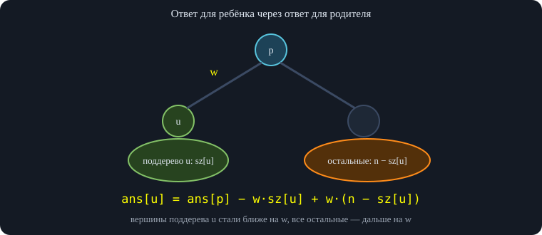
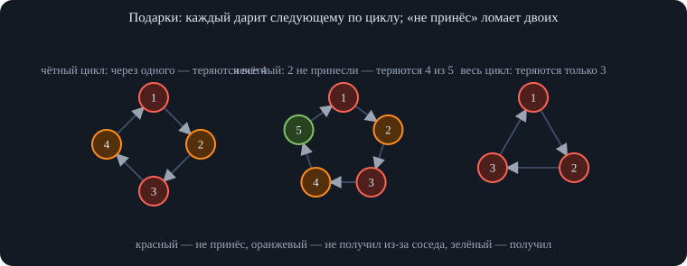
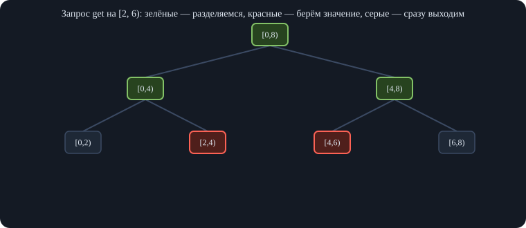
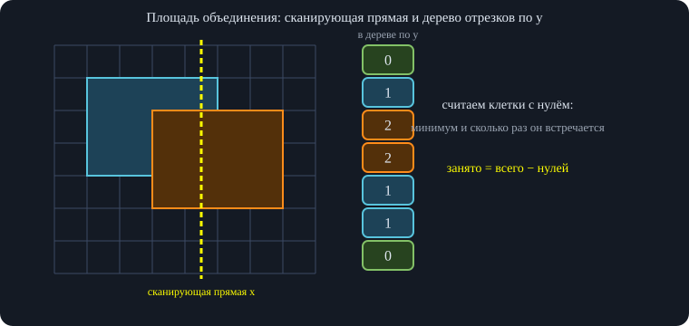
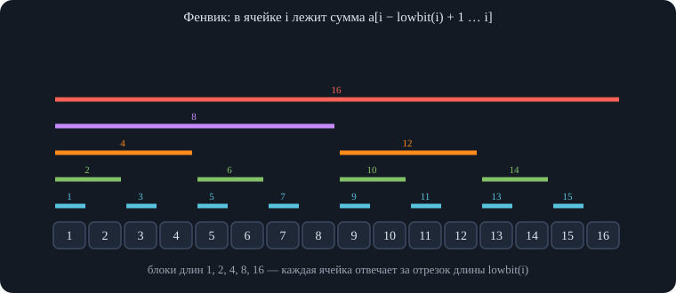

# Занятие 5. Параллель B — Дерево отрезков и разбор динамики

*Разбор контеста по динамике (деревья, строки, отрезки, подарки по циклам) и лекция про дерево отрезков с массовыми операциями, деревья Фенвика, неявные деревья и приём с потенциалом.*

## 1. Разбор контеста по динамике

Контест целиком состоял из задач на динамическое программирование: на деревьях, на строках и на отрезках. Задачи разбираются в порядке «от простых к сложным» (порядок в контесте от этого отличался). Во всех задачах состояние динамики — это ответ на «меньшую» задачу, а переходы выражают ответ через ответы на меньшие. Условия некоторых задач на записи пересказаны не полностью — там это отмечено.

### 1.1. Задача I. Независимое множество максимального веса в дереве

**Условие.** Дано дерево из $n$ вершин, в вершинах записаны числа $a_v$. Нужно выбрать множество вершин с максимальной суммой так, чтобы никакие две выбранные вершины не были соседними.

**Идея.** Та же техника, что на семинаре. Если вершину взяли, то ни одного из её детей брать нельзя; если не взяли — каждый ребёнок свободен в выборе. Поэтому для каждой вершины считаем два значения: $dp[v][1]$ — лучшая сумма в поддереве $v$, когда $v$ взята, и $dp[v][0]$ — когда не взята.

<div class="formula">

$$dp[v][1]=a_v+\sum_{u}dp[u][0],\qquad dp[v][0]=\sum_{u}\max\bigl(dp[u][0],dp[u][1]\bigr),$$

</div>

где суммы идут по детям $u$ вершины $v$. Ответ — $\max(dp[r][0],dp[r][1])$ для корня $r$.

<div class="code">

<div class="code-head">

псевдокод

</div>

    функция независимоеМножество(дерево, a, корень):
        обойти вершины в порядке «сначала дети, потом родитель» (обход DFS)
        для каждой вершины v в этом порядке:
            dp[v][1] = a[v]
            dp[v][0] = 0
            для каждого ребёнка u вершины v:
                dp[v][1] += dp[u][0]
                dp[v][0] += max(dp[u][0], dp[u][1])
        вернуть max(dp[корень][0], dp[корень][1])

</div>

<div class="warn">

<span class="lbl">Практическое замечание</span>\
Если дерево может быть длинной «цепочкой», рекурсивный DFS переполнит стек вызовов — порядок «дети раньше родителя» можно получить обычным обходом и пройти по нему в обратном порядке. Время $O(n)$.

</div>

### 1.2. Задача H. Сумма расстояний от каждой вершины до всех остальных (переподвешивание)

**Условие.** Дано дерево с весами на рёбрах. Для каждой вершины нужно найти сумму длин путей от неё до всех остальных вершин.

**Шаг 1: ответ «вниз» для поддеревьев.** Пусть $sz[u]$ — число вершин в поддереве $u$ (включая $u$), а $down[u]$ — сумма расстояний от $u$ до вершин *её поддерева*. Если у вершины $v$ дети $u$ с весами ребра $w_u$, то $down[v]=\sum_u\bigl(down[u]+w_u\cdot sz[u]\bigr)$: каждый путь из $v$ в поддерево $u$ проходит ребро $w_u$ ровно $sz[u]$ раз (по одному разу на каждую вершину поддерева).

**Шаг 2: ответ «вверх».** Пусть известен полный ответ $ans[p]$ для родителя $p$, и нужно получить $ans[u]$ для ребёнка $u$ по ребру веса $w$. Все пути до вершин поддерева $u$ стали короче на $w$ (мы встали по ту сторону ребра), а до остальных $n-sz[u]$ вершин — длиннее на $w$:

<div class="formula">

$$ans[u]=ans[p]-w\cdot sz[u]+w\cdot\bigl(n-sz[u]\bigr)=ans[p]+w\cdot\bigl(n-2\,sz[u]\bigr).$$

</div>

\
*Переход по ребру $(p,u)$ длины $w$ меняет расстояние до каждой вершины ровно на $\pm w$.*

На записи ответ раскладывался на две части: «пути вверх» (то, что выходит из вершины через родителя) и «пути вниз»; для ребёнка «вверх» складывается из «вверх» родителя, из «вниз» родителя без поддерева ребёнка и самого ребра, пройденного $n-sz[u]$ раз. Это та же формула, записанная в два приёма. Общий приём называется **переподвешиванием**: корень один раз считается одним обходом, а затем ответ «переносится» с родителя на детей за $O(1)$ на каждый переход — всего $O(n)$.

<div class="code">

<div class="code-head">

псевдокод

</div>

    функция суммыРасстояний(дерево, вес, n):
        // 1) обход от корня: порядок, родитель, вес ребра до родителя
        // 2) снизу вверх (в обратном порядке обхода):
        для каждой вершины v:  sz[v] = 1,  down[v] = 0
        для v в обратном порядке (кроме корня):
            sz[родитель v]   += sz[v]
            down[родитель v] += down[v] + вес[v] * sz[v]
        ans[корень] = down[корень]
        // 3) сверху вниз (в прямом порядке):
        для v в прямом порядке (кроме корня):
            ans[v] = ans[родитель v] + вес[v] * (n - 2 * sz[v])
        вернуть ans

</div>

Этот приём «посчитать для корня и переносить вниз» лектор называет общим и очень полезным: его же надо уметь делать в задачах про диаметры и расстояния.

### 1.3. Задача G. Три вершины с максимальной суммой расстояний

**Условие.** В дереве нужно выбрать три вершины так, чтобы сумма расстояний между ними (трёх попарных) была максимальной.

**Способ 1 (конструктивный, без динамики).** Найти диаметр дерева — пару самых далёких вершин $a$, $b$; затем взять третью вершину $c$, для которой $d(c,a)+d(c,b)$ максимальна. Лектор отметил, что такое решение верно, но формально не является динамикой, и что его доказательство «точно такое же, как и для обычного диаметра» (то есть непростое). На случайных деревьях с положительными весами это решение полностью совпало с перебором всех троек.

**Способ 2 (динамика / переподвешивание).** Для любой тройки вершин в дереве существует вершина-«центр» $v$, откуда к трём вершинам идут пути по трём разным направлениям (все три вершины могут быть в разных детях, либо одна «сверху»). Если длины этих трёх «плеч» равны $x,y,z$, то сумма попарных расстояний равна $2(x+y+z)$. Значит, для каждой вершины как центра нужно взять три самых длинных плеча в разных направлениях.

<div class="own">

<span class="lbl">Развёрнутое объяснение</span>\
Почему $2(x+y+z)$: расстояния между вершинами тройки — это $x+y$, $y+z$ и $x+z$, а их сумма — $2(x+y+z)$. Центр — это точка, в которой пути между вершинами тройки расходятся. Если тройка вытянута «цепочкой», центром служит средняя вершина, и одно из плеч там равно нулю — формула остаётся верной.

</div>

**Как найти плечи.** «Вниз» плечи — это максимальные глубины в поддеревьях детей (для каждой вершины достаточно хранить два или три самых больших значения). «Вверх» плечо находится обходом сверху вниз: в DFS передаём значение `len` — длину самого длинного пути вверх из родителя; для ребёнка $u$ длина пути вверх равна $\max(len,\ \text{самое глубокое плечо вниз у родителя, кроме поддерева } u)+w$. Это даёт решение за линейное время.

В чате предложили искать максимум «вниз без одного ребёнка» деревом отрезков, но это лишнее: достаточно хранить два наибольших значения по детям.

### 1.4. Задача E. Приложение со стриком (рюкзак)

**Условие (по записи).** За вход в приложение выдают деньги: если заходишь $x$-й день подряд (серия, «стрик», длины $x$), получаешь $a_x$ монет. Максимальная серия $n\le100$: при серии длины больше $n$ каждый день по-прежнему даёт $a_n$. Нужно набрать $C$ монет за минимальное число дней. В записи не уточнено, нужно «ровно $C$» или «не менее $C$»; ниже разобран вариант «не менее», для «ровно» достаточно брать значение именно для $C$.

**Способ 1. Динамика по сумме и текущей серии.** $dp[c][k]$ — минимальное число дней, чтобы набрать $c$ монет и находиться на серии длины $k$. Переходы: пропустить день (серия обнуляется, +1 день) или зайти (серия $\min(k+1,n)$, прибавляется соответствующее число монет, +1 день). Состояний слишком много для памяти (порядка $10^8$), поэтому, как отметили в чате, хранят только слои по сумме: переходы идут вперёд по сумме не больше, чем на $a_{\max}\approx10^3$, значит, достаточно окна из нескольких соседних слоёв.

**Способ 2. Рюкзак.** Заметим, что поведение состоит из серий, разделённых днями перерыва. Серия длины $i$ даёт $P_i=a_1+\dots+a_i$ монет и занимает $i$ дней плюс день перерыва после неё — то есть это «предмет» веса $i+1$ и ценности $P_i$ (веса до $10^5$, предметов $n\le100$). Особый случай — серия, доходящая до $n$ и продолжающаяся дальше: она может встречаться в ответе **не более одного раза** (нет смысла дважды доходить до серии $n$ и продолжать каждый раз). Поэтому:

- считаем рюкзак $dp[c]$ только по коротким сериям $i<n$ («не доходили до серии $n$»);
- перебираем число $t\ge0$ дней, на которые продлена финальная серия после достижения длины $n$: она даёт $P_n+t\,a_n$ монет за $n+t$ дней;
- для оставшейся суммы берём ответ из $dp$ и складываем.

<div class="code">

<div class="code-head">

псевдокод

</div>

    // P[i] = a[1] + ... + a[i]
    dp[0] = 0;  dp[c] = ∞ для остальных c
    для каждой суммы c по возрастанию:
        для каждой длины серии i от 1 до n-1:
            dp[c + P[i]] = min(dp[c + P[i]], dp[c] + i + 1)      // серия i дней + день перерыва

    ответ = ∞
    для t от 0 пока P[n] + t * a[n] не покроет C:
        осталось = max(0, C - (P[n] + t * a[n]))
        ответ = min(ответ, (n + t) + min(dp[c] для c ≥ осталось))   // «не менее»; «ровно» — dp[осталось]
    // вариант без длинной серии: только короткие серии, перерыв после последней не нужен
    ответ = min(ответ, min(dp[c] - 1 для c ≥ C, где dp[c] > 0))

</div>

<div class="own">

<span class="lbl">Важное дополнение</span>\
Вычитание «лишнего дня перерыва» после последней серии лектор называл так: «можно прибавлять 1, а в конце вычесть 1» — между сериями должен быть ровно один день перерыва, а после самой последней он не нужен. Для проверки подход сравнивался с прямым перебором по дням на малых данных и совпал.

</div>

### 1.5. Задача «Трудности переписки»

**Условие.** Даны строки $s$ и $t$ одинаковой длины. Нужно понять, можно ли разбить $s$ на подстроки $p_1,p_2,\dots,p_k$ (в этом порядке) так, чтобы строка $t$ равнялась $p_k p_{k-1}\dots p_1$ — те же подстроки в **обратном порядке** (сами подстроки не переворачиваются).

**Идея.** Последняя подстрока $p_k$ — это суффикс $s$ и в то же время префикс $t$. Выбираем её длину (перебираем), отрезаем у $s$ суффикс, у $t$ префикс — они должны совпасть, и задача сводится к такой же для оставшейся части.

**Динамика.** Пусть $g[L]$ — «можно ли суффикс $s$ длины $L$ разбить так, чтобы его блоки в обратном порядке дали префикс $t$ длины $L$». Тогда $g[0]=$ истина, и из $g[L]$ можно перейти к $g[L+m]$, если очередной блок длины $m$ — это $s[n-L-m\ldots n-L)$ (блок слева от уже взятых) и он равен $t[L\ldots L+m)$ (место в $t$ сразу за уже собранным префиксом). Ответ — $g[n]$.

<div class="code">

<div class="code-head">

псевдокод

</div>

    g[0] = истина
    для L от 0 до n-1:
        если g[L] ложно: продолжить
        для m от 1 до n - L:
            если s[n-L-m .. n-L) == t[L .. L+m):
                g[L + m] = истина
    вернуть g[n]

</div>

**Как быстро сравнивать подстроки.** Лектор называет два способа: хэши (предпосчитанные один раз) и Z-функция. Для Z-функции для каждой границы $L$ один раз строят строку «суффикс $t$ с позиции $L$, разделитель, префикс $s$» и по значению Z-функции в нужной позиции за $O(1)$ узнают, совпадают ли подстроки для *всех* $m$ сразу. Всего получается $O(n^2)$: $n$ границ по $O(n)$ каждая. Лектор подчёркивает, что стоит уметь пользоваться Z-функцией, а не только хэшами: бывают тесты против хэшей и задачи, не решаемые хэшами, и Z-функция — хороший тренажёр.

<div class="own">

<span class="lbl">Важное дополнение</span>\
Динамика проверена на случайных строках над алфавитом из двух букв против перебора всех разрезов — результаты совпали. Для сравнения за $O(1)$ можно использовать и префикс-функцию; хэши без коллизий предпочтительнее надёжной Z-функции только когда они проходят по времени.

</div>

### 1.6. Задача L. Дерево «И/ИЛИ» и минимум переключений

**Условие.** Дано полное бинарное дерево небольшого размера. В листьях записаны значения 0 или 1, в каждой внутренней вершине — операция «И» или «ИЛИ» над значениями двух детей. За одно действие можно заменить операцию в вершине на противоположную. Какое минимальное число замен нужно, чтобы значение в корне стало равно заданному $C$?

**Идея.** Значение вершины зависит только от значений её детей и от выбранной операции. Поэтому динамика: $dp[v][x]$ — минимальное число замен в поддереве $v$, чтобы в $v$ получилось значение $x\in\{0,1\}$. Для листа $dp[v][x]$ равно 0 при $x$ = значению листа и $\infty$ иначе. Для внутренней вершины перебираем значения детей (2·2), и меняем ли операцию в $v$ (ещё 2) — всего 8 вариантов:

<div class="code">

<div class="code-head">

псевдокод

</div>

    для внутренней вершины v с детьми l и r:
        dp[v][0] = dp[v][1] = ∞
        для a от 0 до 1, для b от 0 до 1, для замена от 0 до 1:
            операция = (операция v) xor замена
            значение = применить(операция, a, b)       // И или ИЛИ
            dp[v][значение] = min(dp[v][значение], dp[l][a] + dp[r][b] + замена)
    ответ = dp[корень][C]

</div>

Перебор операции делают вручную (одна строка на каждую) или циклом по двум значениям — как удобнее. На записи отмечено, что нужно не забывать прибавлять единицу ровно в тех случаях, когда операция заменяется. Для вершины с одним ребёнком правило в записи не названо.

### 1.7. Задача N. Блоки из $k$ наибольших и перенос элементов

**Условие (по записи).** Даны $n$ стоимостей. Их нужно переставить так, чтобы в первых $k$ позициях стояли $k$ максимальных (в любом порядке внутри блока), в следующих $k$ — следующие по величине, и так далее; последний блок может быть неполным. Операция: взять любой элемент и поставить его в любое место (между любыми двумя элементами, в начало или в конец). Ответ — минимальное число **перенесённых** элементов. На записи лектор отмечает, что авторское решение верно для перестановок, а для произвольных данных (с повторами) оно может давать ответ хуже оптимального.

**Общий подход.** Операция «перенести элемент» плохо поддаётся прямому анализу: при каждом переносе меняется весь массив. Надёжный приём — смотреть не на то, что двигаем, а на то, что **не трогаем**. Ответ равен $n$ минус наибольшее число элементов, которые можно оставить на месте.

**Случай $k=1$ и перестановка.** Каждому элементу известна его конечная позиция (по убыванию значения). Элементы, оставшиеся на месте, должны образовывать **убывающую подпоследовательность** (иначе их взаимный порядок нарушит условие). Пример $3,4,1,2$: оставить можно $4,1$ либо $3,2$ — ответ $4-2=2$.

**Общее $k$ для перестановки.** Теперь известен не конкретный индекс, а **номер блока** каждого элемента. Оставляемые на месте элементы должны идти так, чтобы номера их блоков *не убывали* (внутри одного блока порядок не важен, поэтому значения сравнивать нельзя — только блоки). Ответ: $n$ минус длина наибольшей *неубывающей* подпоследовательности номеров блоков.

Пример: массив $5,4,1,2,3$ и $k=2$. Блоки по убыванию: $\{5,4\}$ — блок 0, $\{3,2\}$ — блок 1, $\{1\}$ — блок 2. Номера блоков по массиву: $0,0,2,1,1$. Наибольшая неубывающая подпоследовательность — $0,0,1,1$ (длина 4), ответ $5-4=1$: достаточно перенести единицу в конец, получится $5,4,2,3,1$.

<div class="code">

<div class="code-head">

псевдокод

</div>

    функция минимумПереносов(p[1..n], k):          // p — перестановка
        отсортировать значения по убыванию; блок(значения) = (позиция в этом порядке) / k
        seq[i] = блок(p[i])
        вернуть n - (длина наибольшей неубывающей подпоследовательности seq)

</div>

<div class="own">

<span class="lbl">Важное дополнение</span>\
Формула «$n$ минус наибольшая неубывающая подпоследовательность блоков» проверена на всех перестановках малой длины поиском в ширину по состояниям (операция переноса одного элемента) и совпала. Для массивов с равными значениями граница между блоками может «разрезать» группу равных элементов, и номера блоков для них неоднозначны: выбор нужно делать так, чтобы длина оставляемой подпоследовательности была наибольшей. Как это сделать оптимально, на записи не доведено до конца; лектор показал лишь, что жадное «слева направо назначай блок» (как в авторском решении) может давать неверный ответ.

</div>

### 1.8. Футболисты: $a$ защитников, $b$ полузащитников, $c$ нападающих

**Условие (по записи).** Есть $n$ (порядка $10^5$) футболистов, у каждого три числа $A_i,B_i,C_i$ — сколько очков он приносит в трёх ролях. Нужно собрать команду из 10 человек: 2 в роли $A$, 3 в роли $B$ и 5 в роли $C$ (каждый игрок в одной роли), с максимальной суммой очков.

**Идея: принцип Дирихле.** Достаточно оставить по 10 лучших игроков по каждому признаку — всего не более 30 кандидатов, и оптимальная команда найдётся среди них. Доказательство: пусть в оптимальной команде игрок $x$ с ролью $A$ не входит в десятку лучших по $A$. В команде всего 10 человек, а в десятке лучших по $A$ ровно 10 — значит, найдётся игрок $y$ из этой десятки, которого нет в команде (иначе команда целиком была бы десяткой, а $x$ в ней нет). У него $A_y\ge A_x$, и замена $x$ на $y$ в той же роли сумму не уменьшает. Повторяя замены, получаем оптимальную команду из кандидатов.

**Выбор из 30.** Два способа. Перебор: выбрать двоих по $A$ (около $30^2$ вариантов), из оставшихся троих по $B$, оставшихся пятерых по $C$ — лучших жадно. Либо обычная динамика $dp[a][b][c]$ по префиксу кандидатов (на каждого — куда его поместить), $2\cdot3\cdot5$ состояний на кандидата. Для восстановления состава, если слоёв хранится мало, в каждой ячейке хранят вместе с значением и сам набор.

<div class="own">

<span class="lbl">Важное дополнение</span>\
Утверждение «хватает по $a+b+c$ лучших по каждому признаку» проверено на малых случайных данных против полного перебора назначений и всегда выполнялось.

</div>

### 1.9. Покраска забора

**Условие (по записи).** Есть $n$ досок, каждую нужно покрасить в свой цвет (цветов не больше 26). Операция — покрасить подряд идущие доски одним цветом (прежние цвета затираются). Нужно минимальное число операций.

**Наблюдения.** Это задача на отрезке, поэтому сразу приходит мысль о динамике $dp[l][r]$. Два упрощения: (1) бессмысленно красить отрезок, а потом перекрывать его большим отрезком, который его полностью накрывает — красить нужно **сверху вниз**, от большого отрезка к вложенным; (2) отрезки пересекаться не имеет смысла (можно продлить один из них), поэтому остаются только **вложенные** отрезки.

![Цвета досок 1-2-3-2-1: три операции. Это интервальная динамика по отрезкам $[l, r]$.](images/parallel-b-zan5-derevo-otrezkov-fig2.svg)\
*Цвета досок 1-2-3-2-1: три операции. Это интервальная динамика по отрезкам $[l, r]$.*

**Динамика лектора.** Пусть $f(l,r,c)$ — минимальное число операций, чтобы привести отрезок $[l,r]$ к нужным цветам, если он уже весь покрашен в цвет $c$. Если $a_l=c$, ничего делать не нужно: $f(l,r,c)=f(l+1,r,c)$. Иначе придётся покрасить $l$-ю доску в её цвет $a_l$: перебираем, до какой доски $g$ мы красим этим цветом одну операцию, внутри остаётся $f(l+1,g,a_l)$, а справа от $g$ всё ещё фон $c$: $f(g+1,r,c)$.

<div class="own">

<span class="lbl">Важное дополнение</span>\
Цвет фона $c$ можно убрать из состояния. Классическая запись: $dp[l][r]$ — минимальное число операций для отрезка с «чистого листа»; $dp[l][r]=dp[l+1][r]+1$ (красим $l$-ю доску отдельной операцией) либо, если для некоторой доски $k\in(l,r]$ верно $a_k=a_l$, то $dp[l][r]=dp[l+1][k-1]+dp[k][r]$ (доску $l$ красят вместе с $k$ одной операцией, а между ними — вложенная работа). Сложность $O(n^3)$. Эта формула проверена на малых случайных данных поиском в ширину по всем окраскам — совпала.

</div>

<div class="code">

<div class="code-head">

псевдокод

</div>

    для l от n до 1, для r от l до n:
        если l == r: dp[l][r] = 1; продолжить
        dp[l][r] = dp[l+1][r] + 1
        для k от l+1 до r, где a[k] == a[l]:
            dp[l][r] = min(dp[l][r], dp[l+1][k-1] + dp[k][r])     // dp для пустого отрезка = 0
    вернуть dp[1][n]

</div>

### 1.10. Задача про «съедание» слов

**Условие (по записи — частично).** Даны строка и набор слов суммарной длиной порядка 150. Операция — вычеркнуть из текущей строки слово из набора (подряд идущие символы); после вычёркивания части строки склеиваются. Нужно найти «стоимость» разбиения строки на подотрезки, которые можно полностью съесть. Точная формулировка стоимости (что именно максимизируется) на записи произнесена нечётко; ниже разобрана главная часть — проверка, можно ли полностью съесть заданный подотрезок.

**Два уровня.** (1) Если известно, можно ли полностью съесть каждый подотрезок $[i,j]$, то разбиение префикса на «съедобные» подотрезки — обычная динамика: $best[j]=\max_i\bigl(best[i-1]+cost(i,j)\bigr)$ по подотрезкам, которые целиком съедаются. (2) Основная сложность — научиться проверять «съедаемость».

**Съедаемость $E[i][j]$.** Отрезок $[i,j]$ можно съесть целиком в одном из двух случаев:

- его можно разрезать на две части, каждая из которых съедается отдельно;
- иначе смотрим на **последний шаг**: в этот момент вычёркивается слово $w_k$, чьи буквы стоят в строке на позициях $i=p_1<p_2<\dots<p_m=j$ (первая буква слова на левом краю, последняя — на правом: иначе нашлась бы разрезаемая часть). Все символы между соседними буквами слова к этому моменту уже съедены, причём независимо друг от друга — они «заперты» буквами слова, которые живут до самого конца.

Для проверки второго случая добавляют параметры: $d[i][j][k][y]$ — «из отрезка $[i,j]$ можно получить ровно первые $y$ букв слова $k$, причём первая буква стоит на $i$, а $y$-я — на $j$, а всё между ними съедено». Переход: перебираем позицию $q$ предыдущей, $(y-1)$-й, буквы: $d[i][j][k][y]$ истинно, если $s_j=w_k[y]$, $d[i][q][k][y-1]$ истинно и отрезок $(q,j)$ съедается. Тогда $E[i][j]$ истинно, если для какого-то слова $d[i][j][k][|w_k|]$ истинно (либо отрезок разрезается). Данные по длинам слов в сумме дают 150, поэтому по состояниям работает порядка $n^2\cdot150$, а с перебором $q$ — порядка $n^3\cdot150$, что на записи названо «L-куб, умноженное на 150» и допустимо благодаря малой константе (перебирать нужно лишь подходящие буквы).

<div class="code">

<div class="code-head">

псевдокод

</div>

    E[i][i-1] = истина                                 // пустой отрезок съедается
    для длины отрезка от 1 и выше, для каждого [i, j]:
        E[i][j] = ложь
        для q от i до j-1:                              // разрезать на две съедаемые части
            если E[i][q] и E[q+1][j]: E[i][j] = истина
        для каждого слова k:
            если d[i][j][k][|w_k|]: E[i][j] = истина
        для каждого слова k и y от 1 до |w_k|:          // пересчитать d
            d[i][j][k][y] = (s[j] == w_k[y]) и (
                y == 1 ? (i == j) : существует q в (i, j) с d[i][q][k][y-1] и E[q+1][j-1])

</div>

<div class="own">

<span class="lbl">Важное дополнение</span>\
Критерий «слово — первая буква на левом краю, последняя на правом, между буквами съедено» проверен против прямого поиска в ширину по всем вычёркиваниям на строках над двумя буквами и коротких словах — результаты совпали. Оптимизация из обсуждения: перебирать не все буквы подстроки, а только те, что совпадают с нужной буквой слова.

</div>

### 1.11. Задача P. Подарки по циклам

**Условие (восстановлено по записи).** Каждый человек даёт подарок ровно одному человеку, и каждый получает ровно от одного — то есть задана перестановка, которая распадается на циклы. Человек получит подарок, только если он сам кому-то принесёт подарок **и** ему тоже принесут. Выбираются ровно $K$ человек, которые подарок **не приносят**. Нужно найти минимальное и максимальное возможное число людей, которые не получат подарок.

Каждый не принёсший человек «ломает» двух: самого себя (он не получит) и того, кому он должен был дарить.

\
*Максимум потерь — расставить не принёсших через одного; минимум — брать циклы целиком.*

**Минимум.** Выгодно, чтобы потери перекрывались. Если не принёс ни один человек цикла — цикл цел. Если в цикле выбран подряд идущий кусок из $t$ человек, потеряют $t+1$ человек; но если цикл выбран *целиком*, потеряют ровно $t$. Значит, нужно взять целые циклы так, чтобы их суммарная длина была ровно $K$ — задача о рюкзаке по длинам циклов. Если набрать $K$ нельзя, ответ $K+1$ (целые циклы и один кусок). При $K=0$ ответ 0. Предметов до $10^6$, вес — длина цикла, но различных длин мало (сумма всех длин $n$), поэтому рюкзак по различным значениям длин с кратностями работает быстро.

**Максимум.** Каждый не принёсший в лучшем случае ломает двоих. В цикле чётной длины $\ell$ можно выбрать $\ell/2$ человек «через одного» — потеряет весь цикл ($\ell$ человек). В цикле нечётной длины $\ell$ можно выбрать $(\ell-1)/2$ человек «через одного» и потерять $\ell-1$; оставшегося можно потерять ещё одним не принёсшим, но выигрыш будет уже один человек, а не двое. Пусть $P=\sum\lfloor\ell/2\rfloor$ — число «выгодных» не принёсших. Тогда максимум равен $2K$, если $K\le P$, иначе $\min(n,\ P+K)$.

<div class="code">

<div class="code-head">

псевдокод

</div>

    // циклы: длины ℓ1, ℓ2, …
    P = сумма (ℓi / 2) по циклам              // целочисленное деление
    максимум = (K <= P) ? 2*K : min(n, P + K)
    // минимум: достижима ли сумма K из длин циклов (рюкзак)
    минимум = 0, если K == 0;  K, если K достижима;  иначе K + 1

</div>

<div class="own">

<span class="lbl">Важное дополнение</span>\
Обе формулы проверены перебором всех наборов из $K$ человек на малых разбиениях на циклы и совпали. На записи отмечено, что в своё время эта задача имела высокий рейтинг сложности, но при правильном прочтении условия сводится к рюкзаку и жадности.

</div>

### 1.12. Задача B. Сжатие строки

**Условие (по записи).** Дана строка. Подряд идущие одинаковые подстроки можно записать сжато — в виде «число, скобка, подстрока, скобка» (например, «3(ab)»). Нужно найти минимальную длину записи всей строки.

**Динамика.** $dp[l][r]$ — минимальное число символов, нужное, чтобы записать подстроку $[l,r]$. База: $dp[i][i]=1$. Переходов два:

- **разрезать** на две части: $dp[l][r]=\min_m\bigl(dp[l][m]+dp[m+1][r]\bigr)$;
- **сжать всю подстроку целиком**: перебираем длину повторяющегося куска $p$; если вся подстрока состоит из одинаковых кусков длины $p$, то запись равна «число повторов» + две скобки + $dp$ куска.

Случай «отрезаем слева или справа ровно один символ» отдельного перехода не требует: он уже покрыт разрезанием благодаря базе. Нет смысла сжимать только *часть* строки в момент подсчёта перехода: часть можно было отрезать разрезанием, а сжимать целиком. Проверка того, что подстрока есть повтор куска длины $p$, делается за линию, то есть решение «максимально наивное» (на записи лектор повторяет его для слушателей, пропустивших начало).

<div class="code">

<div class="code-head">

псевдокод

</div>

    для длины от 1 и выше, для каждого [l, r]:
        если l == r: dp[l][r] = 1; продолжить
        dp[l][r] = min по m от l до r-1 из (dp[l][m] + dp[m+1][r])
        для длины куска p, делящей (r - l + 1), где p < r - l + 1:
            если подстрока [l, r] состоит из повторов куска [l, l+p-1]:
                повторов = (r - l + 1) / p
                dp[l][r] = min(dp[l][r], (число цифр в «повторов») + 2 + dp[l][l+p-1])

</div>

Точный формат записи (сколько символов занимают скобки и число) определяется условием задачи; в формуле выше использован пример из записи.

### 1.13. Задача F. Палиндром с обменами соседних символов

**Условие (по записи — частично).** Нужно узнать, можно ли получить палиндром, меняя местами соседние символы, причём **каждый символ может участвовать не более чем в одном обмене**. Динамика идёт «с двух концов к центру»: $dp[i][f_1][f_2]$ — истинно/ложно: можно ли согласовать первые $i$ символов с началом и конца строки, где $f_1$ — флаг «символ $i$ был обменян с символом $i-1$ в начале строки», $f_2$ — то же для конца.

**Почему флаги нужны.** Символ в позиции $i$ ещё может быть обменян со следующим (с $i+1$), поэтому о нём пока ничего нельзя сказать; динамика отвечает про первые $i-1$ символов, а последний пока «открыт». Это стандартное «отложенное решение» в динамике.

**Переход.** Из $dp[i-1][\cdot][\cdot]$ перебираем все значения флагов (всего 16 комбинаций) и проверяем два условия: (1) среди двух пар флагов — в начале и в конце — в каждой паре не должно быть двух единиц сразу, иначе один символ участвует в двух обменах; (2) на шаге от $i-1$ к $i$ проверяем, совпадает ли $(i-1)$-й символ с начала с $(i-1)$-м символом с конца — зная обмены, мы однозначно определяем, какие именно символы там стоят. После схождения динамик в центре остаётся отдельно разобрать небольшой случай — это, как сказал лектор, «немного глины», но не принципиальная часть.

### 1.14. Задача K. Двоичные строки с ограничениями на подотрезки

**Условие.** Нужно посчитать количество двоичных строк длины $n$, удовлетворяющих ограничениям: для каждого подотрезка задано одно из трёх чисел — 1 («все символы на подотрезке равны»), 2 («на подотрезке есть хотя бы два разных символа») или 0 («ограничения нет»).

**Динамика.** $dp[i][len]$ — число способов построить префикс длины $i$ так, что в точности последние $len$ символов равны между собой (а символ перед ними — другой). Пример: у строки, оканчивающейся на 000 и перед ними стоит единица, $len=3$. Этой информации хватает, чтобы проверять все ограничения, появляющиеся при приписывании нового символа: новые ограничения — это подотрезки, оканчивающиеся в новой позиции, то есть суффиксы текущей строки. Чтобы понять, есть ли на суффиксе различные символы, достаточно знать длину последней серии равных символов.

Чтобы пересчитывать динамику, нужно ещё знать, какой символ стоял последним: если дописывается **тот же** символ, серия удлиняется; если **другой** — серия начинается заново с длины 1. Флаг «какой именно символ» можно не хранить: по симметрии нулей и единиц достаточно умножить итог на 2. Проще думать, как будто символ известен, — тогда пересчёты очевидны:

- если приписываем **другой** символ, все ограничения, оканчивающиеся в нём, должны быть двойками или нулями (на любом подотрезке, заканчивающемся здесь, будут различные символы — единицы нарушаются);
- если приписываем **тот же** символ и серия стала длины $len$, то ограничения, оканчивающиеся здесь и целиком лежащие в серии (начало не левее $i-len+1$), должны быть единицами или нулями, а начинающиеся левее границы серии — двойками или нулями.

<div class="code">

<div class="code-head">

псевдокод

</div>

    // для каждой правой границы e заранее:
    //   minL1[e] = самое левое начало ограничения «1», оканчивающегося в e (или ∞)
    //   maxL2[e] = самое правое начало ограничения «2», оканчивающегося в e (или 0)
    допустимо(e, len):                                  // серия из len одинаковых оканчивается в e
        начало = e - len + 1
        вернуть minL1[e] >= начало и maxL2[e] < начало

    dp[1][1] = допустимо(1, 1) ? 1 : 0
    для i от 1 до n-1, для len от 1 до i:
        если допустимо(i+1, len+1): dp[i+1][len+1] += dp[i][len]    // тот же символ
        если допустимо(i+1, 1):     dp[i+1][1]     += dp[i][len]    // другой символ
    ответ = 2 * сумма dp[n][len]                         // умножаем на 2: первый символ — 0 или 1

</div>

<div class="own">

<span class="lbl">Важное дополнение</span>\
Предварительный подсчёт $minL1$ и $maxL2$ — стандартное ускорение: проверка допустимости становится $O(1)$, а вся динамика — $O(n^2)$ (плюс чтение $O(m)$ ограничений). Решение проверено перебором всех строк длины до 9 на случайных наборах ограничений. Главное замечание лектора: нужно сразу увидеть, какую динамику считать — «размер префикса, последний символ и сколько одинаковых в конце»; после этого задача «разваливается».

</div>

## 2. Дерево отрезков с массовыми операциями

Тема лекции — дерево отрезков с **массовыми операциями** (изменение целого отрезка сразу), а также дерево Фенвика и несколько приёмов вокруг них. Дерево отрезков — бинарное дерево, у которого каждая вершина отвечает за отрезок массива. Дальше дерево записывается на **полуинтервалах** $[l,r)$ — левая граница включена, правая нет; тогда нигде в коде не нужны «$+1$» и «$-1$».

### 2.1. Повторение: как работает запрос get

Пусть запрос — отрезок $[ql,qr)$. Вершины, в которые мы заходим, делятся на три вида:

- вершина, чей отрезок не пересекается с запросом, — сразу выходим (значения нет);
- вершина, чей отрезок целиком лежит внутри запроса, — берём её значение и выходим;
- остальные (отрезок пересекается с запросом частично) — разделяемся на двух детей и идём дальше. Назовём их «зелёными».

\
*Посещённых вершин не больше $4\log n$: все «зелёные» — предки самого левого или самого правого листа запроса, а из каждой зелёной вершины рекурсия идёт в двух детей.*

**Утверждение.** Каждая зелёная вершина — это предок самого левого листа запроса или предок самого правого листа запроса. *Доказательство.* В поддереве зелёной вершины есть хотя бы одно число запроса (иначе мы бы вышли сразу). Допустим, она не предок ни одного из двух крайних листьев запроса. Тогда её отрезок лежит строго между ними и целиком вложен в запрос, а значит, мы должны были взять её значение и выйти, а не разделиться — противоречие.

**Оценка.** Предков двух крайних листьев — не больше $2\log n$ (два пути до корня), и в каждой зелёной вершине мы разделяемся надвое, поэтому всего посещается не больше $4\log n$ вершин. Отсюда и асимптотика $O(\log n)$.

### 2.2. Отложенная операция: добавление на отрезке и максимум

Допустим, нужно прибавить $x$ ко всем числам отрезка, который в точности совпадает с отрезком вершины. Вместо того чтобы обходить всё поддерево (линейное время), мы **запоминаем в вершине**: «ко всем числам в моём поддереве надо прибавить $x$» (массив `mass`), и сразу обновляем значение самой вершины. Поддерево при этом остаётся «некорректным» — но мы точно знаем, насколько.

Значения в предках изменились, поэтому при выходе из рекурсии пересчитываем их по детям (путь до корня). Всё остальное дерево не затронуто. Что нужно потом: когда в запросе get мы доходим до вершины, мы прошли весь путь от корня, поэтому знаем все отложенные операции на нём.

**Простой случай: максимум и $+=$ на отрезке.** Здесь все значения в поддереве меняются одинаково на $x$, и максимум на $x$ тоже увеличивается. Поэтому, дойдя до вершины, достаточно *просуммировать* все отложенные добавки на пути до корня — и получим правильное значение. Исходные числа в дереве даже менять не нужно.

Пример: массив $3,7,2,1$. Если двум левым числам ($3$ и $7$) прибавить 3, то отложенная операция (3) записывается в вершине, отвечающей за эти два числа, а её значение становится на 3 больше. Когда get доходит до листа со значением 7, мы знаем, что в нём на самом деле $7+3=10$ (в листе записано 7, а сумма добавок на пути до корня равна 3); для листа со значением 3 получаем $3+3=6$. Правые два числа не затронуты.

**Произвольный отрезок.** Запрошенный отрезок разбиваем на несколько вершин, суммарно покрывающих его (точно так же, как в get), и в каждой из них записываем отложенную операцию. Код в точности повторяет get; единственное отличие — в месте «вершина полностью вложена в запрос».

<div class="code">

<div class="code-head">

C++

</div>

``` cpp
struct SegAddMax {
    int n; vector<long long> t, mass;                  // t[v] — максимум в поддереве v (с учётом mass[v] и ниже)
    SegAddMax(int n) : n(n), t(4 * n, 0), mass(4 * n, 0) {}

    // прибавить x на полуинтервале [ql, qr); v — вершина, [l, r) — её отрезок
    void upd(int v, int l, int r, int ql, int qr, long long x) {
        if (qr <= l || r <= ql) return;                // не пересекается
        if (ql <= l && r <= qr) {                    // целиком внутри запроса
            t[v] += x; mass[v] += x; return;
        }
        int m = (l + r) / 2;
        upd(2 * v + 1, l, m, ql, qr, x);
        upd(2 * v + 2, m, r, ql, qr, x);
        t[v] = max(t[2 * v + 1], t[2 * v + 2]) + mass[v];  // пересчёт + то, что отложено в самой вершине
    }
    long long get(int v, int l, int r, int ql, int qr) {   // максимум на [ql, qr)
        if (qr <= l || r <= ql) return LLONG_MIN / 4;
        if (ql <= l && r <= qr) return t[v];
        int m = (l + r) / 2;
        return max(get(2 * v + 1, l, m, ql, qr), get(2 * v + 2, m, r, ql, qr)) + mass[v];   // + добавки на пути
    }
};
```

</div>

### 2.3. Проталкивание (push)

Не всегда можно просто просуммировать отложенные операции по пути до корня: например, для *суммы* на отрезке одной добавки в предке недостаточно, чтобы узнать сумму в вершине. Тогда отложенные изменения нужно **проталкивать** вниз. Операция `push(v)` переносит отложенную операцию вершины $v$ на её двух детей и обнуляет её у самой вершины.

Для максимума и $+=$: детям прибавляется значение `mass[v]` и к их значению, и к их отложенной операции; у $v$ `mass` становится нулевым. Почему это корректно: до проталкивания поддерево $v$ было «некорректным» с известным смещением; после проталкивания значения у двух детей исправлены и в них записана отложенная операция для их собственных поддеревьев — то есть мы «починили» ровно столько, сколько объявляем корректным, и не объявляем корректными лишние вершины.

В `push` проверяют, что вершина не лист (лист выходит за границы дерева и упадёт при обращении к детям). Правило: когда мы заходим в вершину, мы сначала проталкиваем её отложенные операции в детей — тогда на всём пройденном пути «за собой» остаются нули, и в любой вершине, в которую мы пришли, стоит корректное значение.

<div class="code">

<div class="code-head">

C++

</div>

``` cpp
struct SegPush {
    int n; vector<long long> t, mass;
    SegPush(int n) : n(n), t(4 * n, 0), mass(4 * n, 0) {}

    void push(int v, int l, int r) {
        if (r - l == 1) return;                           // у листа нет детей
        for (int c : {2 * v + 1, 2 * v + 2}) { t[c] += mass[v]; mass[c] += mass[v]; }
        mass[v] = 0;
    }
    void upd(int v, int l, int r, int ql, int qr, long long x) {
        if (qr <= l || r <= ql) return;
        if (ql <= l && r <= qr) { t[v] += x; mass[v] += x; return; }
        push(v, l, r);                                    // перед спуском в детей
        int m = (l + r) / 2;
        upd(2 * v + 1, l, m, ql, qr, x);
        upd(2 * v + 2, m, r, ql, qr, x);
        t[v] = max(t[2 * v + 1], t[2 * v + 2]);
    }
    long long get(int v, int l, int r, int ql, int qr) {
        if (qr <= l || r <= ql) return LLONG_MIN / 4;
        if (ql <= l && r <= qr) return t[v];
        push(v, l, r);                                    // push ПОСЛЕ двух проверок на выход
        int m = (l + r) / 2;
        return max(get(2 * v + 1, l, m, ql, qr), get(2 * v + 2, m, r, ql, qr));
    }
};
```

</div>

**Где ставить push.** Часто пишут `push` первой строкой `get` — это понятное желание обезопасить себя, но на замере лектора такая реализация примерно на 20% медленнее: если в вершину входить только для проверки выхода, проталкивание ей не нужно. Поэтому push нужно ставить *после* двух проверок на выход. При этом нужно понимать, почему так можно: инвариант — при вызове функции в вершине уже лежит корректное значение, и проталкивать нужно только тогда, когда мы собираемся спускаться в детей.

### 2.4. Площадь объединения прямоугольников

**Задача.** Даны прямоугольники на плоскости, нужно найти площадь их объединения. Идея — сканирующая прямая (`scanline`): дерево отрезков стоит по координате $y$, а прямая движется по $x$; в позиции $y$ дерева хранится число прямоугольников, пересекающих текущую вертикальную прямую в этой клетке.

\
*Прямоугольник открывается событием «+1 на \[y1, y2)», закрывается событием «−1 на \[y1, y2)». Клетка занята, если в ней число больше нуля.*

При сдвиге прямой на 1 вправо меняются события: какие-то прямоугольники закрываются (на координате $x_2$), какие-то открываются (на $x_1$). Для прямоугольника $[x_1,x_2)\times[y_1,y_2)$ при $x=x_1$ выполняется «прибавить 1 на $[y_1,y_2)$», при $x=x_2$ — «прибавить $-1$ на $[y_1,y_2)$». События записывают в один вектор и сортируют по $x$.

**Что считать.** Сумма в дереве не годится: клетка, покрытая двумя прямоугольниками, даёт 2, а занята всего одна. Считаем обратное: число **нулей** (свободных клеток), занятых получится «всего минус нули». А количество нулей получается из двух величин: минимума на отрезке и количества минимумов. Если минимум больше нуля — нулей нет; если минимум равен нулю — нулей ровно «количество минимумов». Здесь важно, что числа в дереве не бывают отрицательными (они считают пересекающиеся прямоугольники).

**Узел (`struct node`).** В вершине нужно хранить два числа — минимум и количество минимумов. Лектор рекомендует хранить все данные вершины в одной структуре: компьютер подтягивает её из памяти одним запросом, а не отдельным запросом на каждый массив, поэтому так заметно быстрее. Слияние двух узлов:

- минимум — меньший из двух;
- количество — если минимумы равны, складываем количества; иначе берём количество у того узла, чей минимум меньше.

Массовая операция «прибавить на отрезке» хранится одним числом (отложенная добавка), а значение минимума просто увеличивается; количество минимумов от добавки не меняется.

<div class="code">

<div class="code-head">

C++

</div>

``` cpp
struct Node { int mn, cnt; };
Node mergeN(Node a, Node b) {
    if (a.mn < b.mn) return a;
    if (b.mn < a.mn) return b;
    return {a.mn, a.cnt + b.cnt};
}
struct SegCover {
    int n; vector<Node> t; vector<int> mass;
    SegCover(int n) : n(n), t(4 * n), mass(4 * n, 0) { build(0, 0, n); }
    void build(int v, int l, int r) {
        t[v] = {0, r - l};                                // изначально везде нули
        if (r - l > 1) { int m = (l + r) / 2; build(2*v+1, l, m); build(2*v+2, m, r); }
    }
    void push(int v, int l, int r) {
        if (r - l == 1) return;
        for (int c : {2 * v + 1, 2 * v + 2}) { t[c].mn += mass[v]; mass[c] += mass[v]; }
        mass[v] = 0;
    }
    void add(int v, int l, int r, int ql, int qr, int x) {
        if (qr <= l || r <= ql) return;
        if (ql <= l && r <= qr) { t[v].mn += x; mass[v] += x; return; }
        push(v, l, r);
        int m = (l + r) / 2; add(2*v+1, l, m, ql, qr, x); add(2*v+2, m, r, ql, qr, x);
        t[v] = mergeN(t[2*v+1], t[2*v+2]);
    }
    int zeros() const { return t[0].mn == 0 ? t[0].cnt : 0; }   // свободных клеток во всём дереве
};

long long unionArea(const vector<array<int,4>>& rs, int W) {   // прямоугольники [x1,x2) x [y1,y2), координаты < W
    vector<array<int,4>> ev;                                // (x, +1 открыть / -1 закрыть, y1, y2)
    for (auto [x1, y1, x2, y2] : rs) { ev.push_back({x1, 1, y1, y2}); ev.push_back({x2, -1, y1, y2}); }
    sort(ev.begin(), ev.end());
    SegCover st(W); long long area = 0; int prevX = 0; size_t i = 0;
    while (i < ev.size()) {
        int x = ev[i][0];
        area += (long long)(W - st.zeros()) * (x - prevX);     // занято клеток в столбцах [prevX, x)
        while (i < ev.size() && ev[i][0] == x) { st.add(0, 0, W, ev[i][2], ev[i][3], ev[i][1]); i++; }
        prevX = x;
    }
    return area;
}
```

</div>

Если координаты большие, их сжимают, а в узле дополнительно хранят суммарную длину клеток, в которых стоят нули. По $x$ сжатие нужно не всегда: переход «на 1» заменяется переходом сразу на несколько клеток, и к ответу прибавляют число нулей, умноженное на длину этого столбика (так сделано и в коде выше — умножением на `x - prevX`).

### 2.5. Арифметическая прогрессия на отрезке

**Задача.** На отрезке прибавить арифметическую прогрессию, начинающуюся с $x$ и растущую с шагом $y$, и спрашивать сумму на отрезке. Этот пример показывает, что **отложенная операция может быть сложной**: в вершине по-прежнему хранится одно число (сумма), а в массовой операции — не число, а пара чисел, описывающая прогрессию.

В каждой вершине храним два модификатора: $a$ и $b$ — к $i$-му числу отрезка вершины (счёт от её начала, с нуля) надо прибавить $a+b\cdot i$. Тогда:

- сумма после добавки на отрезок длины $\ell$: прибавляется $a\ell+b\,\ell(\ell-1)/2$ — это формула суммы арифметической прогрессии;
- две прогрессии складываются покомпонентно: $a$ с $a$, $b$ с $b$;
- при проталкивании левому ребёнку отдаём $(a,b)$ без изменений, а правому — $(a+b\cdot\ell_{\text{левой}},\ b)$: прогрессия «сдвинулась» на длину левой половины.

Как и раньше, рекомендуется делать так, чтобы информация, накопленная в вершине, *уже была применена* к её значению: тогда в вершину можно зайти, прочитать значение и ничего не проталкивать; push нужен только перед тем, как идти в детей. Лектор отмечает, что `merge`-функция, написанная для слияния двух узлов, пригодна и для запросов: get может возвращать узел, а результаты левой и правой частей склеиваются тем же `merge`, либо возвращается нейтральный узел.

<div class="code">

<div class="code-head">

C++

</div>

``` cpp
struct SegAP {
    int n; vector<long long> sum, ma, mb;             // ma, mb: к i-му (с нуля) числу отрезка вершины прибавить ma + mb * i
    SegAP(int n) : n(n), sum(4 * n, 0), ma(4 * n, 0), mb(4 * n, 0) {}
    static long long apSum(long long a, long long b, long long len) { return a * len + b * len * (len - 1) / 2; }

    void apply(int v, int l, int r, long long a, long long b) {
        sum[v] += apSum(a, b, r - l); ma[v] += a; mb[v] += b;
    }
    void push(int v, int l, int r) {
        if (r - l == 1) return;
        int m = (l + r) / 2;
        apply(2 * v + 1, l, m, ma[v], mb[v]);
        apply(2 * v + 2, m, r, ma[v] + mb[v] * (m - l), mb[v]);   // правая половина начинается на (m - l) шагов позже
        ma[v] = mb[v] = 0;
    }
    // на [ql, qr) прибавить a, a+b, a+2b, ...
    void upd(int v, int l, int r, int ql, int qr, long long a, long long b) {
        if (qr <= l || r <= ql) return;
        if (ql <= l && r <= qr) { apply(v, l, r, a + b * (l - ql), b); return; }
        push(v, l, r);
        int m = (l + r) / 2;
        upd(2*v+1, l, m, ql, qr, a, b); upd(2*v+2, m, r, ql, qr, a, b);
        sum[v] = sum[2*v+1] + sum[2*v+2];
    }
    long long get(int v, int l, int r, int ql, int qr) {
        if (qr <= l || r <= ql) return 0;
        if (ql <= l && r <= qr) return sum[v];
        push(v, l, r);
        int m = (l + r) / 2;
        return get(2*v+1, l, m, ql, qr) + get(2*v+2, m, r, ql, qr);
    }
};
```

</div>

### 2.6. Неявное дерево отрезков

Вернёмся к площади объединения. Сжатие координат по $x$ делается просто (перейти сразу на несколько клеток), а по $y$ — нелегко: каждая клетка внизу дерева «весит» по-разному. Здесь хорошо работает **неявное дерево отрезков**: дерево на отрезке $[0,10^9)$, в котором вершины создаются только тогда, когда мы в них зашли.

**Почему памяти хватает.** Каждый запрос посещает $O(\log)$ вершин и их предков, поэтому после $q$ запросов будет создано не более $O(q\log n)$ вершин — а не $n$. Дети теперь не лежат по индексам $2v+1$ и $2v+2$ (массив размера $10^9$ создать нельзя): в вершине хранятся индексы левого и правого ребёнка в одном большом массиве вершин, а новая вершина создаётся сдвигом указателя на конец. Лектор настаивает: **пишите на индексах массива, а не на указателях** — это не хуже по памяти, быстрее и безопаснее (указатель — это тот же индекс, только в памяти).

**Условие применимости.** Нужно уметь за $O(1)$ сказать, что лежало бы в вершине, в которую мы ни разу не заходили, — то есть что получилось бы после `build`. Для площади объединения изначально везде нули, поэтому в нетронутой вершине лежит ноль, а количество минимумов — длина отрезка. Если же построение дерева нетривиально, неявное дерево неприменимо. «Не создана» в массиве вершин обозначается индексом $-1$: пока в поле ребёнка $-1$, этой вершины не существует.

<div class="code">

<div class="code-head">

C++

</div>

``` cpp
struct ImplicitSeg {                                     // сумма с += на отрезке на [0, N); N может быть 1e9
    struct V { int L = -1, R = -1; long long sum = 0, mass = 0; };
    vector<V> a; long long N;
    ImplicitSeg(long long N) : N(N) { a.reserve(1 << 20); a.push_back(V()); }   // вершина 0 — корень
    int child(int v, int side) {                         // получить ребёнка, создав при необходимости
        if ((side ? a[v].R : a[v].L) == -1) {
            a.push_back(V());
            (side ? a[v].R : a[v].L) = (int)a.size() - 1;
        }
        return side ? a[v].R : a[v].L;
    }
    void push(int v, long long l, long long r) {
        if (r - l == 1 || a[v].mass == 0) return;
        long long m = (l + r) / 2, x = a[v].mass;
        int L = child(v, 0), R = child(v, 1);
        a[L].sum += x * (m - l); a[L].mass += x;
        a[R].sum += x * (r - m); a[R].mass += x;
        a[v].mass = 0;
    }
    void upd(int v, long long l, long long r, long long ql, long long qr, long long x) {
        if (qr <= l || r <= ql) return;
        if (ql <= l && r <= qr) { a[v].sum += x * (r - l); a[v].mass += x; return; }
        push(v, l, r);
        long long m = (l + r) / 2;
        upd(child(v, 0), l, m, ql, qr, x); upd(child(v, 1), m, r, ql, qr, x);
        a[v].sum = a[a[v].L].sum + a[a[v].R].sum;
    }
    long long get(int v, long long l, long long r, long long ql, long long qr) {
        if (qr <= l || r <= ql) return 0;
        if (ql <= l && r <= qr) return a[v].sum;
        push(v, l, r);
        long long m = (l + r) / 2;
        return get(child(v, 0), l, m, ql, qr) + get(child(v, 1), m, r, ql, qr);
    }
};
```

</div>

На проверке: на отрезке $[0,10^9)$ после двух обновлений и одного запроса создаётся всего около сотни вершин, а ответы совпадают с прямым пересчётом на малых размерах. По словам лектора, такой вариант пишется за 15 минут, а сжатие по $y$ — гораздо дольше; цена — дополнительный логарифм памяти.

### 2.7. Дерево Фенвика

Дерево Фенвика строится на массиве с индексацией **с единицы**. В ячейке $x$ хранится сумма на отрезке длины `lowbit(x)`, *заканчивающемся* в $x$: то есть на $a[x-\mathrm{lowbit}(x)+1\ldots x]$. Здесь `lowbit(x)` — младший установленный бит $x$ (то есть наибольшая степень двойки, делящая $x$). Например, в ячейке 6 хранится сумма $a_5+a_6$, в ячейке 8 — сумма $a_1+\dots+a_8$.

\
*Цвет — длина блока. Для префикса 13 берём ячейки 13, 12, 8: $13\to12\to8\to0$ (каждый раз вычитаем младший бит).*

Структура работает для операций, у которых **есть обратная**: у сложения обратная — вычитание (можно считать и сумму по модулю). У умножения по непростому модулю обратной нет: по модулю 4 числа 1 и 3 при умножении на 2 переходят в 2 и 2, и откатить нельзя. Максимум поиском через Фенвика «в лоб» тоже не найти, но чуть ниже будет приём и для него.

**Сумма на префиксе.** Запомним сумму в ячейке $x$, затем вычтем из $x$ его младший бит и перейдём в новую ячейку — продолжаем, пока $x>0$. Мы последовательно «прыгаем» по всему префиксу, и каждый прыжок уменьшает число единиц в двоичной записи $x$ — значит, прыжков не больше $\log n$ (а не $4\log n$, как у дерева отрезков).

<div class="algo" data-frames="fenwick">

</div>

Младший бит считается как `x & -x` — это работает из-за представления отрицательных чисел в дополнительном коде; пользоваться нужно знаковым типом. Цикл префикса — `while (x > 0) { s += t[x]; x -= x & -x; }`.

**Обновление в точке.** Изменить $a_x$ — значит изменить все ячейки, чьи блоки накрывают $x$. Такие ячейки получаются так: в двоичной записи у них тот же префикс, потом единица вместо нуля и нули на суффиксе. Перебираются они как раз операцией «прибавить младший бит»: `x += x & -x`, пока $x\le n$ (при прибавлении младшего бита все младшие единицы обнуляются и переносятся в следующий разряд). Замена значения («set») — это то же прибавление разности.

Итак, мы научились считать сумму на префиксе и менять одно число — то есть считать *динамические префиксные суммы*, а сумма на отрезке — разность двух префиксов. Это пять строчек кода и очень быстро.

<div class="code">

<div class="code-head">

C++

</div>

``` cpp
struct Fenwick {
    int n; vector<long long> t;                         // индексы 1..n
    Fenwick(int n) : n(n), t(n + 1, 0) {}
    void add(int x, long long v) { for (; x <= n; x += x & -x) t[x] += v; }      // изменить a[x] на v
    long long pref(int x) { long long s = 0; for (; x > 0; x -= x & -x) s += t[x]; return s; }   // a[1..x]
    long long sum(int l, int r) { return pref(r) - pref(l - 1); }                // a[l..r]
};
```

</div>

**Неявный Фенвик.** Значения по умолчанию равны 0, поэтому массив можно заменить на `map`: в цикле обращаемся не к `t[x]`, а к значению в `map`. Память вместо $n$ становится $O(q\log n)$, а координаты могут достигать $10^9$ — при этом время растёт в логарифм раз (из-за `map`).

### 2.8. Массовое прибавление на отрезке на двух Фенвиках

У Фенвика есть ограничение: он не умеет «массовых» операций. Но прибавление на отрезке можно поддержать на **двух** деревьях Фенвика. Запрос: прибавить $v$ ко всем числам отрезка $[l,r)$. Будем считать, что префиксная сумма $S(x)$ — это сумма чисел на $[0,x)$.

В первом Фенвике в точке $l$ запишем $-l\cdot v$, а в точке $r$ запишем $+r\cdot v$. Во втором — в точке $l$ запишем $v$, а в точке $r$ — $-v$ (это обычный разностный массив). Тогда сумма на префиксе:

<div class="formula">

$$S(x)=x\cdot F_2(x)+F_1(x),$$

</div>

где $F_i(x)$ — сумма $i$-го Фенвика по позициям, *строго меньшим* $x$. Почему: для одного запроса $(l,r,v)$ и $l<x\le r$ получаем $F_2=v$, $F_1=-lv$, и $S(x)=xv-lv=v(x-l)$ — ровно столько элементов $[l,x)$ мы прибавили; для $x>r$ получаем $F_2=0$, $F_1=(r-l)v$ — вся добавка; для $x\le l$ — ноль. Суммы для нескольких запросов складываются.

Смысл: первый Фенвик в префиксе собирает всю добавку отрезков, которые целиком лежат левее $x$, и «минус левая граница, умноженная на $v$» от отрезков, покрывающих $x$; второй добавляет к ним $x\cdot v$ для каждого покрывающего отрезка — и вместе получается ровно сумма добавок на префиксе. Сумма на отрезке — разность двух префиксов.

<div class="code">

<div class="code-head">

C++

</div>

``` cpp
struct RangeFenwick {                                   // += на [l, r) и сумма на [l, r); позиции с 0
    Fenwick f1, f2;
    RangeFenwick(int n) : f1(n + 2), f2(n + 2) {}
    void add(int l, int r, long long v) {
        f1.add(l + 1, -(long long)l * v); f1.add(r + 1, (long long)r * v);   // сдвиг на 1: Фенвик с единицы
        f2.add(l + 1, v);                 f2.add(r + 1, -v);
    }
    long long prefix(int x) { return x * f2.pref(x) + f1.pref(x); }           // сумма a[0..x-1]
    long long sum(int l, int r) { return prefix(r) - prefix(l); }
};
```

</div>

<div class="own">

<span class="lbl">Развёрнутое объяснение</span>\
Формулы выше сверены с прямым пересчётом на случайных данных. В устном объяснении было несколько вариантов того, какая именно граница получает какое значение, поэтому надёжнее всего придерживаться одного соглашения: полуинтервалы $[l,r)$ для добавок и префиксная сумма $[0,x)$ для запросов.

</div>

### 2.9. Многомерный Фенвик

Двумерные префиксные суммы на статическом массиве знакомы: ответ на подпрямоугольник получается включением–исключением из префиксов от угла. Теперь научимся то же самое *онлайн*: добавлять числа в точку и считать сумму на двумерном префиксе. Для этого — двумерный Фенвик: ячейка $(x,y)$ хранит сумму на подпрямоугольнике, который идёт от $x$ назад на `lowbit(x)` по первой координате и от $y$ назад на `lowbit(y)` по второй.

Для обновления перебираем все $x_1$, покрывающие $x$ (как в одномерном Фенвике), а для каждого — все $y_1$, покрывающие $y$. Условие ячейки $(x_1,y_1)$: она хранит сумму, содержащую точку $(x,y)$, — это $x_1\ge x$, $y_1\ge y$ и $x_1-\mathrm{lowbit}(x_1)<x$, $y_1-\mathrm{lowbit}(y_1)<y$; поэтому два вложенных цикла перебирают в точности нужные ячейки. Копию $y$ для внутреннего цикла берут, чтобы не испортить внешнюю переменную.

<div class="code">

<div class="code-head">

C++

</div>

``` cpp
struct Fenwick2D {
    int n, m; vector<vector<long long>> t;
    Fenwick2D(int n, int m) : n(n), m(m), t(n + 1, vector<long long>(m + 1, 0)) {}
    void add(int x, int y, long long v) {
        for (; x <= n; x += x & -x)
            for (int y1 = y; y1 <= m; y1 += y1 & -y1) t[x][y1] += v;       // копия y — y1
    }
    long long pref(int x, int y) {                                          // сумма на [1..x] x [1..y]
        long long s = 0;
        for (; x > 0; x -= x & -x)
            for (int y1 = y; y1 > 0; y1 -= y1 & -y1) s += t[x][y1];
        return s;
    }
};
```

</div>

Для $d$ измерений нужно $d$ вложенных циклов: перебираются все комбинации координат, для которых верно условие покрытия. Тогда обновление и запрос работают за $O(\log^d n)$. Лектор упоминает задачу на пятимерном массиве, где «надо написать пять циклов».

### 2.10. Минимум на Фенвике

Казалось бы, минимум на Фенвике не поддержать: минимум на префиксе ничего не говорит о минимуме на отрезке. Приём — завести **два** Фенвика: один «вперёд» (в ячейке $i$ — минимум на $[i-\mathrm{lowbit}(i)+1,\ i]$), второй «назад» (в ячейке $i$ — минимум на $[i,\ i+\mathrm{lowbit}(i)-1]$). Запрос на отрезке $[l,r]$: от $r$ прыгаем назад по первому дереву, пока блок целиком лежит в отрезке; от $l$ прыгаем вперёд по второму, пока блок целиком лежит в отрезке; берём минимум по всем пройденным блокам.

<div class="fix">

<span class="lbl">Исправление</span>\
На записи утверждается, что полученные два «префикса» вместе *полностью* покрывают отрезок. Проверка перебором всех отрезков показывает, что это верно не всегда: в большинстве случаев остаётся **ровно одна** непокрытая позиция — та, на которой остановился прыжок от $r$. Корректный запрос в конце учитывает её отдельно: `res = min(res, a[i])`, где $a$ — исходный массив (он хранится рядом) и $i$ — позиция, на которой остановилась цепочка от $r$. Код ниже проверен случайными тестами против прямого поиска минимума.

</div>

**Обновление.** Менять число можно только на **меньшее**: заменяя $x$ на $y\le x$, мы можем не удалять старое значение — ни один будущий ответ от этого не изменится, потому что рядом есть число не больше. Поэтому вместо «$+=$» достаточно «$\min=$»: для обычного Фенвика обновление идёт по ячейкам, покрывающим $x$, и в каждой берётся минимум со старым значением. Увеличить число или «удалить минимум» нельзя — для этого структура непригодна.

<div class="code">

<div class="code-head">

C++

</div>

``` cpp
struct FenwickMin {
    int n; vector<long long> fw, bw, a;                  // позиции 1..n; a — исходный массив (минимумы)
    FenwickMin(int n) : n(n), fw(n + 2, LLONG_MAX), bw(n + 2, LLONG_MAX), a(n + 2, LLONG_MAX) {}
    void upd(int x, long long v) {                        // a[x] = min(a[x], v)
        a[x] = min(a[x], v);
        for (int i = x; i <= n; i += i & -i) fw[i] = min(fw[i], v);   // fw[i]: минимум на [i - lowbit(i) + 1, i]
        for (int i = x; i > 0;  i -= i & -i) bw[i] = min(bw[i], v);   // bw[i]: минимум на [i, i + lowbit(i) - 1]
    }
    long long get(int l, int r) {                         // минимум на [l, r] включительно
        long long res = LLONG_MAX;
        int i = r;
        while (i > 0 && i - (i & -i) + 1 >= l) { res = min(res, fw[i]); i -= i & -i; }   // от r назад
        int j = l;
        while (j <= n && j + (j & -j) - 1 <= r) { res = min(res, bw[j]); j += j & -j; } // от l вперёд
        if (i >= l) res = min(res, a[i]);                // единственная возможная «дырка»
        return res;
    }
};
```

</div>

### 2.11. Упорядоченное множество и дерево отрезков с обновлениями

Нужна структура, которая умеет вставлять и удалять элемент, находить *индекс* элемента (сколько элементов меньше него) и находить элемент по индексу (порядковая статистика). Теоретически это **декартово дерево**; на практике в C++ обычно используют готовое расширение стандартной библиотеки — `ordered_set` из `pb_ds` (это красно-чёрное дерево с расширенным функционалом). Название лучше просто помнить и уметь написать «по памяти» — вставить в начале решения.

<div class="code">

<div class="code-head">

C++

</div>

``` cpp
#include <bits/extc++.h>                                         // GNU-расширения: pb_ds
using namespace __gnu_pbds;
template <class T>
using ordered_set = tree<T, null_type, less<T>, rb_tree_tag, tree_order_statistics_node_update>;

// ordered_set<int> s;  s.insert(x);  s.erase(x);
// s.order_of_key(x)   — сколько элементов строго меньше x
// *s.find_by_order(k) — k-й по порядку (с нуля) элемент
```

</div>

**Зачем это нужно.** Раньше рассказывали *дерево сортировок (merge sort tree)*: в каждой вершине дерева отрезков хранится отсортированный вектор, в котором бинарным поиском находят количество чисел меньше заданного. Вектор нельзя изменять, а `ordered_set` можно: в каждой вершине хранить `ordered_set`, и тогда при обновлении числа спускаемся по пути до листа, в каждой вершине удаляем старое значение и вставляем новое. Запрос «сколько чисел меньше $x$ на отрезке» — разбиваем отрезок на вершины и в каждой спрашиваем `order_of_key`. Время — порядка $\log^2 n$ на операцию.

**Равные числа.** В `set` нет повторов, поэтому хранят пары «(число, номер)». Чтобы быстро делать «`lower_bound` числа $x$», лектор предлагает хранить число и индекс с минусом: тогда для поиска первого элемента с числом $x$ вместо индекса подставляют минимально возможное значение и спрашивают `order_of_key`.

<div class="warn">

<span class="lbl">Замечание</span>\
Код `pb_ds` здесь не запускался: на компиляторе, использовавшемся для проверки остальных примеров, расширения GNU недоступны. Название и порядок объявления взяты из лекции и совпадают с документацией GNU.

</div>

Лектор подчёркивает: `ordered_set` не заменяет написанное на массиве декартово дерево по скорости — у него шире функционал и поэтому он медленнее; когда нужно сделать порядка $10^5$ операций «быстро набросать», это хороший вариант. Порядковую статистику $k$-го на отрезке с их помощью «в лоб» искать дорого: нужен бинарный поиск по ответу, а в каждой проверке — запрос в каждую вершину.

### 2.12. Взятие по модулю на отрезке и прибавление в точке

**Задача.** Три операции: (1) на отрезке заменить все числа на остаток от деления на $M$ (операция параметризована $M$); (2) прибавить число в точке; (3) найти сумму на отрезке. Лектор называет трюк «очень прикольным»: его в своё время рассказали в 8-м классе.

**Решение.** В каждой вершине храним два числа: максимум на отрезке и сумму. Операцию «по модулю» выполняем так: если максимум в вершине **меньше** $M$, то ничего не изменится — выходим; иначе рекурсивно идём в обоих детей (в листе сразу считаем остаток), после чего пересчитываем максимум и сумму. Остальные операции обычные; сумма поддерживается тривиально — мы либо ничего не делали, либо берём её у детей.

<div class="code">

<div class="code-head">

C++

</div>

``` cpp
struct SegMod {
    int n; vector<long long> sum, mx;
    SegMod(const vector<long long>& a) : n(a.size()), sum(4 * a.size()), mx(4 * a.size()) { build(0, 0, n, a); }
    void pull(int v) { sum[v] = sum[2*v+1] + sum[2*v+2]; mx[v] = max(mx[2*v+1], mx[2*v+2]); }
    void build(int v, int l, int r, const vector<long long>& a) {
        if (r - l == 1) { sum[v] = mx[v] = a[l]; return; }
        int m = (l + r) / 2; build(2*v+1, l, m, a); build(2*v+2, m, r, a); pull(v);
    }
    void modUpd(int v, int l, int r, int ql, int qr, long long M) {   // a[i] %= M на [ql, qr)
        if (qr <= l || r <= ql || mx[v] < M) return;                 // максимум меньше модуля — ничего не изменится
        if (r - l == 1) { sum[v] %= M; mx[v] = sum[v]; return; }
        int m = (l + r) / 2; modUpd(2*v+1, l, m, ql, qr, M); modUpd(2*v+2, m, r, ql, qr, M); pull(v);
    }
    void addPoint(int v, int l, int r, int pos, long long x) {
        if (r - l == 1) { sum[v] += x; mx[v] = sum[v]; return; }
        int m = (l + r) / 2; if (pos < m) addPoint(2*v+1, l, m, pos, x); else addPoint(2*v+2, m, r, pos, x);
        pull(v);
    }
    long long get(int v, int l, int r, int ql, int qr) {
        if (qr <= l || r <= ql) return 0;
        if (ql <= l && r <= qr) return sum[v];
        int m = (l + r) / 2; return get(2*v+1, l, m, ql, qr) + get(2*v+2, m, r, ql, qr);
    }
};
```

</div>

**Почему быстро.** Главное наблюдение: если $x\ge M$, то $x\bmod M<x/2$ — число после взятия по модулю уменьшается больше чем вдвое. Доказательство разбором двух случаев. Если $M\le x<2M$, то $x\bmod M=x-M$, а так как $x<2M$, то $M>x/2$, и $x-M<x/2$. Если $x\ge2M$, то остаток меньше $M$, а $M\le x/2$, поэтому остаток тоже меньше $x/2$.

**Потенциал.** Заведём в каждой вершине «штраф» — величину $(r-l)\cdot\log C$, где $C$ — максимальное значение. Каждый раз, когда мы проходим через вершину вниз (потому что в ней максимум $\ge M$), мы уменьшили хотя бы одно число отрезка вдвое — это «тратит» единицу штрафа. Всякое число можно уменьшить вдвое не более $\log C$ раз, прежде чем оно станет нулём, поэтому суммарно через вершину вниз пройдём не больше $(r-l)\log C$ раз. Сумма штрафов по всему дереву — $n\log n\log C$ (на каждом из $\log n$ уровней сумма $(r-l)$ равна $n$).

**Прибавление в точке.** Увеличив число в точке, мы «возвращаем» ему штраф: по пути от листа до корня в каждой вершине можно считать, что штраф вырос не больше чем на $\log C$ — то есть операция добавляет к общему штрафу $O(\log n\cdot\log C)$. Итого общее время ограничено «начальной суммой штрафов плюс тем, на сколько мы максимально могли её увеличить» — это $O\bigl((n+q)\log n\log C\bigr)$. Идея «заплатить штраф, когда проходишь через вершину» — это *метод потенциалов*; тот же приём, что и в алгоритме, который хранит стек максимумов: каждый элемент кладётся один раз и удаляется один раз, поэтому за линейное время обрабатывается всё.

<div class="fix">

<span class="lbl">Уточнение</span>\
В записи оценка проговорена то как «$n\log^2$», то как «$n\log n\log a$»; верное выражение — начальный штраф $\sum(r-l)\log C = O(n\log n\log C)$ плюс $O(q\log n\log C)$ от обновлений в точке; в сумме — $O\bigl((n+q)\log n\log C\bigr)$. Правильность алгоритма проверена случайными тестами против прямого пересчёта.

</div>

<a href="index.html" class="next"><span class="small">к списку</span><strong>Параллель B</strong></a>
