# Занятие 2. Параллель BS — Бинпоиск и два указателя

*Бинарный поиск по массиву, по функции, по ответу и по вещественным числам; тернарный поиск; метод двух указателей и его доказательство; разбор задач контеста.*

## 1. Бинарный поиск

### 1.1. Угадываем число

Лектор загадывает число от 1 до 100, а слушатели задают вопросы вида «оно больше такого-то?». Оптимально спрашивать про **середину** текущей области: тогда на каждом шаге останется ровно половина кандидатов. Если брать область меньше половины (например, треть), то в «плохой» исход попадёт в два раза больше кандидатов — в худшем случае придётся спрашивать дольше. Важно именно *гарантированное* число вопросов, поэтому делим пополам.

Сколько вопросов нужно? После $k$ делений остаётся не больше $100/2^k$ кандидатов. Так как $2^6=64<100$, шести вопросов не хватает (гарантии нет), а $2^7=128\ge 100$ — хватает семи. Значит, число вопросов равно $\lceil\log_2 100\rceil=7$ (двоичный логарифм, округлённый вверх).

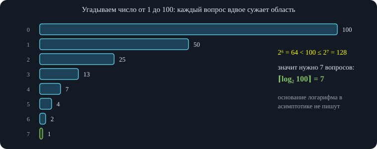\
*После каждого вопроса остаётся половина кандидатов; за $7$ вопросов от $100$ остаётся один. Число вопросов — это $\lceil\log_2 n\rceil$.*

### 1.2. Почему основание логарифма не пишут

То, что мы делаем, — это и есть **бинарный поиск** (бинпоиск), а его асимптотика — $O(\log n)$ без указания основания. В асимптотике константные множители не пишут: она показывает, *как меняется время работы при росте параметра*, а константа на рост не влияет. Если $n$ вырос с 100 до 1000 в $10$ раз, то и время у алгоритма $2n$ выросло в $10$ раз — двойка при делении сокращается. С логарифмами то же самое: $\log_2 n/\log_3 n$ — константа, не зависящая от $n$ (формула замены основания). Поэтому «логарифм по какому основанию» в асимптотике неважно: основание лишь умножает время на константу.

Развёрнутое объяснение\
Формула замены основания: $\log_a n=\dfrac{\log_b n}{\log_b a}$. Отношение $\log_2 n/\log_3 n=\log_2 3$ — число, не зависящее от $n$. Поэтому $O(\log_2 n)=O(\log_3 n)=O(\ln n)$.

### 1.3. Когда можно применять бинпоиск

Лектор просит слушателей сформулировать общий принцип. Ответ: нужна **монотонность** — свойство, при котором сначала идут «нет», потом «да» (или наоборот). Лектору больше всего нравится такое определение: сначала идут нули для какого-то чекера (проверки), а потом единицы.

Пример: в отсортированном массиве ищем число $3$. Для каждой позиции проверяем «уже встретилась ли тройка?» (то есть $a_i\ge3$): получаем $0,0,0,1,1,1,\dots$. Любой поиск превращается в **поиск первой единицы** в массиве из нулей и единиц.

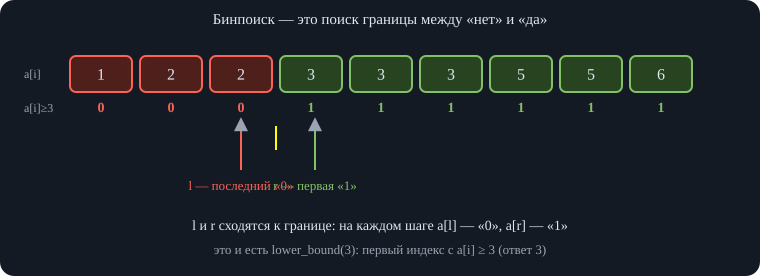\
*Условие делит массив на нули и единицы; бинпоиск находит их границу за $O(\log n)$ проверок.*

### 1.4. Как пишется бинпоиск

Общий вид: пока границы не сошлись, берём середину $m$, проверяем условие в $m$ и сдвигаем одну из границ. Для неубывающей функции: пусть искомое лежит где-то справа от середины. Мы смотрим на $m$: если значение в ней уже больше искомого — искомое левее, и мы сдвигаем правую границу $r$ на $m$; если меньше — правее, и сдвигаем левую границу $l$ на $m$. Середина считается целочисленным делением.

Лектор договаривается об инварианте: **$r$ указывает на «неподходящий» элемент, следующий после подходящих, а $l$ — на подходящий**. Дальше: при $a[m]>x$ сдвигаем $r$, при $a[m]\le x$ сдвигаем $l$ (в записи это называется «$l$ — lower bound, $r$ — upper bound»).

Развёрнутое объяснение\
Названия $l$ и $r$ здесь — просто левая и правая границы, а `lower_bound`/`upper_bound` — это названия *результатов* двух вариантов поиска, а не самих границ. Надёжный способ не запутаться — сформулировать **инвариант**: проверка в $l$ «ложна» (или $l=-1$), проверка в $r$ «истинна» (или $r=n$). Цикл идёт, пока $r-l>1$, и на каждом шаге сохраняет это свойство. Когда $r-l=1$, граница между нулями и единицами найдена: она стоит прямо перед $r$.

Задача: проверить, есть ли в отсортированном массиве число (например, тройка). Для этого ищем первую позицию, где $a[i]\ge x$, и смотрим, равно ли там значение $x$. Начальные значения: можно взять $l=0$, $r=n$ (лектор привыкла писать так: $r$ указывает за конец массива, то есть на заведомо «неподходящий»); можно $l=-1$, $r=n$ — условия цикла будут чуть другими, но работают оба варианта. Предполагаемый ответ после цикла лежит в одной из границ, и в конце нужно проверить, действительно ли там $x$.

``` cpp
// Условие «a[i] >= x» нулей и единиц: сначала false, потом true.
// Инвариант: a[l] < x (или l = -1), a[r] >= x (или r = n).
int lowerBound(const vector<int>& a, int x) {   // первый индекс i с a[i] >= x
    int l = -1, r = a.size();
    while (r - l > 1) {
        int m = (l + r) / 2;
        if (a[m] < x) l = m;                     // m «нулевой» — ответ правее
        else r = m;                              // m «единичный» — ответ в m или левее
    }
    return r;
}
int upperBound(const vector<int>& a, int x) {   // первый индекс i с a[i] > x
    int l = -1, r = a.size();
    while (r - l > 1) {
        int m = (l + r) / 2;
        if (a[m] <= x) l = m;
        else r = m;
    }
    return r;
}
int countEqual(const vector<int>& a, int x) {  // сколько раз x встречается в отсортированном a
    return upperBound(a, x) - lowerBound(a, x);
}
```

Здесь $l=-1$ и $r=n$ — «воображаемые» граничные элементы: слева от массива все проверки «ложны», справа — «истинны». Так цикл не требует разбирать особые случаи: даже если $x$ меньше всех элементов, ответ получится $r=0$, а если больше всех — $r=n$.

Проверка\
Функции `lowerBound`, `upperBound` и `countEqual` сверены со стандартными `lower_bound`/`upper_bound`/`count` на 5000 случайных отсортированных массивах с повторами (в том числе пустых).

Бинпоиск можно делать не только по массиву, но и **по функции**: вместо $a[m]$ вызываем $f(m)$. Всё работает на монотонных функциях — возрастающих, неубывающих, убывающих, невозрастающих.

## 2. Бинпоиск по ответу

### 2.1. Задача про коров и стойла

**Условие.** Даны координаты стойл на прямой и число коров. Нужно расставить коров по стойлам (по одной в стойло) так, чтобы *минимальное расстояние между соседними коровами было максимально возможным*. Например, коровы стоят в трёх стойлах так, что расстояния между ними равны $2,2,5$ — минимальное расстояние $2$; нужно сделать его как можно больше.

**Идея.** Мы бинпоиском идём не по стойлам и не по их номерам, а **по самому ответу** — по значению минимального расстояния $d$. Для фиксированного $d$ вопрос такой: *можно ли поставить $k$ коров так, чтобы любые две соседние были не ближе $d$?* Проверка (чекер) — жадность: ставим первую корову в первое стойло, затем идём по стойлам слева направо и ставим корову в очередное, как только расстояние до последней поставленной стало не меньше $d$. Если удалось поставить хотя бы $k$ коров — расстояние $d$ подходит.

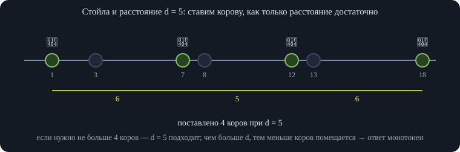\
*Проверка «помещаются ли $k$ коров с расстоянием $\ge d$» — жадность за один проход; затем бинпоиск по $d$.*

Пример с записи: при $d=3$ коров можно поставить по трём стойлам; при $d=4$ тоже подходит (расстояние между подобранными стойлами не меньше $4$); при $d=5$ ещё подходит (), а при $d=6$ — уже нет. Так мы «ощупываем» ответ.

Развёрнутое объяснение\
**Почему жадность верна.** Первую корову выгодно поставить в самое левое стойло: сдвиг её вправо только уменьшает запас для остальных. Следующую — в первое стойло, удалённое от предыдущей не меньше чем на $d$: если поставить её дальше, число оставшихся стойл только уменьшится. По индукции жадная расстановка помещает коров не меньше, чем любая другая.

**Границы.** Левая граница — расстояние $0$ (всегда подходит), правая — на единицу больше максимальной разности координат (заведомо не подходит, если коров не меньше двух). Количество шагов бинпоиска — логарифм максимальной разности координат $C=x_{\max}-x_{\min}$, на каждом шаге проверка за один проход по стойлам. Итого $O(m\log C)$, где $m$ — число стойл (в записи сначала спутаны обозначения числа коров и стойл; лектор сама поправляет асимптотику).

**Почему функция монотонна.** Если коров можно разместить так, что минимальное расстояние не меньше $d$, то и при любом меньшем $d'<d$ их можно разместить той же расстановкой. Если же при каком-то $d$ нельзя, то нельзя и при всех бо́льших. Значит, проверка даёт «да, да, да, …, нет, нет, нет» — как раз нули и единицы.

``` cpp
// Расставить k коров по стойлам x[0..n-1] (по возрастанию) так, чтобы минимальное расстояние было максимальным.
bool canPlace(const vector<int>& x, int k, int d) {     // можно ли расставить k коров с расстояниями >= d
    int cnt = 1, last = x[0];                            // первую корову — в первое стойло
    for (size_t i = 1; i < x.size(); i++)
        if (x[i] - last >= d) { cnt++; last = x[i]; }    // ставим жадно, как только расстояние достаточно
    return cnt >= k;
}
int maxMinDist(const vector<int>& x, int k) {           // нужно 2 <= k <= n
    int l = 0, r = x.back() - x.front() + 1;             // canPlace(l) истинно (d = 0), canPlace(r) ложно
    while (r - l > 1) {
        int m = (l + r) / 2;
        if (canPlace(x, k, m)) l = m;
        else r = m;
    }
    return l;
}
```

Проверка\
Функция `maxMinDist` сверена с полным перебором всех способов выбрать $k$ стойл из $n$ на 3000 случайных тестах ($2\le k\le n\le 9$): ответы совпали.

## 3. Вещественный бинпоиск

До этого все числа были целыми, но границы бинпоиска не обязаны быть целыми — они могут быть вещественными. Пример: найти $x$, при котором $x^3=13$ (то есть корень кубический из $13$). Вопрос слушателям — как научить компьютер извлекать корень; ответ — бинпоиском. Функция $x^3$ монотонно возрастает.

Берём заведомо подходящие границы (в записи — от $-1000$ до $1000$; на деле границы зависят от задачи и берутся так, чтобы ответ гарантированно в них лежал). Смотрим на середину: если $m^3$ больше искомого $13$, ответ левее — двигаем правую границу, иначе двигаем левую. Если идти только по целым, ответ не найти — он нецелый: нужно делить пополам нецелые границы ($2{,}5$ и так далее), они сами будут дробными.

**Как понять, что поиск пора заканчивать?** Условие «$l+1<r$» годилось для целых. Здесь два варианта:

- задать точность $\varepsilon$ и идти, пока $r-l>\varepsilon$;
- **сделать фиксированное число делений** (цикл `for`), например $60$ (лектору кажется нормальным, можно и больше). Лектор советует именно этот вариант: он не зависит от неудачно выбранной точности. Число повторений можно ставить хоть $200$ — лишь бы укладываться по времени.

``` cpp
// Корень кубический из a (a > 0) и корень квадратный: бинпоиск по вещественным, фиксированное число итераций.
double cbrtBS(double a) {
    double l = 0, r = max(1.0, a);                       // f(x)=x^3 возрастает; на [0, max(1,a)] есть искомая точка
    for (int it = 0; it < 100; it++) {
        double m = (l + r) / 2;
        if (m * m * m < a) l = m;
        else r = m;
    }
    return (l + r) / 2;
}
```

Развёрнутое объяснение\
Почему хватает 60–100 итераций: после $k$ делений длина отрезка равна $L/2^k$. При $L=10^9$ и $k=100$ длина — около $10^{9-30}\approx10^{-21}$, что гораздо меньше шага точности вещественного числа `double`; дальше середина просто перестаёт отличаться от границы, и цикл безвреден. С фиксированным числом итераций нет риска зацикливания при слишком малом $\varepsilon$. Проверка\
Функция `cbrtBS` даёт значения, совпадающие с `cbrt` с точностью $10^{-9}$ для $a=13,\ 0{,}5,\ 2,\ 1000$.

## 4. Тернарный поиск

### 4.1. Когда нужен и как работает

Тернарный поиск знают немногие. Нужен он, чтобы искать **максимум (или минимум)** функции, которая сначала возрастает, потом убывает: т. е. один экстремум, без «полок». Отрезок делят не на две, а на **три равные части** точками $m_1<m_2$.

Пусть мы ищем максимум. Сравниваем значения $f(m_1)$ и $f(m_2)$. Если $f(m_1)>f(m_2)$, можно положить $r:=m_2$; если $f(m_1)\le f(m_2)$ — положить $l:=m_1$.

**Почему так можно.** Нам неизвестно, где точка максимума. Мы знаем лишь, что $m_1$ левее $m_2$ и значение в $m_1$ больше. Возможны два случая: $m_1$ и $m_2$ расположены по разные стороны от точки максимума, либо по одну (обе левее). Но если они обе левее, функция растёт, и значение в $m_1$ не могло бы быть больше. Значит, при $f(m_1)>f(m_2)$ максимум *не правее $m_2$*. А вот левее $m_1$ он может быть, поэтому слева границу двигать нельзя — отбрасываем только то, что правее $m_2$. Симметрично при $f(m_1)\le f(m_2)$ сдвигаем $l$ в $m_1$.

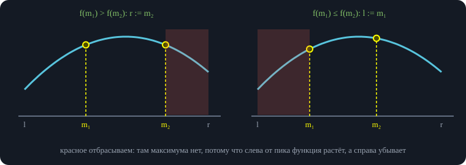\
*Тернарный поиск максимума: по сравнению значений в двух точках отбрасываем треть отрезка, в которой максимума заведомо нет.*

Точки считаются так: $m_1=l+(r-l)/3$, $m_2=r-(r-l)/3$ (в записи: «прибавить треть» и «отнять треть»). Каждый шаг отрезок сжимается в $3/2$ раза, значит, асимптотика — $O(\log n)$ (основание не важно).

``` cpp
// Точка максимума строго унимодальной (сначала строго растёт, потом строго убывает) функции на [l, r].
template <class F>
double ternaryMax(F f, double l, double r) {
    for (int it = 0; it < 100; it++) {
        double m1 = l + (r - l) / 3, m2 = r - (r - l) / 3;
        if (f(m1) > f(m2)) r = m2;                       // справа от m2 максимума нет
        else l = m1;                                     // слева от m1 максимума нет
    }
    return (l + r) / 2;
}
```

### 4.2. Ограничения: плато и унимодальность

Тернарный поиск **не работает на функциях с «полками» (плато)**. Если оказалось $f(m_1)=f(m_2)$, мы не понимаем, где точка — слева, справа или между. Сдвинув любую границу, можно потерять максимум. Итог: тернарный поиск работает **только на строго унимодальных функциях** — таких, которые строго возрастают до максимума и строго убывают после.

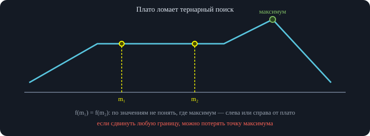\
*Тернарный поиск требует строгой унимодальности: на плато сравнение $f(m_1)$ и $f(m_2)$ ничего не говорит.*

Важное дополнение\
Плато допустимо только на самом экстремуме (у выпуклой функции полка на уровне минимума). Для целочисленного поиска без плато часто удобнее бинпоиск по знаку разности $f(m+1)-f(m)$: для строго унимодальной функции она сначала положительна, потом отрицательна — снова «нули и единицы». У выпуклой функции разности не убывают, и этот бинпоиск работает даже при плато на минимуме (так делается ниже в задаче про сумму расстояний).

## 5. Два указателя

### 5.1. Идея и задача про отрезок с заданной суммой

Метод двух указателей даёт линейную асимптотику там, где наивный перебор отрезков квадратичен. **Задача.** Дан массив неотрицательных чисел; нужно найти *подотрезок* (подряд идущие элементы) с суммой, равной заданной $S$ (на записи — $12$).

Идём двумя указателями $l$ и $r$ — концами текущего отрезка. Если сумма меньше $S$ — двигаем правый указатель вправо (отрезок нужно удлинить); если больше — двигаем левый вправо (отрезок нужно укоротить). Лектор отдельно проговаривает границы: правая граница не включается, левая включается, чтобы пустой отрезок и «последний элемент» не требовали особых случаев. Сформулируем алгоритм целиком:

1.  в начале оба указателя в начале массива, сумма окна — сумма элементов в нём;
2.  пока сумма не равна $S$ и не вышли за границы: если сумма окна *больше* $S$ — вычитаем из суммы левый элемент и сдвигаем левую границу; если *меньше* — прибавляем к сумме следующий справа элемент и сдвигаем правую границу (правая граница не включена);
3.  при равенстве — отрезок найден.

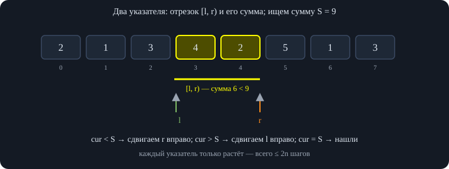\
*Для неотрицательных чисел сумма окна растёт при расширении и убывает при сжатии — это и есть монотонность.*

``` cpp
// Есть ли в массиве НЕОТРИЦАТЕЛЬНЫХ чисел непустой подотрезок с суммой S? Возвращает [l, r) или {-1,-1}.
pair<int,int> segmentWithSum(const vector<long long>& a, long long S) {
    int n = a.size(), l = 0, r = 0;                      // отрезок [l, r), сумма cur
    long long cur = 0;
    while (true) {
        if (cur == S && r > l) return {l, r};
        if (cur < S || r == l) {                         // не хватает — расширяем вправо (пустой отрезок тоже расширяем)
            if (r == n) break;
            cur += a[r++];
        } else {                                         // cur > S — убираем левый элемент
            cur -= a[l++];
        }
    }
    return {-1, -1};
}
```

### 5.2. Почему это работает

Нужно понять, что мы не можем «проскочить» ответ. Идея лектора — инвариант: **искомые границы всегда не левее текущих**: левая граница искомого отрезка находится правее или совпадает с текущей левой, а правая — правее или совпадает с текущей правой. Доказательство от противного. Допустим, инвариант нарушился.

- *Правая граница сдвинута слишком далеко.* Мы сдвигаем её вправо, только когда сумма нашего отрезка слишком мала. Но если искомый отрезок целиком внутри нашего, его сумма не больше суммы нашего отрезка, значит и у нашего она не меньше $S$ — противоречие. (Это справедливо, потому что все числа неотрицательны.)
- *Левая граница сдвинута слишком далеко.* Она сдвигается, когда сумма слишком велика. Рассмотрим момент, когда левая граница стояла на искомой; тогда правая либо левее искомой правой, либо правее — если правее, сумма слишком велика уже у отрезка, лежащего внутри окна, что невозможно; если левее — мы продолжили бы расширять и нашли отрезок. Это уточняется разбором порядка сдвигов: сначала шла правая граница (иначе мы бы дошли до искомой левой границы и нашли отрезок), потому что окно с суммой $A+X$ ($X$ — сумма искомого, $A$ — «лишний» кусок слева) оказалось слишком малым, а это невозможно при $A\ge0$.

Развёрнутое объяснение\
Короткое строгое доказательство. Пусть отрезок $[a,b)$ имеет сумму $S$; рассмотрим тот из них, у которого левая граница $a$ минимальна, и покажем, что алгоритм остановится не позже, чем $l=a$, $r=b$.\
**1.** Пока $l\le a$, указатель $r$ не может оказаться правее $b$: он сдвигается вправо только при сумме окна $<S$, а если $r\ge b$ и $l\le a$, то окно содержит $[a,b)$ и его сумма $\ge S$ (числа неотрицательны).\
**2.** Пока $r\le b$ и $l=a$, указатель $l$ не сдвигается: сдвиг идёт при сумме окна $>S$, а окно $[a,r)\subseteq[a,b)$ имеет сумму $\le S$.\
Итак, пока ответ не найден, $l\le a$ и $r\le b$, а каждый шаг сдвигает хотя бы один из них — значит, через конечное число шагов будет $l=a$, $r=b$ (в этот момент или раньше сумма равна $S$, и алгоритм останавливается).

**Асимптотика.** Каждый из указателей двигается только вправо и проходит не больше $n$ позиций, поэтому суммарно действий не больше $2n$, то есть $O(n)$.

### 5.3. Встречные указатели и условие применимости

Указатели не обязаны двигаться в одну сторону. Бывают задачи, где левый указатель стоит в начале массива, правый — в конце, и они идут навстречу друг другу в зависимости от условий. Главное, чтобы сохранялся какой-то инвариант. Доказательство выше опирается на **монотонность суммы по включению**: расширили отрезок — сумма не уменьшилась. В записи это называют требованием к операции; если оно нарушено, границы не обязаны двигаться только в одну сторону.

Важное дополнение\
Для массива с **отрицательными** числами этот метод неверен: добавление элемента справа может уменьшить сумму, и правило «меньше → расширяем» ничего не гарантирует. Для таких массивов используют префиксные суммы и словарь. Метод двух указателей применим, когда условие «отрезок подходит» монотонно: если подходит $[l,r)$, то подходит и любой отрезок, содержащий его (или любой вложенный — в зависимости от задачи). Проверка\
Функция `segmentWithSum` сверена с перебором всех отрезков на 5000 случайных массивах неотрицательных чисел (в том числе с нулями) и случайных $S$ от $0$ до $12$: результат о существовании совпал, найденный отрезок действительно имеет сумму $S$.

## 6. Разбор задач контеста

### 6.1. Задача 1. Сколько раз число встречается в массиве

**Условие.** Дан массив и несколько чисел; для каждого нужно сказать, сколько раз оно входит в массив. **Идея.** Отсортировать массив и использовать пару `lower_bound` и `upper_bound` — оба и есть бинпоиск. Ответ: $\text{upper}-\text{lower}$. Лектор акцентирует: надо понимать, что означает условие в теле цикла. Равные элементы образуют «плато». Нам нужны первая и последняя позиции плато, и разные условия внутри цикла дают разные границы.

Если внутри бинпоиска проверять $a[m]\ge x$, то граница остановится на *первом* элементе, равном $x$ (или первом большем); если проверять $a[m]>x$ — на первом элементе, который *строго больше* $x$. Именно поэтому можно написать два разных поиска — «нестрогий» и «строгий» — и получить разные результаты. Количество вхождений — разность этих двух позиций.

```
lower(x) = первый индекс i с a[i] ≥ x
upper(x) = первый индекс i с a[i] > x
ответ    = upper(x) − lower(x)
```

### 6.2. Единичный квадрат и две скорости

**Условие.** Есть единичный квадрат; нужно пройти из левого нижнего угла $(0,0)$ в правый верхний $(1,1)$. Скорость зависит от координаты $x$: пока $x<r$ (параметр $r$ задан), скорость равна $v_1$, дальше — $v_2$. Найти минимальное время. Идеи слушателей: выгодно идти по прямым; выбрать точку на границе между зонами и идти из начала в неё и из неё в конец; искать её бинарным поиском.

**Разбор.** Если бы скорость была одинаковой, оптимальный путь — диагональ. Отклонение зависит от отношения скоростей: например, при $v_1\gg v_2$ выгодно пройти больший путь по быстрой зоне, чтобы меньший путь пройти по медленной. Путь состоит из двух прямолинейных отрезков: от $(0,0)$ до точки $(r,y)$ на границе и от неё до $(1,1)$. Время:

$$T(y)=\frac{\sqrt{r^2+y^2}}{v_1}+\frac{\sqrt{(1-r)^2+(1-y)^2}}{v_2},\qquad y\in[0,1].$$

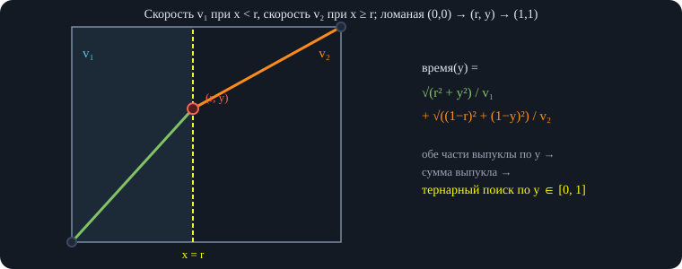\
*Минимизируем время по ординате $y$ точки пересечения границы $x=r$; на каждой стороне оптимально идти прямо.*

Каждое слагаемое — выпуклая функция от $y$, а сумма выпуклых функций выпукла. **Выпуклая** функция — такая, что хорда между любыми двумя точками лежит не ниже графика. Выпуклая функция унимодальна, значит ищем точку минимума **тернарным поиском** по $y$ на $[0,1]$. Ответ — время в найденной точке.

Развёрнутое объяснение\
Почему слагаемые выпуклы: $\sqrt{r^2+y^2}$ — длина вектора $(r,y)$, то есть норма, а норма, составленная с линейной функцией от $y$, выпукла (неравенство треугольника). Тот же вывод для $\sqrt{(1-r)^2+(1-y)^2}$. Деление на положительную скорость сохраняет выпуклость. Строгая выпуклость здесь имеет место, поэтому плато нет и тернарный поиск корректен. (Другой путь — закон Снеллиуса из оптики.)

### 6.3. Задача 4. Приближённый корень из числа

**Условие.** Найти приближённое значение корня из заданного числа. Нужна монотонная функция, по которой идти бинпоиском: заменяем «найти $x=\sqrt a$» на «найти первое $x$, для которого $x^2\ge a$». Это и есть бинарный поиск по возрастающей функции $F(x)=x^2$ с условием $F(x)\ge a$; точность задаётся условием задачи.

### 6.4. Фонари и дома

**Условие.** Вдоль прямой стоят дома; нужно освещать их заданным количеством $k$ фонарей, каждый освещает расстояние $R$ вправо и влево. Найти *минимальный радиус* $R$, при котором существует расстановка $k$ фонарей, покрывающая все дома.

**Идея.** Если радиус $R$ подходит, то подходит и любой больший: расстановка та же, зоны только расширились. Значит, бинарный поиск по ответу $R$ (границы — от $0$ до максимального расстояния между домами). Осталась проверка конкретного $R$.

**Проверка.** Самый левый неосвещённый дом должен быть освещён каким-то фонарём. Фонарь, освещающий его, выгодно сдвинуть вправо до тех пор, пока этот дом всё ещё в его зоне: левее домов нет, так что ничего не потеряем. Поэтому ставим фонарь в точку «координата дома $+R$»; он освещает дома до «координата дома $+2R$». Затем берём следующий неосвещённый дом и повторяем. Если потребовалось не больше $k$ фонарей, радиус подходит.

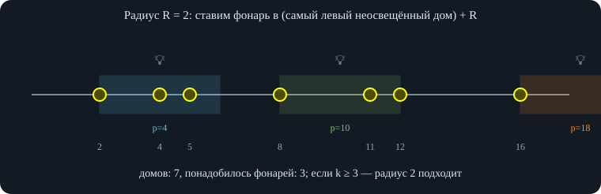\
*Крайний дом обязан быть освещён; фонарь выгодно сдвинуть вправо до границы его зоны — левее освещать нечего.*

Лектор разбирает пример: при радиусе $3$ расстановка получается, а при радиусе $2$ () понадобится как минимум три фонаря, то есть радиус $2$ не подходит.

Формально: нужно найти минимальное $R$, для которого существуют $k$ координат, такие, что каждый дом находится хотя бы от одной из них на расстоянии не больше $R$.

```
covered(R):
    used = 0; i = 0
    пока i < n:
        used += 1
        reach = h[i] + 2R        // фонарь в h[i]+R
        пока i < n и h[i] ≤ reach: i += 1
    вернуть used ≤ k

бинпоиск по R: l = 0 (не подходит или предельно), r = h[n−1]−h[0] (подходит);
    m = (l+r)/2; если covered(m): r = m, иначе l = m   // 100 итераций
```

Проверка\
Итоговый радиус, найденный описанным способом, сверен с полным перебором разбиений домов на не более чем $k$ групп (радиус для группы — половина её длины) на 3000 случайных тестах: значения совпадали с точностью $10^{-6}$.

### 6.5. Локальный максимум в массиве

**Условие.** Дан массив из $n$ чисел; известно, что **по краям стоят $-\infty$** (то есть «за» первым и последним элементом считаем $-\infty$), а соседние элементы различны. Нужно найти *локальный максимум*: такой индекс $i$, что $a_{i-1}<a_i>a_{i+1}$. Ответ существует всегда (из-за $-\infty$ по краям), и нужен бинпоиск за $O(\log n)$ — а не линейный проход.

**Идея.** Берём середину $m$ текущего отрезка и смотрим на соседа справа. Если сосед справа *меньше* $a_m$, то пик существует в левой части (включая $m$): слева от $m$ рано или поздно нужно вернуться вниз (на краю $-\infty$), а мы уже стоим выше правого соседа. Рассуждение через непрерывное движение: мы не можем бесконечно подниматься — мы или упрёмся в пик, или в конце концов опустимся. Инвариант: на текущем отрезке есть тройка точек «выше слева — выше в середине — ниже справа» (в смысле границ), отрезок сужается, и в конце остаётся три подряд идущих элемента, по которым видно пик. Если сосед справа *больше*, пик в правой части.

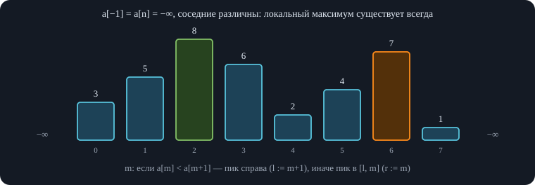\
*Любой подъём вправо рано или поздно кончается: либо спуск, либо $-\infty$ на краю — значит пик внутри.*

На вопрос о том, нужен ли именно максимум: нет — достаточно *любого* локального максимума, ответов может быть несколько ().

```
l = 0, r = n − 1                        // инвариант: пик в [l, r]
пока l < r:
    m = (l + r) / 2
    если a[m] < a[m+1]: l = m + 1       // справа выше — пик правее
    иначе:               r = m           // справа ниже — пик в [l, m]
вернуть l
```

Проверка\
Алгоритм проверен на 5000 случайных массивах (длины $1$–$12$, соседние различны): найденный индекс всегда является локальным максимумом.

### 6.6. Задача 7. K-я по величине абсолютная разность

**Условие.** Дан массив чисел (отсортированный). Рассмотрим все попарные абсолютные разности $|a_i-a_j|$, $i<j$. Нужно найти $k$-ю по величине в отсортированном списке этих разностей. Наивно выписать все разности и отсортировать нельзя — их порядка $n^2$.

**Идея.** Бинарный поиск **по ответу** $M$. Для фиксированного $M$ считаем $W(M)$ — количество пар с $|a_i-a_j|\le M$. Если $M$ — искомая разность, то среди всех разностей ровно $W(M)$ не больше $M$.

**Как считать $W(M)$ за $O(n\log n)$.** Для каждой точки $x_i$ бинпоиском находим последнюю точку, у которой координата $\le x_i+M$ (первое «слишком далёкое»), и аналогично первую, где координата $\ge x_i-M$. Все точки между ними — подходящие, их количество прибавляем. Суммарно $O(n\log n)$ за подсчёт, и ещё внешний бинпоиск по $M$ даёт $O(n\log n\log C)$.

Пример: точки на $1,2,3,4$; попарные разности: $1,1,1,2,2,3$. Единица является ответом для $k=1,2,3$ — одно и то же значение занимает несколько номеров в списке.

**Монотонность и условие.** $W(M)$ не убывает с ростом $M$. Нужно найти *наименьшее* $M$, при котором $W(M)\ge k$: именно такое $M$ — $k$-я разность. Лектор подробно разбирает неверные варианты. Если искать «$W(M)\le k$» — для четвёртой статистики пробное значение $3$ даст ответ $1$ (неверно). Если искать «$W(M)=k$» — для $k=2$ при ответе $1$ получится $W=3$, а условие равенства не выполнено. Правильный вариант: первое $M$, при котором $W(M)\ge k$.

```
W(M): для каждого i найти справа бинпоиском последнюю j с a[j] − a[i] ≤ M
      сумма (j − i) по всем i              // пар (i, j') с i < j' ≤ j
ответ: минимальное M, для которого W(M) ≥ k
```

Улучшение подсчёта — в конце занятия (раздел «Возвращаемся к задаче 7»).

### 6.7. Задача 9. Точка с минимальной суммой расстояний

**Условие.** На прямой лежат $n$ точек. Нужно найти точку $x$, для которой сумма расстояний до всех точек $f(x)=\sum_i |x-x_i|$ минимальна. Лектор объясняет, какая функция: на левом конце убывает, потом возрастает; значит, подходят и бинпоиск по знаку разности, и тернарный поиск (: если функция унимодальна, поиск по «убывает/возрастает» даёт тот же результат, что тернарный).

Но задача проще: ответ — **медиана** (). Если точки отсортированы $x_1\le\dots\le x_n$, то это элемент $x_{(n+1)/2}$ при нечётном $n$; при чётном $n$ подойдёт любая точка между двумя средними. Ответ — точка, принадлежащая множеству данных (можно искать и тернарным поиском).

**Почему медиана.** Пусть мы стоим в точке $x$, слева (не правее) от нас $L$ точек, справа $R$. Сдвинем $x$ на $\delta>0$ вправо, не пересекая никакой точки. Для каждой точки слева слагаемое $|x-x_i|=x-x_i$ становится $x+\delta-x_i$, то есть увеличивается на $\delta$; для каждой точки справа слагаемое уменьшается на $\delta$. Итого сумма меняется на $\delta(L-R)$. Если $R>L$ (справа точек больше) — шаг вправо улучшает ответ; если $L>R$ — выгодно идти влево. Когда мы проходим точку, она «перекладывается» из правых в левые: $R$ уменьшается на $1$, $L$ увеличивается на $1$. Идти нужно, пока правых больше, значит, остановка — когда $L\ge R$ и $R\ge L$ в смысле $\pm1$: в медиане. При пяти точках остановимся на третьей (слева и справа по две); при шести можно «гулять» между третьей и четвёртой — сумма постоянна.

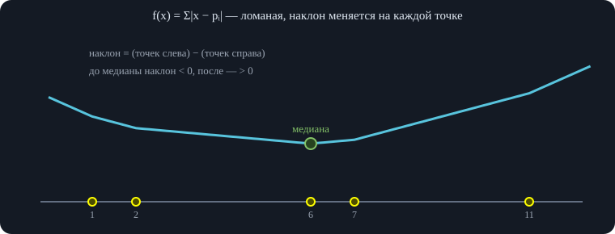\
*Сдвиг вправо на $\delta$ меняет сумму на $\delta\,(\#\text{слева}-\#\text{справа})$; минимум — там, где знак меняется.*

Итак, функция сначала убывает, потом плато, потом возрастает, и после этого можно искать минимум тернарным поиском. **На плоскости** с манхэттенским расстоянием $|x-x_i|+|y-y_i|$ слагаемые независимы: $x$-координата и $y$-координата оптимизируются отдельно — берём медиану по каждой оси.

```
отсортировать x_1 ≤ … ≤ x_n
ответ = x_{⌈n/2⌉}          // медиана (для чётного n — любая точка между двумя средними)
```

Проверка\
Бинпоиск по знаку разности $f(x+1)-f(x)$ (разность не убывает у выпуклой функции) на 3000 случайных массивах из $1$–$9$ чисел в диапазоне $[-20,20]$ нашёл точку с минимальной суммой, совпадающую с перебором.

### 6.8. Задача 12. Работники и штраф за время

**Условие.** Нужно выполнить заказ из $n$ изделий. Нанять одного работника стоит $K$; работник делает одно изделие за время $t$. Если заказ выполнен за время $T$, предприятие платит штраф $T^2$. Какое минимальное количество денег придётся потратить? Заранее нужно решить, сколько работников $w$ нанять — от этого зависит штраф.

Идея лектора: если нанять слишком много работников — потратим много на найм, слишком мало — заказ будет делаться долго и штраф будет большим; значит, функция «сначала убывает, потом возрастает», и можно искать **тернарным поиском по числу работников $w$**. Сколько времени потребуется: $w$ работников делают по $w$ изделий за каждые $t$ единиц времени; если $n$ не кратно $w$, остаток делается ещё за один шаг — поэтому округляем вверх. Время $T=\lceil n/w\rceil\cdot t$, стоимость $\text{cost}(w)=K\cdot w+\left(\lceil n/w\rceil\,t\right)^2$ ().

Исправление\
Сама идея «функция выпукла, значит тернарный поиск» из-за **округления вверх неверна**: $\lceil n/w\rceil$ — ступенчатая функция, и сумма с линейным слагаемым может иметь несколько локальных минимумов. Пример: $n=4$, $K=1$, $t=1$: значения $\text{cost}(1),\dots,\text{cost}(4)$ равны $17,6,7,5$ — после подъёма снова спуск, минимум $5$ при $w=4$, а целочисленный тернарный поиск остановится на $6$. Это не редкость: в $2222$ из $3000$ случайных наборов параметров значения $\text{cost}(w)$ после подъёма снова убывают.

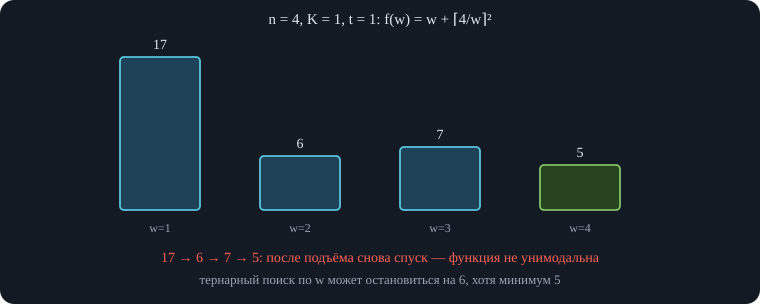\
*Из-за округления вверх $\lceil n/w\rceil$ значения образуют «ступеньки»: унимодальности нет.*

Правильный способ — заметить, что $\lceil n/w\rceil$ принимает только $O(\sqrt n)$ различных значений. Внутри блока, где оно постоянно, время не меняется, а $K\cdot w$ растёт — значит, в блоке выгодно брать **наименьшее** $w$. Достаточно перебрать только такие $w$.

```
best = ∞;  w = 1
пока w ≤ n:
    c = ⌈n / w⌉
    best = min(best, K·w + (c·t)²)
    w = ⌈n / (c − 1)⌉ если c > 1 иначе n + 1    // первое w, при котором c уменьшится
```

Проверка\
Перебор блоков сверен с полным перебором всех $w$ от $1$ до $n$ на 3000 случайных тестах ($n\le60$, $K\le40$, $t\le5$): минимальные стоимости совпали.

### 6.9. MEX на отрезках

**Определение.** $\operatorname{mex}$ множества — минимальное целое неотрицательное число, которого в множестве нет. Задача: отвечать на запросы $\operatorname{mex}$ на отрезках массива, причём известно, что **суммарное смещение границ запросов невелико** (сумма модулей разностей соседних границ запросов мала). Для одного запроса можно ответить за $O(\text{длина})$ перебором; интересна более быстрая схема.

**Идея.** Храним не само множество чисел окна, а множество **отсутствующих** чисел $0,1,\dots,n$ — например, в `std::set` — и счётчик вхождений каждого числа. Изначально в множестве отсутствующих лежат все числа $0..n$, счётчики нулевые. При добавлении числа: если его счётчик был $0$ — удаляем число из множества отсутствующих, затем увеличиваем счётчик. Тогда $\operatorname{mex}$ — это просто наименьший элемент `begin()` множества отсутствующих.

**Переход к следующему запросу.** Окно нового запроса получается из предыдущего сдвигом границ; мы добавляем нужные элементы справа и слева и удаляем лишние: при удалении уменьшаем счётчик, и если он стал $0$ — возвращаем число в множество отсутствующих (если двойка осталась в окне, счётчик $>0$ и в множество она не вернётся). Ответ на запрос — `begin()` множества. Каждое добавление и удаление стоит $O(\log n)$, всего $O((\text{суммарный сдвиг}+q)\log n)$.

Развёрнутое объяснение\
Это частный случай техники, известной как «алгоритм Мо»: запросы сортируют так, чтобы границы сдвигались мало, а ответ пересчитывают при добавлении/удалении элементов. Чтобы счётчики не стали отрицательными, сначала расширяют окно (добавляют), потом сужают (удаляют).

```
все числа 0..n лежат в set «отсутствуют»; cnt[v] = 0
add(v): если cnt[v] = 0: удалить v из set;  cnt[v] += 1
del(v): cnt[v] −= 1;  если cnt[v] = 0: вставить v в set
сдвиг окна к [l, r): сначала добавить недостающие справа/слева, потом удалить лишние
mex = первый (наименьший) элемент set
```

Проверка\
Схема сверена с прямым вычислением mex на 3000 случайных массивах длины до $10$ и запросах (до 6 отрезков подряд): ответы совпали.

### 6.10. Возвращаемся к задаче 7: два указателя вместо вложенного бинпоиска

Подсчёт $W(M)$ можно ускорить. Идём по правому концу $j$ слева направо, левый указатель $i$ держим на первой подходящей позиции ($a_j-a_i\le M$): пока $a_j-a_i>M$, увеличиваем $i$. Когда правая точка сдвигается вправо, граница слева может только увеличиться — это то же монотонное движение двух указателей. Для каждого $j$ прибавляем $j-i$.

Было: внутренний бинпоиск на каждый $i$ — $O(n\log n)$ на подсчёт и $O(n\log n\log C)$ суммарно. Стало: $O(n)$ на подсчёт и $O(n\log C)$ суммарно — теперь внутри бинпоиска нет второго бинпоиска, а только проход по массиву.

```
W(M): cnt = 0; i = 0
      для j от 0 до n−1:
          пока a[j] − a[i] > M: i += 1
          cnt += j − i
      вернуть cnt
бинпоиск по M: наименьшее M с W(M) ≥ k
```

Проверка\
Версия с двумя указателями (`kthDiff`) сверена с явным списком всех попарных разностей на 3000 случайных тестах ($n\le9$, значения до $25$): $k$-я разность совпала для всех $k$.

В конце лектор предлагает дорешать оставшиеся задачи дома и задавать вопросы по контесту.
