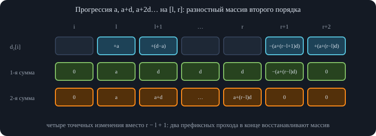
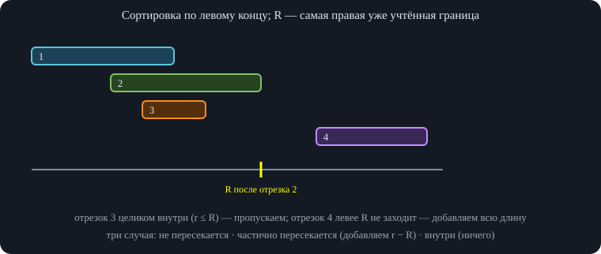
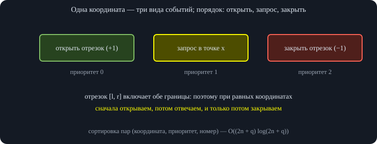
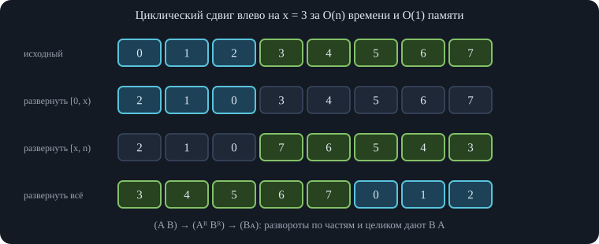
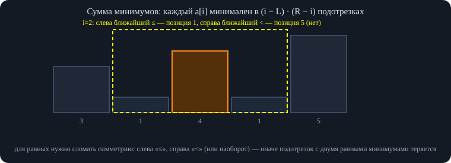
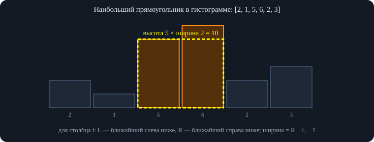
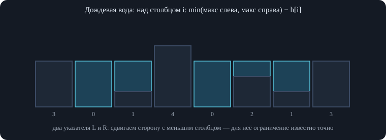

# Занятие 3. Параллель BS — Линейные алгоритмы

*Префиксные суммы и разностные массивы, сканирующая прямая, второй максимум, сдвиг на месте, ближайшие большие и меньшие элементы, гистограммы и дождевая вода.*

## 1. Префиксные суммы и разностные массивы

Линейный алгоритм работает за время, пропорциональное длине входа. На этом занятии разбираются приёмы, которые превращают «очевидное» решение за $O(n^2)$ в проход за $O(n)$: префиксные суммы, разностные массивы, сканирующая прямая, монотонный стек и два указателя. Запись ведут два лектора: первую часть лекции (до перерыва) и семинар после перерыва.

### 1.1. Префиксные суммы

**Задача.** Дан массив $a$ и много запросов «найти сумму на отрезке $[l,r]$». Решение для каждого запроса «в лоб» — $O(n)$; после предподсчёта можно отвечать за $O(1)$.

**Префиксные суммы.** $\mathit{pref}_i=a_0+a_1+\dots+a_{i-1}$ — сумма первых $i$ элементов; $\mathit{pref}_0=0$. Тогда сумма на отрезке равна разности двух значений:

<div class="formula">

$$\sum_{i=l}^{r}a_i=\mathit{pref}_{r+1}-\mathit{pref}_{l}.$$

</div>

Лектор показывает два способа не спотыкаться об индекс $l-1$: либо отдельная проверка («если $l=0$, префикс до него равен нулю»), либо удобнее — *сдвинуть индексацию*: массив префиксов на единицу длиннее, нулевой элемент равен 0, и тогда в формуле всегда есть $\mathit{pref}_l$ (в векторе вместо «мусора» там 0 по умолчанию). Если в задаче границы даются с единицы, их достаточно уменьшить на 1.

Смысл формулы: в $\mathit{pref}_{r+1}$ лежит сумма всех элементов до $r$ включительно, а в $\mathit{pref}_l$ — до $l-1$; разность оставляет ровно $[l,r]$. Позднее эту идею оптимизируют до дерева отрезков (когда массив меняется), но для статического массива хватает префиксов.

### 1.2. Отрезок с максимальной суммой

**Условие.** В массиве (числа могут быть отрицательными) найти отрезок с максимальной суммой.

**Идея.** Зафиксируем правую границу $r$. Сумма отрезка $[l,r]$ равна $\mathit{pref}_{r+1}-\mathit{pref}_l$: первое слагаемое от $l$ не зависит, поэтому для максимума нужно *минимальное* $\mathit{pref}_l$ среди $l\le r$. Значит, идём слева направо и поддерживаем минимальный из уже встреченных префиксов. Ни отдельный массив минимумов, ни второй проход не нужны: префикс и его минимум обновляются в одном цикле.

**Нулевая длина.** Если разрешён пустой отрезок, ответ не меньше нуля. Если отрезок должен быть непустым, то при вычислении кандидата в ответ минимум нужно брать *до* того, как в него попадёт текущий префикс. Если все числа отрицательные, ответ — наибольший (наименее отрицательный) элемент, а не 0.

<div class="code">

<div class="code-head">

C++

копировать

</div>

```
long long maxSubarray(const vector<long long>& a) {      // непустой отрезок
    long long p = 0, minP = 0, ans = LLONG_MIN;
    for (long long x : a) {
        p += x;                                          // p = pref[r + 1]
        ans = max(ans, p - minP);                        // лучшая левая граница — с минимальным pref[l]
        minP = min(minP, p);                             // pref[r + 1] станет кандидатом для следующих r
    }
    return ans;
}
```

</div>

На вопрос из чата об алгоритме Кадане лектор отвечает: это то же самое, только без массивов: `cur = max(cur + a[i], a[i])`, `ans = max(ans, cur)`. Оба подхода работают за $O(n)$ и $O(1)$ дополнительной памяти.

### 1.3. Разностный массив

Разностный массив $d$ — «обратная операция» к префиксным суммам: $d_0=a_0$, $d_i=a_i-a_{i-1}$. Обратиться к элементу исходного массива — значит взять префикс сумм $d$. Практический смысл: **прибавить $x$ на отрезке $[l,r]$** — это только два изменения: $d_l\mathrel{+}=x$ и $d_{r+1}\mathrel{-}=x$. После всех запросов один проход префиксными суммами восстанавливает массив. Именно поэтому разностный массив и префиксные суммы — две стороны одного приёма.

На семинаре это повторяют: нужно прибавить 5 на отрезке — делаем $+5$ в начале и $-5$ сразу за концом; тогда на всём суффиксе после начала прибавляется 5, а за концом она «гасится». **Чем отличаются.** Префиксные суммы — сумма всех элементов до текущего включительно; разностный массив — разность соседних. С помощью первого отвечают на запросы суммы, с помощью второго прибавляют на отрезках, а затем префиксные суммы восстанавливают исходный массив.

### 1.4. Прибавление арифметической прогрессии на отрезке

**Задача.** Запросы теперь вида $(l,r,a,d)$: к элементу $l$ прибавить $a$, к $l+1$ — $a+d$, …, к $r$ — $a+(r-l)d$.

**Идея: два раза префиксные суммы.** Если в разностном массиве прибавить единицу в одной позиции и дважды взять префиксные суммы, получится $0,1,2,3,4,\dots$ — арифметическая прогрессия с $a=d=1$. Значит, прогрессию задаёт «разностный массив разностного массива» (второго порядка). Нужно научиться (1) задавать произвольные $a$ и $d$ и (2) *останавливать* прогрессию в конце отрезка.

**Начало.** Пусть после первой суммы мы хотим получить $a$ в позиции $l$ и дальше шаг $d$ в каждой позиции: нужно $+a$ в позиции $l$ и $(d-a)$ в позиции $l+1$ (после первой суммы получатся $a,\ d,\ d,\ d,\dots$, а после второй — $a,\ a+d,\ a+2d,\dots$).

**Остановка.** К позиции $r+1$ вторая сумма уже накопила $a+(r-l)d$, а на первой сумме продолжает идти $d$. Чтобы погасить и значение, и шаг, в позицию $r+1$ нужно вписать $-(a+(r-l+1)d)$, а в позицию $r+2$ вернуть $+(a+(r-l)d)$.

<div class="fix">

<span class="lbl">Уточнение</span>\
На записи правило для конца отрезка проговорено так: «в $L$ прибавляем $A$, в $L+1$ прибавляем $-A+D$, и в $R+1$ вычитаем член прогрессии». Этих трёх изменений недостаточно: если остановиться на них, то справа от отрезка остаётся ненулевой «хвост» (шаг $d$ продолжает накапливаться). Нужна четвёртая точка $r+2$ и значение $-(a+(r-l+1)d)$ в $r+1$. Проверка перебором на случайных данных: вариант из трёх точек даёт неверный ответ в 72% тестов, вариант из четырёх точек — верный во всех.

</div>

<div class="code">

<div class="code-head">

C++

копировать

</div>

```
// запросы (l, r, a, d): на [l, r] прибавить a, a + d, a + 2d, ...; индексы с нуля
vector<long long> addProgressions(int n, const vector<array<long long, 4>>& qs) {
    vector<long long> d2(n + 3, 0);
    for (auto [l, r, a, d] : qs) {
        d2[l]     += a;                                 // начало: после двух префиксных сумм будет a
        d2[l + 1] += d - a;                             // шаг d
        d2[r + 1] -= a + (r - l + 1) * d;               // гасим значение и шаг справа от отрезка
        d2[r + 2] += a + (r - l) * d;                   // компенсируем лишнее
    }
    vector<long long> res(n); long long p = 0, s = 0;
    for (int i = 0; i < n; i++) { p += d2[i]; s += p; res[i] = s; }   // два прохода префиксных сумм
    return res;
}
```

</div>

\
*Вариант из трёх точек (без компенсации в $r+2$) оставляет ненулевой «хвост» справа от отрезка.*

### 1.5. Сумма на прямоугольнике

**Задача.** Дана матрица чисел, запросы — суммы на прямоугольниках. Префиксная сумма в клетке $(i,j)$ — это сумма на прямоугольнике от левого верхнего угла до этой клетки. Если известны префиксы выше и левее, то по включению–исключению:

<div class="formula">

$$p[i][j]=a[i][j]+p[i-1][j]+p[i][j-1]-p[i-1][j-1]$$

</div>

(вычитаем $p[i-1][j-1]$, потому что общая часть сложена дважды).

**Запрос.** Для прямоугольника с левым верхним углом $(x_1,y_1)$ и правым нижним $(x_2,y_2)$: берём $p[x_2][y_2]$, вычитаем лишнюю полосу сверху $p[x_1-1][y_2]$ и слева $p[x_2][y_1-1]$, а угол, вычтенный дважды, возвращаем: $+p[x_1-1][y_1-1]$. Для трёхмерного случая нужна аналогичная формула включения–исключения по восьми «углам»; на семинаре её не разбирали («нужно представлять в трёхмерном виде»).

<div class="code">

<div class="code-head">

C++

копировать

</div>

```
struct Prefix2D {
    vector<vector<long long>> p;                      // p[i][j] — сумма на [1..i] x [1..j]
    Prefix2D(const vector<vector<long long>>& a) : p(a.size() + 1, vector<long long>(a[0].size() + 1, 0)) {
        for (size_t i = 1; i <= a.size(); i++) for (size_t j = 1; j <= a[0].size(); j++)
            p[i][j] = a[i-1][j-1] + p[i-1][j] + p[i][j-1] - p[i-1][j-1];
    }
    long long sum(int x1, int y1, int x2, int y2) {      // индексы с 1, границы включительно
        return p[x2][y2] - p[x1-1][y2] - p[x2][y1-1] + p[x1-1][y1-1];
    }
};
```

</div>

### 1.6. Минимальное число операций «−1 на отрезке» до нулей

**Условие.** Дан массив неотрицательных чисел. За одну операцию можно выбрать любой подотрезок и уменьшить все его числа на единицу. Сколько операций нужно, чтобы получить все нули?

**Ответ.** Положим $a_0=0$ и назовём «ступенькой» пару соседних элементов, где правый больше левого. Тогда ответ равен сумме высот всех ступенек:

<div class="formula">

$$\sum_{i}\max\bigl(0,\ a_i-a_{i-1}\bigr)\qquad(a_{-1}=0).$$

</div>

**Нижняя оценка.** Для каждой ступеньки высоты $h=a_i-a_{i-1}$ (правый столбик выше левого) не менее $h$ отрезков обязаны *начинаться* именно в позиции $i$: отрезок, начавшийся левее, обязан был бы включать и $(i-1)$-й столбик, но он ниже, и это уменьшило бы его ниже нужного. Поэтому операций не меньше суммы высот ступенек (ответ — сумма, а не максимум).

**Верхняя оценка.** Будем действовать так: берём любой максимальный по включению отрезок одинаковой высоты и вычитаем единицу. Каждая такая операция сокращает хотя бы одну ступеньку на единицу, новых ступенек не возникает, а до нуля мы всегда дойдём — значит, операций не больше суммы высот ступенек. Две оценки совпадают.

**Через разностный массив.** Вычесть единицу на отрезке $[l,r]$ — это $-1$ в $d_l$ и $+1$ в $d_{r+1}$. Нужно, чтобы все $d_i$ стали нулями; каждая операция уменьшает на единицу один положительный элемент и увеличивает один отрицательный. Всего требуется ровно «сумма положительных элементов разностного массива» операций — та же формула.

<div class="code">

<div class="code-head">

C++

копировать

</div>

```
long long opsToZero(const vector<long long>& a) {
    long long prev = 0, s = 0;
    for (long long x : a) { s += max(0LL, x - prev); prev = x; }   // сумма положительных «ступенек»
    return s;
}
```

</div>

<div class="own">

<span class="lbl">Важное дополнение</span>\
Формула проверена жадной симуляцией операций на случайных массивах малой длины и совпала. Лектор отдельно отвечает на вопрос из зала («а если вычитать ещё и соседний столбик другой высоты?»): такой ход не сокращает число ступенек и поэтому не уменьшает количество операций.

</div>

## 2. Сканирующая прямая

Сканирующая прямая (`scanline`) — приём для задач, где объекты расположены на очень длинной оси (например, от $-10^9$ до $10^9$): создать массив размером с ось нельзя, поэтому мы идём по *интересным* точкам в отсортированном порядке.

### 2.1. Длина объединения отрезков

**Условие.** Дано $n$ отрезков $[l_i,r_i)$ с границами от $-10^9$ до $10^9$ (длина оси порядка $2\cdot10^9$ — массив по клеткам не создать). Нужно найти суммарную длину их объединения.

**Идея.** Отсортируем отрезки по левой границе. Будем хранить $R$ — самую правую границу среди уже обработанных отрезков (изначально $-\infty$). Для очередного отрезка $[l,r)$ возможны три случая:

- $l\ge R$ — отрезок не пересекается с уже учтённым: добавляем всю его длину $r-l$;
- $l<R<r$ — отрезок частично перекрыт: так как мы сортировали по левой границе, вся часть слева от $R$ уже учтена; добавляем только $r-R$;
- $r\le R$ — отрезок целиком внутри уже учтённого: добавлять нечего.

Во всех случаях после обработки $R=\max(R,r)$. Левая граница нового отрезка не меньше левых границ предыдущих, поэтому не может быть, чтобы часть слева от $R$ осталась неучтённой.

\
*Добавка отрезка: $r-\max(l,R)$, если $r>R$, и ничего иначе; затем $R=\max(R,r)$.*

<div class="code">

<div class="code-head">

C++

копировать

</div>

```
long long unionLength(vector<pair<int, int>> seg) {         // отрезки [l, r)
    sort(seg.begin(), seg.end());                        // по левой границе
    long long ans = 0; int R = INT_MIN;                  // R — самая правая обработанная граница
    for (auto [l, r] : seg) {
        if (r <= R) continue;                            // целиком внутри уже учтённого
        ans += r - max(l, R);                            // добавляем только новую часть
        R = r;
    }
    return ans;
}
```

</div>

### 2.2. События: сколько отрезков покрывают точку

**Задача.** Даны $n$ отрезков и $q$ точек-запросов; для каждой точки $x$ найти, сколько отрезков её накрывают ($l\le x\le r$). Наивно — $O(nq)$. Хотим быстрее.

**Идея: события.** Превратим всё в события трёх видов на оси: «открылся отрезок» (в точке $l$), «закрылся отрезок» (в точке $r$), «запрос» (в точке $x$). Событие — это пара «координата + что за событие + номер» (номер нужен, чтобы запрос знал, куда писать ответ). Сортируем все события по координате и идём слева направо, поддерживая счётчик $c$ — сколько отрезков сейчас открыто: открытие — $c$ увеличивается, закрытие — уменьшается, запрос — записываем $c$ в ответ.

**Порядок событий при равных координатах.** Отрезок $[l,r]$ включает обе границы, поэтому в точке $x$ нужны все отрезки, у которых $l\le x$ и $r\ge x$. Следовательно, при равной координате:

1.  сначала **открытия** (минимальный приоритет): отрезки, начинающиеся в $x$, уже должны считаться;
2.  затем **запросы**;
3.  в конце **закрытия** (максимальный приоритет): отрезок, заканчивающийся в $x$, ещё покрывает $x$.

\
*Если закрыть отрезок раньше запроса, точка на его правой границе окажется не покрытой — ошибка на ровном месте.*

Если закрыть отрезок раньше запроса, точка на правой границе перестанет считаться покрытой — типичная ошибка. Если запросы идут не по возрастанию, ответы записываются по номеру запроса: массив `ans[id]`. Размер массива событий — $2n+q$, а сортировка даёт $O((2n+q)\log(2n+q))$. Отвечать «онлайн» так нельзя: сначала нужно прочитать все запросы и отсортировать.

<div class="code">

<div class="code-head">

C++

копировать

</div>

```
vector<int> coverCount(const vector<pair<int, int>>& seg, const vector<int>& q) {   // отрезки [l, r] включительно
    vector<array<int, 3>> ev;                          // (координата, тип, номер): 0 — начало, 1 — запрос, 2 — конец
    for (auto [l, r] : seg) { ev.push_back({l, 0, 0}); ev.push_back({r, 2, 0}); }
    for (int i = 0; i < (int)q.size(); i++) ev.push_back({q[i], 1, i});
    sort(ev.begin(), ev.end());                          // при равной координате: начала, затем запросы, затем концы
    vector<int> ans(q.size()); int cur = 0;
    for (auto [x, type, id] : ev) {
        if (type == 0) cur++;
        else if (type == 2) cur--;
        else ans[id] = cur;
    }
    return ans;
}
```

</div>

Если нужно идти «с конца», приходится писать свой компаратор для сортировки — это нормально. Такая вариация сканлайна («сканпоинт») часто встречается на Codeforces и олимпиадах: выделяете события и сортируете.

## 3. Один проход и $O(1)$ памяти

### 3.1. Второй максимум

**Задача.** Найти второй максимум линейным алгоритмом. Способы: отсортировать ($O(n\log n)$), сделать два линейных прохода (найти максимум, потом максимум среди остальных), либо **за один проход**: поддерживать два числа — первый и второй максимум на префиксе. Новый элемент $a_i$ претендует лишь на то, чтобы стать новым первым максимумом (тогда прежний первый становится вторым), либо — если он не больше первого — на то, чтобы стать вторым, если он больше нынешнего второго.

Это даёт два сравнения на элемент (на записи отмечено: «два сравнения всегда»), но главное преимущество — **память $O(1)$**: числа могут приходить «онлайн», и если их негде хранить, это единственный вариант: достаточно трёх переменных (`max1`, `max2` и новый элемент).

<div class="code">

<div class="code-head">

C++

копировать

</div>

```
int secondMax(const vector<int>& a) {                // второй по величине элемент с учётом повторов: [5, 5, 3] -> 5
    int m1 = INT_MIN, m2 = INT_MIN;
    for (int x : a) {
        if (x >= m1) { m2 = m1; m1 = x; }              // новый первый максимум; прежний становится вторым
        else if (x > m2) m2 = x;
    }
    return m2;
}
```

</div>

<div class="own">

<span class="lbl">Важное дополнение</span>\
Нужно заранее выяснить, что требуется: второй по величине *элемент* (тогда в $[5,5,3]$ ответ 5) или второе по величине *значение* (ответ 3). Код выше реализует первый вариант; для второго условие первой ветки делается строгим ($x>m_1$), а во вторую добавляется $x<m_1$. Оба варианта проверены перебором.

</div>

### 3.2. Циклический сдвиг массива на месте

**Задача.** Сдвинуть массив циклически влево на $x$ (первые $x$ элементов уходят в конец) за $O(n)$ времени и $O(1)$ дополнительной памяти.

**Неудачные идеи.** «Склеить массив с собой» — нужна память $2n$. Деки не подходят (память). Простая запись формулой «$a[i]=a[(i+x)\bmod n]$» перезаписывает значения, которые ещё нужны: после $a_0\leftarrow a_x$ элемент $a_0$ потерян. Попытка сдвигать свопами: $a_0$ уходит на позицию $n-x$, потом нужно найти, где сейчас лежит $a_0$, и значение уже оказывается в нескольких местах — это распадается на циклы длины $n/\gcd(n,x)$ и требует аккуратной реализации.

**Решение — три разворота.** Пусть массив — это $A\,B$, где $A$ — первые $x$ элементов. Развернём $A$ на месте, затем развернём $B$ на месте, затем развернём весь массив: $(A^R B^R)^R=B\,A$. Каждый разворот — $O(\text{длина})$ обменов, итого $O(n)$ и $O(1)$ памяти. Реверс можно применять не ко всему массиву, а к любой его части.

\
*Попытка сдвигать «по циклам» свопами ломается: значение, которое надо подставить, уже перезаписано, и его пришлось бы искать по всему массиву.*

<div class="code">

<div class="code-head">

C++

копировать

</div>

```
void rotateLeft(vector<int>& a, int x) {                // циклический сдвиг влево на x
    int n = a.size(); x %= n;
    reverse(a.begin(), a.begin() + x);                   // [a0 .. a(x-1)] -> развёрнут
    reverse(a.begin() + x, a.end());                     // [ax .. a(n-1)] -> развёрнут
    reverse(a.begin(), a.end());                         // весь массив — получаем [ax .. a(n-1), a0 .. a(x-1)]
}
```

</div>

## 4. Ближайшие большие и меньшие элементы

### 4.1. Ближайший больший справа без стека

**Задача.** Для каждого $a_i$ найти индекс ближайшего справа элемента, строго большего $a_i$. Лектор показывает вариант без стека — просто переходы по уже посчитанным индексам.

Для удобства идём справа налево, чтобы в момент обработки $i$ ответы для всех $j>i$ уже были посчитаны. Пусть $b_j$ — ответ для $j$ (индекс или $n$, если большего нет). Для $i$ сначала смотрим на $i+1$: если $a_{i+1}>a_i$, ответ $i+1$. Иначе $a_{i+1}\le a_i$, и нужно искать дальше; но элементов, больших $a_{i+1}$, между $i+1$ и $b_{i+1}$ нет — значит, они не могут быть больше и $a_i$. Поэтому **перепрыгиваем** сразу в $j=b_{i+1}$ и снова сравниваем $a_j$ с $a_i$; если опять не больше — прыгаем в $b_j$, и так далее.

![Между $j$ и $b[j]$ нет элементов больше $a[j]$, поэтому весь этот промежуток можно перепрыгнуть одним шагом.](images/parallel-bs-zan3-linejnye-fig5.svg)\
*Между $j$ и $b[j]$ нет элементов больше $a[j]$, поэтому весь этот промежуток можно перепрыгнуть одним шагом.*

<div class="code">

<div class="code-head">

C++

копировать

</div>

```
vector<int> nextGreater(const vector<int>& a) {           // b[i] — ближайший справа строго больший, иначе n
    int n = a.size(); vector<int> b(n, n);
    for (int i = n - 2; i >= 0; i--) {
        int j = i + 1;
        while (j < n && a[j] <= a[i]) j = b[j];          // между j и b[j] больших, чем a[j], нет — перепрыгиваем
        b[i] = j;
    }
    return b;
}
```

</div>

**Почему линейно.** Внутри цикла по $i$ есть ещё цикл прыжков, поэтому сумма выглядит квадратичной. Введём «глубину» — число прыжков, которое придётся сделать из $i$. Из $i$ первый шаг — переход в $i+1$ (глубина увеличивается не больше чем на 1 по сравнению с глубиной $i+1$), а каждый следующий прыжок эту глубину уменьшает; глубина никогда не бывает отрицательной (мы упираемся в край массива). Значит, суммарно «подъёмов» не больше $n$, и «спусков» тоже не больше $n$ — всего $O(n)$. Это то же рассуждение, что и про амортизированный стек: каждый элемент «входит» и «выходит» по одному разу. Лектор отмечает, что здесь не нужна дополнительная память под стек: мы просто переходим по индексам.

### 4.2. Сумма минимумов по всем подотрезкам

**Задача.** Найти $\sum_{l\le r}\min(a_l,\dots,a_r)$ — сумму минимумов по всем подотрезкам.

**Идея: вклад каждого элемента.** Если можно искать ближайший больший, то по тому же принципу можно искать ближайший меньший, слева и справа (достаточно развернуть массив). Для каждого $a_i$ найдём $L_i$ — ближайший слева элемент, меньший $a_i$, и $R_i$ — ближайший справа элемент, меньший $a_i$. Элемент $a_i$ является минимумом на подотрезке тогда и только тогда, когда этот подотрезок содержит $i$, начинается правее $L_i$ и заканчивается левее $R_i$. Левую границу можно выбрать $i-L_i$ способами, правую — $R_i-i$ способами, и эти выборы независимы, поэтому количество таких подотрезков — произведение:

<div class="formula">

$$\sum_{l\le r}\min(a_l..a_r)=\sum_{i}a_i\cdot(i-L_i)\cdot(R_i-i).$$

</div>

\
*Левых границ $i-L$, правых границ $R-i$; выбор левой и правой границы независим, поэтому количество подотрезков — произведение.*

<div class="fix">

<span class="lbl">Исправление</span>\
На записи для «ближайших» взяли *нестрогое* сравнение с обеих сторон («меньше либо равный, чтобы не париться с индексом»). Так нельзя: подотрезок, в котором несколько равных минимальных элементов, перестаёт быть засчитанным для всех: каждый из них считает, что более левый (или правый) равный блокирует границу. На проверке такой вариант расходится с перебором в 67% случайных тестов. Чтобы каждый подотрезок посчитался ровно один раз, симметрию нужно сломать: слева брать ближайший элемент *не больший* ($\le$), а справа — ближайший *строго меньший* ($<$) (или наоборот).

</div>

<div class="code">

<div class="code-head">

C++

копировать

</div>

```
long long sumOfMinimums(const vector<long long>& a) {
    int n = a.size(); vector<int> L(n), R(n), st;
    for (int i = 0; i < n; i++) {                        // L[i]: ближайший слева элемент <= a[i], иначе -1
        while (!st.empty() && a[st.back()] > a[i]) st.pop_back();
        L[i] = st.empty() ? -1 : st.back(); st.push_back(i);
    }
    st.clear();
    for (int i = n - 1; i >= 0; i--) {                   // R[i]: ближайший справа элемент < a[i], иначе n
        while (!st.empty() && a[st.back()] >= a[i]) st.pop_back();
        R[i] = st.empty() ? n : st.back(); st.push_back(i);
    }
    long long s = 0;
    for (int i = 0; i < n; i++) s += a[i] * (i - L[i]) * (R[i] - i);   // a[i] минимален в (i-L)*(R-i) подотрезках
    return s;
}
```

</div>

Смысл формулы лектор объясняет «на пальцах»: выбор левой границы и выбор правой границы никак не влияют друг на друга, поэтому способы перемножаются, а $a_i$ — значение минимума на всех этих подотрезках. Те же идеи работают для максимума.

### 4.3. Ближайший слева меньший — монотонный стек

На семинаре тот же приём разбирают через стек. **Задача.** Для каждого числа найти индекс ближайшего слева элемента, который строго меньше его (или $-1$, если такого нет).

Идём слева направо и храним стек индексов с **возрастающими** значениями. Встретив $a_i$, снимаем с вершины все элементы, которые не меньше $a_i$: для всех следующих элементов они уже не могут быть ближайшими меньшими, потому что $a_i$ стоит ближе и не больше. После этого вершина стека — ответ для $i$ (или $-1$, если стек пуст); затем кладём $i$ в стек. В стеке нужно хранить именно *индексы* (по ним берутся значения); числа на записи писали «для наглядности».

<div class="algo" data-frames="stack">

</div>

<div class="code">

<div class="code-head">

C++

копировать

</div>

```
vector<int> prevSmaller(const vector<int>& a) {          // индекс ближайшего слева элемента строго меньше, иначе -1
    vector<int> res(a.size()), st;
    for (int i = 0; i < (int)a.size(); i++) {
        while (!st.empty() && a[st.back()] >= a[i]) st.pop_back();
        res[i] = st.empty() ? -1 : st.back(); st.push_back(i);
    }
    return res;
}
vector<int> nextSmaller(const vector<int>& a) {          // индекс ближайшего справа элемента строго меньше, иначе n
    int n = a.size(); vector<int> res(n), st;
    for (int i = n - 1; i >= 0; i--) {
        while (!st.empty() && a[st.back()] >= a[i]) st.pop_back();
        res[i] = st.empty() ? n : st.back(); st.push_back(i);
    }
    return res;
}
```

</div>

Время $O(n)$: каждый индекс один раз кладётся в стек и не более одного раза снимается.

### 4.4. Наибольший прямоугольник в гистограмме

**Задача.** Дана гистограмма (высоты столбиков, например $2,1,5,6,2,3$). Найти прямоугольник наибольшей площади, целиком лежащий под гистограммой.

**Идея.** Наибольший прямоугольник «упирается» в какой-то столбик: его высота — высота этого столбика. Поэтому для каждого столбика $i$ берём самый широкий прямоугольник его высоты: он тянется влево до ближайшего более низкого столбика $L_i$ и вправо до ближайшего более низкого $R_i$ (сами они в прямоугольник не входят). Ширина равна $R_i-L_i-1$. Первые идеи из зала («смотреть только ближайший меньший слева») дают неполный перебор — нужны оба соседа.

\
*Для каждого столбца берём самый широкий прямоугольник его высоты; ответ — максимум по всем столбцам.*

<div class="code">

<div class="code-head">

C++

копировать

</div>

```
long long largestRectangle(const vector<int>& h) {
    auto L = prevSmaller(h), R = nextSmaller(h); long long best = 0;
    for (int i = 0; i < (int)h.size(); i++)
        best = max(best, (long long)h[i] * (R[i] - L[i] - 1));   // ширина — между L и R, не включая их
    return best;
}
```

</div>

### 4.5. Наибольший прямоугольник из единиц в матрице

**Задача.** Дана матрица из нулей и единиц. Найти наибольший по площади прямоугольник, целиком состоящий из единиц. (Это не динамика — на семинаре «не тема ДП», но идея близкая.)

Идея «для каждой клетки считать ближайший ноль в четырёх направлениях» не работает (контрпример: прямоугольник, полученный пересечением, может содержать нули в углах). **Решение.** Для каждой клетки посчитаем, на какую высоту вверх из неё идёт столбец из единиц: если в клетке 0 — высота 0, иначе высота клетки сверху плюс 1. Это считается по строкам сверху вниз. Затем каждая строка этой новой матрицы — гистограмма; наибольший прямоугольник из единиц с *нижней стороной* в этой строке — это наибольший прямоугольник в гистограмме. Перебираем все нижние строки и берём максимум.

<div class="code">

<div class="code-head">

C++

копировать

</div>

```
long long largestOnesRectangle(const vector<vector<int>>& M) {
    int m = M[0].size(); vector<int> h(m, 0); long long best = 0;
    for (auto& row : M) {
        for (int j = 0; j < m; j++) h[j] = row[j] ? h[j] + 1 : 0;   // высота столбца из единиц над клеткой
        best = max(best, largestRectangle(h));             // прямоугольники с нижней стороной в этой строке
    }
    return best;
}
```

</div>

Всего $O(nm)$ времени и $O(m)$ дополнительной памяти.

## 5. Дождевая вода

### 5.1. Сколько воды удержит гистограмма

**Задача.** Даны столбики; сверху льют воду, которая заполняет впадины. Найти, сколько воды поместится.

Идея «посчитать воду между самым высоким и самым низким» неверна: если между ними есть низкий столбик, воды над ним столько же, сколько позволяет ограничение с каждой стороны. **Правильный взгляд.** Над столбиком $i$ уровень воды определяется двумя ограничивающими столбиками: самым высоким слева (включая $i$) и самым высоким справа (включая $i$). Воды над ним столько, сколько не хватает до *меньшего* из этих двух максимумов.

**Решение за $O(n)$ времени и памяти.** Посчитаем префиксные максимумы $\mathit{pm}_i=\max(\mathit{pm}_{i-1},h_i)$ слева направо и суффиксные максимумы справа налево, затем сложим $\min(\mathit{pm}_i,\mathit{sm}_i)-h_i$ по всем $i$.

\
*Синий — вода. Памяти $O(1)$: максимум с отстающей стороны не нужен, раз с другой стороны есть столбец не ниже.*

<div class="code">

<div class="code-head">

C++

копировать

</div>

```
long long waterArrays(const vector<int>& h) {
    int n = h.size(); vector<int> pm(n), sm(n);
    for (int i = 0; i < n; i++) pm[i] = max(h[i], i ? pm[i-1] : 0);               // максимум слева, включая i
    for (int i = n - 1; i >= 0; i--) sm[i] = max(h[i], i + 1 < n ? sm[i+1] : 0); // максимум справа, включая i
    long long tot = 0;
    for (int i = 0; i < n; i++) tot += min(pm[i], sm[i]) - h[i];
    return tot;
}
```

</div>

**Решение за $O(1)$ памяти — два указателя.** Заводим указатели $l$ и $r$ на концы и два максимума: $\mathit{mx}_1$ — максимум на префиксе до $l$ включительно и $\mathit{mx}_2$ — максимум на суффиксе от $r$ включительно. На каждом шаге сравниваем столбики $h_l$ и $h_r$ и сдвигаем указатель у *меньшего*. Допустим, сдвигаем $r$ (то есть $h_r\le h_l$): для вышедшего столбика нужно знать меньший из двух максимумов. Максимум справа ($\mathit{mx}_2$) известен точно; максимум слева известен лишь частично (на префиксе до $l$), но может только увеличиться. Если $\mathit{mx}_1\ge\mathit{mx}_2$, то реальный левый максимум не меньше $\mathit{mx}_2$, и меньшим из двух будет именно $\mathit{mx}_2$. А случай $\mathit{mx}_1<\mathit{mx}_2$ невозможен: он означал бы, что справа был столбик выше всего слева, но тогда мы бы со стороны этого столбика не ушли — мы сдвигаем только указатель со столбца, который не выше другого.

<div class="code">

<div class="code-head">

C++

копировать

</div>

```
long long waterTwoPointers(const vector<int>& h) {      // O(1) дополнительной памяти
    int l = 0, r = (int)h.size() - 1, mx1 = 0, mx2 = 0; long long tot = 0;
    while (l <= r) {
        if (h[l] <= h[r]) { mx1 = max(mx1, h[l]); tot += mx1 - h[l]; l++; }   // сдвигаем сторону с меньшим столбцом
        else              { mx2 = max(mx2, h[r]); tot += mx2 - h[r]; r--; }
    }
    return tot;
}
```

</div>

<div class="own">

<span class="lbl">Важное дополнение</span>\
Все алгоритмы этого занятия проверены случайными тестами против перебора (максимальный подотрезок, объединение отрезков, события, второй максимум, три разворота, прыжки, сумма минимумов, прямоугольники, прогрессия, префиксы на прямоугольниках, операции «−1», дождевая вода обоими способами); код компилировался и совпал с перебором во всех проверках.

</div>

<a href="../parallel-bs/parallel-bs-zan2-binpoisk-dva-ukazatelya.html" class="prev"><span class="small">← занятие 2</span><strong>Бинпоиск и два указателя</strong></a><a href="index.html" class="next"><span class="small">к списку</span><strong>Параллель BS</strong></a>
