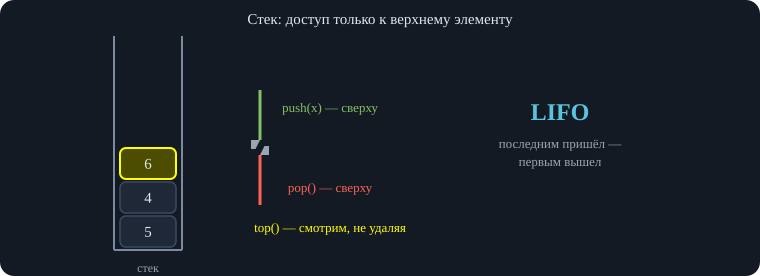
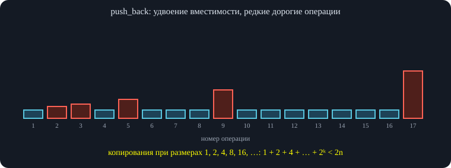
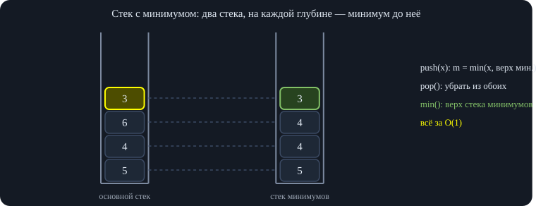
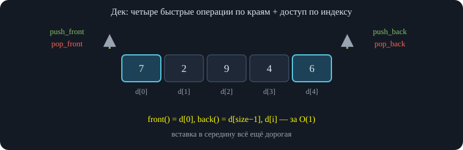

# Занятие 1. Параллель C — Контейнеры

*Организация курса и оценка, повторение асимптотики, стек, очередь и дек; стек и очередь с минимумом, проверка скобочной последовательности, постфиксная запись.*

## 1. Организация курса

Первое занятие параллели C — вводное. Сначала лектор рассказывает, как устроен курс, затем читает основную лекцию «Контейнеры»: повторение асимптотики, стек, очередь и дек.

### 1.1. Язык, блоки и контесты

Весь код пишется и сдаётся **только на C++**. Тем, кто раньше не знал язык, записан мини-курс, который можно проходить в своём темпе, но желательно быстрее — чтобы скорее приступить к контестам. Сдавать первые контесты на Python не разрешается.

Обучение устроено **блоками**: блок — это три лекции и разбор. После каждой лекции выдаётся контест на 10–15 задач по её теме. На четвёртом занятии блока — разбор трёх контестов и небольшой *мини-тест* по пройденным темам в начале. Пример из записи: лекции 12.09, 19.09 и 26.09, разбор 3.10, дедлайн всех трёх контестов — 10.10. Дорешивать можно в течение недели после разбора без потери баллов; после дедлайна задачи сдавать можно, но в оценку они уже не идут.

### 1.2. Как считается оценка

Оценка влияет на то, отчислят ли ученика из кружка, получит ли он мерч и автопроход в следующую параллель (и в какую именно). Элементы контроля:

- каждый **контест** оценивается от 0 до 10 — по доле решённых задач; $O_\text{контесты}$ — среднее по всем контестам;
- каждый **мини-тест** — от 0 до 10; $O_\text{тесты}$ — среднее по тестам;
- **экзамен** в конце каждого полугодия (декабрь и май) — от 0 до 10.

Итоговая оценка за полугодие:

<div class="formula">

$$O_\text{полугодие}=0{,}7\,O_\text{контесты}+0{,}3\,O_\text{экзамен}+0{,}1\,O_\text{тесты}.$$

</div>

Сумма коэффициентов равна $1{,}1$, поэтому последнее слагаемое — *бонус*: при максимуме везде можно набрать 11. Пропущенный тест переписать нельзя, так что для 11 нужно написать все тесты (и посетить занятия с разбором). По прошлому году на 11 закрылся максимум один человек.

**Порог:** при $O_\text{полугодие}\ge5$ из 10 ученика не отчисляют (то есть достаточно набрать хотя бы пять баллов по каждому элементу контроля). Пороги для более низких оценок и для автопрохода определят ближе к концу полугодия. Посещаемость на отчисление не влияет и наказаний за пропуски нет — её отмечают для внутренних нужд.

### 1.3. Пропуски, тесты, экзамены и вопросы из чата

Если ученик болеет или уехал на профильную смену (лагерь, образовательный центр) и не может решать контесты, нужно написать преподавателю лично — дедлайн, скорее всего, продлят. Для обычного отдыха это не работает.

**Тесты** проходят раз в четыре занятия, перед разбором, и длятся 20–30 минут: выбор варианта ответа или «напишите одно число». Накануне лектор предупредит: «завтра разбор» всегда означает тест. Форма — Google-форма онлайн или бумага очно. **Экзамены**: устный разговор с преподавателем (онлайн или очно) плюс контест; порядок объявят за две недели. Микрофон и веб-камера для обучения не обязательны, для экзамена — да.

Лекции других параллелей смотреть можно (запись и задачи — на сайте Algocourse.ru). Лекция идёт с 16:00 до 18:00 по Москве, затем перерыв до 19:00, а после него — решение задач и вопросы (если лекция не уложилась в два часа, время берётся из второй половины). Правила письменно закрепят в канале; правила перехода между параллелями — позже, это сложный вопрос.

В конце лекции повторяются практические детали: запись выкладывают в течение суток на YouTube и VK Видео и в чат параллели; первый контест на «Контейнеры» уже открыт, дедлайн 10.10 в 16:00; вопросы можно писать в Telegram-чат параллели или преподавателям лично.

## 2. Повторение: асимптотика и O-нотация

### 2.1. Зачем нужна O-нотация

Допустим, мы написали программу и хотим понять, быстра ли она. Мерить секунды бесполезно: время на одном тесте ничего не говорит о других тестах, а ещё зависит от компьютера (разница в тысячи и десятки тысяч раз). Нас интересует **зависимость числа операций от размера входа** — это и записывается в $O$-нотации.

Цикл `for (int i = 0; i < n; ++i) counter += i * n % 7;` делает $n$ шагов, на каждом — сложение, умножение, взятие по модулю. При $n=10^3$ он отработает мгновенно, при $n=10^{18}$ — не закончится никогда. Если $n$ вырастает вдвое, шагов вдвое больше, значит, это *линейная* зависимость: $O(n)$.

### 2.2. Правила подсчёта на примерах

**Константы заменяются единицей.** Программа «считать $a$ и $b$, вывести $a+b$» делает три действия — формально $O(3)$, но пишут $O(1)$: константа не зависит от входа. Нас интересует *вид* зависимости.

**Шаг и число действий в теле цикла — тоже константы.** Цикл с шагом 2 делает $n/2$ итераций по три действия внутри: $O(\tfrac n2\cdot 3)=O(n)$.

**Вложенные циклы перемножаются.** Внешний цикл $n$ раз, внутри цикл $n$ раз, внутри вывод константной строки — $O(n\cdot n\cdot1)=O(n^2)$. Но *показатель степени* заменить единицей нельзя: это не множитель, а то, в какой степени стоит $n$.

**Последовательные части суммируются, побеждает самая тяжёлая.** Цикл за $O(n)$ и затем отдельный вложенный за $O(n^2)$ дают $O(n+n^2)=O(n^2)$: слагаемое $n^2$ перевешивает.

<div class="note">

**Вывод строки.** Вывод строки фиксированной длины — $O(1)$; вывод строки длины $n$ — $O(n)$ и умножается на число итераций. Умножение двух чисел — одна операция, поэтому вывести $n^2$ как число — $O(1)$, а вывести $n^2$ символов — $O(n^2)$. Константы вроде «20n вместо n» тоже отбрасываются.

</div>

### 2.3. Ограничения подсказывают нужную асимптотику

Точное время работы оценить очень трудно (процессор, ввод-вывод, железо), а асимптотику легко сравнивать, и по ограничениям задачи видно, какого решения от вас ждут. Это отсекает заведомо плохие идеи вроде полного перебора.

| Ограничение $n$ | Ожидаемая асимптотика |
|----|----|
| до $10^{18}$ (и до $10^9$, когда число лезет в `int`) | $O(1)$ или $O(\log n)$ — формула или бинпоиск/деление пополам |
| до $10^6$ | $O(n)$, $O(n\log n)$ |
| до $10^5$ | вплоть до $O(n\sqrt n)$, если писать аккуратно |
| до $10^3$ | $O(n^2)$ |
| до $100$ | $O(n^3)$ |
| до $20$ | $O(2^n)$ |
| до $8$ | $O(n!)$ |

Откуда такие числа: современная проверяющая система выполняет порядка $10^9$ простых операций в секунду, и надо уложиться примерно в такой бюджет. Это очень приблизительная эвристика.

<div class="fix">

**Исправление.** Строка про $n\le10^9$ у лектора звучит как «всё равно $O(1)$ или $O(\log n)$». Это верно, когда $n$ — *значение* единственного числа во входе (например, нужно что-то вычислить про число $n$). Если же во входе $n$ *элементов*, то прочитать их уже стоит $O(n)$, а лимит времени в 1 с допускает линейный проход только примерно до $10^7$–$10^8$ элементов. Поэтому таблицу надо читать вместе с вопросом «что именно ограничено числом $n$». Асимптотика в программировании — та же, что в математике: $f(n)=O(g(n))$ означает $f(n)\le C\,g(n)$ при больших $n$ для некоторой константы $C$.

</div>

Про логарифм: $O(\log n)$ получается, когда число раз за разом делят пополам, пока оно не станет нулём; подробно это разбирается на следующем занятии (бинпоиск).

## 3. Контейнеры. Стек

### 3.1. Что такое контейнер

Данные можно хранить в переменной, пока их фиксированное число. Но обычно даётся $n$ объектов переменной длины, причём $n$ заранее неизвестно. Нужен «ящик», в который их складывают и из которого достают. Такие структуры называются **контейнерами** (как грузовые контейнеры на корабле) — их много, и устроены они по-разному: из одних можно брать только сверху, из других с любого конца.

### 3.2. Стек: идея и операции

**Стек** (stack) — ящик с доступом только сверху: класть можно сверху и доставать тоже только сверху. Жизненные примеры: стопка блинов, тарелок, пачка листов А4 — положить в середину быстро нельзя, добраться до нижнего блина без перекладывания тоже. Порядок: *последним пришёл — первым вышел* (LIFO).

Операции стека:

- `empty()` — пуст ли стек;
- `size()` — сколько объектов внутри;
- `push(x)` — положить $x$ сверху;
- `top()` — вернуть верхний объект;
- `pop()` — удалить верхний объект.

\
*Стопка блинов или тарелок: класть и брать можно только сверху.*

### 3.3. Стек в C++: используем `vector`

В C++ есть `std::stack<int>`, но им не пользуются: стек — это вектор с ограничениями (он буквально на нём и реализован), а вектор умеет больше — например, быстрый доступ по индексу. В угловых скобках указывается тип: `vector<int>`, `vector<string>`, `vector<vector<int>>`, `vector<pair<int,int>>`.

| Стек      | Вектор           |
|-----------|------------------|
| `empty()` | `v.empty()`      |
| `size()`  | `v.size()`       |
| `push(x)` | `v.push_back(x)` |
| `top()`   | `v.back()`       |
| `pop()`   | `v.pop_back()`   |

С вектором работаем «как со стеком»: добавляем и удаляем только в конце. Вставка в середину (`insert`) или в начало сдвигает весь хвост и работает за $O(n)$. Метод `pop_back()` ничего не возвращает: сначала возьмите `back()`, потом вызовите `pop_back()`.

<div class="code">

<div class="code-head">

C++

копировать

</div>

```
vector<int> v;                    // стек целых
v.push_back(3);                   // положили 3
v.push_back(5);                   // положили 5
int x = v.back();                 // x = 5, верхний элемент
v.pop_back();                     // удалили 5; теперь на вершине 3
if (v.empty()) { /* стек пуст */ }
```

</div>

### 3.4. Амортизированная сложность `push_back`

`empty` и `size` — $O(1)$. А вот `push_back` интереснее: одна операция может быть долгой, потому что при нехватке места выделяется новая память и массив копируется. Но есть гарантия: **$n$ операций подряд работают за $O(n)$**, то есть сумма их времён не больше $C\cdot n$ для константы $C$, не зависящей от $n$. Отсюда говорят, что одна операция выполняется за $O(1)$ *амортизированно*.

<div class="good">

**Развёрнутое объяснение.** Почему так. Пусть вместимость при переполнении удваивается. Копирования происходят при размерах $1,2,4,8,\dots$, и их стоимости образуют геометрическую прогрессию: $1+2+4+\dots+2^k<2^{k+1}\le 2n$ для $n$ вставок. Значит, на $n$ вставок приходится меньше $2n$ копирований плюс $n$ собственно вставок — всего $O(n)$. (В тестовом прогоне на $n=2^{20}$ получилось $\approx n$ копирований, в точности $n-1$.) Амортизированная оценка — это *не* «в среднем по случайным входам», а гарантия на любую последовательность операций.

</div>

Как именно вектор выделяет память — сложная тема, пока его можно воспринимать как чёрный ящик с этими операциями.

\
*Высота столбика — стоимость операции. Красные редкие, и их сумма не больше $2n$: амортизированно $O(1)$.*

## 4. Задачи на стек

### 4.1. Стек с поддержкой минимума

**Условие.** Нужен стек чисел со всеми обычными операциями и ещё `min()` — минимальное число в стеке за $O(1)$. Перебирать весь вектор при каждом запросе нельзя: это $O(n)$.

**Идея: два стека.** Кроме основного заводим второй — *стек минимумов*. На каждой глубине в нём лежит минимум всех элементов основного стека до этой глубины включительно.

- `push(x)`: кладём $x$ в основной стек; в стек минимумов кладём $x$, если он пуст, и $\min(x,\ \text{верх стека минимумов})$ иначе;
- `pop()`: убираем верхний элемент из обоих стеков;
- `top()`: верх основного стека; `min()`: верх стека минимумов.

Пример из записи: `push 5, push 4, push 6, push 3` — основной стек $5,4,6,3$, стек минимумов $5,4,4,3$; `min` даёт 3. После `pop` (убираем 3 из обоих) `min` даёт 4 — верх стека минимумов теперь 4; `top` даёт 6. Ещё один `pop` оставляет $5,4$ и $5,4$, `min` снова 4.

\
*После push 5, 4, 6, 3 минимум равен 3; после pop — снова 4: он уже лежит под вершиной.*

**Сложность.** Все операции — константное число операций над стеками: $O(1)$. Память — $O(n)$ (вдвое больше). Снаружи структура ведёт себя как один стек, умеющий отдавать минимум.

<div class="good">

**Почему корректно.** Инвариант: для каждого $i$ элемент $m_i$ стека минимумов равен $\min(a_1,\dots,a_i)$. При `push` имеем $m_{k+1}=\min(m_k,x)$ — инвариант сохраняется; `pop` удаляет последние элементы обоих стеков, и инвариант на оставшихся позициях не меняется. Поэтому верх стека минимумов — минимум всего стека.

</div>

<div class="code">

<div class="code-head">

C++

копировать

</div>

```
struct MinStack {
    vector<int> val, mn;                  // основной стек и стек минимумов
    bool empty() const { return val.empty(); }
    int size() const { return (int)val.size(); }
    void push(int x) {
        val.push_back(x);
        mn.push_back(mn.empty() ? x : min(mn.back(), x));   // минимум "до этой глубины"
    }
    void pop() { val.pop_back(); mn.pop_back(); }
    int top() const { return val.back(); }
    int getMin() const { return mn.back(); }                // O(1)
};
```

</div>

### 4.2. Проверка правильной скобочной последовательности

**Определение (ПСП).** Есть скобки трёх видов: круглые, квадратные, фигурные (бывают и треугольные). Правильная скобочная последовательность определяется так: пустая строка — ПСП; если $A$ и $B$ — ПСП, то $AB$ — ПСП; если $A$ — ПСП, то $(A)$, $[A]$, $\{A\}$ — ПСП. (Точная формулировка есть в условии задачи.)

**Примеры.** `[(])` — не ПСП: квадратная скобка закрывается, пока круглая ещё не закрыта. `][` — не ПСП: закрываем раньше, чем открыли. `[()][]` — ПСП. «Открывающие» — это `( [ {`, «закрывающие» — `) ] }`.

Простые проверки не работают. Даже когда для каждого вида число открывающих равно числу закрывающих, последовательность может быть неправильной; даже когда все открывающие каждого вида стоят раньше закрывающих — тоже (`[(])`). Нужна структура, которая помнит порядок: **стек**.

**Алгоритм.** Заводим стек «открытых, но не закрытых» скобок и идём по строке слева направо:

- открывающая скобка — кладём в стек;
- закрывающая — она может закрыть только *последнюю* открытую скобку. Если стек пуст — ответ «нет» (закрываем то, что не открывали). Иначе сравниваем тип с верхом стека: не совпал — «нет», совпал — снимаем верх.

После прохода нужно проверить, что стек **пуст**: иначе остались незакрытые скобки (пример: `()[](`). Итого — один проход, $O(n)$ по времени и памяти.

<div class="algo" data-frames="brackets">

</div>

<div class="code">

<div class="code-head">

C++

копировать

</div>

```
bool isBalanced(const string& s) {
    vector<char> st;                                   // открытые, но не закрытые
    for (char c : s) {
        if (c == '(' || c == '[' || c == '{') st.push_back(c);
        else {
            if (st.empty()) return false;              // закрываем то, что не открывали
            char o = st.back();
            if ((c == ')' && o != '(') || (c == ']' && o != '[') || (c == '}' && o != '{'))
                return false;                          // тип не совпал
            st.pop_back();                             // скобка закрыта
        }
    }
    return st.empty();                                 // всё закрыто?
}
```

</div>

<div class="good">

**Проверка.** Функция сверена с независимым перебором (многократное удаление соседних пар `()`, `[]`, `{}`) на 20 000 случайных строк из шести символов длиной до 10 — расхождений нет.

</div>

<div class="note">

**Вопросы из чата.** *Можно ли с вектором?* Да — «стек» здесь структура данных, а реализуем её вектором, и лектор это рекомендует; разницы по памяти нет.

</div>

### 4.3. Постфиксная запись (калькулятор)

**Идея.** Обычное выражение $3+2\cdot(7+8-6)$ написать легко, но вычислять его трудно: нужны скобки и приоритеты операций, а перевод в удобный формат сам по себе непрост. В **постфиксной записи** (обратной польской) сначала идут операнды, потом знак операции; скобок и приоритетов нет, и строка однозначно задаёт выражение. Пример из записи: `3 2 + 7 8 6 - + *` означает $(3+2)\cdot(7+(8-6))=5\cdot9=45$.

**Алгоритм.** Заводим стек чисел и идём по токенам слева направо: число — кладём в стек; операция — снимаем два верхних числа, применяем операцию и кладём результат обратно. Если запись корректна, в конце в стеке остаётся одно число — значение выражения.

Разбор примера: кладём 3, 2; `+` снимает 2 и 3 и кладёт 5; кладём 7, 8, 6; `-` снимает 6 и 8 и кладёт $8-6=2$; `+` снимает 2 и 7 и кладёт 9; `*` снимает 9 и 5 и кладёт 45.

<div class="fix">

**Исправление: порядок операндов.** Первым снимается *правый* операнд, вторым — левый. В коде лектора `A = back; pop_back; B = back; pop_back` получается $A$ = правый, $B$ = левый, и результат вычитания — это $B-A$, а не $A-B$. Для сложения и умножения порядок безразличен, для вычитания (и деления) — нет.

</div>

<div class="code">

<div class="code-head">

C++

копировать

</div>

```
long long evalPostfix(const vector<string>& tokens) {
    vector<long long> st;
    for (const string& t : tokens) {
        if (t == "+" || t == "-" || t == "*") {
            long long b = st.back(); st.pop_back();     // правый операнд снимается первым
            long long a = st.back(); st.pop_back();     // левый
            st.push_back(t == "+" ? a + b : t == "-" ? a - b : a * b);
        } else st.push_back(stoll(t));
    }
    return st.back();                                   // единственное число в стеке
}
```

</div>

Проверка: для `3 2 + 7 8 6 - + *` функция возвращает 45.

**Вопрос из чата:** «почему нельзя записать `3 2 7 8 6 - + + *`?» Вычислим: после `-` в стеке $3,2,7,2$; первый `+` даёт $3,2,9$; второй `+` складывает уже 2 и 9 (а не 3 и 2) и даёт $3,11$; `*` даёт $33\ne45$. То есть другой порядок токенов — другое выражение. Постфиксная запись однозначно кодирует порядок действий; в задаче выражение будет дано именно в таком виде, а приоритеты операций не нужны.

В контесте будут именно эти три задачи на стек (плюс ещё несколько); все разобранные на лекции задачи нужно написать самостоятельно.

## 5. Очередь

### 5.1. Идея и операции

**Очередь** (queue) — «стек без дна»: добавляют в конец, а убирают из начала. Порядок: *первым пришёл — первым вышел* (FIFO). Примеры: очередь на кассе, очередь обращений в поддержку, очередь запросов к серверу.

Операции: `empty()`, `size()`, `push(x)` (добавить в конец), `front()` (первый, самый «старый» элемент), `pop()` (убрать первый). В C++ — `queue<int>` из `<queue>`, тип пишется в угловых скобках.

<div class="note">

**Зачем придумали стек, если есть вектор?** Стек, очередь, дек — *абстракции*: интерфейсы с набором операций. Конкретная реализация может быть разной (в C++ стек сделан поверх вектора). Мы говорим о стеке как об абстракции, но в коде используем вектор.

</div>

### 5.2. Очередь на двух стеках

Зачем делать очередь самим, если есть `queue`? Потому что на двух стеках легко добавить нестандартные возможности (например, минимум, см. ниже). Конструкция: стек `in` (куда кладём новые) и стек `out` (откуда отдаём старые).

- `push(x)`: кладём $x$ в `in`;
- `front()` и `pop()`: если `out` пуст, вызываем `balance()` — пока `in` не пуст, перекладываем верхний элемент `in` в `out`. После этого верх `out` — самый старый элемент очереди; он и есть `front()`, а `pop()` снимает его.

Пример из записи: `push 5, push 4, push 3` — в `in` лежит $5,4,3$ (снизу вверх). `front`: `out` пуст, перекладываем 3, 4, 5 — в `out` теперь $3,4,5$ (снизу вверх), верх — 5; это и есть первый пришедший. Затем `push 2, push 1` уходят в `in`; следующий `front` снова возвращает 4 — перебалансировка не нужна, потому что `out` не пуст.

<div class="algo" data-frames="queue2">

</div>

**Сложность.** `push` — $O(1)$. А вот `front`/`pop` иногда запускают `balance`, которая стоит $O(n)$. Оценим *амортизированно*: каждый элемент один раз попадает в `in`, не более одного раза перекладывается в `out` (обратно в `in` он не вернётся!) и один раз выходит из `out` — не более четырёх элементарных операций (push + pop при перекладывании + финальный pop). Значит, $n$ операций стоят $O(n)$, а одна — $O(1)$ амортизированно.

<div class="code">

<div class="code-head">

C++

копировать

</div>

```
struct Queue2 {                                       // очередь на двух стеках
    vector<int> in, out;
    void balance() {                                  // перекладываем, только если out пуст
        if (out.empty())
            while (!in.empty()) { out.push_back(in.back()); in.pop_back(); }
    }
    void push(int x) { in.push_back(x); }
    int front() { balance(); return out.back(); }
    void pop() { balance(); out.pop_back(); }
    bool empty() const { return in.empty() && out.empty(); }
    int size() const { return (int)(in.size() + out.size()); }
};
```

</div>

<div class="good">

**Проверка.** Структура сверена с `deque` на 2000 случайных последовательностей по 60 операций (`push`, `front`, `pop`); в отдельном прогоне на $2\cdot10^5$ операций число перекладываний оказалось равным примерно половине числа операций и никогда не превышало его.

</div>

Стандартная `queue` устроена иначе и работает быстрее, поэтому **если нужна обычная очередь, эту реализацию писать не нужно**.

### 5.3. Очередь с поддержкой минимума

**Условие.** Очередь с операциями `push`, `pop`, `front` и `min()` — минимум среди элементов очереди — за $O(1)$.

**Идея.** Берём очередь на двух стеках, но каждый из стеков — *стек с минимумом* (т. е. всего четыре обычных стека). Тогда минимум очереди — это $\min$ минимумов двух стеков (пустой стек пропускается).

Пример из записи: `push 5, push 6, push 3, front, push 4, min`. После трёх `push` в `in` лежит $5,6,3$ с минимумами $5,5,3$. `front` перекладывает в `out`: $3,6,5$ с минимумами $3,3,3$ (после перекладывания минимумы пересчитываются, пока кладём). `push 4` кладёт 4 в `in`. `min` = $\min(\text{верх мин. }in,\ \text{верх мин. }out)=\min(4,3)=3$.

<div class="code">

<div class="code-head">

C++

копировать

</div>

```
struct MinQueue {
    MinStack in, out;                                  // два стека с минимумом (см. 4.1)
    void balance() {
        if (out.empty())
            while (!in.empty()) { out.push(in.top()); in.pop(); }
    }
    void push(int x) { in.push(x); }
    int front() { balance(); return out.top(); }
    void pop() { balance(); out.pop(); }
    int getMin() const {                               // минимум по двум стекам
        if (in.empty()) return out.getMin();
        if (out.empty()) return in.getMin();
        return min(in.getMin(), out.getMin());
    }
};
```

</div>

<div class="good">

**Проверка.** `MinQueue` сверена с перебором (`min_element` по `deque`) на 2000 случайных последовательностей — совпадение на каждом шаге.

</div>

Все операции — $O(1)$ амортизированно. Через настоящую `queue` это сделать нельзя (или очень сложно) — как раз поэтому такая реализация полезна. Задача «очередь с минимумом» есть в контесте. *Применения:* балансировка нагрузки, наименьший приоритет в очереди и т. п.

## 6. Дек

### 6.1. Двусторонняя очередь

**Дек** (`deque`, double-ended queue) — очередь с двумя концами: умеет добавлять и удалять и в конце, и в начале. Примеры из жизни: очередь, в начало которой лезет «умник».

| Операция                    | Метод                                |
|-----------------------------|--------------------------------------|
| положить в конец / в начало | `push_back(x)` / `push_front(x)`     |
| убрать с конца / с начала   | `pop_back()` / `pop_front()`         |
| посмотреть конец / начало   | `back()` / `front()`                 |
| элемент по номеру           | `d[i]` (`d[0]` то же, что `front()`) |
| пуст ли, размер             | `empty()`, `size()`                  |

Все методы работают за $O(1)$ (амортизированно), включая доступ по индексу. Тип пишется в угловых скобках: `deque<int>`.

\
*Дек умеет всё, что умеют стек и очередь; платит за это большей константой, чем вектор.*

**Дек против вектора.** Дек и вектор устроены принципиально по-разному. Если нужен только стек (добавление/удаление в конце), берите вектор: у него меньше константа и он быстрее на практике. Дек нужен, когда требуется добавлять или удалять *в начале*: вставка в начало вектора (`insert`) сдвигает весь вектор за $O(n)$.

### 6.2. Почему «дек на двух стеках» не работает

Для очереди двух стеков хватает, потому что элемент «прыгает» из `in` в `out` один раз и обратно не возвращается. У дека балансировка нужна в обе стороны: если опустел `out` — берём из `in`, если опустел `in` — берём из `out`. Элементы могут перекладываться туда-сюда много раз, и амортизированная оценка $O(1)$ ломается: чередуя удаление с начала и с конца в тяжёлом состоянии, можно заставить каждую операцию стоить $O(n)$.

Корректные деки на стеках существуют (с поддержкой минимума тоже), но используют пять–восемь стеков и очень сложны; на лекции они не разбираются.

## 7. Итоги

| Структура | Порядок | В C++ | Сложность операции |
|----|----|----|----|
| Стек | LIFO | `vector` (`push_back`, `back`, `pop_back`) | $O(1)$ амортиз. |
| Очередь | FIFO | `queue`; на двух стеках — для расширений | $O(1)$ амортиз. |
| Дек | оба конца | `deque` | $O(1)$ амортиз. |
| Стек / очередь с минимумом | — | два стека с минимумом | $O(1)$ амортиз. |

Первая лекция проще следующих. Дальше нужно решать контест: задачи на стек (минимум, ПСП, постфиксная запись), на очередь с минимумом и на дек.

<a href="../parallel-c/parallel-c-zan2-linejnye.html" class="next"><span class="small">занятие 2 →</span><strong>Линейные алгоритмы</strong></a>
