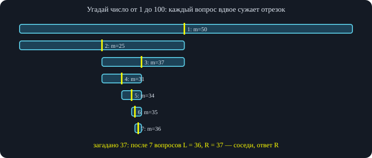

# Занятие 3. Параллель C — Бинарный поиск

*Игра «угадай число» и логарифмическая асимптотика, инвариант «L не подходит, R подходит», lower_bound и upper_bound, вещественный бинпоиск, бинпоиск по ответу.*

## 1. Идея бинарного поиска

### 1.1. Игра «угадай число»

Друг загадал целое число от 1 до 100 (обе границы включительно). Мы называем догадку, а он отвечает: «твоё число больше», «меньше» или «равно». Можно спрашивать подряд «1? 2? 3? …» — но тогда мы не используем главное: ответ «больше/меньше» несёт информацию. Разумный первый ход — серединка: **50**. Если ответ «меньше», число лежит в $[1,49]$; если «больше» — в $[51,100]$. Потом спрашиваем серединку оставшегося отрезка — 25, и так далее; на отрезке из одного числа ответ ясен.

**Друг-жулик.** Пусть друг на самом деле не загадывал число заранее, а отвечает так, чтобы все прежние ответы оставались правдой. Алгоритм от этого не ломается: для него важны только полученные ответы, число шагов не растёт. Это полезно помнить: бинпоиск работает и «против» самого плохого ответа — оценка шагов верна всегда.

### 1.2. Сколько шагов: логарифм

На каждом шаге отрезок сужается вдвое. Если было $n$ вариантов, после $k$ шагов их остаётся порядка $n/2^k$; процесс заканчивается, когда останется один, то есть $k\approx\log_2 n$. Для 100 вариантов: $100\to50\to25\to12\to6\to3\to1$ — **7 шагов**. Асимптотика: $O(\log n)$. Это новый для курса класс времени работы: $\log_2 n$ — сколько раз надо поделить $n$ пополам, чтобы получить единицу.

\
*Жёлтая черта — вопрос; закрашен отрезок, где ответ ещё возможен. $\lceil\log_2 100\rceil=7$ вопросов.*

**Почему делить именно пополам.** Если делить на три части, придётся задать два вопроса, чтобы сузить область втрое; а два вопроса бинпоиска сужают её вчетверо. Интуитивно ясно, что деление на 3, 4, 5 частей проигрывает. (Тернарный поиск — другая тема: он нужен для других задач, на этом занятии его нет.)

**Проверка.** Для всех загаданных чисел от 1 до 100 алгоритм из следующего раздела угадывает число, при этом максимальное количество вопросов равно 7.

## 2. Реализация и инвариант

### 2.1. Полуинтервал и инвариант «L не подходит, R подходит»

Если аккуратно вести отрезок «от $a$ до $b$ включительно», то на каждом шаге вылезают неприятные $\pm1$ (после ответа «меньше 50» граница — 49, после «больше» — 51). Чтобы их не было, поддерживаем **инвариант** на *полуинтервале*: вводим понятие «**подходит**» (для загаданного числа $x$ — «число не меньше $x$») и храним две границы:

- $L$ — число, которое *точно не подходит*;
- $R$ — число, которое *точно подходит*.

Искомый ответ — *первое подходящее* число — всегда лежит правее $L$ и не правее $R$. Для чисел от 1 до 100: $L=0$ (0 меньше любого загаданного — точно не подходит), $R=101$ (подходит). Граница, которая «точно подходит» или «точно не подходит», может быть искусственной (вне диапазона) — к ней мы никогда не обратимся.

**Шаг.** Берём середину $m=\lfloor (L+R)/2\rfloor$. Спрашиваем у друга про $m$. Если $m$ подходит — сдвигаем $R=m$ (она подходит, а значит, может заменить прежнюю $R$); иначе $L=m$. Никаких $m\pm1$ не нужно: каждая из границ всегда именно такая, какой её определяет инвариант. **Когда остановиться:** $L$ и $R$ равными быть не могут (одна из них не подходит, а другая подходит), поэтому остановка — когда они стали соседями, $R=L+1$; цикл `while (l + 1 < r)`. Если разность хотя бы 2, между ними есть число, о котором мы ничего не знаем.

**Ответ.** После цикла $L$ не подходит, $R$ подходит и они соседние, значит $R$ — *первое* подходящее число (число $R-1=L$ не подходит). Ответ — $R$.

``` cpp
int l = 0, r = 101;                    // 0 точно не подходит, 101 точно подходит
while (l + 1 < r) {                    // пока между границами есть число
    int m = (l + r) / 2;               // середина
    if (m < x) l = m;                  // «m меньше загаданного» → m не подходит
    else r = m;                        // иначе подходит (m >= x)
}
// ответ: r — первое число, которое >= x, то есть само x
```

Здесь в роли «вопроса к другу» выступает проверка $m<x$ (в программе $x$ неизвестно — мы лишь представляем, что получаем ответ).

**Зачем не останавливаться при равенстве.** Можно было бы при «равно» сразу вывести ответ. Но алгоритм проще и универсальнее без этой проверки: равенство попадает в ветку «подходит», $R$ становится равным $x$ и остаётся таким до конца. В худшем случае (нечестный друг) «равно» всё равно прозвучит только в самом конце, так что число шагов то же. Универсальный шаблон — без ранних выходов — пригодится дальше. **Важное дополнение: переполнение.** Выражение `(l + r) / 2` безопасно для небольших границ. Если $L$ и $R$ порядка $2\cdot10^9$ и хранятся в `int`, сумма $l+r$ переполнится. Тогда пишут `l + (r - l) / 2` (на тех же 2 000 000 000 и 2 147 483 647 получается 2 073 741 823) или используют `long long`. Для неотрицательных границ результаты округления вниз совпадают.

## 3. Бинпоиск по отсортированному массиву

### 3.1. Первое число не меньше $x$

**Условие.** Дан массив из $n$ чисел и число $x$. Найти минимальное число массива, которое $\ge x$ (если такого нет — вывести $-1$). Например, для $a=(1,3,5,10,12,13,15,19)$ и $x=14$ ответ 15. Линейный проход даёт $O(n)$; хотим быстрее.

В такой постановке порядок элементов в массиве не важен, поэтому массив **сортируем** (`sort(a.begin(), a.end())`) — иначе, глядя на середину, мы ничего не можем сказать о левой и правой половинах. Инвариант тот же: подходящие — числа $\ge x$; ищем первое подходящее. Бинарим теперь не значения, а **позиции** в массиве (нумерация с нуля):

- $L=-1$ — фиктивная позиция «до начала», точно не подходит;
- $R=n$ — фиктивная позиция «после конца» (мысленно там стоит $+\infty$), точно подходит.

Середина $m$: если $a_m<x$ (не подходит) — $L=m$; иначе $R=m$. В конце, если $R=n$, такого числа нет; иначе ответ $a_R$ (или сама позиция $R$, если просят позицию). К $L=-1$ и $R=n$ внутри цикла мы не обращаемся: про них известно заранее.

Прогон для $a=(1,3,5,10,12,13,15,19)$, $x=14$: $L=-1$, $R=8$; $m=3$, $a_3=10<14$ → $L=3$; $m=5$, $a_5=13<14$ → $L=5$; $m=6$, $a_6=15\ge14$ → $R=6$. Теперь $R=L+1$, ответ $a_6=15$.

``` cpp
int firstGE(const vector<int>& a, int x) {     // позиция первого a[i] >= x, иначе n
    int l = -1, r = a.size();                 // l — фиктивно «не подходит», r — «подходит»
    while (l + 1 < r) {
        int m = (l + r) / 2;
        if (a[m] < x) l = m;                  // не подходит
        else r = m;                           // подходит
    }
    return r;
}
```

### 3.2. Последнее число меньше $x$

**Способ 1 (рассуждение).** Первое число $\ge x$ — на позиции $R$. Тогда все левее — меньше $x$, а ближайшее слева, позиция $R-1$ (она же $L$), и есть последнее меньшее.

**Способ 2 (другой инвариант).** Сделаем «подходящими» числа $<x$ и ищем последнее подходящее. Теперь $L=-1$ точно подходит, $R=n$ точно не подходит. Проверка $a_m<x$: да — $L=m$, нет — $R=m$. Ответ — $L$ ($-1$ означает, что такого числа нет). Код получается тот же самый — изменилась лишь интерпретация. Это и есть главная идея: *не запоминать готовые рецепты, а каждый раз формулировать инвариант*.

А «первое число $\le x$» искать не нужно: в отсортированном по возрастанию массиве это либо нулевой элемент, либо его нет вовсе.

**Ответ «нет решения».** Если в итоге $R=0$ при поиске первого $\ge x$ — значит, все числа $\ge x$ и «последнего меньшего» нет. Если $L=-1$ при поиске последнего меньшего — ответа нет. Такие случаи в задаче оговаривают явно (например, выводят $-1$ или `no`).

### 3.3. Количество чисел, равных $x$: lower_bound и upper_bound

**Условие.** Отсортированный массив, много запросов «сколько в нём чисел, равных $x$». Например, для $(1,2,4,4,4,6,8,8)$: число 4 встречается 3 раза, число 8 — 2 раза.

Находим две позиции: **$A$** — первая позиция элемента $\ge x$ (это `lower_bound`, «нижняя граница») и **$B$** — первая позиция элемента $>x$ (`upper_bound`, «верхняя граница»). Ответ — $B-A$. Искать «первое равное $x$» неудобно: равных может не быть; заменять условие на «$\ge$» и «$>$» — типовой приём.

Для $B$ инвариант: подходят числа $>x$; $L=-1$ не подходит, $R=n$ подходит; если $a_m>x$, то $R=m$, иначе $L=m$. Для $x=4$ в примере: $A=2$, $B=5$, ответ $3$. Для $x=8$: $A=6$, $B=8=n$, ответ $2$ — без особых случаев. Для массива из одинаковых элементов $A=0$, $B=n$ — ответ $n$.

``` cpp
int firstGT(const vector<int>& a, int x) {     // позиция первого a[i] > x, иначе n
    int l = -1, r = a.size();
    while (l + 1 < r) {
        int m = (l + r) / 2;
        if (a[m] <= x) l = m; else r = m;
    }
    return r;
}
int cnt(const vector<int>& a, int x) { return firstGT(a, x) - firstGE(a, x); }
```

**Проверка.** Функции `firstGE`, `firstGT`, поиск последнего меньшего и подсчёт `cnt` сверены со стандартными `lower_bound` / `upper_bound` и прямым подсчётом на 20 000 случайных отсортированных массивов (длины до 11, значения 0–9, $x$ от −1 до 10).

Позиции удобно мыслить числами, а не итераторами: позиция после конца — $n$, до начала — $-1$. В C++ эти две функции уже есть: `lower_bound(a.begin(), a.end(), x)` и `upper_bound(...)` возвращают итераторы (позиция — разность с `a.begin()`). **На учебном контесте их использовать нельзя** — нужно писать свои бинпоиски, чтобы потренироваться; на обычных соревнованиях пользоваться ими разумно.

## 4. Вещественный бинарный поиск

### 4.1. Монотонные функции

Бинпоиск нужен упорядоченность. Для функций это **монотонность**: функция монотонна, если только возрастает или только убывает (на всей области определения; нестрогая монотонность, когда значения могут повторяться, тоже годится — как массив из одинаковых чисел). Функция с «горбами» не подходит. $\sqrt x$ монотонна там, где определена ($x\ge0$).

«Решить уравнение $f(x)=0$» значит найти точку пересечения графика с осью $x$. Строго монотонная функция пересекает ось не более одного раза; корней может и не быть совсем (гипербола приближается к оси и не пересекает её).

### 4.2. Пример: $x^2+\sqrt x-20=0$

Программа должна найти корень уравнения такого вида — причём она должна работать и для произвольных коэффициентов (например $ax^2+b\sqrt x-c=0$), для которых явной формулы нет. Функция $f(x)=x^2+\sqrt x-20$ определена при $x\ge0$ и монотонно возрастает. Назовём $x$ **подходящим**, если $f(x)>0$. Границы: $L=0$ ($f(0)=-20<0$ — не подходит), $R=100$ ($f(100)=10000+10-20>0$ — подходит). Дальше обычный бинпоиск, но середина теперь настоящая, вещественная: `m = (l + r) / 2` в `double`, а не округлённая.

**Почему нет точного равенства.** В вещественных числах нельзя ждать точного нуля: из-за погрешности (классический пример $0{,}1+0{,}2\ne0{,}3$) значение в найденной точке будет, например, $10^{-15}$, а не 0. Поэтому «первого подходящего» в вещественных числах не существует; ищем такие близкие $L$ и $R$, что $f(L)<0<f(R)$ и $R-L$ очень мало. Корень лежит между ними, и любую из них можно выдавать как ответ: проверяющая система принимает ответ, если он отличается от жюри не больше, чем на заданную точность (например, $10^{-6}$).

``` cpp
double f(double x) { return x * x + sqrt(x) - 20; }

double solve() {
    double l = 0, r = 100;                 // f(l) < 0, f(r) > 0
    for (int it = 0; it < 100; it++) {     // фиксированное число итераций
        double m = (l + r) / 2;
        if (f(m) > 0) r = m;               // подходит
        else l = m;
    }
    return r;                              // l и r почти совпали
}
```

**Проверка.** При 100 итерациях корень получается $\approx 4{,}2357876568$, $f(r)\approx3{,}6\cdot10^{-15}$.

**Сколько итераций.** Условие «пока $R-L>\varepsilon$» использовать не рекомендуется: при очень близких $L$ и $R$ погрешность самого вычисления $(L+R)/2$ может оказаться больше $\varepsilon$, и цикл не закончится никогда. Поэтому берут **фиксированное число итераций**, прикинув его заранее: отрезок длины $C$ за $k$ итераций сжимается в $2^k$ раз, значит нужно $\log_2 C$ итераций, чтобы получить единицу, и ещё $\log_2 (1/\varepsilon)$, чтобы дойти до точности $\varepsilon$ (для $10^{-6}$ — около 20). Для $C\le10^9$ выходит порядка 50, для $C\sim10^{18}$ — около 100–150. Практически берут 50–200 с запасом: больше смысла нет, дальше всё съедает погрешность. Число пишут в цикле *константой*, посчитанной «в уме» или на калькуляторе, а не вычисляют по формуле от текущих $R$ (которое меняется в цикле).

### 4.3. Как выбрать границу $R$ (и $L$) в общем случае

Если формула сложная, а подходящее значение не очевидно, делаем **удвоение**: подставляем $1$, затем $2,4,8,16,\dots$ — пока $f$ не станет положительной; это и будет $R$ (вообще: пока значение не перескочит ноль). Если вплоть до больших степеней (потолок — $\approx2^{60}$ для переполнения) ничего не нашли — корня нет. Почему двойка: чем быстрее растёт множитель, тем быстрее найдём $R$, но тем выше риск «перепрыгнуть» границу переполнения, когда значение чуть меньше нуля, а следующий шаг уже вне допустимых чисел; двойка — разумный компромисс (можно и 1,5). Для левой границы так же: $-1,-2,-4,\dots$, если область определения допускает отрицательные $x$ (в нашем примере $\sqrt x$ не определён при $x<0$, поэтому берём $L=0$).

### 4.4. Вывод вещественных чисел в C++

- Для большей точности есть тип `long double`.
- По умолчанию `cout` округляет вывод до малого числа значащих цифр, и ответ вроде $0{,}000000000005$ может превратиться в $0$ — и вы получите «неверный ответ» при верном вычислении. Лечится двумя настройками *до первого вывода*: `cout << fixed << setprecision(10);` (нужен `#include <iomanip>`). Тогда всегда печатается 10 знаков после запятой. Лишние нули не вредят — проверяющая система принимает такой ответ, если он в допустимой погрешности; вредны именно потерянные значащие цифры.
- Знаков ставят с запасом (точность $10^{-6}$ — 8–10 знаков). Ставить сильно больше (50–100) бессмысленно: после 15–18 знаков остаются случайные цифры.

``` cpp
#include <iomanip>
// ...
cout << fixed << setprecision(10);       // до первого вывода вещественного числа
cout << solve() << "\n";
```

### 4.5. Немонотонная функция: кубический многочлен

Что, если функция не монотонна — например кубический многочлен $x^3+bx^2+cx+d$? Он может иметь один, два или три корня, но корень *существует всегда*: при очень большом отрицательном $x$ значение уходит в $-\infty$ (меньше нуля), при большом положительном — в $+\infty$ (больше нуля), а непрерывная функция должна где-то пересечь ноль. Одно только «в середине больше нуля» ничего не говорит о положении корня — но нам и не нужно знать все корни, нужен *хотя бы один*.

Инвариант: $f(L)<0$ и $f(R)>0$ ⇒ между $L$ и $R$ точно есть корень. Берём середину: если $f(m)<0$, корень между $m$ и $R$ — ставим $L=m$; если $f(m)>0$ — между $L$ и $m$, ставим $R=m$. Код буквально тот же, что и для монотонной функции, но рассуждение другое: раньше мы искали «первую хорошую» точку перелома, а теперь — просто сохраняем знаки на концах. Для кубической параболы границы находим удвоением: $R=1,2,4,\dots$ пока $f(R)\le0$, $L=-1,-2,-4,\dots$ пока $f(L)\ge0$. На контесте будут конкретные коэффициенты и небольшая «подковырка», требующая ветвления.

**Проверка.** Описанный способ (границы удвоением, 200 итераций) проверен на 1000 случайных кубических многочленов с целыми коэффициентами от −10 до 10: во всех случаях $|f(R)|<10^{-6}$. **Итог по вещественному поиску.** Выводить с фиксированной точностью; число итераций — константа, прикинутая заранее; границы подбирать так, чтобы на левой стороне условие «не подходит», на правой — «подходит»; не брать отрицательные $x$, если функция там не определена.

## 5. Бинарный поиск по ответу

### 5.1. Задача про два принтера

**Условие.** Нужно отсканировать $n$ листов. Первый принтер сканирует лист за $x$ секунд, второй — за $y$ секунд. Время на перекладывание листов нулевое. За какое минимальное время можно отсканировать все $n$ листов?

Заметим, что точно хватит $n\cdot\min(x,y)$ секунд (всё на более быстром принтере; подойдёт и $n\cdot x$ — любая гарантированно хорошая граница). Как проверить, **хватит ли времени $k$**? За $k$ секунд принтеры успевают отсканировать $\lfloor k/x\rfloor+\lfloor k/y\rfloor$ листов (как только принтер освободился, кладём в него следующий лист). Хватает, если эта сумма $\ge n$. Пример: $k=20$, $x=3$, $y=5$ → $6+4=10$ листов.

Если время $k$ «хорошее» (успеваем), то любое большее время тоже хорошее — функция проверки **монотонна**. Значит, ищем минимальное хорошее время бинпоиском *по значению ответа*: $L=0$ (за 0 секунд не успеть — плохое), $R=n\min(x,y)$ (хорошее). Середина $m$: если $m/x+m/y\ge n$ (целочисленное деление) — $R=m$, иначе $L=m$. Ответ — $R$.

``` cpp
long long minTime(long long n, long long x, long long y) {
    long long l = 0, r = n * min(x, y);            // l — плохое, r — хорошее
    while (l + 1 < r) {
        long long m = (l + r) / 2;
        if (m / x + m / y >= n) r = m;             // успеваем за m секунд
        else l = m;
    }
    return r;
}
```

**Проверка.** Функция сверена с линейным перебором времени $0,1,2,\dots$ на 5000 случайных наборов $(n,x,y)$ — ответы совпадают.

Такой приём называется **бинарным поиском по ответу**: ответ — число (минимальное время, максимальный размер и т. п.), и для любого кандидата умеем быстро проверять «подходит или нет», причём подходящие значения образуют «хвост» (или «голову») числовой прямой. Это работает и когда нужно найти *максимальное* значение, при котором что-то ещё возможно (максимум времени отдыха). Если границы неочевидны, их подбирают удвоением $1,2,4,8,\dots$, пока не найдём первое подходящее.

**Итог занятия.** Общая схема бинпоиска: сформулировать, какие значения «подходят», зафиксировать $L$ (не подходит) и $R$ (подходит), пока $L+1<R$ проверять серединку и сдвигать нужную границу; ответ — $R$. В разных задачах это даёт первое $\ge x$, последнее $<x$, число вхождений ($upper-lower$), корень монотонной или знакопеременной функции и минимум по ответу. Следующее занятие — тест и разбор трёх контестов блока.
