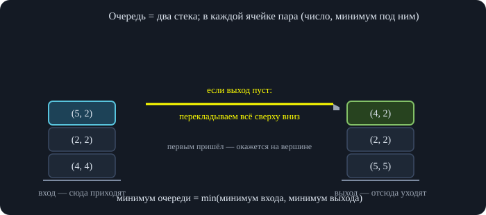
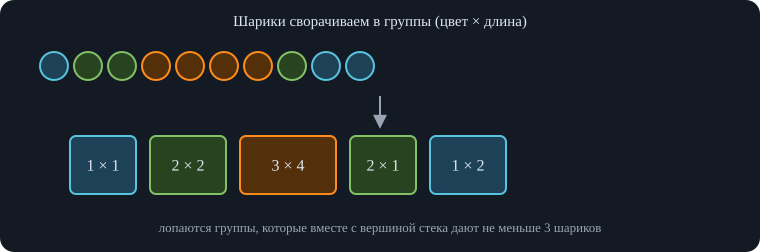
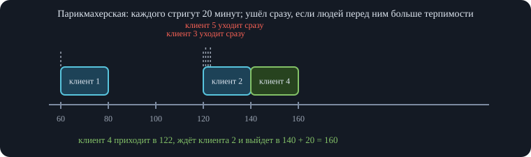
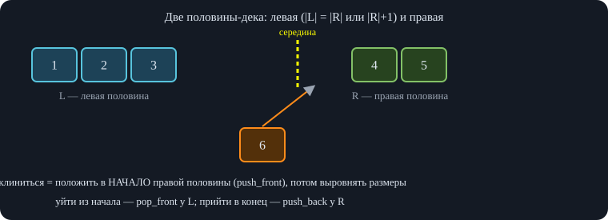
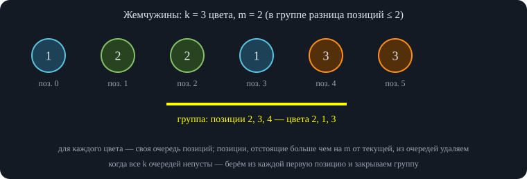
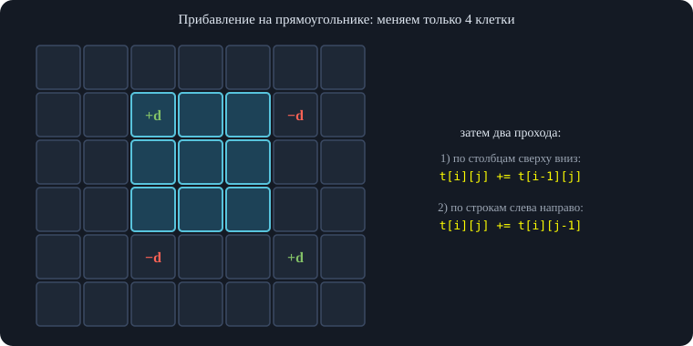
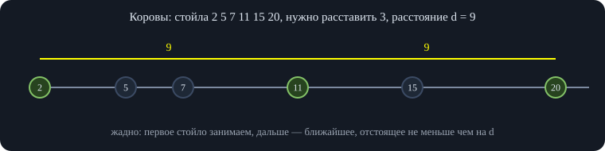
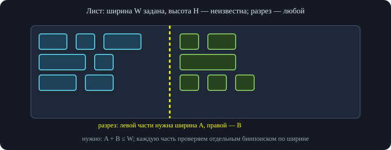
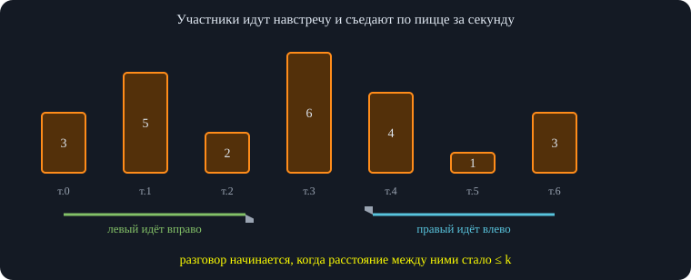

# Занятие 4. Параллель C — Разбор контестов

*Разбор задач трёх контестов: контейнеры (стек, очередь, дек), линейные алгоритмы (префиксные суммы, два указателя) и бинарный поиск (по ответу, вещественный, вложенный).*

## 1. Контест «Контейнеры»

Контейнеры — это структуры, которые хранят набор элементов и позволяют быстро добавлять и забирать их в определённом порядке: **стек** (кладём и забираем с одного конца), **очередь** (кладём в конец, забираем из начала), **дек** (добавляем и убираем с обоих концов). Почти все задачи контеста сводятся к тому, чтобы выбрать нужный контейнер и правильно хранить в нём вспомогательную информацию.

### 1.1. Задача D. Стек с минимумом

**Условие.** Нужно поддерживать стек чисел с тремя операциями: положить число, убрать верхнее, сказать минимум среди всех чисел стека.

**Идея.** Вместе с каждым числом храним **минимум среди всех, кто лежит не выше него** (то есть самого числа и всех ниже). Тогда ячейка стека — это пара (число, минимум до этой ячейки).

Пример. Приходят числа 1, 2, 1, 4. Ячейки: (1, 1), (2, 1), (1, 1), (4, 1) — в каждой второе число показывает, какой минимум у стека до этого места включительно. Убираем 4 — просто удаляем верхнюю пару целиком, и в вершине снова лежит (1, 1) с правильным минимумом. Если потом после опустошения стека положить 4, 2, 3, то получится (4, 4), (2, 2), (3, 2): минимум стека всегда читается с вершины.

Инвариант\
Для каждой ячейки второе число равно минимуму всех чисел от дна стека до этой ячейки. При добавлении числа $x$ новый минимум равен $\min(x,\ \text{минимум вершины})$ (для пустого стека — просто $x$). При удалении вершины все оставшиеся ячейки не меняются, поэтому инвариант сохраняется сам собой.

Все операции работают за $O(1)$, память — $O(n)$. На записи отмечено, что стек можно реализовать и обычным динамическим массивом (добавление и удаление с конца), как выше: отдельная структура «стек» из библиотеки не обязательна.

Типичные ошибки\
Хранить один «глобальный минимум» и обновлять его только при добавлении: после удаления минимального числа он перестанет быть верным. Вызывать `getMin` у пустого стека.

### 1.2. Задача E. Очередь с минимумом

**Условие.** Нужна очередь (добавляем в конец, убираем из начала) и ответ на вопрос «какой сейчас минимум?». У обычной `std::queue` минимум получить нельзя, поэтому очередь строится из двух стеков с минимумом.

**Очередь на двух стеках.** Заводим *входной* стек (в него кладём приходящих) и *выходной* (из него забираем уходящих). Когда нужно убрать первого из очереди:

- если выходной стек не пуст — просто снимаем его вершину;
- если пуст — перекладываем **весь** входной стек в выходной (снимаем сверху, кладём в другой): порядок разворачивается, и на вершине оказывается тот, кто пришёл раньше всех; затем снимаем вершину.

\
*Слева — стек тех, кто пришёл (4, затем 2, затем 5). Когда нужно удалить первого, а выходной стек пуст, всё перекладывается в выходной: вершиной становится 4 — самый ранний.*

**Минимум.** Теперь делаем каждый из двух стеков стеком с минимумом из предыдущей задачи. Все элементы очереди лежат либо во входном, либо в выходном стеке, поэтому минимум очереди — это минимум из двух минимумов. На записи этот факт объяснён так: если множество разбито на две части, то минимум всего множества равен минимуму из минимумов частей (например, $\min(1,2,3,4,5)=\min(\min(1,2,3),\min(4,5))$).

**Сложность.** Каждый элемент за всё время перекладывается из входного стека в выходной не более одного раза, поэтому операции работают за $O(1)$ *амортизированно* (одно удаление может занять $O(n)$, но в среднем по всем операциям — константа).

Типичные ошибки\
Перекладывать входной стек в выходной, когда выходной ещё **не пуст** (порядок очереди сломается). Брать минимум только из одного стека, забыв, что другой может быть пустым.

### 1.3. Задача F. Шарики

**Условие.** Дан ряд шариков разных цветов. Каждый раз, когда образуется группа из трёх и более шариков одного цвета подряд, вся группа лопается и исчезает, а оставшиеся части ряда склеиваются (соседи после склейки могут образовать новую группу). Нужно найти, сколько шариков останется. Важное условие: **в начальный момент групп из трёх и более одноцветных шариков не больше одной.**

**Идея.** Сначала сворачиваем ряд в группы подряд идущих одинаковых шариков — стек пар (цвет, сколько). Для ряда $1,2,2,3,3,3,3,2,1,1$ получается $(1,1),(2,2),(3,4),(2,1),(1,2)$. Сворачивание делается за один проход: если цвет совпал с вершиной стека, увеличиваем счётчик, иначе кладём новую пару.

\
*Десять шариков превращаются в пять групп. Дальше достаточно обрабатывать группы стеком.*

Дальше идём по группам слева направо и собираем второй стек — то, что осталось:

- если группа того же цвета, что вершина стека, **склеиваем**: прибавляем её длину к вершине;
- если после этого (или у новой группы самой по себе) длина стала не меньше 3 — группа лопается: прибавляем её длину к счётчику лопнувших и убираем вершину со стека;
- иначе кладём группу на стек.

Разбор примера: $(1,1)$ и $(2,2)$ кладём; $(3,4)$ — лопает сама (лопнуло 4); следующая $(2,1)$ совпадает цветом с вершиной $(2,2)$ — получается три, лопаем (ещё 3) и снимаем вершину; последняя $(1,2)$ совпадает с вершиной $(1,1)$ — снова три, лопаем (ещё 3). Всего лопнуло 10, осталось 0.

**Почему так можно.** Лопнувшая группа ничем не мешает дальнейшему: после неё соседи склеиваются, а склейка рассматривается, когда мы дойдём до следующей группы. Поскольку начальная группа из трёх и более ровно одна, каскады идут цепочкой от неё, и один проход слева направо со стеком их воспроизводит. Удалений из середины нет — всё происходит на вершине стека. Время и память — $O(n)$.

**Вопросы из чата.** Предложение «заменять лопнувшие на $-1$ и искать группы заново» не работает так просто: после замены соседние шарики не склеиваются, а нужно, чтобы цвета по обе стороны от образовавшейся «дыры» снова считались соседями. Решение «идти по массиву с вспомогательным вектором и проверять последние три элемента» тоже можно довести до рабочего, но нельзя удалять тройку сразу: если дальше идёт четвёртый такой же шарик, нужно удалить всю четвёрку целиком — поэтому и удобнее считать длины групп.

### 1.4. Задача G. Соседние буквы

**Условие.** Дана строка из латинских букв. Пара соседних в строке символов называется подходящей, если эти буквы соседние *в алфавите* (например, `ab`, `ba`, `cd`, `yz`; а `ac` — нет). Пока в строке есть подходящие пары, берётся самая левая из них, и из двух букв оставляется **меньшая** (большая стирается). Нужно получить итоговую строку.

Пример. В строке `cbbcbb` подходящие пары — `cb` и снова `cb`; самая левая — первые две буквы, остаётся `b`. Процесс продолжается, пока подходящих пар не останется; итог для этой строки — `bbbb`.

**Идея.** Так как всегда обрабатывается **самая левая** пара, строку можно читать слева направо со стеком уже обработанных букв: как только новая буква образует подходящую пару с вершиной стека, эту пару можно обработать немедленно. Откладывать нечего — это и есть самая левая пара.

**Алгоритм.** Для очередной буквы $c$ пока стек не пуст и вершина — соседняя с $c$ по алфавиту буква: снимаем вершину и заменяем $c$ на меньшую из двух. Затем кладём $c$ на стек. Цикл нужен потому, что после замены новая буква может образовать подходящую пару уже с буквой *под* вершиной (так и получается на разборе: замена $B$ на $A$ образует новую пару с тем, что лежало ниже).

**Как сравнивать буквы.** Тип `char` хранит числовой код символа (кодировка ASCII). Коды латинских букв нижнего регистра идут подряд: `'a'` = 97, `'b'` = 98, …, `'z'` = 122; заглавные идут подряд тоже (`'A'` = 65 … `'Z'` = 90), цифры — тоже. Поэтому буквы можно сравнивать как числа, а «соседние в алфавите» означает, что коды отличаются ровно на 1: `abs(a - b) == 1`. На записи лектор сначала назвал код буквы `a` неверно (по памяти), а затем исправил — правильно 97.

Осторожно с регистром\
Сравнивать на «больше–меньше» можно буквы одного регистра. Заглавные и строчные буквы в таблице кодов лежат отдельными блоками, и заглавная буква *меньше* любой строчной.

### 1.5. Задача H. Парикмахерская

**Условие.** Даны моменты прихода клиентов (по возрастанию) и для каждого — его «терпимость» (сколько людей перед собой он готов терпеть). Каждого клиента стригут ровно 20 минут. Клиент, придя, считает людей в парикмахерской, *включая того, кого стригут сейчас*; если их больше его терпимости, он сразу уходит. Если время окончания стрижки одного клиента совпадает со временем прихода другого, считается, что стрижка закончилась раньше. Нужно для каждого клиента вывести момент, когда он уйдёт.

**Идея.** Все времена переводим в минуты (например, $2{:}01$ — это $121$). Поддерживаем очередь тех, кто остался стричься, и храним в ней не момент прихода, а **момент, когда клиент закончит стрижку**. Для очередного клиента, пришедшего в момент $t$:

- из начала очереди убираем всех, у кого время окончания не больше $t$ (они уже ушли);
- если размер очереди больше терпимости клиента — он уходит в момент $t$, в очередь не встаёт;
- иначе он закончит в момент $\max(t,\ \text{последнее время в очереди})+20$: если очередь пуста, это $t+20$, иначе через 20 минут после того, как закончит предыдущий; кладём это время в конец очереди и выводим.

\
*Моменты прихода (пунктир) и стрижка. Клиент 3 в 121 видит перед собой клиента 2 (терпимость 0) и уходит; клиент 4 готов ждать троих и выходит в 160.*

Пример с записи: клиенты приходят в $60, 120, 121, 122, 123$ минут. Первый стрижётся до 80 и уходит в 80. Второй (терпимость 0) приходит, когда очередь пуста, и заканчивает в 140. Третий в 121 видит перед собой второго, а его терпимость 0 — уходит сразу, в 121. Четвёртый (терпимость 3) в 122 готов ждать и заканчивает в $140+20=160$ (а не в 142: сначала нужно дождаться второго). Пятый в 123 видит двоих при терпимости 0 и уходит сразу. Ответ: 80, 140, 121, 160, 123.

Работает за $O(n)$: каждый клиент попадает в очередь и покидает её не более одного раза. Как пояснено на записи, терпимость 0 означает «не готов терпеть никого», а не «ждёт бесконечно»: клиент встанет в очередь только если перед ним в этот момент никого нет.

### 1.6. Задача I. Очередь из блоков одинаковых чисел

**Условие.** Есть две операции: «добавить в конец $c$ копий числа $x$» и «удалить из начала $c$ чисел и вывести их сумму». Числа $c$ могут достигать миллиардов.

**Идея.** Раскладывать миллиард копий по одной в очередь невозможно — не хватит ни времени, ни памяти. Поэтому храним очередь **пар (сколько, какое число)**. Добавление — одна пара в конец. Удаление $c$ чисел: пока нужно удалять, смотрим первую пару $(k, x)$:

- если $k \le c$ — пара уходит целиком: прибавляем $k\cdot x$ к сумме, уменьшаем $c$ на $k$, убираем пару;
- иначе из пары убираем только $c$ чисел: прибавляем $c\cdot x$, уменьшаем $k$ на $c$ и заканчиваем.

Пример. Добавили две двойки — пара $(2, 2)$. Удаляем одно число: сумма 2, остаётся $(1, 2)$. Добавили пять четвёрок: очередь $(1,2),(5,4)$. Удаляем три числа: первая пара уходит целиком (сумма 2, осталось удалить 2), из $(5,4)$ убираем две четвёрки (ещё 8, остаётся $(3,4)$) — ответ 10.

**Сложность.** Каждая пара добавляется один раз и целиком удаляется не более одного раза; кроме того, за один запрос удаления может остаться не более одной пары, из которой убрали лишь часть. Поэтому суммарное время — $O(q)$ по числу операций. Сумму храните в `long long`: произведения $c\cdot x$ легко выходят за `int`.

Вопрос из чата о том, как удалять, если в паре меньше чисел, чем нужно удалить: удаляем её целиком, уменьшаем оставшееся количество и берём следующую пару — именно для этого нужен цикл `while`. Хранить пары нужно именно в очереди (`queue` или `deque`), потому что добавляем в конец, а удаляем из начала.

### 1.7. Задача J. Железнодорожный тупик

**Условие.** Поезда заезжают по первому пути; их можно загнать в тупик (он работает как стек) и затем выпускать на второй путь. Напрямую с первого пути на второй проехать нельзя. Нужно, чтобы на втором пути вагоны выстроились по порядку $1,2,\dots,n$. Если это невозможно — вывести 0.

**Идея.** Поддерживаем число $\text{need}$ — какой вагон должен ехать на второй путь следующим (сначала 1). Каждый приехавший вагон приходится положить в тупик — другого выхода нет. После этого, пока на вершине тупика лежит именно нужный вагон, отправляем его на второй путь и увеличиваем $\text{need}$. Если на вершине лежит не он — выпускать нельзя (порядок нарушится), ждём следующих вагонов.

Прогон для $4,1,3,2$: 4 в тупик (ждём 1); приехал 1 — это нужный, уезжает; приехал 3 — в тупик (ждём 2); приехал 2 — нужный, уезжает; теперь на вершине 3 — нужный, уезжает; затем 4. Получили $1,2,3,4$. Для $3,2,1$ тоже получается сортировка. Для $2,3,1$: 2 и 3 ложатся в тупик, 1 уезжает, теперь нужна двойка, но на вершине лежит 3, а двойка под ней — и новых вагонов нет. Отсортировать нельзя — ответ 0.

**Почему жадность верна.** Если нужный вагон лежит на вершине, его выгодно отправить сразу: пока он лежит, любой следующий вагон ляжет сверху и закроет его, а убирать другие вагоны со второго пути нельзя. А если на вершине не нужный вагон, отправить его на второй путь — значит нарушить порядок, так что делать нечего. Если нужно вывести и сами операции, достаточно записывать «въезд в тупик» и «выезд на второй путь» в те же места кода.

### 1.8. Задача K. Невероятная очередь

**Условие.** У очереди три операции: человек уходит из начала; человек встаёт в конец; человек **вклинивается в середину** — встаёт сразу за центром очереди (при нечётном числе людей — сразу за центральным; например, в очереди $1,2,3,4,5$ новичок встаёт между 3 и 4, а в очереди $1,2,3,4$ — между 2 и 3).

Решение «в лоб» — хранить массив и вставлять в середину — слишком медленное: вставка в середину сдвигает половину элементов.

**Идея.** Храним две половины очереди в двух деках `L` (левая) и `R` (правая) с условием $|L| = |R|$ или $|L| = |R|+1$. Тогда «середина» — это граница между ними:

- человек вклинивается — встаёт в **начало правой** половины (`R.push_front`) — именно поэтому половинки нужны в виде деков;
- человек приходит в конец — добавляем в конец `R`;
- уходит человек из начала — `L.pop_front`;
- после каждой операции **выравниваем** размеры: пока $|L|<|R|$ — перекладываем начало `R` в конец `L`; пока $|L|>|R|+1$ — перекладываем конец `L` в начало `R`.

\
*Очередь 1 2 3 \| 4 5. Новый участник 6 встаёт сразу за серединой — это начало правой половины.*

Разбор примера с записи: очередь $1,2,3\mid 4,5$. Уходит 1 — из начала `L`, размеры $2$ и $2$ нормальны. Уходит 2 — остаётся $|L|=1$, $|R|=2$, поэтому 4 переезжает из начала `R` в конец `L`: $3,4\mid 5$. Вклинивается 6 — встаёт в начало правой половины: $3,4\mid 6,5$. Приходит 7 в конец — в конец правой: $3,4\mid 6,5,7$, размеры $2$ и $3$, поэтому 6 переезжает в левую: $3,4,6\mid 5,7$.

Каждая операция переносит не больше одного элемента между половинами, поэтому всё работает за $O(1)$ на операцию.

### 1.9. Задача L. Постфиксная запись и параллельные вычисления

**Условие.** Задано выражение в **постфиксной записи**: последовательность чисел и операций, где операция применяется к двум последним числам стека. Независимые операции можно выполнять одновременно — за один «шаг». Нужно найти значение выражения и минимальное число шагов.

**Идея.** Вместе с каждым числом в стеке храним, **за сколько шагов оно вычисляется**. Число из входа вычисляется за 0 шагов. Операция берёт два верхних числа с их шагами $a$ и $b$, и, так как слагаемые можно считать параллельно, результат готов через $\max(a,b)+1$ шагов.

Пример: $(1+2)\cdot(3+4)-6$ в постфиксной записи — `1 2 + 3 4 + * 6 -`. Числа 1, 2, 3, 4 — по 0 шагов. $1+2=3$ за $\max(0,0)+1=1$ шаг; $3+4=7$ тоже за 1 шаг (параллельно с первым). Произведение $3\cdot7=21$ — за $\max(1,1)+1=2$ шага. Шестёрка — 0 шагов, вычитание $21-6=15$ — за $\max(2,0)+1=3$ шага. Ответ: значение 15, шагов 3. Если бы одно из слагаемых считалось за 3 шага, а другое за 1, то для следующей операции получилось бы $\max(3,1)+1=4$: короткое вычисление скрывается внутри длинного.

### 1.10. Задача M. Жемчужины

**Условие.** Дан массив жемчужин $k$ цветов. Нужно разбить как можно больше жемчужин на непересекающиеся группы так, чтобы в каждой группе были жемчужины **всех $k$ цветов** (по одной каждого), причём любые две позиции в группе отличаются не больше чем на $m$.

Пример: $1,2,2,1,3,3$, $k=3$, $m=2$. Группа из позиций 0, 1, 4 запрещена: позиции 0 и 4 отстоят на 4. Допустима только группа из позиций 2, 3, 4 с цветами 2, 1, 3. Больше групп не набрать.

\
*В группу попадает 2, 1, 3 (позиции 2–4). Группа 1, 2, 3 из позиций 0, 1, 4 запрещена: позиции 0 и 4 отстоят на 4 \> 2.*

**Идея.** Для каждого цвета ведём свою очередь позиций жемчужин этого цвета (в порядке появления), плюс счётчик числа непустых очередей. Идём по массиву слева направо; на позиции $i$:

1.  позицию $i-m-1$ (если она ещё стоит в начале очереди своего цвета) удаляем: она отстоит от $i$ больше, чем на $m$, и ни в какую группу, содержащую $i$ или дальше, попасть уже не может;
2.  добавляем $i$ в очередь её цвета;
3.  если все $k$ очередей непусты — берём первую позицию из каждой, записываем группу и удаляем эти позиции из очередей.

Группа, которую мы закрываем, состоит из самых левых позиций каждого цвета, находящихся не дальше $m$ от текущей, поэтому размах группы не превышает $m$. Время работы — $O(n)$: каждая позиция один раз добавляется и один раз удаляется.

Важное дополнение\
Почему выгодно закрывать группу сразу же, как только все очереди непусты, и брать самые левые позиции: более левые жемчужины раньше других выходят из допустимого окна и пропадают, поэтому использовать их в группе сейчас — самый «дешёвый» способ; оставлять их на потом — рисковать потерять. Это жадный выбор; на мелких случайных тестах он совпал с полным перебором.

## 2. Контест «Линейные алгоритмы»

Линейные алгоритмы работают за время, пропорциональное длине входа. Здесь два главных инструмента: **префиксные суммы** (и их обратная операция — **разностный массив**), а также **два указателя**, которые двигаются только в одну сторону.

### 2.1. Задачи A–D. Префиксные и разностные массивы

Первые задачи контеста были на лекции, поэтому на записи разбираются кратко.

**A. Сумма на отрезке (RSQ).** Префиксные суммы: $p_0=0$, $p_{i+1}=p_i+a_i$. Тогда сумма $a_l+\dots+a_r$ равна $p_{r+1}-p_l$ — ответ на запрос за $O(1)$ после предварительного подсчёта за $O(n)$.

**B. Прибавление на отрезке (RUQ).** Разностный массив $d$: прибавление $x$ ко всем элементам отрезка $[l,r]$ — это $d_l \mathrel{+}= x$ и $d_{r+1} \mathrel{-}= x$. После всех операций исходный массив восстанавливается префиксными суммами $d$. Каждая операция — $O(1)$.

**C. Сумма на прямоугольнике (RSQ 2D).** Двумерные префиксные суммы: $p[i][j]$ — сумма на прямоугольнике от угла $(1,1)$ до $(i,j)$:

$$p[i][j]=a[i][j]+p[i-1][j]+p[i][j-1]-p[i-1][j-1].$$

Сумма на прямоугольнике $(x_1,y_1)\ldots(x_2,y_2)$ вычисляется включением–исключением: $p[x_2][y_2]-p[x_1-1][y_2]-p[x_2][y_1-1]+p[x_1-1][y_1-1]$.

**D. Сумма на параллелепипеде (RSQ 3D).** В лекции эта часть не разбиралась, но идея та же: трёхмерные префиксные суммы и включение–исключение по восьми «углам». Подробная формула есть в шпаргалке параллели в разделе «Многомерные префиксные суммы».

Важное дополнение\
Знаки в формуле параллелепипеда чередуются по числу «срезанных» измерений: ноль срезов — плюс (полный объём), один — минус, два — плюс, три — минус. Для суммы по параллелепипеду на 1D, 2D и 3D работает один и тот же принцип включения–исключения; формулы проверены случайными тестами против прямого суммирования.

### 2.2. Задача E. Отрезок с максимальной суммой

**Условие.** Найти подотрезок с максимальной суммой (числа могут быть отрицательными).

**Идея.** Сумма подотрезка $[l,r]$ равна $p_{r+1}-p_l$. Зафиксируем правую границу: чтобы сумма была максимальной, нужно вычесть **наименьший** из префиксов $p_0,\dots,p_r$. Поэтому идём по массиву слева направо, поддерживая текущую префиксную сумму и минимум из префиксных сумм, которые уже встречались (включая $p_0=0$).

Время $O(n)$, память $O(1)$. Порядок строк внутри цикла важен: сначала используем минимум, *потом* обновляем его, иначе получим пустой подотрезок. Если массив состоит только из отрицательных чисел, ответ — наибольший (наименее отрицательный) элемент, а не 0 — поэтому `ans` нельзя инициализировать нулём.

### 2.3. Задача F. Объединение квадратов и кубов

**Условие.** Есть последовательности квадратов $1,4,9,16,\dots$ и кубов $1,8,27,64,\dots$. Их сливают в одну неубывающую последовательность $1,1,4,8,9,16,25,27,\dots$. Нужно вывести элемент на позиции $x$, где $x$ до $10^7$.

**Идея.** Это та же операция, что слияние двух отсортированных массивов в сортировке слиянием, только массивы заданы формулами. Два указателя $i$ и $j$ (какой квадрат и какой куб рассматриваем), и $x$ раз выбираем меньшее из $i^2$ и $j^3$ и сдвигаем соответствующий указатель.

**Вопрос о повторяющихся числах.** В таком виде число, которое является одновременно квадратом и кубом (1, 64, 729, …), входит в последовательность *дважды*. Если по условию совпадающие числа нужно учитывать один раз, добавляют отдельный случай: при $i^2=j^3$ берём число и сдвигаем *оба* указателя, а в остальных ветках сравнение делается строго:

### 2.4. Задача G. Стильная одежда

**Условие.** Есть четыре вида одежды (например, шапка, куртка, брюки, обувь), у каждого — набор вариантов с числовыми характеристиками. Нужно выбрать по одному варианту каждого вида так, чтобы разность $\max-\min$ среди выбранных чисел была как можно меньше.

Пример: наборы $\{1,2,3\}$, $\{1,3\}$, $\{3,4\}$, $\{2,3\}$. Выгодно выбрать $3,3,3,3$ — разность 0.

**Идея.** Сортируем каждый набор. Ставим по указателю на начало каждого набора — получаем текущий выбор из четырёх чисел. Дальше как в задачах на два указателя нужно решить, какой указатель двигать. Рассуждение:

- двигать указатель на **максимум** бессмысленно: максимум может только вырасти, и разность не улучшится;
- двигать указатель на число, которое не минимум, тоже не помогает: минимум остаётся прежним, а максимум не уменьшится;
- единственный способ уменьшить разность — поднять **минимум**. Значит, каждый раз двигаем указатель, который сейчас указывает на минимальное из четырёх чисел.

После каждого сдвига обновляем ответ $\max-\min$. Останавливаемся, когда указатель, которому надо шагнуть, выходит за границу своего набора: меньшего минимума в таком случае уже не получить.

Время — $O(S\cdot k)$ для $S$ вариантов всего и $k=4$ видов (поиск минимума среди четырёх — константа). Для большого числа видов минимум удобно поддерживать в приоритетной очереди.

### 2.5. Задача H. Пары точек на большом расстоянии

**Условие.** Дан отсортированный массив координат точек и число $d$. Нужно посчитать количество пар точек, расстояние между которыми **строго больше** $d$ (до $3\cdot10^5$ точек).

Пример: точки $1,3,5,8$, $d=4$. Подходят пары $(1,8)$ с расстоянием 7 и $(3,8)$ с расстоянием 5; пара $(1,5)$ имеет расстояние ровно 4 и *не* подходит. Ответ 2.

Уточнение\
На записи условие сначала произнесено как «больше либо равно», а при разборе примера лектор исправился: «здесь не больше либо равно, а строго больше». Пример (ответ 2) согласуется именно со строгим неравенством; если бы подходили пары с расстоянием ровно $d$, ответ был бы 3.

**Идея.** Для каждой левой точки $i$ ищем указатель $j$ — первую точку, которая находится от неё дальше чем на $d$. Все точки правее $j$ ещё дальше, поэтому они тоже подходят — это $n-j$ пар. При переходе к следующему $i$ точка $x_i$ сдвигается вправо, значит, указатель $j$ не нужно возвращать назад — он только растёт. Это и есть два указателя.

Время $O(n)$. Ответ нужно хранить в 64-битном типе: при $n=3\cdot10^5$ количество пар достигает десятков миллиардов.

### 2.6. Задача I. Префикс и суффикс с близкими суммами

**Условие.** Дан массив неотрицательных чисел. Нужно выбрать позиции $l<r$ так, чтобы модуль разности суммы префикса $a_1+\dots+a_l$ и суммы суффикса $a_r+\dots+a_n$ был минимальным. Для массива $1,2,3,4$: префикс $1+2=3$ и суффикс $4$ дают разность 1.

**Идея.** Два указателя навстречу друг другу: $l$ — конец префикса, $r$ — начало суффикса, и две суммы $A$ (сумма префикса) и $B$ (сумма суффикса). Изначально префикс — это только $a_1$, суффикс — только $a_n$. Дальше сдвигаем тот указатель, у которого сумма **меньше**: расширение меньшей суммы приближает её к большей, а расширение большей только увеличит разность. После каждого шага обновляем ответ $|A-B|$ и продолжаем, пока указатели не встретятся.

Условие применимости\
Жадный выбор «двигать меньшую сумму» верен только для **неотрицательных** чисел: именно поэтому на записи отмечено, что отрицательных чисел нет. Если числа могут быть отрицательными, расширение суммы может её и уменьшить, и тогда двигать нужно иначе.

В условии оригинальной задачи просят вывести индексы $l$ и $r$, а в коде выше считается только значение. Как лектор оставил слушателю, нужно дополнительно запоминать $l$ и $r$ в момент, когда ответ улучшается. Время $O(n)$.

### 2.7. Задача J. Супероперации

**Условие.** Дан массив и список операций, каждая из которых прибавляет число $d$ к отрезку $[l,r]$. Затем приходят запросы-«супероперации»: «выполнить операции с номерами от $a$ до $b$». Нужно получить массив после выполнения всех супероопераций. Выполнять каждую супероперацию по всем её операциям слишком долго.

**Идея в два этапа с разностными массивами.**

1.  Заводим массив-счётчик $c$ по номерам операций: $c_i$ — сколько раз будет выполнена операция $i$. Каждая супероперация $(a,b)$ — это «прибавить 1 на отрезке $[a,b]$ в массиве $c$». Делаем это разностным массивом и восстанавливаем $c$ префиксными суммами.
2.  Операция $i$ с числом $d$, выполненная $c_i$ раз, прибавит суммарно $d\cdot c_i$ на том же отрезке. Применяем теперь все операции один раз, но с числом $d\cdot c_i$ — снова разностным массивом по элементам.

Пример с записи: операции $(1,2,1)$, $(1,3,2)$, $(2,3,4)$ и супероперации $(1,2)$, $(1,3)$, $(2,3)$. Счётчики: первая операция входит в две супероперации (2 раза), вторая — во все три (3 раза), третья — в две (2 раза). Эффективные добавки: $1\cdot2=2$, $2\cdot3=6$, $4\cdot2=8$. К элементам массива прибавится: на позиции 1 — $2+6=8$, на позиции 2 — $2+6+8=16$, на позиции 3 — $6+8=14$.

**Вопрос зачем умножать.** Операция «прибавить 4», вызванная дважды, добавляет $4\cdot2=8$ — это то же самое, что вызвать операцию «прибавить 8» один раз. Умножение на счётчик просто собирает все её вызовы в один.

Время $O(n+m+q)$, где $q$ — число супероопераций.

### 2.8. Задача K. Прибавление на прямоугольнике

**Условие.** Дана таблица $n\times m$ и много запросов вида «прибавить $d$ ко всем клеткам прямоугольника $(l_x,l_y)\ldots(r_x,r_y)$». Нужно вывести таблицу после всех запросов (важно: только итог, а не состояние после каждого запроса).

**Идея.** Это двумерный разностный массив. Сначала решение «каждая строка — свой разностный массив»: прибавление на прямоугольнике — это по $+d$ в начале каждой строки отрезка и $-d$ сразу после его конца, то есть порядка $n$ изменений на запрос. Чтобы сократить до константы, посмотрим на эти изменения по столбцам как на разностный массив *по вертикали*: столбец «$+d$ в строках $l_x..r_x$» — это всего два изменения. Итого на запрос меняем **4 клетки**:

$$t[l_x][l_y]\mathrel{+}=d,\quad t[l_x][r_y+1]\mathrel{-}=d,\quad t[r_x+1][l_y]\mathrel{-}=d,\quad t[r_x+1][r_y+1]\mathrel{+}=d.$$

\
*Синий — прямоугольник запроса. Ставим +d в левый верхний угол, −d справа и снизу от прямоугольника, +d в правый нижний угол. Два прохода восстанавливают настоящие значения.*

После всех запросов восстанавливаем таблицу **двумя проходами**: сначала по столбцам сверху вниз (`t[i][j] += t[i-1][j]`), затем по строкам слева направо (`t[i][j] += t[i][j-1]`). Проходы делаются один раз в самом конце.

Общее время — $O(k+nm)$ для $k$ запросов: 4 операции на запрос и два прохода по таблице в конце (на записи это названо «$2nm$ плюс константа на запрос»). Таблицу заводим размера $(n+2)\times(m+2)$, чтобы индексы $r+1$ не выходили за границы.

## 3. Контест «Бинарный поиск»

Бинарный поиск применим не только к поиску числа в массиве, но и к **поиску ответа**: если есть проверка «подходит ли значение $x$?», которая для всех значений до некоторого порога даёт «да», а после — «нет» (или наоборот), то границу можно найти за $O(\log)$ проверок. Во всех задачах ниже используется один шаблон: $l$ — значение, которое точно подходит, $r$ — значение, которое точно не подходит, и пока $l+1\ne r$ проверяем середину.

### 3.1. Задачи A и B. Поиск числа и ближайшего числа

**A.** Проверить, есть ли число $x$ в отсортированном массиве, — обычный бинарный поиск (`binary_search` или `lower_bound` и проверка найденного элемента).

**B. Ближайшее число.** Найти в массиве число, ближайшее по модулю разности к заданному $x$. Находим `lower_bound` — позицию `pos` первого элемента, не меньшего $x$. Ближайшее число — либо `a[pos]`, либо предыдущее `a[pos-1]`: предыдущее тоже может оказаться ближе. Например, для массива $2, 5$ и $x=3$ `lower_bound` указывает на 5, но ближайшее число — 2.

**Вопрос из чата: почему именно `lower_bound`, а не `upper_bound`?** `lower_bound` — первый элемент, *не меньший* $x$ (больше или равный), `upper_bound` — первый *строго больший*. Если число $x$ есть в массиве, `lower_bound` попадает ровно на него, и расстояние равно 0 — это сразу правильный ответ.

Граничные случаи\
Позиция `pos` может оказаться равной $n$ (все элементы меньше $x$) или 0 (все элементы не меньше $x$) — обе проверки в коде выше защищены условиями на границы.

### 3.2. Задача C. Копии на двух принтерах

**Условие.** Нужно сделать $n$ копий документа. Первый аппарат делает копию за $x$ секунд, второй — за $y$. Ловушка: в начале есть только оригинал, поэтому первую копию нужно сделать на более быстром аппарате (он освободится за $m=\min(x,y)$ секунд); после этого копировать можно на обоих.

**Функция проверки.** Для момента $t$: если $t<m$, не успели ни одной копии — «нет». Иначе первая копия сделана за $m$ секунд, а за оставшиеся $t-m$ секунд каждый аппарат делает $\lfloor\frac{t-m}{x}\rfloor$ и $\lfloor\frac{t-m}{y}\rfloor$ копий. Затем бинарный поиск по минимальному $t$, при котором проверка выполняется.

Уточнение\
На записи проверка произнесена как «$\lfloor\frac{t-m}{x}\rfloor+\lfloor\frac{t-m}{y}\rfloor\ge n$». Если первая копия, сделанная за $m$ секунд, входит в число $n$ (так в классической постановке этой задачи), то её нужно учесть: $1+\lfloor\frac{t-m}{x}\rfloor+\lfloor\frac{t-m}{y}\rfloor\ge n$, то есть остальные $n-1$ копий делаются двумя аппаратами за оставшееся время. Версия без единицы даёт другие ответы (на малых значениях они расходятся в большинстве случаев), поэтому сверьтесь с точной формулировкой условия задачи.

### 3.3. Задача D. Вещественный бинарный поиск

**Условие.** Найти решение уравнения $x^2+\sqrt{x}=c$. Разбиралась на лекции: функция $f(x)=x^2+\sqrt{x}$ возрастает при $x\ge0$, поэтому корень находится бинарным поиском по вещественным числам с фиксированным числом итераций.

Развёрнутое объяснение\
Левая граница 0 (там $f=0\le c$), правая — $\max(1,c)$: при $c\ge1$ имеем $f(c)=c^2+\sqrt{c}\ge c$, а при $c<1$ значение $f(1)=2>c$. Дальше 100 итераций сжимают отрезок до предела точности `double`. Проверка условия «подходит» здесь — $f(m)<c$ (значит, корень правее).

### 3.4. Задача E. Космическое поселение

**Условие.** Есть прямоугольное поле размером $V\times H$ и нужно разместить $n$ модулей размера $a\times b$. Вокруг каждого модуля с каждой стороны нужна защитная зона шириной $d$, то есть каждому модулю нужен прямоугольник $(a+2d)\times(b+2d)$. Нужно найти **максимальное** $d$, при котором все $n$ модулей помещаются; модули можно поворачивать на 90°. Гарантируется, что при $d=0$ они помещаются.

**Монотонность.** Если модули помещаются при каком-то $d$, то при меньшем $d$ они тем более поместятся; если не помещаются — при большем тоже не поместятся. Значит, можно бинарить $d$.

**Проверка.** В поле вдоль стороны $V$ помещается $\lfloor V/(a+2d)\rfloor$ модулей, вдоль $H$ — $\lfloor H/(b+2d)\rfloor$; всего их произведение. Для повёрнутого модуля — $\lfloor H/(a+2d)\rfloor\cdot\lfloor V/(b+2d)\rfloor$. Подходит, если хотя бы одно произведение не меньше $n$.

**Вопрос: почему сравнивать площади нельзя.** Проверка «суммарная площадь модулей не больше площади поля» неверна: при очень узком поле прямоугольники по площади «помещаются», а на деле нет. Нужно считать, *сколько прямоугольников укладывается по каждой стороне*, и перемножать. Пример: поле $4\times5$ и модули $2\times2$. По площади $\frac{4\cdot5}{2\cdot2}=5$ модулей, но по сторонам помещается $\lfloor4/2\rfloor\cdot\lfloor5/2\rfloor=2\cdot2=4$ — пятый уже никуда не встанет.

### 3.5. Задача F. Дипломы

**Условие.** У Пети $n$ дипломов размера $V\times H$. Найти наименьшее $c$, при котором на квадратную доску $c\times c$ можно разместить все дипломы (поворачивать нельзя).

**Проверка.** На доске $c\times c$ помещается $\lfloor c/H\rfloor$ рядов, в каждом из них $\lfloor c/V\rfloor$ дипломов. Подходит, если $\lfloor c/H\rfloor\cdot\lfloor c/V\rfloor\ge n$. Бинарный поиск: $l=0$ точно не подходит (дипломов нет), $r=n\cdot\max(V,H)$ точно подходит.

Переполнение\
При $c$ порядка $10^{18}$ произведение двух больших чисел $\lfloor c/H\rfloor\cdot\lfloor c/V\rfloor$ выходит за `long long`. Чтобы этого избежать, умножение заменяют делением с округлением вверх: пусть `rows = c / H`. Условие «в каждом ряду достаточно места» записывается как `perRow >= ceil(n / rows)`, то есть `c / V >= (n + rows - 1) / rows`. Деление переполнения не вызывает. Если `rows == 0`, ответ «не подходит» (иначе деление на 0).

**Вопрос про сложность задач.** Задачи в контестах *не отсортированы* по сложности: учебные стараются ставить в начало, но общего правила нет. Поэтому стоит просматривать не только первые, но и средние и последние задачи — среди них может оказаться простая.

### 3.6. Задача G. Корень кубического уравнения

**Условие.** Найти корень уравнения $ax^3+bx^2+cx+d=0$ при $a\ne0$.

**Идея.** Кубическая функция непрерывна и уходит в $\pm\infty$ на концах, поэтому на достаточно широком отрезке $[l,r]$ знаки значений на концах противоположны и корень найдётся бинарным поиском по вещественным числам. Ловушка: при $a>0$ график идёт «снизу вверх» ($f(l)<0<f(r)$), а при $a<0$ — «сверху вниз» ($f(l)>0>f(r)$). Поэтому условие «слева значение отрицательно, справа положительно» верно только при $a>0$.

**Простое решение:** если $a<0$, умножить все четыре коэффициента на $-1$. Корни уравнения от этого не меняются, а $a$ становится положительным.

Важное дополнение\
Границы поиска нужно брать достаточно широкими: любой корень по модулю не превосходит $R=1+\max\bigl(|b/a|,|c/a|,|d/a|\bigr)$ (оценка Коши). Отрезок $[-R,R]$ гарантированно содержит все корни, и на нём знаки на концах разные.

### 3.7. Задача H. Провода

**Условие.** Даны $n$ отрезков проводов длин $L_i$. Нужно получить $k$ одинаковых отрезков целой длины $x$, причём $x$ как можно больше (резать можно как угодно, остатки выбрасываются). Пример: длины $802, 743, 457, 539$, $k=11$ — ответ 200: получается $4+3+2+2=11$ отрезков.

**Почему нельзя просто сложить всё и поделить на $k$:** остатки у каждого провода пропадают, поэтому нужно считать целые части отдельно для каждого провода.

**Монотонность.** Если можно получить $k$ отрезков длины $x$, то и меньшей длины тоже (от каждого отрезка отрежем лишнее). Если нельзя для $x$, то для большей длины тем более нельзя. Проверка: $\sum_i\lfloor L_i/x\rfloor\ge k$.

Отдельно обрабатывать «ответ 0» не нужно: если даже длины 1 не хватает, $l$ так и остаётся нулём. Время $O(n\log C)$, где $C$ — максимальная длина.

### 3.8. Задача I. Коровы в стойлах

**Условие.** Даны координаты $n$ стойл (по возрастанию) и число коров $k\le n$. Нужно расставить коров по стойлам так, чтобы **минимальное расстояние между соседними коровами было как можно больше**. Пример: стойла $2,5,7,11,15,20$, $k=3$ — ответ 9 (коровы в 2, 11, 20).

**Монотонность.** Если расстояние $x$ обеспечить можно, то и любое меньшее; если нельзя, то большее тем более.

**Проверка для расстояния $d$ — жадность.** Первую корову ставим в первое стойло; каждую следующую — в ближайшее стойло, отстоящее от предыдущей коровы не меньше чем на $d$. Считаем, сколько коров поместилось; подходит, если не меньше $k$.

\
*Для d = 9 жадность ставит коров в 2, 11, 20 — три штуки. Для d = 10 уже не получится, значит ответ 9.*

На записи лектор спрашивает, какую границу выводить в конце, — левую: она соответствует наибольшему $d$, для которого проверка «да».

### 3.9. Задача J. Лист бумаги и два текста

**Условие.** Лист бумаги в клеточку имеет известную ширину $W$ и неизвестную высоту. Лист делится вертикальной линией на две части, место разреза выбираем сами. В левую часть нужно записать $N$ слов (заданы их длины $a_1,\dots,a_N$), в правую — $M$ слов (длины $b_1,\dots,b_M$). Слово пишется в клеточках подряд, между словами пропускается одна клетка; если следующее слово целиком не помещается в строку, оно **полностью** переносится на следующую строку. Нужно найти **минимальную высоту** листа, при которой всё помещается. Гарантируется, что слова поместиться могут.

\
*Слова записываются в строки через пробел, не помещающееся слово переносится целиком. Две колонки не зависят друг от друга, поэтому для высоты H ищем наименьшую ширину каждой.*

**Идея: бинарный поиск внутри бинарного поиска.** Высота монотонна: если все слова влезают в высоту $h$, то в большую тоже. Поэтому внешний бинарный поиск идёт по высоте $h$. Чтобы проверить высоту $h$, левый и правый тексты можно рассматривать *независимо*:

- для левого текста найти **наименьшую ширину** $A$, в которую он помещается в $h$ строк;
- то же для правого текста — наименьшая ширина $B$;
- разрез существует, если $A+B\le W$.

Наименьшая ширина для заданного текста тоже монотонна (больше ширина — легче), поэтому её ищет вложенный бинарный поиск: $l$ — ширина, в которую точно не помещается (например, длина самого длинного слова минус 1), $r=W$ — помещается по гарантии. Для проверки конкретной ширины слова записываются жадно: пишем, пока слово влезает, иначе начинаем новую строку, и считаем число строк.

Исправление\
В ходе разбора лектор дважды поправил себя по условию (сначала знак в неравенстве про ширину, затем асимптотику). Итог: условие существования разреза — $A+B\le W$ (сумма ширин *не больше* ширины листа). Сложность: внешний поиск делает $O(\log(N+M))$ шагов, на каждом — два вложенных поиска по $O(\log W)$ шагов, и на каждом такой шаг проход по словам за $O(N+M)$. Итого $O\bigl((N+M)\log(N+M)\log W\bigr)$ — слова проходятся не $N$ раз, а один раз за проверку.

### 3.10. Задача K. Пиццы на олимпиаде

**Условие.** Между двумя аудиториями расположены $n$ точек с пиццей; в точке $i$ лежит $a_i$ пицц. Каждую секунду из левой аудитории выходит участник, идёт к ближайшей точке, где ещё осталась пицца, и съедает одну; одновременно из правой аудитории выходит участник и делает то же со своей стороны. Если в какой-то момент расстояние между двумя участниками (в точках) не больше $k$, они начинают разговор. Нужно найти, через сколько секунд начнётся первый разговор.

\
*Расстояние между участниками со временем только уменьшается, поэтому момент разговора ищем бинпоиском по времени.*

**Монотонность.** Участники всё время идут навстречу друг другу, поэтому расстояние между ними со временем только уменьшается. Если разговор начался к секунде $t$, он уже идёт и в любую более позднюю. Значит, по времени можно делать бинарный поиск.

**Проверка для секунды $t$.** Нужно узнать, где в секунду $t$ стоит левый участник и где — правый:

- левый на секунде $t$ съедает $t$-ю по счёту пиццу слева направо, поэтому он стоит в первой точке $x$, для которой сумма $a_0+\dots+a_x$ **включительно** не меньше $t$;
- правый — симметрично, в самой правой точке $y$, где сумма $a_y+\dots+a_{n-1}$ не меньше $t$;
- разговор начался, если $y-x\le k$.

Точки $x$ и $y$ находятся бинарным поиском по префиксным суммам (то есть получается три бинарных поиска: внешний по времени и два вложенных; вложенные не зависят друг от друга).

Уточнение\
На записи условие позиции формулировалось как «сумма всех пицц *до* точки хотя бы $t$» и приводился пример про 12 секунд для точек с 2, 4, 6 пиццами. Строгая формулировка такая: в секунду $t$ участник находится в точке $i$ тогда и только тогда, когда $P_i<t\le P_{i+1}$, где $P_i=a_0+\dots+a_{i-1}$. Для точек с 2, 4, 6 пиццами секунды 1–2 участник у первой точки, 3–6 — у второй, 7–12 — у третьей. Именно с включительной суммой код ниже совпал с прямым моделированием на случайных малых тестах.

**Вариант проще.** Позиции $x$ и $y$ для заданного $t$ можно искать и обычным линейным проходом по массиву — это даёт $O(n\log C)$ вместо $O(\log C\cdot\log n)$, но тоже проходит. В чате спросили, нельзя ли получить позицию «формулой»: нет, это функция от конкретных чисел массива, поэтому нужен либо поиск по префиксным суммам, либо проход.

## 4. Общие приёмы разобранных задач

Важное дополнение\
Краткая шпаргалка по тому, какую идею разбирали в каждом контесте.

| Признак задачи | Приём | Примеры |
|----|----|----|
| Нужно знать минимум/сумму «текущего» содержимого контейнера | Хранить вместе с элементом агрегат (минимум) или пару (число, количество) | Стек и очередь с минимумом, очередь блоков |
| Операции затрагивают только вершину или начало и конец | Стек, очередь, дек; сворачивание в группы | Шарики, соседние буквы, тупик, парикмахерская |
| Запрос на отрезке, прямоугольнике, параллелепипеде | Префиксные суммы и включение–исключение | RSQ 1D/2D/3D |
| Много прибавлений, нужен только итог | Разностный массив (в 2D — четыре угла) | RUQ, супероперации, прибавление на прямоугольнике |
| Подотрезки, пары, слияние отсортированного | Два указателя, которые двигаются в одну сторону | Квадраты и кубы, стильная одежда, пары точек, префикс и суффикс |
| «Максимизировать/минимизировать значение, при котором что-то можно» | Бинарный поиск по ответу с монотонной проверкой | Модули, дипломы, провода, коровы, лист, пиццы |
| Нужно вещественное число | Фиксированное число итераций вместо сравнения с $\varepsilon$ | $x^2+\sqrt x=c$, кубическое уравнение |
