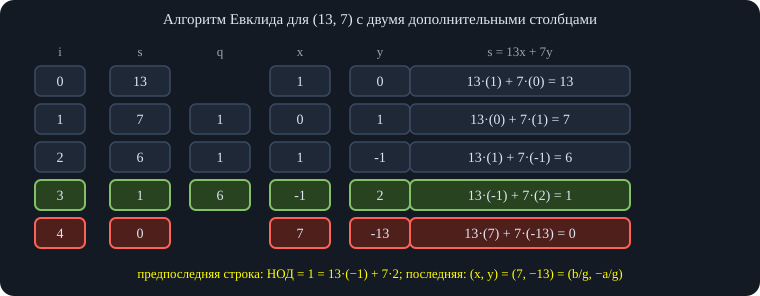
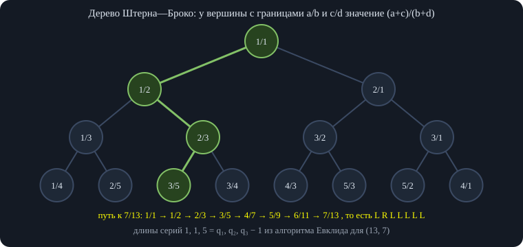
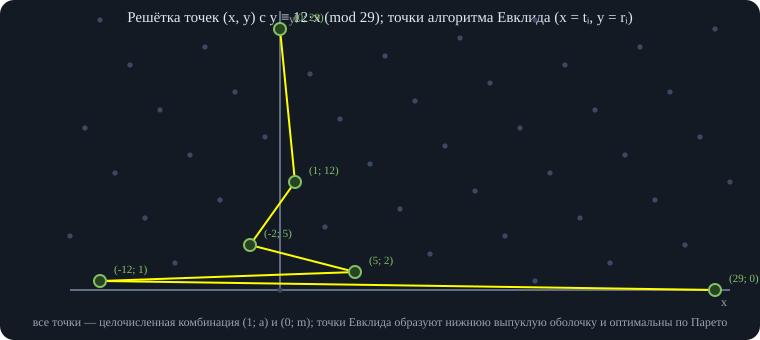
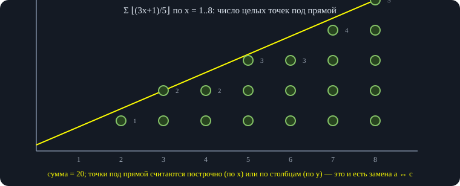
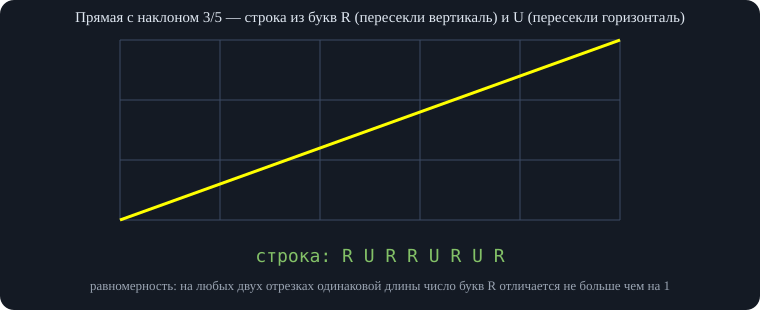
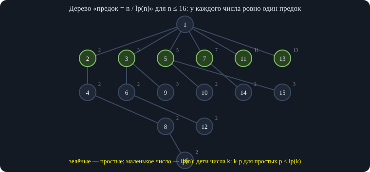
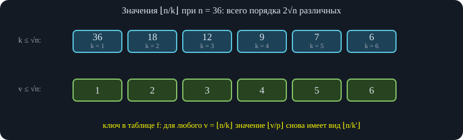
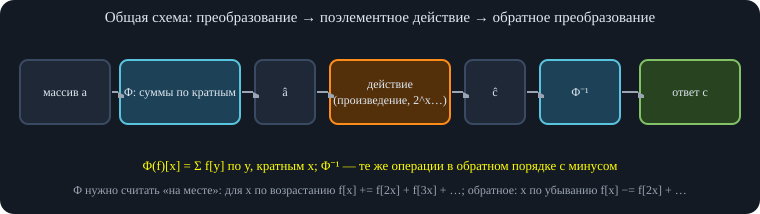

# Занятие 2. Параллель X — Теория чисел

*Разбор контеста по дереву отрезков; алгоритм Евклида, дерево Штерна—Броко, геометрия решёток, рациональная реконструкция, floor sum, решёта, мультипликативные функции, НОД-свёртки.*

## 1. Разбор контеста: применение дерева отрезков

Разбираются задачи тематического контеста по занятию 1. Решения записаны идеями и псевдокодом; код нужен только в лекционной части. Задачи, полностью совпадающие с лекцией (B, C, D), пропущены.

### 1.1. Аналог инверсий на дереве

**Идея.** Для корня $r$ нужно посчитать пары (предок $w$, потомок $b$) с $b<w$ — «инверсии на дереве». Ответ нужен для каждой вершины как корня. Сначала считаем ответ $I(r)$ для одного корня, затем переходим по рёбрам дерева, поддерживая разность.

**Ответ для одного корня.** Вершина $b$ — потомок $w$ ровно тогда, когда $b$ лежит в поддереве $w$, то есть в отрезке эйлерова обхода. Поэтому $I(r)=\sum_w \#\{b\in\operatorname{subtree}(w):\ b<w\}$ — это запрос «сколько чисел на отрезке меньше $x$». Он решается merge sort tree, а так как запросы известны заранее — и офлайн; итого $O(n\log n)$ или $O(n\log^2 n)$.

**Переход от $A$ к соседу $B$.** Удалим ребро $AB$; обозначим $S_A$ — компоненту с $A$, $S_B$ — компоненту с $B$. Пары, в которых $w$ и $b$ лежат по одну сторону ребра, не меняются. Пары «$A$ — потомок/предок вершины из $S_B$» меняются, потому что $A$ перестаёт быть предком вершин из $S_B$, а $B$ становится предком вершин из $S_A$:

$$I(B)-I(A)=\#\{u\in S_A:\ u<B\}-\#\{v\in S_B:\ v<A\}.$$

Каждое из множеств — это либо поддерево (подотрезок эйлерова обхода), либо его дополнение (два подотрезка). Значит, одна смена корня — три запроса «число значений меньше $x$ на отрезке» к уже построенной структуре.

<div class="code">

<div class="code-head">

псевдокод

копировать

</div>

    ans[root] = Σ по w: count(tin[w]..tout[w], меньше w)
    для каждого ребра A→B при обходе дерева:
        SA, SB = (дополнение поддерева B, поддерево B), если B — сын A; иначе наоборот
        ans[B] = ans[A] + count(SA, меньше B) − count(SB, меньше A)

</div>

<div class="good">

**Проверка.** Формула разности сверена с прямым пересчётом ответа для каждого корня на 3000 случайных деревьях (до 9 вершин, случайные различные значения). Вершины $A$ и $B$ входят в $S_A$ и $S_B$ соответственно, поэтому лишней единицы не появляется.

</div>

### 1.2. Число минимумов на отрезке (онлайн)

**Условие.** Массив длины $10^6$, до $10^7$ запросов в зашифрованном виде (то есть только онлайн): найти число минимумов на отрезке. Ответ на запрос — пара (минимум, сколько раз он встречается).

Обычный sparse table здесь не годится: чтобы найти минимум он использует два *перекрывающихся* отрезка, а количества пришлось бы складывать — перекрытие посчиталось бы дважды. Disjoint sparse table разбивает запрос на два *непересекающихся* куска, поэтому достаточно слить две пары: $\min$ берётся из двух, а количества складываются, если минимумы равны.

<div class="code">

<div class="code-head">

псевдокод

копировать

</div>

    merge((m1, c1), (m2, c2)):
        если m1 < m2: вернуть (m1, c1)
        если m2 < m1: вернуть (m2, c2)
        вернуть (m1, c1 + c2)
    предподсчёт — disjoint sparse table, O(n log n); запрос — O(1)

</div>

### 1.3. Таблица: прибавление к столбцам, присваивание строке

**Условие.** Таблица $n\times m$, изначально нули. Запросы: (1) прибавить $x$ ко всем элементам со столбцами из отрезка $[l,r]$ (во всех строках); (2) присвоить значение всем элементам строки $i$; (3) узнать значение в клетке. Все запросы зашифрованы (онлайн).

**Идея.** Операции над столбцами и над строкой почти не связаны, поэтому состояние хранится «по частям». Для строки $i$ запоминаем момент $T_i$ последнего присваивания и присвоенное значение $X_i$ (начальные нули — присваивание в момент 0). Значение клетки $(i,j)$ — это $X_i$ плюс все прибавления к столбцу $j$, которые произошли *после* $T_i$.

Прибавления к столбцам храним в **персистентном** дереве отрезков (прибавление на отрезке, значение в точке), версия — номер запроса. Тогда количество прибавлений после момента $T_i$ в столбце $j$ — разность значений в точке $j$ между последней версией и версией $T_i$.

<div class="code">

<div class="code-head">

псевдокод

копировать

</div>

    присвоить строке i значение x:  T[i] = текущее время; X[i] = x
    добавить x на столбцах [l, r]:   новая версия ДО = add(последняя, l, r, x)
    значение (i, j):                  X[i] + get(последняя версия, j) − get(версия T[i], j)
    все запросы — O(log m)

</div>

### 1.4. Путь в дереве, на рёбрах — отрезки чисел

**Условие.** Усложнение задачи «$k$-я статистика на пути»: на ребре теперь записан не один вес, а отрезок $[l,r]$ — все целые числа от $l$ до $r$. Запрос: две вершины, $k$-е по порядку число среди всех чисел на пути. На ребре может «жить» много чисел, поэтому на пути их намного больше, чем рёбер.

**Идея.** Схема прежняя: массив подсчёта по значениям и спуск по нему. Отличие: при проходе по ребру нужно прибавить единицу сразу на *отрезке* значений $[l,r]$, а не в точке. Ищем минимальный префикс значений, сумма на котором не меньше $k$.

Для каждой вершины строим версию дерева (сумма, прибавление на отрезке), идущую от корня к ней. Для пути $u$–$v$ нужна «линейная комбинация» трёх версий: $\text{версия}(u)+\text{версия}(v)-2\cdot\text{версия}(\operatorname{lca})$. Спуск идёт по трём деревьям одновременно, как в классической задаче.

**Без push.** Когда нужны только суммы и спуск, прибавление на отрезке можно хранить в вершине как отложенную добавку и вообще не проталкивать: при спуске достаточно знать, сколько единиц дали предки (длина отрезка умножается на накопленное прибавление). Новые вершины при спуске создавать не нужно, так как порядок прибавлений не важен.

<div class="note">

**Замечание из обсуждения.** В предыдущей задаче («$k$-я статистика на пути» с точечными вставками) массовые операции не нужны вовсе; здесь же прибавление на отрезке неизбежно, но push не требуется.

</div>

### 1.5. Разрезание массива по индексу и значению

**Условие.** Дан массив $a_0$; после каждого запроса от него отрезается часть: либо все элементы начиная с $i$-го *по индексу*, либо все элементы, которые больше $i$-го *по значению*. После каждого запроса нужно вывести длину оставшегося массива.

Можно придумать амортизированное решение за квадрат (массивы только уменьшаются; «перелив» за размер меньшей части, хранение в декартовых деревьях), но возможно и $O(n\log n)$.

**Ключевое наблюдение.** В любой момент массив состоит из всех элементов исходного массива, у которых индекс лежит в $[L,R]$ и значение лежит в $[X,Y]$. Вырезание по значению просто заменяет $Y$ на меньшее число, вырезание по индексу заменяет $R$ на новую границу. Поэтому длина массива — это число точек в прямоугольнике $[L,R]\times[X,Y]$, а геометрическая картинка (ось индексов и ось значений) отражает именно эти два вида запросов.

Подсчёт числа точек в прямоугольнике онлайн — персистентное дерево отрезков. Остаётся понять, как *вырезать по индексу*: нужно найти $k$-й из элементов, которые ещё присутствуют, и положить $R$ равным его индексу.

Строим персистентное ДО по индексам: в версии $v$ стоят единицы на позициях элементов со значением не больше $v$. Разность версий $Y$ и $X-1$ — массив единиц для элементов со значениями из $[X,Y]$. Нужно найти в нём $k$-ю единицу, считая от позиции $L$, то есть спуск по сумме (как в $k$-й статистике), прибавив к $k$ число единиц левее $L$. Предподсчёт $O(n\log n)$, запрос $O(\log n)$.

### 1.6. Тройки чисел: сумма делится на $D$

**Условие.** Массив троек $(a_i,b_i,c_i)$ и число $D$. Запрос $[l,r]$: из каждой тройки на позициях $l..r$ выбрать одно число так, чтобы сумма выбранных делилась на $D$, и найти *максимальную* такую сумму. (Нужна именно *максимальная* сумма, а не число способов.)

**Идея.** Задача похожа на disjoint sparse table: любой отрезок запроса разбивается на две непересекающиеся части. Для каждой части считаем динамику $dp[r]$ — максимальная сумма с остатком $r$ по модулю $D$ (недостижимые остатки хранят $-\infty$). Ответ на запрос — максимум по $r$ от $dp_{\text{лев}}[r]+dp_{\text{прав}}[(D-r)\bmod D]$, то есть $O(D)$.

Для построения нужно уметь только *дописывать один элемент* в динамику: каждый остаток $r$ обновляется тремя способами — из $r-a_i$, $r-b_i$, $r-c_i$, время $O(D)$. Итого предподсчёт $O(nD\log n)$ времени и памяти, запрос $O(D)$.

<div class="code">

<div class="code-head">

псевдокод

копировать

</div>

    добавить тройку (a, b, c) к dp:
        new[r] = max(dp[(r − a) mod D] + a, dp[(r − b) mod D] + b, dp[(r − c) mod D] + c)
    запрос [l, r]: найти уровень DST, взять dp левой и правой частей
        ответ = max по x: dpЛ[x] + dpП[(D − x) mod D]   (недостижимые — −∞)

</div>

<div class="good">

**Проверка.** Схема «динамика для левой части + динамика для правой части + сочетание по остаткам» сверена с полным перебором всех выборов на 500 случайных массивах (до 8 троек, $D\le 5$), для всех отрезков $[l,r]$ и произвольного разбиения отрезка на две части.

</div>

**Вопрос из зала по задаче о тройках.** Делать слияние двух больших отрезков не нужно, так как строится именно disjoint sparse table, а не дерево отрезков: во время построения мы добавляем к уже посчитанному отрезку по одному элементу, а это $O(D)$.

### 1.7. Существа с атакой и здоровьем

**Условие.** Существа с атакой $A$ и здоровьем $H$. Операции: создать существо $1{:}1$; умножить атаку на 2; умножить здоровье на 2; создать копию существа; заставить двух существ драться — у каждого здоровье уменьшается на атаку противника, и при здоровье меньше нуля существо умирает. Для каждого существа нужно найти момент смерти.

Копирование существа подсказывает *явную персистентность*: структуру здоровья надо копировать. Свойства: атака — всегда степень двойки (стартует с 1 и только удваивается), поэтому хранится просто показатель степени. Здоровье степенью двойки не остаётся (из него вычитаются степени двойки), значение может быть огромным, поэтому его хранят в *двоичной записи*.

Нужные операции над здоровьем $H$: сравнить со степенью двойки (умерло ли существо), вычесть степень двойки, умножить на 2. Умножение на 2 — это сдвиг *указателя начала числа* на один разряд вправо. Бит-массив изначально записан как единица и $Q$ нулей (где $Q$ — число запросов, больше сдвигов не будет), указатель стоит на единице.

Остальное делается персистентным деревом отрезков над битами.

<div class="own">

**Развёрнутое объяснение.** Вычитание $2^k$ из $H$ в двоичной записи: найти ближайшую единицу в позиции $\ge k$ (пусть это позиция $j$), обнулить её и поставить единицы в позициях $k,\ldots,j-1$ — присваивание на отрезке. Сравнение $H<2^k$ равносильно «старший бит числа меньше $k$». Оба действия — спуск по дереву и присваивание на отрезке, то есть $O(\log Q)$ на операцию; персистентность даёт копирование за $O(1)$.

</div>

<div class="good">

**Проверка.** Правило «вычитание $2^k$ = обнулить ближайшую единицу и заполнить единицами младшие разряды до $k$» и сравнение через старший бит сверены с обычной арифметикой на 100 000 случайных чисел (до $2^{38}$) и степеней $2^k$, $k<36$.

</div>

*Часть записи этого фрагмента (около минут 40–45) отсутствует, поэтому последний шаг приведён только как развёрнутое объяснение выше.*

### 1.8. Неубывающие подпоследовательности на отрезке

Следующая задача — запросы на отрезке, для которых нужно считать неубывающие последовательности с значениями до $k$. Слияние двух половин в обычном дереве отрезков потребовало бы динамики «подпоследовательности с началом $x$ и концом $y$» размером $k\times k$ и слияния за $O(k^3)$ — слишком дорого.

Выход — снова disjoint sparse table: в запросе объединяются всего *две* части — левая и правая относительно центра блока. Неубывающая последовательность, пересекающая центр, имеет свой конец в левой части и начало в правой. Поэтому для левой части достаточно хранить $dp[x]$ — число последовательностей, *оканчивающихся* значением $x$, для правой — $dp[y]$ по *началу* $y$. Всего $O(k)$ чисел.

Ответ на запрос: сумма по всем парам $x\le y$ произведений $dp_{\text{лев}}[x]\cdot dp_{\text{прав}}[y]$ (считается за $O(k)$ через суффиксные суммы) плюс последовательности целиком в левой и целиком в правой частях. Предподсчёт $O(nk\log n)$.

Так как все запросы известны заранее, DST можно заменить схемой «разделяй и властвуй» и считать динамики только для тех отрезков, которые действительно нужны: запросов заметно меньше $n\log n$, что улучшает константу (а ограничение по времени было жёстким).

<div class="note">

**Замечание.** В записи не слышна первая часть условия этой задачи, поэтому здесь изложена лишь общая схема: она относится к любым задачам, где результат для двух «склеенных» частей собирается за $O(k)$ из одномерных динамик.

</div>

### 1.9. Число различных на отрезке с заменами

**Условие.** Массив и запросы двух видов: найти число различных на $[l,r]$; заменить $a_i$ на другое число $x$.

Используем индекс предыдущего вхождения: $f_i=\max\{j<i: a_j=a_i\}$ (или $-1$). Число различных на $[l,r]$ — количество $i\in[l,r]$ с $f_i<l$.

Замена $a_i$ с $y$ на $x$ меняет в $f$ ровно **три** элемента: $f_i$ (теперь это предыдущее вхождение $x$), $f$ следующего вхождения $y$ (теперь предыдущее вхождение $y$ — то, что стояло перед $i$) и $f$ следующего вхождения $x$ после $i$ (его предыдущим стало $i$). Задача свелась к массиву $f$ с точечными изменениями и запросом «число значений меньше $l$ на отрезке».

Классический ответ — дерево отрезков, в вершинах которого стоят декартовы деревья, то есть $O(\log^2 n)$ на запрос. Но константа очень большая: на каждый запрос три изменения в деревьях внутри ДО.

**Корневая.** Разобьём массив $f$ на блоки размера $K$, в каждом храним отсортированный блок. Запрос «число значений $<l$ на $[l,r]$»: два крайних блока перебираем целиком, внутренние — бинпоиском, то есть $O\!\left(K+\frac nK\log n\right)$. Обновление значения: меняем число в блоке и передвигаем его на новое место соседними обменами — $O(K)$. При $K\approx\sqrt n$ это $O(\sqrt n\log n)$ на запрос, и по замеру автора такое решение работает примерно **в пять раз быстрее** авторского решения за $O(\log^2 n)$.

## 2. Алгоритм Евклида: таблица и расширенный алгоритм

Лекция состоит из двух больших частей. Первая — алгоритм Евклида: показывается «правильный» расширенный алгоритм, который проще запоминается, удобнее пишется и имеет гораздо больше теоретических следствий. Вторая — решета (линейное, сегментированное, подсчёт простых), мультипликативные функции и НОД-свёртки.

Договорённость: в теории чисел НОД часто обозначают просто круглыми скобками $(a,b)=\gcd(a,b)$, дальше так и будем писать там, где это не вызывает недоразумений.

### 2.1. Евклид в виде таблицы

Запишем алгоритм таблицей, растущей сверху вниз. Для $(13,7)$: из $13$ вычитаем $7$ — остаётся $6$; из $7$ вычитаем $6$ — остаётся $1$; $6$ по модулю $1$ — это $0$. Предпоследнее число — НОД. Пусть $s_i$ — числа, получающиеся в ходе алгоритма: $s_0=a$, $s_1=b$, $s_{i+1}=s_{i-1}-q_i s_i$, где $q_i=\lfloor s_{i-1}/s_i\rfloor$.

Чтобы решить уравнение $ax+by=\gcd(a,b)$, будем хранить для каждого $s_i$ представление $s_i=a x_i+b y_i$. Начало: $a=a\cdot1+b\cdot0$, $b=a\cdot0+b\cdot1$, то есть $(x_0,y_0)=(1,0)$ и $(x_1,y_1)=(0,1)$. Каждая новая строка получается вычитанием $q_i$ раз предыдущей строки из позапредыдущей, и то же самое делаем с $x$ и $y$: равенство $s=ax+by$ сохраняется для всех трёх.

\
*Каждая строка — равенство $s_i = a x_i + b y_i$. Новая строка получается вычитанием $q_i$ раз предыдущей, поэтому равенство сохраняется для всех трёх чисел сразу.*

<div class="algo" data-frames="euc">

</div>

Итог: $1=-1\cdot 13+2\cdot 7$ — это решение линейного уравнения. Обычно рассказ про расширенный алгоритм на этом заканчивается («а теперь решим КТО»). На самом деле из этой таблицы можно вытащить гораздо больше.

<div class="code">

<div class="code-head">

C++

копировать

</div>

``` cpp
struct Row { long long s, x, y; };                 // s = a*x + b*y
// строки таблицы: последняя имеет s = 0, предпоследняя — НОД
vector<Row> eucTable(long long a, long long b) {
    vector<Row> t{{a, 1, 0}, {b, 0, 1}};
    while (t.back().s != 0) {
        Row &p = t[t.size() - 2], &q = t.back();
        long long k = p.s / q.s;                       // сколько раз вычитаем
        t.push_back({p.s - k * q.s, p.x - k * q.x, p.y - k * q.y});
    }
    return t;
}
```

</div>

<div class="good">

**Проверка.** Для 20 000 случайных пар $a,b\in[1,1000]$ проверено: в каждой строке $s=ax+by$; предпоследнее $s$ равно НОД; последняя пара $(x,y)$ равна $(\pm b/g,\ \mp a/g)$; все $|x|\le b/g$, $|y|\le a/g$ (с запасом 1).

</div>

### 2.2. Определитель как инвариант

Напомним определитель матрицы $2\times2$: $\det\begin{pmatrix}a&b\\c&d\end{pmatrix}=ad-bc$. Нам понадобятся два свойства: при прибавлении к одной строке другой, умноженной на число, определитель не меняется (слагаемые $a\lambda d$ и $b\lambda c$ сокращаются); при перестановке строк знак меняется на противоположный. Эти свойства верны и для матриц любого размера — поэтому они выбраны именно такими.

Возьмём в таблице две соседние строки столбцов $x,y$ как матрицу $2\times2$. У первой пары $(1,0),(0,1)$ определитель равен $1$. Следующая пара получается так: из первой строки вычитаем вторую $q$ раз (определитель не меняется) и меняем строки местами (знак меняется на минус). Значит, **определитель любых двух соседних строк $(x_i,y_i),(x_{i+1},y_{i+1})$ равен $(-1)^i$**.

**Следствие 1 (последняя пара).** Пусть алгоритм остановился на шаге $k$: $s_k=0$, $s_{k-1}=g=\gcd(a,b)$. Тогда пара $(p,q)=(x_k,y_k)$ удовлетворяет $ap+bq=0$, то есть $(p,q)=t\cdot\left(\tfrac bg,-\tfrac ag\right)$ для некоторого целого $t$ (числа $b/g$ и $a/g$ взаимно просты). Определитель $x_{k-1}q-p\,y_{k-1}$ делится на $t$ и равен $\pm1$, поэтому $t=\pm1$. Итог: **в конце таблицы получаются исходные $b/g$ и $a/g$ (с точностью до знаков)**.

### 2.3. Знаки и границы: переполнений нет

**Знаки чередуются.** Пусть $a\ge b$ (иначе первый шаг $q_1=0$ просто поменяет строки местами). Тогда $q_1\ge1$, и после первого шага имеем $(x_2,y_2)=(1,-q_1)$: $x$ положительный, $y$ отрицательный. По индукции знаки $x_i$ (и $y_i$) чередуются: на каждом шаге из числа одного знака вычитается положительное кратное числа противоположного знака, поэтому знак сохраняется, а модули складываются.

Отсюда $|x_i|$ и $|y_i|$ не убывают, а последние значения равны $b/g$ и $a/g$. Значит, **все промежуточные $x_i,y_i$ по модулю не превосходят $b/g$ и $a/g$**: переполнения нет. В распространённой реализации с рекурсией и умножением двух чисел переполнение возможно, и тогда приходится брать тип шире (например, 128-битный для 64-битных входов). Здесь все вычисления идут в том же типе, что и входные данные.

<div class="note">

**Что дальше.** Алгоритм можно обобщать на многочлены, гауссовы числа и т. п.; здесь он усложняется в другую сторону — изучается всё, что происходит с $x$ и $y$.

</div>

## 3. Дерево Штерна—Броко

### 3.1. Пары $(x,y)$ как дроби и медианта

Столбцы $x,y$ таблицы можно записать как пары $(1,0),(0,1),(1,-1),(-1,2),(7,-13)$. Заменим вычитание сложением (знаки чередуются, поэтому модули складываются): $(1,0)\to(0,1)\to(1,1)\to(1,2)\to\dots$. Начинаем с двух «дробей» $0/1$ и $1/0$ (последнюю считаем бесконечностью) и повторяем: две соседние дроби заменяем их *медиантой* — дробью, у которой числитель и знаменатель равны суммам числителей и знаменателей.

**Лемма (медианта).** Если $\frac ab<\frac cd$ ($a,b,c,d>0$), то $\frac ab<\frac{a+c}{b+d}<\frac cd$.

<div class="own">

**Доказательство.** Из $\frac ab<\frac cd$ получаем $ad<bc$. Тогда $a(b+d)=ab+ad<ab+bc=b(a+c)$, откуда $\frac ab<\frac{a+c}{b+d}$. Аналогично $c(b+d)=cb+cd>ad+cd=d(a+c)$, откуда $\frac{a+c}{b+d}<\frac cd$.

</div>

Таким образом медианта лежит строго между исходными дробями. Эта «неправильная» сложение дробей из школы здесь вполне осмысленно.

Строим бесконечное бинарное дерево: корень $1/1$ — медианта $0/1$ и $1/0$; левый сын получается как медианта с левой границей, правый — с правой. Это **дерево Штерна—Броко**: оно является деревом поиска (всё левое поддерево меньше корня, правое — больше).

\
*Каждая положительная несократимая дробь встречается ровно один раз; путь в дереве — это последовательность $q_i$ алгоритма Евклида (серии шагов влево и вправо чередуются).*

### 3.2. Свойства: несократимость и полнота

**Матричная запись.** Храним у вершины матрицу из двух столбцов — левой и правой границ: $\begin{pmatrix}a&c\\b&d\end{pmatrix}$ (столбцы $(a,b)$ и $(c,d)$). Шаг влево заменяет правый столбец на сумму столбцов, шаг вправо — левый. Это прибавление одного столбца к другому — определитель не меняется и остаётся равным $1$ (изначально $\det\begin{pmatrix}0&1\\1&0\end{pmatrix}$ по модулю $1$).

**Несократимость.** Если бы у вершины $(c,d)$ был общий делитель $t>1$: $c=t\hat c$, $d=t\hat d$, то определитель $ad-bc$ делился бы на $t$, а он равен $\pm1$. Значит, все дроби в дереве несократимы.

**Полнота.** Каждая положительная несократимая дробь встречается в дереве, и ровно один раз. Это видно из алгоритма Евклида: построение пути ровно то же, что и процесс таблицы.

**Путь = числа $q_i$.** Например, к дроби $7/13$: из корня $1/1$ идём влево ($7/13<1$), затем вправо к $2/3$, затем несколько раз влево: $3/5,4/7,5/9,6/11,7/13$. Количество шагов в сериях $1,1,\dots$ совпадает с частными $q_1,q_2,q_3$ алгоритма Евклида (в последней серии на единицу меньше). Влево и вправо серии чередуются: сначала $q_1$ шагов влево, затем $q_2$ вправо, затем $q_3$ влево и так далее.

**Вопрос на понимание.** Что означает $q_1=0$ в алгоритме Евклида, запущенном на $(a,b)$ с $a<b$? Тогда дробь $b/a>1$ расположена правее корня, и ноль шагов влево — просто сразу идём вправо. Отдельно обрабатывать этот случай не нужно.

### 3.3. Применения: перечисление и минимальный знаменатель

**Все дроби $i/j$ с $1\le i,j\le n$ по возрастанию за $O(n^2)$.** Обходим дерево Штерна—Броко в порядке «левое поддерево, вершина, правое поддерево», и там, где числитель или знаменатель стал больше $n$, поддерево отсекаем (дальше они только растут). Раньше это умели за $O(n^2\log n)$ сортировкой.

<div class="code">

<div class="code-head">

C++

копировать

</div>

``` cpp
// выписывает несократимые дроби p/q, 1 <= p,q <= n, в порядке возрастания
void go(int a, int b, int c, int d, int n, vector<pair<int,int>>& out) {  // между a/b и c/d
    int p = a + c, q = b + d;                    // медианта
    if (p > n || q > n) return;                 // дальше только больше
    go(a, b, p, q, n, out); out.push_back({p, q}); go(p, q, c, d, n, out);
}
// запуск: go(0, 1, 1, 0, n, out)
```

</div>

<div class="good">

**Проверка.** Для всех $n=1..12$ результат обхода совпадает с отсортированным списком всех несократимых дробей $i/j$, $1\le i,j\le n$.

</div>

Идея с отсечением полезна и вне дробей: например, задача «таблица умножения» контеста (отсортировать все произведения $i\cdot j$ таблицы $n\times n$ и найти сумму $k\cdot a_k$) решается такой же идеей с дополнительной комбинаторикой.

**Дробь с минимальным знаменателем между $\frac ab$ и $\frac cd$.** Нужна $p/q$ с $\frac ab\le\frac pq\le\frac cd$ и минимальным $q$. Это в точности **наименьший общий предок** двух дробей в дереве Штерна—Броко: выше него вершин между $\frac ab$ и $\frac cd$ быть не может (всё лежит строго левее или правее), а в поддереве знаменатели только растут.

<div class="code">

<div class="code-head">

C++

копировать

</div>

``` cpp
// минимальный знаменатель p/q в [a/b, c/d], a/b < c/d, a > 0
pair<ll,ll> minDenominator(ll a, ll b, ll c, ll d) {
    ll la = 0, lb = 1, ra = 1, rb = 0;           // границы 0/1 и 1/0
    while (true) {
        ll p = la + ra, q = lb + rb;              // вершина дерева
        if (p * b < a * q) { la = p; lb = q; }   // p/q < a/b: идём вправо
        else if (c * q < p * d) { ra = p; rb = q; }   // p/q > c/d: идём влево
        else return {p, q};
    }
}
```

</div>

<div class="fix">

**Граничный случай.** Дроби $0/1$ и $1/0$ — границы дерева, а не вершины. Поэтому, если левая граница $a/b=0$, ответ — сразу $0/1$ (знаменатель $1$); приведённый код рассчитан на $a>0$. Для открытых интервалов нужно аккуратно перепроверить включение концов.

</div>

<div class="good">

**Проверка.** Спуск сверен с полным перебором (минимальный $q$, затем минимальный $p$) на 20 000 случайных пар дробей с числителями и знаменателями до $30$; случай $a=0$ проверен отдельно.

</div>

Без построения дерева путь находят через алгоритм Евклида: для каждой из дробей получаем свою последовательность $q_1,q_2,\dots$ и $\hat q_1,\hat q_2,\dots$. Общая часть путей — это общий префикс из одинаковых $q_i$; на первом различающемся номере $i$ дробь, пересекающая оба пути, идёт в нужную сторону на $\min(q_i,\hat q_i)$ шагов (а для последней серии нужно учесть, что в ней на единицу меньше). Наивный спуск выше делает по одному шагу и подходит при небольших значениях; для больших нужно ускорять каждую серию.

## 4. Геометрия решёток

### 4.1. Определитель, формула Пика, пустой треугольник

Определитель двух векторов $\vec u=(u_1,u_2)$, $\vec v=(v_1,v_2)$ равен косому произведению $u_1v_2-u_2v_1$ — это *ориентированная* удвоенная площадь треугольника на этих векторах. Если определитель равен $1$, площадь треугольника $0,\vec u,\vec v$ равна $\tfrac12$.

**Формула Пика.** Для многоугольника с целочисленными вершинами $S=I+\frac B2-1$, где $I$ — число целых точек строго внутри, $B$ — на границе. Для треугольника $B\ge3$ (три вершины). Подставив $S=\tfrac12$: $\tfrac12=I+\tfrac B2-1$, и при $B=3$ получаем $I=0$; любое увеличение $B$ или $I$ сразу даёт площадь больше $\tfrac12$. Значит, **треугольник площади $\tfrac12$ с целыми вершинами не содержит других целых точек — ни внутри, ни на рёбрах**.

**Целочисленный базис.** Если определитель векторов $\vec u,\vec v$ равен $\pm1$, то любую целую точку можно записать как $a\vec u+b\vec v$ с целыми $a,b$. Например, $(1,0)$ и $(0,1)$; но можно взять и $(1,1)$ вместо первого. Геометрически: прямые, проходящие через $\vec v,\ 2\vec v,\dots$ в направлении $\vec u$, разбивают плоскость на пустые треугольники площади $\tfrac12$, у которых вершины — все узлы. Поэтому узлы, на которые разбивает плоскость такой базис, — это ровно все целые точки.

**Решётка** (упрощённое определение): множество точек $a\vec u+b\vec v$, $a,b\in\mathbb Z$. Целочисленная сетка $\mathbb Z^2$ — решётка, у неё много разных базисов.

**Смысл дерева Штерна—Броко.** Целые точки первой четверти — неотрицательные целочисленные комбинации $\vec u=(1,0)$ и $\vec v=(0,1)$. Добавим луч $y=x$ с вектором $\vec u+\vec v$: любая точка в нижнем «секторе» — неотрицательная целая комбинация $\vec u$ и $\vec u+\vec v$, в верхнем — $\vec v$ и $\vec u+\vec v$. Дальше сектор делится аналогично. Дроби — это *направления* лучей, а дерево Штерна—Броко упорядочивает их; все получающиеся треугольники имеют площадь $\tfrac12$. Ничего принципиально нового, но полезная геометрическая интерпретация.

## 5. Рациональная реконструкция

### 5.1. Постановка и единственность

**Задача.** Дано число $a$ по модулю $m$. Нужно найти дробь $\frac pq$ с «малыми» числителем и знаменателем такую, что $\frac pq\equiv a\pmod m$, то есть $p\equiv aq\pmod m$. (Такие задачи возникают на практике, когда ответ — рациональное число, а считали его по модулю.)

**Единственность.** Пусть $0\le p\le P$, $0<q\le Q$ и $PQ<m$. Если $\frac{p_1}{q_1}\equiv\frac{p_2}{q_2}$, то $p_1q_2\equiv p_2q_1\pmod m$, а $|p_1q_2-p_2q_1|\le PQ<m$ — значит, разность равна нулю и дроби совпадают. Если числитель может быть отрицательным ($|p|\le P$), то $|p_1q_2-p_2q_1|\le 2PQ$ и нужно условие $2PQ<m$.

### 5.2. Решётка и алгоритм Евклида

Запустим алгоритм Евклида на $(m,a)$: числа $r_i$ с $r_i\equiv a\,t_i\pmod m$, где $t_i$ — коэффициенты при $a$ (для $m$ коэффициент $t$ равен $0$, для $a$ равен $1$). Каждая строка — решение сравнения $r\equiv at\pmod m$ — то есть дробь $\frac{r}{t}\equiv a$.

Рассмотрим плоскость с осью $x$ (число $t$) и осью $y$ (число $r$) и множество $S$ всех точек $(t,\,at\bmod m)$ плюс точки, сдвинутые на $(0,m)$. Это решётка с базисом $(1,a)$ и $(0,m)$; ей принадлежит также $(m,0)$, и картинка повторяется со сдвигом на $m$ по осям. Площадь треугольника, натянутого на базис, равна $\tfrac m2$.

**Лемма (обобщение формулы Пика).** Если три точки решётки $S$ образуют треугольник площади $\tfrac m2$, то внутри (и на сторонах) других точек $S$ нет. Доказательство: сопоставим $S$ целочисленную решётку $\mathbb Z^2$ (базис в координатах $\vec u,\vec v$). Косое произведение сохраняет знак и умножается на положительную константу $\det(\vec u,\vec v)=m$, поэтому «точка внутри треугольника» эквивалентна для $S$ и для $\mathbb Z^2$.

**Что делает Евклид.** Вычитая из одного вектора другой, мы получаем последовательность точек: на каждом шаге вектора лежат по разные стороны от оси, площади всех возникающих треугольников равны (параллелограмм, общее основание и высота). Поэтому построенные точки не содержат других точек решётки внутри; можно показать индукцией, что они образуют **выпуклую оболочку** (ломаную по точкам решётки, ближайших к осям).

\
*Рациональная реконструкция: $p/q\equiv a$ означает точку $(q, p)$ этой решётки в маленьком прямоугольнике; кандидатов дают лишь точки алгоритма Евклида.*

Они также **оптимальны по Парето**: для любой другой точки решётки (в нужном секторе) найдётся точка из списка, которая не хуже по обоим координатам сразу. Почему? Любая другая точка вместе с двумя соседними образует параллелограмм площади $m$, внутри которого точек решётки нет; значит, любая «лучшая» точка не может лежать между ними. Поэтому достаточно перебрать промежуточные строки алгоритма Евклида — и все кандидаты рассмотрены. Это и решает задачу рациональной реконструкции.

**Алгоритм.** Запускаем Евклид на $(m,a)$ и останавливаемся на первой строке с $r\le P$. Если $t=0$ или $|t|>Q$ — дроби нет; иначе $\frac rt$ (при $t<0$ меняем знаки обоих) — искомая дробь.

<div class="code">

<div class="code-head">

C++

копировать

</div>

``` cpp
// ищем p/q ≡ a (mod m), |p| <= P, 0 < q <= Q
bool ratRecon(ll a, ll m, ll P, ll Q, ll& p, ll& q) {
    ll r0 = m, r1 = a % m, t0 = 0, t1 = 1;        // всегда r_i ≡ a * t_i (mod m)
    while (r1 > P) {
        ll k = r0 / r1;
        ll r2 = r0 - k * r1, t2 = t0 - k * t1;
        r0 = r1; r1 = r2; t0 = t1; t1 = t2;
    }
    if (t1 < 0) { t1 = -t1; r1 = -r1; }
    if (t1 == 0 || t1 > Q) return false;
    p = r1; q = t1; return true;
}
```

</div>

<div class="good">

**Проверка.** Для $m=1000003$, случайных $P,Q\le700$ с $2PQ<m$ и случайных несократимых $p/q$ дробь восстанавливается точно, а найденная пара удовлетворяет $q\cdot a\equiv p\pmod m$ (20 000 попыток).

</div>

## 6. Floor sum

### 6.1. Идея сведения

**Задача.** Вычислить $\sum_{x=1}^{n}\left\lfloor\frac{ax+b}{c}\right\rfloor$ за $O(\log)$. Округление — вниз (в том числе для отрицательных чисел: не к нулю, а именно вниз).

**Шаг 1: убрать целые части.** Если $a\ge c$, запишем $a=a_0c+a'$ с $a'<c$; тогда $\lfloor\frac{ax+b}{c}\rfloor=a_0x+\lfloor\frac{a'x+b}{c}\rfloor$, и сумма первого слагаемого считается в замкнутом виде. То же с $b$: $b=b_0c+b'$ даёт $b_0$ в каждом слагаемом. Остаётся случай $0\le a,b<c$.

**Шаг 2: комбинаторный смысл.** Значение $\lfloor\frac{ax+b}{c}\rfloor$ — число натуральных $y$, лежащих под прямой $y=\frac{ax+b}{c}$ при данном $x$. Сумма — это количество целых точек $(x,y)$, $1\le x\le n$, $1\le y\le\frac{ax+b}c$, то есть точек под прямой в «таблице» $n\times M$, где $M=\lfloor\frac{an+b}{c}\rfloor$.

**Шаг 3: поменять оси.** Посчитаем вместо этого точки, *не* лежащие под прямой, — их $nM$ минус искомое. Условие $cy>ax+b$ даёт $x\le\lfloor\frac{cy-b-1}{a}\rfloor$. Получилась такая же сумма, только по $y$ от $1$ до $M$ и с числами $(c,\,\cdot,\,a)$ вместо $(a,\,b,\,c)$ — то есть шаг алгоритма Евклида: $(a,c)\to(c\bmod a,\dots)$. Глубина рекурсии — $O(\log c)$.

\
*Комбинаторный смысл суммы: количество точек $(x,y)$, $1\le x\le n$, $1\le y\le (ax+b)/c$. Если считать по $y$, получается такая же сумма с другими числами — на этом строится алгоритм.*

<div class="own">

**Развёрнутое объяснение.** В записи эта часть рассказа слышна лишь частично. Ниже стандартная итеративная реализация для суммы по $i=0..n-1$ (индекс с нуля): сначала снимаются целые части $a\ge m$ и $b\ge m$, затем $y=an+b$; если $y<m$, все слагаемые нулевые, иначе переходим к задаче $(n,m,a,b)\to(\lfloor y/m\rfloor,\ a,\ m,\ y\bmod m)$ — тот же подсчёт точек, но «по другой оси». Тождество проверено тестами ниже.

</div>

<div class="code">

<div class="code-head">

C++

копировать

</div>

``` cpp
// sum_{i=0}^{n-1} floor((a*i + b) / m),  a, b >= 0, m > 0
ll floorSum(ll n, ll m, ll a, ll b) {
    ll ans = 0;
    while (true) {
        if (a >= m) { ans += (n - 1) * n / 2 * (a / m); a %= m; }
        if (b >= m) { ans += n * (b / m); b %= m; }
        ll y = a * n + b;
        if (y < m) break;
        n = y / m; b = y % m; swap(m, a);     // ось x и ось y меняются местами
    }
    return ans;
}
```

</div>

<div class="good">

**Проверка.** Сумма сверена с прямым суммированием на 100 000 случайных наборов ($n\le30$, $m\le20$, $a,b<40$).

</div>

### 6.2. Равномерная строка и моноид

Рассмотрим луч в направлении вектора $(c, a)$ из начала координат. Идём вдоль него и записываем букву `R`, когда пересекаем вертикальную линию сетки, и `U` — горизонтальную (в узле сначала пишем `U`, затем `R`). Получается строка, которую можно повторять циклически как угодно долго. Пример: $\frac35$ даёт `R U R R U R U R` (см. рисунок).

\
*Равномерная строка. Её можно собирать по алгоритму Евклида, склеивая блоки, и держать в каждой склейке моноид (сумму, число инверсий и т. п.).*

**Свойства.** Между соседними буквами `R` стоит ноль или одна буква `U`, то есть буквы `U` не идут подряд, а `R` повторяются один или два раза (при $a<c$). Число букв `R` на любых двух участках одинаковой длины отличается не больше чем на $1$ (это число пересечённых вертикалей, а наклон прямой постоянен). Строка называется *равномерной*.

**Разложение по Евклиду.** Строку можно «сжать»: заменить блоки `U` (единичные) на новую букву $U^*$ и блоки `R` с хвостом на $R^*$ и повторить то же с новой строкой, — это ровно шаги алгоритма Евклида. В итоге такую длинную строку можно собрать, склеивая блоки операцией $O(\log c)$ раз.

**Зачем.** Пусть вместо букв — элементы моноида (сумма, число инверсий, матрица и т. д.), которые можно «слить» за $O(1)$. Тогда за $O(\log c)$ слияний получается итог по всей строке. Для floor sum: `U` означает «прибавить 1», `R` — «прибавить текущую высоту к ответу». Для $\sum\lfloor\cdot\rfloor^2$ и подобных нужно просто взять другой моноид: например, квадрат суммы выражается через число *пар* (подпоследовательностей длины $2$), то есть через биномиальные коэффициенты $\binom{S}{2}$, а их можно получать моноидом из числа единиц и числа пар.

<div class="note">

**Замечания.** Сдвиг начальной точки (слагаемое $b$) циклически сдвигает строку; это учитывается, но технически значительно сложнее. Всё это работает в *двумерном* случае: для трёхмерных аналогов (например, сумм вида $\lfloor\frac{ax+by+c}{d}\rfloor$ по двум переменным) быстрых алгоритмов в общем случае не известно.

</div>

### 6.3. Что осталось за рамками

Евклида можно считать без деления (для двоичных чисел — на сдвигах; расширенный вариант тоже работает), запускать на решётках и обобщать на несколько векторов (алгоритм LLL), на многочлены (отдельная лекция). Тема глубокая — здесь остановились. Затем объявлен перерыв на 15 минут.

## 7. Решета

### 7.1. Решето Эратосфена

**Задача.** Для $n$ до $10^7$ найти все простые числа в $[1,n]$ (или для каждого числа найти какой-нибудь делитель). Вычёркиваем кратные $2$ кроме самой двойки, затем кратные $3$ и т. д.; число, не вычеркнутое к моменту рассмотрения, — простое. Время: $O(n\log\log n)$.

**Откуда $\log\log n$.** Простое число $p$ вычёркивает $n/p$ чисел, поэтому время равно $n\sum_{p\le n}\frac1p$. Если бы мы вычёркивали по *всем* числам, получился бы гармонический ряд $n\sum\frac1k\approx n\ln n$. Простых мало: $k$-е простое число $\approx k\ln k$ (отношение стремится к $1$), поэтому $\sum_{p\le n}\frac1p\approx\sum_k\frac1{k\ln k}\approx\ln\ln n$.

<div class="fix">

**Исправление.** В записи упоминается оценка «$\pi(n)=\frac{n}{\ln n}+O(\sqrt n)$». Верная формулировка: $\pi(n)\sim\frac{n}{\ln n}$ (т. е. отношение стремится к $1$). Остаточный член вида $O(\sqrt n\log n)$ относится не к $\frac n{\ln n}$, а к интегральному логарифму и выводится из гипотезы Римана. Для оценки времени решета нужна только эквивалентность $\sum_{p\le n}\frac1p\sim\ln\ln n$.

</div>

**Две очевидные оптимизации.** (1) Перебирать простые только до $\sqrt n$; (2) вычёркивать, начиная с $p^2$ (меньшие кратные уже вычеркнуты меньшими простыми). Этого достаточно почти для любых целей: решето быстрое.

<div class="code">

<div class="code-head">

C++

копировать

</div>

``` cpp
vector<char> comp(n + 1);                      // comp[i] = 1, если i составное
for (ll p = 2; p * p <= n; p++)
    if (!comp[p])
        for (ll j = p * p; j <= n; j += p) comp[j] = 1;
```

</div>

### 7.2. Линейное решето

Асимптотически можно быстрее: $O(n)$. Пусть $\operatorname{lp}(n)$ — минимальный простой делитель $n$ (для простого $n$ равен самому $n$). Определим дерево: предок числа $n$ — это $n/\operatorname{lp}(n)$. Тогда единица — корень, простые числа подвешены к ней, $4$ и $6$ — к $2$ и $3$ соответственно и т. д.

\
*Линейное решето обходит это дерево: каждое составное число $n=k\cdot p$ посещается ровно один раз — как ребёнок $k=n/\operatorname{lp}(n)$.*

**Идея.** Идём по числам по возрастанию и для каждого $k$ перебираем всех его детей. Заметим, что $\operatorname{lp}(n/\operatorname{lp}(n))\ge\operatorname{lp}(n)$: делением на минимальный простой делитель набор простых делителей только уменьшается, а минимум не уменьшается. Поэтому детьми числа $k$ являются числа $k\cdot p$ для простых $p\le\operatorname{lp}(k)$ (и $kp\le n$). Для них $\operatorname{lp}(kp)=p$ — сразу известно.

<div class="algo" data-frames="linsieve">

</div>

<div class="code">

<div class="code-head">

C++

копировать

</div>

``` cpp
const int N = 10000000;
int lp[N + 1]; vector<int> pr;
void sieve() {
    for (int i = 2; i <= N; i++) {
        if (!lp[i]) { lp[i] = i; pr.push_back(i); }          // не помечено — простое
        for (int p : pr) {
            if (p > lp[i] || (long long)i * p > N) break;   // дети: p <= lp(i) и i*p <= N
            lp[i * p] = p;                                    // каждое число помечается ровно один раз
        }
    }
}
```

</div>

<div class="good">

**Проверка.** Количество простых, найденных линейным решетом до $3\cdot10^5$, совпадает с количеством по решету Эратосфена, а значения $\varphi$, $\tau$, $\sigma$, посчитанные на его основе (см. ниже), сверены с определениями.

</div>

### 7.3. Сегментированное решето

**Задача.** Найти простые (или разложение) на отрезке $[L,R]$, где $R$ велико, но $R-L$ мало. Заметим: у составного $x\le R$ есть простой делитель $\le\sqrt R$. Сначала найдём простые до $\sqrt R$ обычным решетом, затем для каждого такого $p$ помечаем кратные внутри $[L,R]$, начиная с первого кратного $\ge L$ (и не меньше $p^2$): первое кратное — $\lceil L/p\rceil p$.

**Время.** $(R-L)\sum_{p\le\sqrt R}\frac1p+\sqrt R\ln\ln R$, то есть $O((R-L)\log\log R+\sqrt R\log\log R)$. Если не просто помечать, а делить, чтобы получить, например, наибольший простой делитель: число делений на $p$ равно $\frac{R-L}{p}+\frac{R-L}{p^2}+\dots\le\frac{2(R-L)}{p}$ — геометрическая прогрессия, поэтому асимптотика не меняется.

<div class="code">

<div class="code-head">

C++

копировать

</div>

``` cpp
// простые на [L, R]; smallPrimes(n) возвращает простые до n
vector<char> segSieve(ll L, ll R) {
    vector<char> isPrime(R - L + 1, 1);
    for (int p : smallPrimes((int)sqrtl(R) + 1)) {
        if ((ll)p * p > R) break;
        ll start = max((ll)p * p, (L + p - 1) / p * p);
        for (ll j = start; j <= R; j += p) isPrime[j - L] = 0;
    }
    for (ll v = L; v <= 1 && v <= R; v++) isPrime[v - L] = 0;       // 0 и 1 не простые
    return isPrime;
}
```

</div>

<div class="good">

**Проверка.** Результат сверен с обычным решетом на $3000$ случайных отрезков до $3\cdot10^6$ (длина до $1000$) и на всех малых отрезках $0\le L\le R\le 60$.

</div>

### 7.4. Подсчёт простых за $O(n^{3/4})$

Подсчитать *количество* простых $\pi(n)$ намного проще, чем найти их. Оказывается, $\pi(n)$ можно вычислять за $O\!\left(\frac{n^{3/4}}{\log n}\right)$ (придумано участником сайта Project Euler; **Важное дополнение:** в литературе этот приём называют алгоритмом Lucy_Hedgehog).

**Прямой подход.** Из $n$ чисел вычесть кратные $2$, потом кратные $3$ и т. д. с формулой включений-исключений — слагаемых экспоненциально много. Нужна динамика.

**Ключ 1: значения $\lfloor n/k\rfloor$.** Все аргументы динамики имеют вид $\lfloor n/k\rfloor$: их не более $2\sqrt n$ (либо $k\le\sqrt n$, либо само значение $\le\sqrt n$). Деление на $p$ не выводит из этого множества: $\lfloor\lfloor n/k\rfloor/p\rfloor=\lfloor n/(kp)\rfloor$.

\
*Динамика считается только в точках $\lfloor n/k\rfloor$: их $\approx 2\sqrt n$, и при делении на $p$ мы остаёмся внутри этого множества.*

**Динамика.** Пусть $p_1<p_2<\dots$ — простые, $S(v,j)$ — количество чисел от $2$ до $v$, которые либо простые, либо не делятся ни на одно из $p_1,\dots,p_j$. Начало: $S(v,0)=v-1$. Переход при добавлении простого $p=p_j$: из чисел, оставшихся после $j-1$ шагов, нужно убрать составные числа вида $p\cdot i$ с $i\ge p$ без делителей меньше $p$ — их количество $S(\lfloor v/p\rfloor,j-1)-S(p-1,j-1)$ (последнее вычитание убирает простые меньше $p$ из числа $i$):

$$S(v,j)=S(v,j-1)-\bigl[S(\lfloor v/p\rfloor,j-1)-S(p-1,j-1)\bigr]\quad(v\ge p^2),\qquad S(v,j)=S(v,j-1)\ (v<p^2).$$

Ответ — $\pi(n)=S(n,j)$ после того, как просеяны все простые до $\sqrt n$. Память — слой по $j$ (два массива по $\sqrt n$), значения $v$ обновляются от больших к меньшим, чтобы использовать старые значения.

<div class="algo" data-frames="lucy">

</div>

**Ключ 2: начинать с $p^2$.** Обновляем только значения $v\ge p^2$. *Оценка.* Для простых $p\le n^{1/4}$ обновляются все $\approx 2\sqrt n$ значений — суммарно $\frac{n^{1/4}}{\ln n}\sqrt n=\frac{n^{3/4}}{\ln n}$. Для $n^{1/4}<p\le\sqrt n$ обновляются лишь значения $v=\lfloor n/k\rfloor\ge p^2$, то есть $k\le n/p^2$. Заменим сумму по простым суммой по всем $k$ и оценим сверху:

$$\sum_{k=n^{1/4}}^{n^{1/2}}\frac{n}{k^2}\ \lesssim\ n\sum\left(\frac1{k-1}-\frac1k\right)=\frac{n}{n^{1/4}}=n^{3/4},$$

и ещё делим на $\ln n$, поскольку простых мало. Итого $O\!\left(\frac{n^{3/4}}{\log n}\right)$.

<div class="code">

<div class="code-head">

C++

копировать

</div>

``` cpp
// pi(n): количество простых <= n, O(n^{3/4})
ll countPrimes(ll n) {
    if (n < 2) return 0;
    ll r = sqrtl(n); while (r * r > n) r--; while ((r + 1) * (r + 1) <= n) r++;
    vector<ll> lo(r + 2), hi(r + 2);      // lo[v] = f(v), hi[k] = f(n / k)
    for (ll v = 1; v <= r; v++) { lo[v] = v - 1; hi[v] = n / v - 1; }
    for (ll p = 2; p <= r; p++) {
        if (lo[p] == lo[p - 1]) continue;       // p составное
        ll cp = lo[p - 1], p2 = p * p;
        for (ll k = 1; k <= min(r, n / p2); k++) {            // значения n/k >= p^2, от больших
            ll d = k * p;
            hi[k] -= (d <= r ? hi[d] : lo[n / d]) - cp;
        }
        for (ll v = r; v >= p2; v--) lo[v] -= lo[v / p] - cp;
    }
    return hi[1];
}
```

</div>

<div class="good">

**Проверка.** Значение $\pi(n)$ сверено с таблицей по решету для 3000 случайных $n\le2\cdot10^6$ и для точек $0,1,2,3,4,10,100,10^3,10^6,2\cdot10^6$. Дополнительно $\pi(10^{10})=455\,052\,511$ — известное табличное значение.

</div>

<div class="note">

**Что запомнить.** Два приёма: считать динамику только в точках $\lfloor n/k\rfloor$ (это даёт $\sqrt n$ значений) и просеивать только простые, начиная с $p^2$ (это даёт выигрыш в одну четверть степени и ещё делит на логарифм).

</div>

## 8. Мультипликативные функции

### 8.1. Определение и примеры

**Определение.** Функция $f$ на натуральных числах *мультипликативна*, если $f(1)=1$ и для любых *взаимно простых* $a,b$ верно $f(ab)=f(a)f(b)$. Тогда значение в любом $n=p_1^{k_1}\cdots p_m^{k_m}$ равно $\prod f(p_i^{k_i})$, а сама функция однозначно определяется своими значениями в степенях простых — и эти значения можно задавать свободно.

Если бы требование взаимной простоты не накладывалось (полностью мультипликативная функция), то значение определялось бы значениями в простых: $f(n)=\prod f(p_i)^{k_i}$. Такие функции менее интересны.

- **Функция Эйлера** $\varphi(n)=n\prod_{p\mid n}\left(1-\frac1p\right)$ — число $k\in[1,n]$ взаимно простых с $n$. На степенях простых: $\varphi(p^k)=p^k-p^{k-1}$.
- **Число делителей** $\tau(n)$: $\tau(p^k)=k+1$. Мультипликативность: для каждого простого выбираем показатель от $0$ до $k_i$ независимо.
- **Сумма делителей** $\sigma(n)$ и $\sigma_k(n)=\sum_{d\mid n}d^k$: $\sigma(p^k)=1+p+\dots+p^k$.

**Почему $\sigma$ мультипликативна.** Для $n=p_1^{k_1}\cdots p_m^{k_m}$ произведение $\prod_i(1+p_i+\dots+p_i^{k_i})$ после раскрытия скобок содержит по одному слагаемому из каждой скобки, то есть числа $p_1^{l_1}\cdots p_m^{l_m}$ с $0\le l_i\le k_i$ — это в точности все делители $n$, каждый ровно один раз.

<div class="own">

**Развёрнутое объяснение.** Прямое доказательство для взаимно простых $a,b$: $\sigma(a)\sigma(b)=\sum_{x\mid a}\sum_{y\mid b}xy$. Любой делитель $d$ числа $ab$ единственным образом записывается как $d=xy$ с $x\mid a$, $y\mid b$: положим $x=\gcd(d,a)$, тогда $y=d/x$ делит $b$ (так как $d/x$ взаимно просто с $a/x$, а $d\mid ab$), причём $\gcd(d/x,\,a)=1$. Обратно, любая пара $(x,y)$ даёт делитель $xy$, поскольку $\gcd(x,y)=1$ единственным образом восстанавливает $x$ и $y$. Значит, $\sum_{d\mid ab}d=\sum_{x\mid a}\sum_{y\mid b}xy=\sigma(a)\sigma(b)$.

</div>

### 8.2. Линейное решето для мультипликативных функций

Если известны значения функции в степенях простых, то по ним можно получить значения во всех числах до $n$ за $O(n)$. Каркас — линейное решето. Рассматриваем $n=i\cdot p$ при $p\le\operatorname{lp}(i)$. Два случая:

- $p\nmid i$ (то есть $p<\operatorname{lp}(i)$): $i$ и $p$ взаимно просты, значит $f(ip)=f(i)\,f(p)$.
- $p\mid i$ (то есть $p=\operatorname{lp}(i)$): $p$ уже входит в $i$ в некоторой степени. Пусть $p^k$ — наибольшая степень $p$, делящая $i$, и $i=\text{rest}\cdot p^k$. Тогда $f(ip)=f(\text{rest})\,f(p^{k+1})$, а $f(p^{k+1})$ получается из $f(p^k)$ по формуле, специфичной для функции.

Чтобы не использовать деление (оно в разы медленнее умножения), храним для каждого числа $\operatorname{pw}[n]$ — максимальную степень минимального простого, делящую $n$, и $\text{rest}[n]=n/\operatorname{pw}[n]$. При $p\nmid i$: $\operatorname{pw}[ip]=p$, $\text{rest}[ip]=i$. При $p\mid i$: $\operatorname{pw}[ip]=\operatorname{pw}[i]\cdot p$, $\text{rest}[ip]=\text{rest}[i]$. Для функций из примеров: $\varphi(p^{k+1})=p\cdot\varphi(p^k)$, $\tau(p^{k+1})=\tau(p^k)+1$, $\sigma(p^{k+1})=p\,\sigma(p^k)+1$.

<div class="code">

<div class="code-head">

C++

копировать

</div>

``` cpp
// phi, tau, sigma для всех n <= N за O(N); деления нет
int lp[N + 1], pw[N + 1], rest[N + 1]; vector<int> pr;
long long phi[N + 1], tau[N + 1], sig[N + 1];
void sieve() {
    phi[1] = tau[1] = sig[1] = 1; pw[1] = rest[1] = 1;
    for (int i = 2; i <= N; i++) {
        if (!lp[i]) { lp[i] = i; pr.push_back(i); pw[i] = i; rest[i] = 1;
                      phi[i] = i - 1; tau[i] = 2; sig[i] = i + 1; }
        for (int p : pr) {
            if (p > lp[i] || (long long)i * p > N) break;
            int n = i * p; lp[n] = p;
            if (p == lp[i]) {                                  // p уже делит i
                pw[n] = pw[i] * p; rest[n] = rest[i];
                long long phq = phi[pw[i]] * p, taq = tau[pw[i]] + 1, sgq = sig[pw[i]] * p + 1;
                if (rest[n] == 1) { phi[n] = phq; tau[n] = taq; sig[n] = sgq; }
                else { phi[n] = phi[rest[n]] * phq; tau[n] = tau[rest[n]] * taq; sig[n] = sig[rest[n]] * sgq; }
            } else {                                           // p не делит i: взаимно просты
                pw[n] = p; rest[n] = i;
                phi[n] = phi[i] * phi[p]; tau[n] = tau[i] * tau[p]; sig[n] = sig[i] * sig[p];
            }
        }
    }
}
```

</div>

<div class="good">

**Проверка.** Значения $\varphi,\tau,\sigma$ для $n\le3000$ сверены с определением (перебор делителей и НОД), а для $n\in[N-2000,N]$, $N=3\cdot10^5$ — с разложением на простые. Количество найденных простых совпало с решетом Эратосфена.

</div>

<div class="note">

**Про цикл.** Внутренний цикл по простым $p\le\operatorname{lp}(i)$ в среднем короткий: общее число итераций не превосходит $2N$, поэтому время остаётся линейным. Дальше: на некоторых мультипликативных функциях можно считать префиксные суммы за $O(n^{2/3})$ — это отдельная, более продвинутая тема.

</div>

### 8.3. Пример: число взаимно простых пар

Нужно найти число пар $(i,j)$, $1\le i,j\le n$ с $\gcd(i,j)=1$. Для $i\ge j$ количество подходящих $j$ — это $\varphi(i)$ (числа от $1$ до $i$, взаимно простые с $i$); сумма даёт пары с $j\le i$. Такое же число пар с $j\ge i$; на диагонали лежит единственная взаимно простая пара $(1,1)$, которую нужно вычесть, чтобы не посчитать дважды:

$$\#\{(i,j):\gcd(i,j)=1\}=2\sum_{i=1}^{n}\varphi(i)-1.$$

Значения $\varphi$ берутся из линейного решета. Формула проверена перебором для $n\le200$.

## 9. НОД-свёртки

### 9.1. Схема на примере «число пар с НОД $=x$»

**Задача.** Даны массивы $a_1..a_n$ и $b_1..b_n$ со значениями до $N$ (например, $N=10^6$). Для каждого $x\in[1,N]$ найти число пар $(i,j)$ с $\gcd(a_i,b_j)=x$.

Общий трюк (он напоминает дискретное преобразование Фурье, Адамара и суммы по подмножествам). Сначала считаем $\mathrm{cnt}_A[x]$ — сколько раз $x$ встречается в $a$, аналогично $\mathrm{cnt}_B$. Затем преобразование $\Phi$: $D_A[x]=\sum_{x\mid y}\mathrm{cnt}_A[y]$ — сколько элементов $a$ *делятся на $x$* (сумма по кратным). Затем $D_C[x]=D_A[x]\cdot D_B[x]$ — по правилу произведения это число пар $(i,j)$, у которых *оба* числа делятся на $x$, то есть $x\mid\gcd(a_i,b_j)$.

Пусть $\mathrm{ans}[x]$ — искомое число пар с $\gcd$ ровно $x$. Тогда $D_C=\Phi(\mathrm{ans})$ (число пар с $\gcd$, кратным $x$), и ответ получается обратным преобразованием: $\mathrm{ans}=\Phi^{-1}(D_C)$.

\
*Для НОД-свёрток действие — поточечное произведение: число пар с обоими числами, кратными $x$, равно произведению соответствующих счётчиков.*

**Как делать $\Phi$ на месте.** Перебираем $x$ от $1$ до $N$ и для $y=2x,3x,\dots$ делаем $f[x]\mathrel{+}=f[y]$. При прибавлении значение $f[y]$ ещё не изменено (изменяются только меньшие индексы), поэтому получаем именно сумму исходных значений. Время $O(N\log N)$ (гармонический ряд).

**Обратное преобразование** получается выполнением тех же операций в обратном порядке с обратным знаком: $x$ от $N$ до $1$, и $f[x]\mathrel{-}=f[y]$ для $y=2x,3x,\dots$. Механическое правило: если прямое преобразование — последовательность обратимых операций, то обратное — те же операции в обратном порядке, каждая обращена. Это избавляет от необходимости придумывать обратную формулу.

<div class="code">

<div class="code-head">

C++

копировать

</div>

``` cpp
// сумма по кратным (на месте): f[x] = sum f[y] по y, кратным x
void up(vector<ll>& f) { int M = f.size() - 1;
    for (int x = 1; x <= M; x++) for (int y = 2 * x; y <= M; y += x) f[x] += f[y]; }
// обратное: те же операции в обратном порядке
void down(vector<ll>& f) { int M = f.size() - 1;
    for (int x = M; x >= 1; x--) for (int y = 2 * x; y <= M; y += x) f[x] -= f[y]; }
// ans[x] = число пар (i,j), gcd(a_i, b_j) = x
//   cntA, cntB -> up -> поэлементное произведение -> down
```

</div>

<div class="good">

**Проверка.** Результат сверен с прямым перебором всех пар на 300 случайных массивах (до 12 элементов, значения до 30): для каждого $x$ число пар с $\gcd=x$ совпало.

</div>

### 9.2. Другие задачи на этой схеме

**Подмножества с НОД, равным $1$.** Дан один массив $a$ длины $n$, значения до $N$. Нужно найти число подмножеств (подпоследовательностей) с $\gcd=1$. Схема та же: шаг 1 — $\mathrm{cnt}[x]$; шаг 2 — $D[x]=\Phi(\mathrm{cnt})[x]$ — сколько чисел делятся на $x$; шаг 3 — вместо произведения берём $2^{D[x]}-1$ (непустых подмножеств, у которых все числа делятся на $x$); шаг 4 — обратное преобразование, ответ — значение в $x=1$.

<div class="good">

**Проверка.** Сверено с перебором всех $2^n-1$ непустых подмножеств на 300 случайных массивах (до 12 элементов, значения до 30).

</div>

Преобразованию безразлично, что именно считать — пары, числа, тройки или подмножества: важно лишь, что на среднем шаге действие поточечное.

**Пути в дереве.** Дерево, на рёбрах — различные числа; нужно для каждого $x$ найти число пар вершин, у которых НОД чисел на пути равен $x$. Применяем схему: пусть $C'[x]$ — число пар, у которых НОД на пути *делится* на $x$; это пары вершин, лежащих в одной компоненте связности подграфа из рёбер, число на которых делится на $x$. Для каждого $x$ перебираем только рёбра с числами, кратными $x$ (суммарно $O(N\log N)$ по всем $x$ благодаря гармоническому ряду), запускаем DFS только из вершин-концов этих рёбер (чтобы не заходить в изолированные вершины) и для каждой компоненты размера $s$ прибавляем $\binom s2$. Обратное преобразование даёт точный НОД.

*Это идея решения; код отдельно не проверялся.*

### 9.3. Ускорение до $O(N\log\log N)$

Сумму по кратным можно считать *по простым по отдельности*: для каждого простого $p$ идём по $i$ от $\lfloor N/p\rfloor$ вниз до $1$ и делаем $f[i]\mathrel{+}=f[i\cdot p]$. После всех простых получается сумма по всем кратным (по очереди учитываются степени каждого простого). Время $\sum_{p}\frac Np=O(N\log\log N)$. Обратное преобразование — те же шаги в обратном порядке с вычитанием: для каждого простого $i$ от $1$ вверх, $f[i]\mathrel{-}=f[i\cdot p]$.

<div class="code">

<div class="code-head">

C++

копировать

</div>

``` cpp
void upFast(vector<ll>& f, const vector<int>& primes) {          // O(N log log N)
    int M = f.size() - 1;
    for (int p : primes) { if (p > M) break; for (int i = M / p; i >= 1; i--) f[i] += f[i * p]; }
}
void downFast(vector<ll>& f, const vector<int>& primes) {
    int M = f.size() - 1;
    for (int p : primes) { if (p > M) break; for (int i = 1; i * p <= M; i++) f[i] -= f[i * p]; }
}
```

</div>

<div class="good">

**Проверка.** Быстрое прямое преобразование совпало с определением суммы по кратным, а обратное вернуло исходный массив на 300 случайных массивах длиной до 200.

</div>

## 10. Итоги лекции

- **Алгоритм Евклида** строит три массива $s,x,y$ — и все они имеют смысл: решение $ax+by=g$, пути в дереве Штерна—Броко, рациональная реконструкция, floor sum, равномерная строка. Определитель соседних строк $\pm1$ гарантирует отсутствие переполнений.
- **Решета.** Просто решето Эратосфена; линейное — классная идея; подсчёт простых по значениям $\lfloor n/k\rfloor$.
- **Мультипликативные функции.** Нашли мультипликативную функцию, связанную с задачей, — задача, скорее всего, решена: остаётся техника (линейное решето, а для сложных случаев — продвинутые методы вычисления префиксных сумм за $O(n^{2/3})$).
- **НОД-свёртки.** Первое, что нужно пробовать в задачах на НОД: сумма по кратным → поточечное действие → обратное преобразование.

<a href="../parallel-x/parallel-x-zan1-primenenie-do.html" class="prev"><span class="small">← занятие 1</span><strong>Применение дерева отрезков</strong></a><a href="../parallel-x/parallel-x-zan3-potoki.html" class="next"><span class="small">занятие 3 →</span><strong>Введение в потоки</strong></a>
