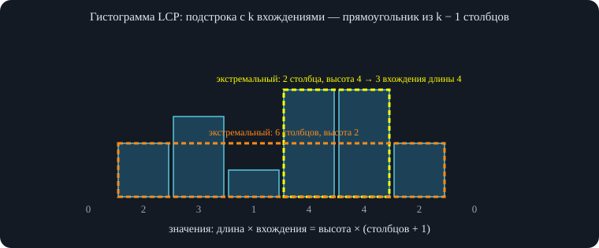
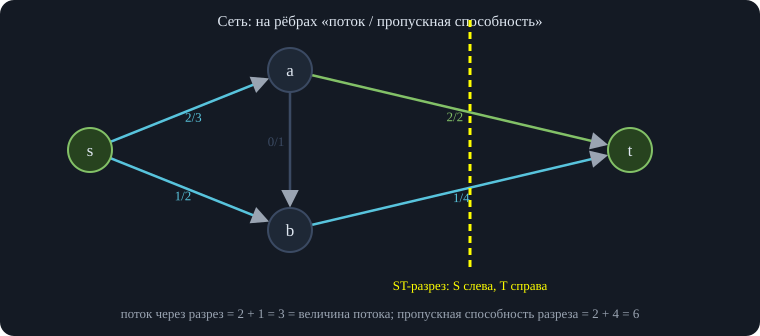
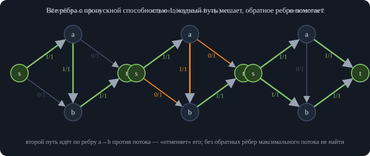
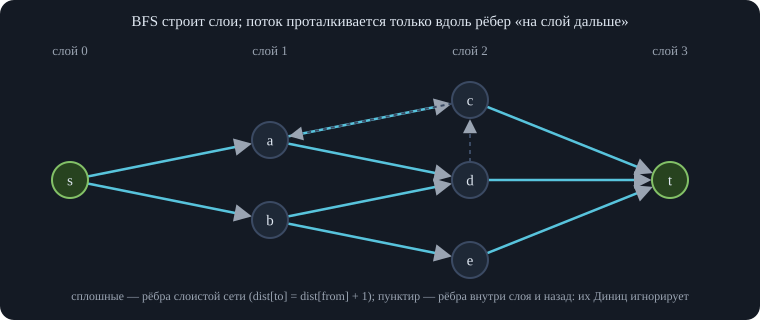
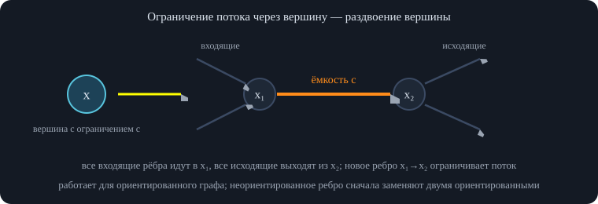
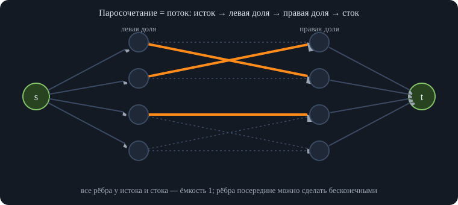
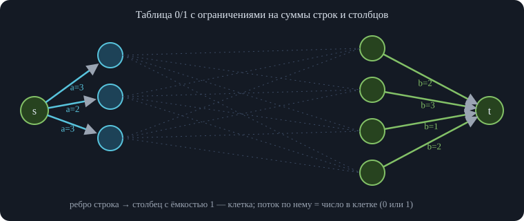
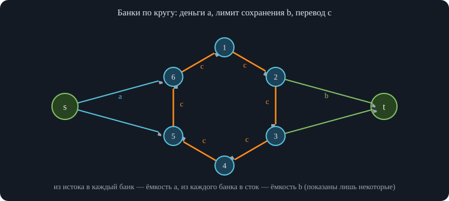
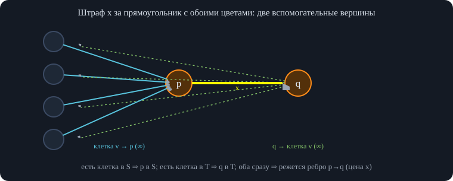

# Занятие 3. Параллель X — Введение в потоки

*Разбор задач на суффиксный массив и лекция про потоки: максимальный поток и минимальный разрез, алгоритмы Форда—Фалкерсона, Эдмонса—Карпа и Диница, паросочетания, гаджеты для разрезов.*

## 1. Разбор контеста: циклический сдвиг и суффиксный массив

Первые полчаса записи — разбор двух тем контеста: конструктивной задачи на циклический сдвиг и трёх задач на суффиксный массив, которые решаются одной техникой. Начало разбора задачи B в записи отсутствует (лектор продолжает её обсуждение).

### 1.1. Задача B. Строка с наибольшим минимальным циклическим сдвигом

**Условие.** Даны количества букв: $a$ букв «A», $b$ букв «B» и $c$ букв «C». Нужно составить строку из всех этих букв так, чтобы её **минимальный** циклический сдвиг был **максимальным** из возможных. Нужно построить такую строку, а не просто найти значение.

**Идея построения.** Считаем, что букв каждого вида ненулевое количество (иначе строка устроена очевидно; если какой-то буквы нет, можно считать её отсутствующей — циклический сдвиг сделает нужную букву последней). После каждой буквы «A» образуется «корзина» (место, куда можно класть остальные буквы). Если сложить все остальные буквы в одну корзину, получится много букв «A» подряд — минимальный сдвиг будет плохим; поэтому буквы нужно **равномерно раскидать по корзинам**.

Сначала раскидывают самую редкую по роли букву «C», затем в оставшиеся места — «B». В примере с лекции три корзины получаются вида «ACC», остальные «ACB», «ACBB»: каждая корзина — теперь новая «составная буква» (примитив), и задача сводится к такой же задаче меньшего размера на трёх видах примитивов. Это сведение даёт три вида примитивов: «C с крышкой» (где максимально много C), «B с крышкой» и «A с крышкой»; они строго сравнимы друг с другом, и снова нужно как можно больше крупных примитивов.

<div class="warn">

<span class="lbl">Что не доказано</span>\
Лектор прямо говорит, что строгого доказательства оптимальности этой жадности он не приводит («формально это не доказательство, но можно поверить» и «формально доказывать я это, кстати, даже не умею»). Это конструктивная идея с эвристическим обоснованием: жадность по-другому не сделать, потому что если насыпать много букв в одну корзину, то будет один большой примитив, а такие примитивы уходят в конец и не улучшают начало строки. Точные детали сведения (в каком порядке и как делить остаток) в записи не раскрыты.

</div>

### 1.2. Три задачи на суффиксный массив

Три оставшиеся задачи — на суффиксный массив и сканирующую прямую (`scanline`); большинство остальных задач контеста были на лекции или почти на лекции (например, наибольшая общая подстрока нескольких строк — склеить строки через разделители и решить на одном суффиксном массиве). Все три задачи ищут **подстроку, максимизирующую некоторую функцию**:

- **G («рефрен»)** — максимум произведения «длина подстроки × число её вхождений»;
- **J** — максимум «длина подстроки плюс (значение префикс-функции этой подстроки)²»;
- **I** — максимум «длина подстроки, делённая на её период» (период неполный: у строки `ababa` корректный период 2).

**Гистограмма LCP.** У строки есть суффиксный массив и массив LCP (наибольших общих префиксов соседних суффиксов); нарисуем LCP как гистограмму. Подстрока $W$ входит в строку тогда и только тогда, когда это общий префикс подряд идущих суффиксов в суффиксном массиве; значит, её вхождения образуют отрезок суффиксного массива, на котором все LCP между соседями не меньше $|W|$. Число вхождений на единицу больше, чем число столбцов LCP в отрезке: шесть столбцов — семь суффиксов, семь вхождений. То есть вхождения неповторяющейся подстроки — это **прямоугольник** в гистограмме LCP.

\
*Ответ в задачах «максимизировать функцию подстроки» достигается на экстремальном прямоугольнике — таком, который нельзя ни поднять вверх, ни расширить вбок.*

**Экстремальные прямоугольники.** Идём сканирующей прямой по значению LCP сверху вниз. В каждый момент рассмотрены столбцы с LCP не меньше текущего $x$, и они сгруппированы по соседству (удобно — системой непересекающихся множеств, DSU). Каждая такая группа — прямоугольник, который нельзя поднять вверх (LCP не позволяет) и нельзя расширить вбок (там LCP уже меньше). Такие прямоугольники называются **экстремальными**. Когда новый столбец примыкает к существующим группам, они сливаются в новый экстремальный прямоугольник.

**Утверждение: ответ достигается на экстремальном прямоугольнике.** Возьмём подстроку-ответ. Её вхождения образуют прямоугольник. Если он не экстремален, его можно *поднять* (взять строку длиннее с тем же числом вхождений) или *расширить* вбок (взять строку с большим числом вхождений, возможно, чуть короче): функция от этого не ухудшается. Поэтому достаточно перебрать все экстремальные прямоугольники, а их немного — столько, сколько слияний.

**Задача G.** Для экстремального прямоугольника значение равно (число столбцов + 1) × высота. Нужно найти максимум по всем таким прямоугольникам (плюс случай, когда подстрока встречается один раз: длина всей строки).

<div class="code">

<div class="code-head">

псевдокод

</div>

    функция рефрен(s):
        sa = суффиксный массив s;   h[1..n-1] = LCP соседних суффиксов
        ответ = длина(s)                          // подстрока без повторов: вся строка
        стек = пустой                              // (левая граница, высота), высоты возрастают
        для i от 1 до n (h[n] = 0 — сторож):
            нач = i
            пока стек не пуст и высота(вершина) >= h[i]:
                (лев, выс) = стек.снять()
                ответ = max(ответ, (i - лев + 1) * выс)    // выс × (число столбцов + 1)
                нач = лев
            стек.положить((нач, h[i]))
        вернуть ответ

</div>

<div class="own">

<span class="lbl">Важное дополнение</span>\
На записи экстремальные прямоугольники находят DSU-сканированием; ту же роль выполняет классический «стек для наибольшего прямоугольника в гистограмме», код выше. Формула «столбцов + 1 на высоту» проверена против перебора всех подстрок на случайных строках над двумя буквами и совпала.

</div>

**Задача J.** Пусть $W$ имеет границу (префикс, совпадающий с суффиксом) $u$; тогда $u$ — подстрока строки, и для данного $u$ лучшая $W$ тянется от *самого левого* до *самого правого* вхождения $u$. Зафиксируем значение префикс-функции — длину границы, то есть высоту прямоугольника: у экстремального прямоугольника минимальный и максимальный номера суффиксов даёт разность «max − min»; длина строки получается как «max − min плюс длина границы», а слагаемое с префикс-функцией зависит только от высоты. Остаётся перебрать экстремальные прямоугольники и в каждом взять минимум и максимум номеров начал суффиксов по отрезку — это легко поддерживать в DSU. Точное выражение функции в записи проговорено нечётко, поэтому здесь описана только схема решения.

**Задача I.** Строка $w$ с периодом $|u|$ начинается в позиции $i$ и состоит из $u$, повторённого с неполным хвостом; её длина равна $|u|+\mathrm{LCP}(\text{суффикс}_i,\text{суффикс}_{i+|u|})$. Обозначим $g=i+|u|$. Тогда отношение «длина на период» равно $1+\mathrm{LCP}/(g-i)$. Значит, нужно максимизировать $\mathrm{LCP}/(g-i)$ по парам позиций. В экстремальном прямоугольнике LCP равна высоте, поэтому нужно взять как можно *меньшее* расстояние $g-i$ между двумя номерами из отрезка — то есть найти в множестве номеров два ближайших числа.

**Как искать два ближайших числа при слияниях.** Сканлайн сливает отрезки; при слиянии нужно найти ближайшую пару, где одно число из одного множества, другое из другого. Лектор сомневается, что общий запрос «два ближайших числа на произвольном отрезке массива» решается быстрее, чем за корень или $\log^2$ (с обновлениями «в онлайне» — тем более), но здесь запросы особые: отрезки только сливаются.

<div class="own">

<span class="lbl">Важное дополнение</span>\
Для слияний хватает приёма «меньшее в большее» (small-to-large): храним номера каждой группы в упорядоченном множестве; при слиянии берём элементы *меньшего* множества и для каждого находим соседей в большем (предыдущий и следующий), обновляя минимальную разность; затем вставляем их в большее. Каждый элемент переезжает не больше $\log n$ раз, всего $O(n\log^2 n)$.

</div>

## 2. Потоки и разрезы

Лекцию читает приглашённый лектор; тема — максимальный поток в сети, минимальный разрез и то, как через них решаются разнообразные задачи.

### 2.1. Что такое поток

Представим сеть труб: в вершине $s$ (**источник**) находится завод, в вершине $t$ (**сток**) — пункт, куда всё сливается. Вершины — промежуточные узлы, рёбра — трубы; жидкость течёт непрерывно, и по каждой трубе в секунду проходит какой-то объём. **Поток** — это функция $f$ на рёбрах: для каждого ребра сколько жидкости по нему течёт. Пути необязательно непересекающиеся: любая функция, удовлетворяющая условиям ниже.

\
*Поток через любой ST-разрез равен величине потока, а величина потока не превосходит пропускной способности каждого разреза.*

**Условия.**

- **Антисимметричность.** Направление важно, поэтому каждое ребро считаем «двойным»: ребро $(u,v)$ связано с обратным $(v,u)$, и $f(u,v)=-f(v,u)$. Благодаря этому не нужно отдельно разбирать, в какую сторону течёт поток, и можно работать и с ориентированными, и с неориентированными графами.
- **Ограничение пропускной способностью** (capacity): $f(e)\le c(e)$ для каждого ребра. Без него задача была бы скучной — ответ всегда был бы бесконечным.
- **Сохранение потока.** Для вершины $v$ определим $x_v=\sum_u f(v,u)$ — сколько вытекает минус сколько втекает. Потребуем $x_s\ge0$ (источник порождает поток), $x_t\le0$ (сток поглощает) и $x_v=0$ для всех остальных вершин: сколько втекло, столько вытекло.

**Нижние ограничения не нужны.** Ограничение вида $f(e)\ge l(e)$ ничего нового не даёт: для обратного ребра оно превращается в ограничение сверху $f(\hat e)\le-l(e)$, то есть в обычную пропускную способность (при смене знака неравенство меняет направление). Поэтому снизу поток ограничивать бессмысленно.

**Задача о максимальном потоке.** Дана сеть (граф и пропускные способности $c$). Нужно найти поток с максимальной **величиной** $|f|=x_s$ — сколько потока перетекло из $s$ в $t$.

### 2.2. Поток через разрез

Первое свойство: $x_s=-x_t$. Просуммируем $x_v$ по всем вершинам: это сумма потока по всем рёбрам в обе стороны, и она равна нулю, так как $f(u,v)$ и $f(v,u)$ сокращаются; остальные $x_v$ нулевые, поэтому $x_s+x_t=0$.

Усилим это. **ST-разрез** — разбиение вершин на два непересекающихся множества $S$ и $T$ (две «краски»), в котором $s\in S$ и $t\in T$. **Утверждение:** величина потока равна суммарному потоку через разрез:

<div class="formula">

$$|f|=\sum_{u\in S,\ v\in T}f(u,v).$$

</div>

Интуитивно: мы разрезали сеть на две части и смотрим, сколько потока течёт из одной в другую; если часть потока течёт обратно, он просто вычитается. *Доказательство.* Добавим к сумме по $u\in S,\ v\in T$ нулевую сумму по парам $u\in S,\ v\in S$ (внутри $S$ потоки по рёбрам в обе стороны сокращаются). Тогда $u$ пробегает $S$, а $v$ — все вершины, и получается $\sum_{u\in S}x_u$ — сумма дисбалансов вершин $S$. Но из них ненулевой только $x_s$. Значит, величину потока можно вычислить по *любому* разрезу.

### 2.3. Теорема Форда—Фалкерсона: max-flow = min-cut

Определим **пропускную способность разреза** $c(S,T)=\sum_{u\in S,\ v\in T}c(u,v)$. Так как $f\le c$ на каждом ребре, поток через любой разрез не больше его пропускной способности, а величину потока можно вычислить по любому разрезу — поэтому $|f|\le c(S,T)$ для всех разрезов, значит, *максимальный поток не превосходит минимального разреза*. Вопрос — когда достигается равенство. **Теорема Форда—Фалкерсона** отвечает: всегда.

*Замечание.* Потоки бывают целочисленными (когда требуется $f(e)\in\mathbb Z$) и произвольными вещественными; существование максимального потока лектор не доказывает («просто будем в это верить»); а для целочисленной сети алгоритм Форда—Фалкерсона (ниже) даёт и целочисленный максимальный поток — поэтому в задачах не нужно беспокоиться о дробях.

*Доказательство.* Пусть $f$ — произвольный максимальный поток (их может быть несколько). Рассмотрим «прибавку» $\Delta f$ такую, что $f+\Delta f$ — тоже поток. Ограничения на прибавку: $\Delta f(e)\le c(e)-f(e)$ — насколько ещё можно увеличить поток вдоль ребра. Это пропускные способности **остаточной сети** $N_f$: в ней ребро имеет способность $c(e)-f(e)$ (для обратного ребра это $c(\hat e)-f(\hat e)$, то есть остаток плюс уже пущенное в противоположную сторону). Прибавка $\Delta f$ — это просто поток в остаточной сети.

Ненулевая прибавка существует тогда и только тогда, когда в остаточной сети $t$ достижима из $s$ по рёбрам с положительной остаточной способностью: если путь есть, пускаем по нему небольшой поток. Но $f$ максимален, значит, **пути нет**. Тогда пусть $S$ — множество вершин, достижимых из $s$ в остаточной сети, а $T$ — остальные. Ни одно ребро из $S$ в $T$ не имеет положительной остаточной способности, то есть $f(e)=c(e)$ для всех рёбер разреза. Значит, поток по этому разрезу равен его пропускной способности: $|f|=c(S,T)$. С учётом $|f|\le c(S,T)$ для любого разреза получаем, что $c(S,T)$ — минимальный разрез и максимальный поток равен ему.

Из доказательства сразу получается и **алгоритм**: итеративно увеличивать поток по путям в остаточной сети, пока путь есть.

### 2.4. Алгоритм Форда—Фалкерсона и его реализация

Реализацию стоит запомнить, потому что многие пишут её неправильно, и она работает медленно. **Хранение рёбер.** Заводится глобальный массив рёбер `edges`; в каждом ребре — `to` (куда ведёт), `flow` (сколько пропущено), `cap` (сколько можно) и `next` (служебное поле: следующее ребро из той же вершины). Рёбра идут **парами**: обратное ребро к $e$ — это $e\oplus1$ (отличается только младшим битом). Список рёбер каждой вершины хранится как односвязный список: `head[v]` — номер первого ребра, `next` ведёт по остальным.

При добавлении ребра $(u,v)$ с пропускной способностью `cap` создаётся прямое ребро (способность `cap`) и обратное (обычно 0 — это случай, когда обратно можно только «отменять» поток; при желании там тоже можно задать способность, получится ребро с разными способностями в разные стороны — для потоков это нормально).

**Поиск пути.** Путь ищет `DFS` по остаточной сети: если пришли в $t$ — путь найден; иначе перебираем рёбра из вершины и идём по тем, у которых `cap − flow` положительно, в ещё не посещённые вершины. Лучше не пускать по пути единицу потока, а **насыщать** путь: протолкнуть столько, сколько позволяет ребро с минимальным остатком (`MaxPush`) — меньше проталкивать нет смысла. На обратном ходе рекурсии изменяем поток по ребру *и* по обратному ребру, чтобы сохранялась антисимметричность $f(e)=-f(\hat e)$.

**Главный цикл.** Заводим переменную потока, перед каждым DFS сбрасываем отметки посещённости, проталкиваем поток; если протолкнуть не вышло — найден минимальный разрез, выходим из цикла.

<div class="code">

<div class="code-head">

C++

</div>

``` cpp
struct Network {
    struct Edge { int to; long long flow, cap; int next; };
    int n; vector<Edge> edges; vector<int> head;
    Network(int n) : n(n), head(n, -1) {}
    void addEdge(int u, int v, long long cap, long long rcap = 0) {   // рёбра парами: e и e ^ 1
        edges.push_back({v, 0, cap, head[u]}); head[u] = edges.size() - 1;
        edges.push_back({u, 0, rcap, head[v]}); head[v] = edges.size() - 1;
    }
    vector<char> vis;
    // DFS: ищем путь по рёбрам с остатком не меньше lim; возвращаем, сколько протолкнули (MaxPush)
    long long push(int v, int t, long long f, long long lim) {
        if (v == t) return f;
        vis[v] = 1;
        for (int id = head[v]; id != -1; id = edges[id].next) {
            Edge& e = edges[id];
            long long can = e.cap - e.flow;
            if (can >= lim && !vis[e.to]) {
                long long d = push(e.to, t, min(f, can), lim);
                if (d > 0) { e.flow += d; edges[id ^ 1].flow -= d; return d; }   // обратное ребро меняем синхронно
            }
        }
        return 0;
    }
    long long maxFlowFF(int s, int t, bool scaling) {                // scaling — масштабирование (ниже)
        long long total = 0;
        for (int k = scaling ? 30 : 0; k >= 0; k--) {
            while (true) {
                vis.assign(n, 0);
                long long d = push(s, t, LLONG_MAX, 1LL << k);
                if (d == 0) break;
                total += d;
            }
        }
        return total;
    }
};
```

</div>

<div class="algo" data-frames="ff">

</div>

**Почему нужны обратные рёбра.** Кажется логичным упростить: идти по DFS только по прямым рёбрам — ведь поток нужен слева направо. Но это неверно. Пример: сеть из пяти рёбер с пропускными способностями 1, в которой первый найденный путь идёт $s\to a\to b\to t$. Если после этого обратные рёбра не рассматривать, то из $s$ можно протолкнуть поток в $b$, но дальше он не пойдёт, и мы застрянем на потоке 1, хотя максимальный равен 2.

\
*Если искать путь только по прямым рёбрам, застрянем на потоке 1. Обратное ребро с остаточной способностью 1 позволяет отменить поток по $a\to b$.*

С обратными рёбрами на втором шаге находится путь $s\to b\to(\text{обратное } b\to a)\to a\to t$: по ребру $a\to b$ поток сначала пустили в одну сторону, потом в обратную, и он погасился — локально получилось, как будто ребро никогда не использовалось. Заранее предугадать, какие рёбра будут полезны, нельзя, поэтому DFS просто не различает прямые и обратные рёбра, а при изменении потока нужно менять его в обе стороны, чтобы всегда было $f(e)=-f(\hat e)$. Величина потока при этом на каждой итерации только растёт.

Ещё одно условие: `cap ≥ 0` на всех рёбрах. Мы начинаем с нулевого потока, поэтому нужно, чтобы он был допустимым; при отрицательной способности нулевой поток не подходит.

Всё это вместе — **теорема** Форда—Фалкерсона, **метод** (идея увеличивать поток по путям) и **алгоритм** Форда—Фалкерсона, названные по именам двух авторов.

### 2.5. Как найти сам минимальный разрез

Раз максимальный поток равен минимальному разрезу, удобно получать и сам разрез. Он находится бесплатно: когда последний запуск DFS не нашёл пути, **вершины, до которых он дошёл** (достижимые из $s$ в остаточной сети), образуют $S$-часть разреза, остальные — $T$-часть. Из $S$ в $T$ нет рёбер с положительным остатком, то есть в исходной сети все такие рёбра насыщены, а значит, разрез минимален.

<div class="code">

<div class="code-head">

C++

</div>

``` cpp
    // продолжение struct Network: вершины, достижимые из s по рёбрам остаточной сети, — это S-часть минимального разреза
    vector<char> reachable(int s) {
        vector<char> seen(n, 0); vector<int> st{s}; seen[s] = 1;
        while (!st.empty()) {
            int v = st.back(); st.pop_back();
            for (int id = head[v]; id != -1; id = edges[id].next)
                if (edges[id].cap - edges[id].flow > 0 && !seen[edges[id].to]) { seen[edges[id].to] = 1; st.push_back(edges[id].to); }
        }
        return seen;
    }
// ребро id входит в разрез, если seen[edges[id ^ 1].to] (его начало) и !seen[edges[id].to] (его конец)
```

</div>

Ребро $u\to v$ принадлежит разрезу, если `seen[u]` и `!seen[v]`. Обратное ребро проверяют, поменяв $u$ и $v$ местами; подходит только один из двух вариантов.

### 2.6. Декомпозиция потока

Поток — это функция на рёбрах, но хочется представления поинтуитивнее. **Теорема о декомпозиции:** любой поток $f$ можно представить как сумму потоков вдоль *путей* из $s$ в $t$ и вдоль *циклов*; у каждого пути и цикла есть величина (сколько единиц потока по нему течёт).

*Доказательство* устроено так же, как у Форда—Фалкерсона, только проще. Из потока всегда можно найти путь из $s$ в $t$, идущий вдоль потока и по ненулевым рёбрам: сколько в вершину втекает, столько и вытекает, поэтому, придя по потоку в вершину, всегда есть куда идти. Найдя путь, вычитаем из потока максимально возможную величину вдоль него и повторяем. В конце поток может не обнулиться — останутся циклы (вода «крутится по кругу»). Их тоже можно выделить: любое ненулевое ребро лежит на цикле — это аналог взвешенной эйлеровости (сколько входит, столько выходит). Контрпример к тому, что остаются только пути: два пути и замкнутая циркуляция «туда-сюда».

Заметим: если поток по ребру шёл в одну сторону, то в декомпозиции нет путей, идущих по этому ребру в обратную сторону. А направления рёбер, по которым «нет потока», в декомпозиции не фиксированы.

**Сложность.** Если вычитать из потока лишь единицу вдоль пути, то порядка $|f|\cdot E$. Но если выделять *максимально возможную* величину вдоль пути или цикла, то каждый раз хотя бы одно ребро «обнуляется» и исчезает, а это бывает не более $E$ раз. Декомпозиция работает за $O(E^2)$ (часто быстрее).

<div class="own">

<span class="lbl">Важное дополнение</span>\
Если поток проходит через $s$ или $t$ «обратно» (есть ненулевые рёбра из $t$ или в $s$), идти по потоку от $s$ до первого повтора вершины нужно так, чтобы не останавливаться в $t$, пока из неё ещё есть поток: тогда часть потока окажется в циклах, проходящих через $s$ и $t$. Декомпозиция проверена на случайных потоках: суммы путей и циклов восстанавливают поток, а число шагов не превышает числа рёбер.

</div>

### 2.7. Ускорение Форда—Фалкерсона

Форд—Фалкерсон работает за $O(|f|\cdot E)$: каждый поиск пути — один DFS, а поток растёт хотя бы на единицу. Если величина потока порядка миллиарда, это плохо, и хочется оценить время только через размер графа, а не через числа на рёбрах.

**Масштабирование потока.** Каждый раз проталкиваем не единицу, а поток размера хотя бы $2^k$, где $k$ пробегает от 30 до 0: сначала ищем пути по рёбрам с большим остатком, потом — вдвое меньшим, и так далее. В DFS добавляется один параметр — минимальный допустимый остаток `lim = 2^k`, и цикл по $k$ (см. `maxFlowFF(s, t, true)` выше). Алгоритм остаётся корректным: Форд—Фалкерсон не требует, чтобы пути были обязательно «любыми».

**Оценка $O(E^2\log C)$**, где $C$ — максимальная пропускная способность. На предыдущей фазе мы гарантировали, что нет пути по рёбрам с остатком хотя бы $2^{k+1}$. То есть множество вершин, достижимых из $s$ по таким рёбрам, образует разрез, у которого все рёбра имеют остаток меньше $2^{k+1}$, а их не больше $E$. Значит, остаток потока, который ещё можно пустить, меньше $2^{k+1}\cdot E$; на текущей фазе каждый найденный путь увеличивает поток хотя бы на $2^k$, поэтому DFS запустится не более $2E$ раз. Итого — $O(E)$ запусков DFS на фазу и $O(E^2)$ на фазу по времени, всего $E^2\log C$.

**Эдмонс—Карп** — замена DFS на BFS: ищем кратчайший (по числу рёбер) путь. Расстояния от $s$ в остаточной сети не уменьшаются: рассмотрим остаточную сеть после BFS и слои по расстоянию. Ребёр, перепрыгивающих через слой, нет; после проталкивания по кратчайшему пути новые рёбра появляются только «назад» (обратные к рёбрам пути), поэтому более короткого пути не возникает. При фиксированном расстоянии каждый раз насыщается хотя бы одно ребро слоистой сети, а их не больше $E$; различных расстояний не больше $V$. Итого $O(V\cdot E^2)$.

### 2.8. Алгоритм Диница

Диниц (советско-израильский учёный) предложил идею «максимально простую»: если уже запустили BFS и построили слои, то увеличивать поток не один раз, а много — по *всем* кратчайшим путям слоистой сети. Это **блокирующий поток**.

- **BFS** по остаточной сети (рёбра с `flow < cap`) считает расстояния. Если до $t$ не добрались — поток максимален.
- **DFS** проталкивает поток только по рёбрам слоистой сети: ребро годится, если оно не насыщено и ведёт на слой дальше (`dist[to] = dist[v] + 1`). Остальные рёбра (насыщенные, внутри слоя, назад) игнорируются.
- **Указатель `ptr[v]`** — ключевая оптимизация: у каждой вершины запоминаем, с какого ребра продолжать. Если из вершины по ребру не удалось протолкнуть поток, в слоистой сети это ребро бесполезно навсегда (поток течёт только вперёд и компенсации не будет), и смотреть на него снова нет смысла.

\
*Блокирующий поток ищется DFS по слоистой сети; указатель ptr у вершины запоминает ребро, с которого продолжать, чтобы не обходить безнадёжные рёбра заново.*

<div class="code">

<div class="code-head">

C++

</div>

``` cpp
    // продолжение struct Network: алгоритм Диница
    vector<int> dist, ptr;
    bool bfs(int s, int t) {
        dist.assign(n, -1); dist[s] = 0; queue<int> q; q.push(s);
        while (!q.empty()) {
            int v = q.front(); q.pop();
            for (int id = head[v]; id != -1; id = edges[id].next)
                if (edges[id].cap - edges[id].flow > 0 && dist[edges[id].to] == -1) {
                    dist[edges[id].to] = dist[v] + 1; q.push(edges[id].to);
                }
        }
        return dist[t] != -1;
    }
    long long dfsDinic(int v, int t, long long f) {
        if (v == t || f == 0) return f;
        for (int& id = ptr[v]; id != -1; id = edges[id].next) {      // ptr[v] запоминает, с какого ребра продолжать
            Edge& e = edges[id];
            if (dist[e.to] == dist[v] + 1 && e.cap - e.flow > 0) {
                long long d = dfsDinic(e.to, t, min(f, e.cap - e.flow));
                if (d > 0) { e.flow += d; edges[id ^ 1].flow -= d; return d; }
            }
        }
        return 0;
    }
    long long maxFlowDinic(int s, int t) {
        long long total = 0;
        while (bfs(s, t)) {
            ptr = head;                                               // сбрасываем указатели на начало списков
            while (long long d = dfsDinic(s, t, LLONG_MAX)) total += d;
        }
        return total;
    }
```

</div>

**Оценка $O(V^2E)$.** Внутри одной итерации BFS каждое ребро либо рассматривается один раз и не годится, либо по нему удалось протолкнуть поток — в таком случае DFS потратил порядка $V$ шагов, и одно ребро слоистой сети насыщено. Поэтому блокирующий поток находится за $O(VE)$, а число итераций BFS (расстояние до $t$ строго растёт) — не более $V$.

К Диницу тоже можно добавить масштабирование (запрет на малые остатки — «lower bound» по остатку: условие `cap − flow ≥ lowerBound`, в конце `lowerBound = 1`), и оно ускоряет работу.

**Частные случаи.** Если все пропускные способности равны 1, одна итерация насыщает сразу много рёбер и блокирующий поток находится за $O(E)$; число итераций BFS не больше $\sqrt E$, поэтому весь алгоритм — $O(E\sqrt E)$ (на записи это сказано как «Диниц работает за квадрат» — оценка $E\sqrt E\le E^2$ верна, но можно сказать точнее). Если, кроме того, у каждой вершины либо входит не более одного ребра, либо выходит не более одного (так устроена сеть для паросочетания), число итераций порядка $\sqrt V$. На «локально ограниченных» сетях Диниц работает гораздо быстрее своей верхней оценки $V^2E$. Лектор называет оценки с $\sqrt{\ }$ «оценками Карзанова» и подробно их не разбирает.

**Практический совет.** Если по смыслу задачи величина потока небольшая (например, не больше 5), пишите не Диница, а простой Форд—Фалкерсон: он работает быстрее.

<div class="own">

<span class="lbl">Важное дополнение</span>\
Все четыре алгоритма — Форд—Фалкерсон, он же с масштабированием, Эдмонс—Карп и Диниц — проверены на тысячах случайных сетей: они дают одно и то же значение, равное минимальному разрезу, найденному полным перебором; разрез из достижимых вершин остаточной сети действительно минимален; поток антисимметричен и сохраняется в промежуточных вершинах.

</div>

### 2.9. Связность: два моста и точки сочленения

Связь разрезов и потоков можно продолжать на более глубокие факты. **Два моста** — пары рёбер, при удалении которых граф теряет связность (обычные мосты — единичные такие рёбра). Число мостов линейное, а пар-«два мостов» может быть квадратичным: в цикле из $n$ рёбер любая пара рёбер — два моста.

Если в графе нет мостов, то между любой парой вершин есть два рёберно непересекающихся пути; чтобы найти такую пару путей, надо поставить пропускные способности 1 в обе стороны и найти поток величины 2. Обобщение: если в графе нет $k$-мостов и меньших (рёберная связность не меньше $k$), то между любой парой вершин есть $k$ рёберно непересекающихся путей.

### 2.10. Ограничения на вершины

Поток можно ограничивать не только на рёбрах, но и на вершинах («через вершину проходит не больше $c$»). Для этого вершину **раздваивают**: $x\to x_1,x_2$, все входящие рёбра идут в $x_1$, все исходящие — из $x_2$, а между ними проводится новое ребро $x_1\to x_2$ с пропускной способностью $c$.

\
*Если рёбра сделать бесконечными, а вершины — единичными, потоки превращаются в непересекающиеся по вершинам пути.*

Приём работает только для ориентированного графа; если по ребру поток мог идти в обе стороны, ребро сначала заменяют двумя ориентированными, а потом раздваивают вершины. Если на рёбрах поставить бесконечные способности, а на вершинах — 1 (кроме $s$ и $t$), то поток раскладывается в пути, **непересекающиеся по вершинам**, а разрез проходит *по вершинам* исходного графа (раздвоенная пара оказывается разрезана). Отсюда факт: если в графе нет точек сочленения, то между любыми двумя вершинами есть два непересекающихся по вершинам простых пути, и любая пара вершин лежит на общем простом цикле.

### 2.11. Паросочетание, покрытие и независимое множество

**Паросочетание в двудольном графе.** Нужно выбрать наибольшее подмножество рёбер, никакие два из которых не имеют общей вершины. Сводим к потоку: добавляем источник и сток; из источника — рёбра ёмкости 1 к вершинам левой доли, из вершин правой доли — рёбра ёмкости 1 в сток; рёбра двудольного графа направляем слева направо (на них можно поставить ёмкость 1 или бесконечность — безразлично). Ребро графа входит в паросочетание, если по нему течёт единица потока. Алгоритм Куна — это в точности Форд—Фалкерсон на такой сети (рёбра обрабатываются неявно).

\
*Оранжевые рёбра — паросочетание: по ним течёт единица потока. Алгоритм Куна — это Форд—Фалкерсон на такой сети.*

**Минимальный разрез на этой сети.** Пусть после максимального потока $Z$ — множество вершин, достижимых из $s$ в остаточной сети. Разрез проходит только по рёбрам из истока в левую долю и из правой доли в сток (рёбра между долями бесконечные). Рёбра внутри между $Z\cap L$ и $R\setminus Z$ не возникают, потому что они бесконечные. Рёбра потока по обратным направлениям из $T$-части в $S$-часть невозможны: иначе поток можно было бы отменить в остаточной сети, и вершина оказалась бы достижимой. Остаются два вида насыщенных рёбер: из истока в вершины левой доли вне $Z$ и из вершин правой доли внутри $Z$ в сток.

Поэтому множество $C=(L\setminus Z)\cup(R\cap Z)$ — **вершинное покрытие** (каждое ребро графа покрыто) размера, равного величине потока, то есть размеру максимального паросочетания; а его дополнение $(L\cap Z)\cup(R\setminus Z)$ — **независимое множество**, и оно максимально по размеру. Это **теорема Кёнига**: в двудольном графе размер минимального вершинного покрытия равен размеру максимального паросочетания, а наибольшее независимое множество равно $|V|-{}$размер паросочетания.

<div class="code">

<div class="code-head">

C++

</div>

``` cpp
// L вершин слева (0..L-1), R справа (L..L+R-1); s = L + R, t = L + R + 1
Network g(L + R + 2);
for (int i = 0; i < L; i++) g.addEdge(s, i, 1);
for (int j = 0; j < R; j++) g.addEdge(L + j, t, 1);
for (auto [i, j] : edges) g.addEdge(i, L + j, INF);        // INF — «бесконечность», например 1e18
long long matching = g.maxFlowDinic(s, t);
auto Z = g.reachable(s);                                    // достижимые из s в остаточной сети
vector<int> cover, independent;
for (int i = 0; i < L; i++) (Z[i] ? independent : cover).push_back(i);
for (int j = 0; j < R; j++) (Z[L + j] ? cover : independent).push_back(L + j);
```

</div>

Код выше вместе с утверждениями «покрытие покрывает все рёбра, его размер равен паросочетанию, размер независимого множества равен $|V|$ минус паросочетание» проверен на случайных двудольных графах против перебора независимых множеств. Лектор отмечает, что к этим рассуждениям потоки можно было бы не привлекать — достаточно алгоритма Куна, — но так их проще осознать; ещё один инструмент для таких рассуждений — лемма Холла.

### 2.12. Задача: таблица 0/1 с ограничениями на суммы

**Условие.** Есть таблица $n\times m$, заполненная нулями и единицами. Сумма в $i$-й строке не больше $a_i$, сумма в $j$-м столбце не больше $b_j$. Нужно максимизировать общее число единиц.

\
*Максимальный поток равен максимальному числу единиц. Но сеть огромна, поэтому ответ ищут как минимальный разрез.*

**Сеть.** Левая доля — строки (ребро из истока с ёмкостью $a_i$), правая — столбцы (ребро в сток с ёмкостью $b_j$), клетка $(i,j)$ — ребро ёмкости 1 из строки $i$ в столбец $j$. Между потоками и таблицами есть **биекция**: поток по ребру $(i,j)$ — это число в клетке. Ограничения на строки и столбцы выполнены автоматически, потому что в строку $i$ втекает не более $a_i$ потока. Максимальный поток — максимальное число единиц; при целочисленных ёмкостях максимальный поток целочисленный (дробей не бывает).

**Проблема.** $m$ до $10^5$, сеть огромна, искать поток бессмысленно. Но по теореме Форда—Фалкерсона максимальный поток равен минимальному разрезу, а разрезы в такой сети устроены очень просто. Пусть разрез: строки делятся на $L_S$ (в $S$-части) и $L_T$ (в $T$-части), столбцы — на $R_S$ и $R_T$. Его пропускная способность складывается из трёх видов рёбер, ведущих из $S$ в $T$:

- из истока в строки из $L_T$: $\sum_{i\in L_T}a_i$;
- из столбцов $R_S$ в сток: $\sum_{j\in R_S}b_j$;
- из строк $L_S$ в столбцы $R_T$ по всем клеткам: $|L_S|\cdot|R_T|$.

Минимизируем. Пусть набор строк $L$ уже разделён, зафиксируем $k=|L_S|$. Тогда каждый столбец $j$ выбирает: в $R_S$ с платой $b_j$ или в $R_T$ с платой $k$ — берёт меньшее, $\min(b_j,k)$. А строки: при фиксированном числе $|L_T|=n-k$ в $T$-часть выгодно класть строки с *наименьшими* $a_i$. Получаем формулу:

<div class="formula">

$$\max\#1=\min_{0\le k\le n}\Bigl(\sum_{i=1}^{n-k}a_{(i)}+\sum_{j=1}^{m}\min(b_j,k)\Bigr),$$

</div>

где $a_{(1)}\le a_{(2)}\le\dots$ — отсортированные $a$. Сортировка плюс два указателя: $O(n\log n+m\log m)$ — гораздо быстрее потока.

<div class="code">

<div class="code-head">

C++

</div>

``` cpp
// a, b — ограничения строк и столбцов; ответ — максимальное число единиц
long long maxOnes(vector<long long> a, const vector<long long>& b) {
    int n = a.size(); sort(a.begin(), a.end());
    long long best = LLONG_MAX, prefix = 0;                  // prefix = сумма n - k наименьших a (меняется с k)
    vector<long long> sb = b; sort(sb.begin(), sb.end());     // отсортированные b — для быстрого sum min(b, k)
    vector<long long> pb(sb.size() + 1, 0); for (size_t j = 0; j < sb.size(); j++) pb[j + 1] = pb[j] + sb[j];
    vector<long long> pa(n + 1, 0); for (int i = 0; i < n; i++) pa[i + 1] = pa[i] + a[i];
    for (int k = 0; k <= n; k++) {
        int cnt = lower_bound(sb.begin(), sb.end(), k) - sb.begin();    // столбцов с b < k
        long long cost = pa[n - k] + pb[cnt] + (long long)(sb.size() - cnt) * k;
        best = min(best, cost);
    }
    return best;
}
```

</div>

<div class="own">

<span class="lbl">Важное дополнение</span>\
Формула минимального разреза проверена перебором всех таблиц $n,m\le3$ с различными ограничениями — совпала. Если сеть простая, искать минимальный разрез часто гораздо выгоднее, чем проталкивать поток.

</div>

### 2.13. Задача: банки по кругу и запросы изменения

**Условие.** $n$ банковских счетов расположены по кругу, на $i$-м лежит $a_i$ денег. Между счетами можно переводить деньги: из $i$-го в $(i+1)$-й не больше $c_i$ за раз. В конце на $i$-м счёте сохраняется не более $b_i$ (остальное сгорает, как при банкротстве банка и ограничении выплат). Нужно сохранить наибольшую сумму.

\
*При точечных изменениях $a_i$ минимальный разрез считается динамикой по кругу, которую можно слить в дерево отрезков.*

**Сеть.** Источник; из него в каждый счёт ребро $a_i$; из каждого счёта в сток ребро $b_i$; рёбра перевода $i\to i+1$ с ёмкостью $c_i$. Максимальный поток — максимальная сохранённая сумма. Для одного запроса поток быстро находится, но если добавить запросы вида «заменить $a_i$ на $x$» (порядка $10^5$ запросов и вершин), потоки считать нельзя.

**Идея: минимальный разрез как динамика.** В разрезе каждая вершина попадает в $S$ или в $T$. Если вершина $i$ в $T$, платим $a_i$ (режется ребро из истока); если в $S$ — платим $b_i$ (режется ребро в сток); а ребро перевода $i\to i+1$ режется (цена $c_i$), если $i\in S$, а $i+1\in T$. Это динамика по префиксу: для префикса нужны лишь два значения — в какой части оказалась *первая* и в какой — *последняя* вершина префикса. Для круга в конце учитывается ребро из последней вершины в первую.

Эта динамика **сливается**: для двух отрезков, зная минимальные штрафы при каждой комбинации «первая / последняя вершина в S/T», можно объединить значения (прибавив штраф ребра на стыке). Получается матрица $2\times2$ в полукольце $(\min,+)$ в каждой вершине дерева отрезков, а точечное обновление $a_i$ — обычное обновление дерева отрезков. Так задача про поток внезапно становится задачей про дерево отрезков.

<div class="code">

<div class="code-head">

C++

</div>

``` cpp
struct RingBanks {
    int n; vector<long long> a, b, c;                       // c[i] — канал i -> (i+1) % n
    struct M { long long v[2][2]; };                         // v[x][y]: первая вершина отрезка в S(0)/T(1), последняя — y
    vector<M> t;
    long long vertexCost(int i, int side) const { return side == 0 ? b[i] : a[i]; }   // в S платим b, в T платим a
    M leaf(int i) const {
        M m; for (int x = 0; x < 2; x++) for (int y = 0; y < 2; y++) m.v[x][y] = (x == y) ? vertexCost(i, x) : (long long)1e18;
        return m;
    }
    M merge(const M& L, int lastIdx, const M& R) const {   // lastIdx — последний индекс левого отрезка
        M r; for (int x = 0; x < 2; x++) for (int y = 0; y < 2; y++) r.v[x][y] = (long long)1e18;
        for (int x = 0; x < 2; x++) for (int p = 0; p < 2; p++) for (int q = 0; q < 2; q++) for (int y = 0; y < 2; y++) {
            long long cross = (p == 0 && q == 1) ? c[lastIdx] : 0;     // канал режется, если левый конец в S, а правый в T
            r.v[x][y] = min(r.v[x][y], L.v[x][p] + R.v[q][y] + cross);
        }
        return r;
    }
    void build(int v, int l, int r) {
        if (r - l == 1) { t[v] = leaf(l); return; }
        int m = (l + r) / 2; build(2*v+1, l, m); build(2*v+2, m, r); t[v] = merge(t[2*v+1], m - 1, t[2*v+2]);
    }
    void upd(int v, int l, int r, int pos) {
        if (r - l == 1) { t[v] = leaf(l); return; }
        int m = (l + r) / 2; if (pos < m) upd(2*v+1, l, m, pos); else upd(2*v+2, m, r, pos);
        t[v] = merge(t[2*v+1], m - 1, t[2*v+2]);
    }
    RingBanks(vector<long long> a, vector<long long> b, vector<long long> c) : n(a.size()), a(a), b(b), c(c), t(4 * a.size()) { build(0, 0, n); }
    long long answer() const {                                // замыкаем круг ребром n-1 -> 0
        long long best = (long long)1e18;
        for (int x = 0; x < 2; x++) for (int y = 0; y < 2; y++)
            best = min(best, t[0].v[x][y] + ((y == 0 && x == 1) ? c[n - 1] : 0));
        return best;
    }
    void setA(int i, long long v) { a[i] = v; upd(0, 0, n, i); }
};
```

</div>

Код сверен с максимальным потоком в сети из этой постановки на случайных кольцах и после случайных изменений значений $a_i$ — результаты совпали.

**Два способа решать задачи про сети.** Когда строится сеть, задачу можно решать либо *на поток* (поток имеет смысл: в таблице единица потока — число в клетке, в банках — движение денег), либо *на минимальный разрез* (вершины красятся в два цвета $S$ и $T$ и накладываются штрафы). В первом случае обычно максимизируют величину, во втором — минимизируют. Бывает, что, решив задачу на поток, её сводят к разрезу, чтобы использовать структуру сети.

### 2.14. Минимальный разрез как раскраска в два цвета

**Условие.** Табличка $n\times m$ (порядка $100\times100$) должна быть раскрашена в два цвета A и B. Часть клеток уже раскрашена. Задано $k$ прямоугольников; за $i$-й прямоугольник начисляется штраф $x_i$, если в нём встретились *оба* цвета. Минимизировать суммарный штраф.

Потока здесь нет — и не может быть, потому что цель — минимизация. Главный принцип: **если в условии два цвета, сразу пробуйте $S$ и $T$**: каждая клетка — вершина, цвет — часть разреза, штрафы — рёбра.

Для прямоугольника из двух клеток нужно просто соединить их ребром веса $x$. Для большого прямоугольника нужен «гаджет». **Первая попытка лектора:** одна дополнительная вершина, соединённая со всеми клетками рёбрами веса $x$. Лектор сам заметил, что это неверно: такая вершина выбирает цвет большинства, и штраф выходит $x\cdot\min(\#A,\#B)$, а не $x$. Он исправил условие под такой штраф (задача с произведением $x\cdot\#A\cdot\#B$ решалась бы рёбрами между всеми парами), но исходное условие «штраф, если есть оба цвета» таким гаджетом не решается.

<div class="fix">

<span class="lbl">Исправление</span>\
Для штрафа «$x$, если в прямоугольнике есть оба цвета» подходит гаджет с **двумя** вспомогательными вершинами $p$ и $q$: для каждой клетки $v$ прямоугольника добавляем рёбра $v\to p$ и $q\to v$ с бесконечной ёмкостью и ребро $p\to q$ ёмкости $x$. Если какая-то клетка в $S$, то $p$ обязана быть в $S$ (иначе режется бесконечное ребро $v\to p$); если какая-то клетка в $T$, то $q$ обязана быть в $T$. Когда есть клетки обоих цветов, $p\in S$ и $q\in T$, и режется ребро $p\to q$ — цена $x$; иначе ничего не режется. Гаджет проверен на случайных раскрасках против перебора.

</div>

\
*Верный гаджет. Первая попытка лектора — одна вершина, соединённая со всеми клетками, — давала штраф за меньший из цветов, а не за «оба цвета».*

**Исток и сток.** В сети должны быть $s$ и $t$. Уже раскрашенные клетки — это условие «вершина обязана быть в $S$» (бесконечное ребро из $s$ в клетку цвета A) или «обязана быть в $T$» (бесконечное ребро из клетки цвета B в $t$): если закинуть вершину не в ту часть, штраф станет настолько огромным, что всё остальное потеряет смысл.

<div class="code">

<div class="code-head">

C++

</div>

``` cpp
// cells — число клеток; fixedColor[v] ∈ {0 (A, часть S), 1 (B, часть T), -1 (свободна)}; rects — (клетки прямоугольника, штраф x)
long long minPenalty(int cells, const vector<int>& fixedColor, const vector<pair<vector<int>, long long>>& rects) {
    const long long INF = 1e12;
    int s = cells + 2 * rects.size(), t = s + 1; Network g(t + 1); int nxt = cells;
    for (auto& [cs, x] : rects) {
        int p = nxt++, q = nxt++;
        for (int v : cs) { g.addEdge(v, p, INF); g.addEdge(q, v, INF); }   // v в S => p в S;  v в T => q в T
        g.addEdge(p, q, x);                                                 // оба случая сразу => режется p -> q
    }
    for (int v = 0; v < cells; v++) {
        if (fixedColor[v] == 0) g.addEdge(s, v, INF);
        if (fixedColor[v] == 1) g.addEdge(v, t, INF);
    }
    return g.maxFlowDinic(s, t);                                            // минимальный разрез = максимальный поток
}
```

</div>

### 2.15. Три цвета, 2-SAT и штрафы за пары

Гаджеты бывают разными. В одной студенческой олимпиаде вершину нужно было красить в три цвета со штрафами. Идея: вершину *раздвоить* — получится 4 варианта пар (S/T, S/T); один из вариантов (скажем, «первая в $S$, вторая в $T$») запрещаем однонаправленным бесконечным ребром — остаются три «цвета». Дальше обсуждается, какие штрафы за пару трёхцветных вершин можно получить, добавляя симметричные рёбра: можно задавать штрафы за различие первой компоненты, за различие второй, и за «ступенчатые» комбинации; для цветов $1,2,3$ штраф за пару $(1,3)$ не должен быть меньше суммы штрафов $(1,2)$ и $(2,3)$ — в записи эта часть изложена схематично, лектор советует самостоятельно порисовать гаджеты.

**Связь с 2-SAT.** Бесконечное ребро $u\to v$ выражает импликацию «если $u\in S$, то $v\in S$». Отличие от 2-SAT в том, что в разрезе нельзя делать отрицание переменных: можно выразить импликации и штрафы одного вида, а если переменные «разных типов», то в графе это уже не представить — поэтому разрезы дают «урезанный» 2-SAT.

### 2.16. Потоки во времени

Много задач содержат время: событие длится сколько-то шагов. Типичный приём — **слоистая сеть по времени**: для каждого момента строим слой вершин и соединяем слои рёбрами «остаться» и «перейти». Пример с контеста (оценка сложности около 3500): $n$ аэропортов расположены по кругу; в каждый день из аэропорта $i$ можно перевезти не более $A_i$ чемоданов в соседний, не более $C_i$ — в другой, и не более $B_i$ может остаться до следующего дня; значения $A,B,C$ меняются каждый день (порядка 2000 дней). Нужно найти максимальное число чемоданов, которое можно провести за все дни.

**Сеть:** для каждого дня и аэропорта две вершины («утро» и «после проверки»), рёбра утро→после с соответствующими способностями, рёбра на следующий день; источник — начало, сток — конец. Максимальный поток — ответ. Смысл потока — «история» каждого чемодана по дням.

Дальше задача сводится к минимальному разрезу и динамике по кругу, сливаемой в дерево отрезков — как в предыдущем примере. Если в условии есть *время*, то часто сеть строят «слоями по времени», а если просят минимальное время — используют бинарный поиск по времени.

### 2.17. Как поток зависит от параметра

Пусть пропускная способность ребра зависит от времени линейно: $c_e(t)=c_e+k_e\,t$ при $c_e\ge0$. Поток $F(t)$ зависит от $t$ сложно, но по теореме Форда—Фалкерсона $F(t)$ равен минимальному разрезу, а он равен минимуму по всем разрезам $(S,T)$ от суммы $c_e(t)$ по рёбрам разреза. Каждая такая сумма — линейная функция от $t$, то есть $F(t)=\min_{\text{разрезы}}(K t+M)$ — **минимум линейных функций**, а значит, *вогнутая* кусочно-линейная функция.

<div class="fix">

<span class="lbl">Уточнение</span>\
На записи функцию называют то «вогнутой», то «выпуклой». Верно: минимум линейных функций **вогнут** (график сначала растёт, затем может убывать). Поэтому для поиска момента, при котором поток *максимален*, подходит тернарный поиск (или бинарный поиск по наклону); сам лектор рекомендует бинарный поиск как более приятный.

</div>

Так решается задача «найти момент времени, когда по сети можно прокачать наибольший поток»: функция вогнута, остаётся искать максимум по времени и в каждой точке считать поток. В записи лектор добавляет, что в контесте пока лишь простые задачи и что полезно самим «поковыряться» и построить разные конструкции — это очень полезно.

<a href="../parallel-x/parallel-x-zan2-teoriya-chisel.html" class="prev"><span class="small">← занятие 2</span><strong>Теория чисел</strong></a><a href="index.html" class="next"><span class="small">к списку</span><strong>Параллель X</strong></a>
