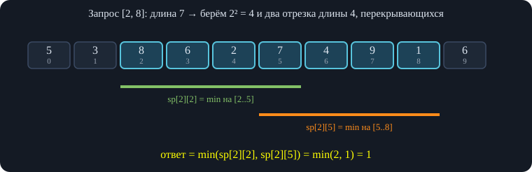
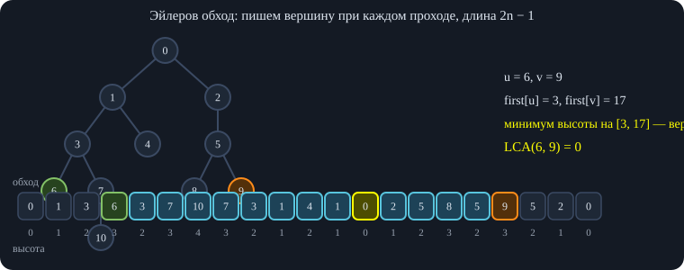
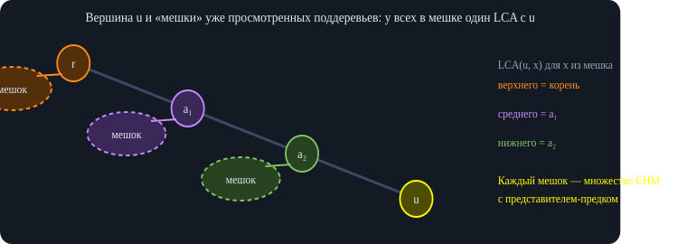
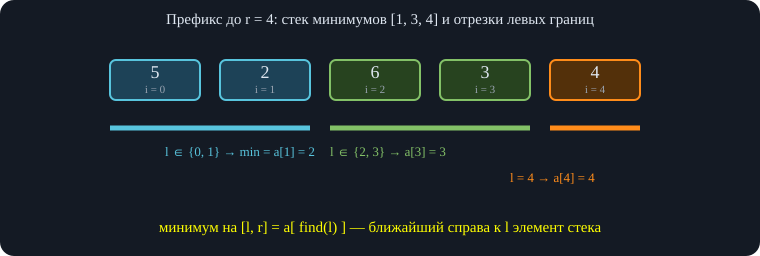
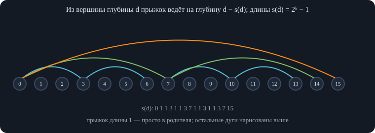
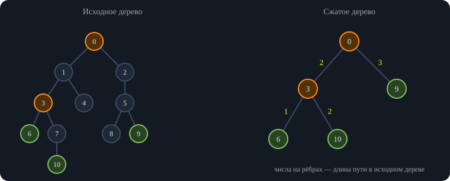
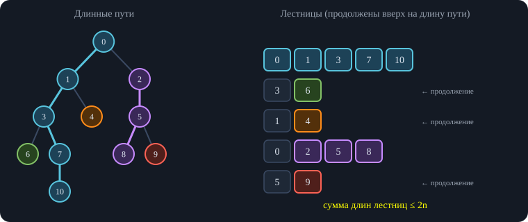
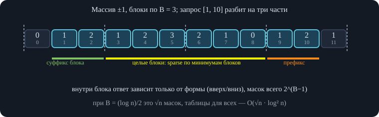

# Занятие 1. Параллель XS — Деревья

*Двоичные подъёмы и LCA, разреженная таблица, эйлеров обход и запросы на путях, алгоритмы Тарьяна, подъёмы с линейной памятью, сжатое дерево, лесенки, метод четырёх русских, декартово дерево.*

## 1. Двоичные подъёмы

Тема занятия — деревья: двоичные подъёмы и наименьший общий предок (LCA), разреженные таблицы, эйлеров обход, алгоритмы Тарьяна, подъёмы с линейной памятью, сжатые деревья. Дерево — связный граф без циклов (эквивалентно: между любыми двумя вершинами ровно один путь). Дерево считается корневым, у каждой вершины есть высота $h$ — расстояние до корня.

### 1.1. Идея и предподсчёт

**Задача.** Для вершины $v$ найти предка на $k$ рёбер выше. **Идея.** Для каждой вершины и каждой степени двойки $2^j$ ($j\le\log_2 n$) хранить предка на $2^j$ выше: $\mathrm{up}[j][v]$. Предподсчёт идёт по формуле $\mathrm{up}[j][v]=\mathrm{up}[j-1][\mathrm{up}[j-1][v]]$: прыжок на $2^j$ — это два прыжка на $2^{j-1}$ (). Для корня считаем, что предок — он сам.

![Таблица $\mathrm{up}[j][v]$: предок на $2^j$ рёбер выше. Подъём на $k$ — это прыжки по единичным битам числа $k$.](images/parallel-xs-zan1-derevya-fig1.svg)\
*Таблица $\mathrm{up}[j][v]$: предок на $2^j$ рёбер выше. Подъём на $k$ — это прыжки по единичным битам числа $k$.*

**Запрос.** Идём по битам числа $k$ от старшего к младшему: если бит равен единице, прыгаем по $\mathrm{up}[j]$. Прыгнем ровно на включённые степени двойки, то есть ровно на $k$. Время $O(\log n)$, память и предподсчёт $O(n\log n)$ ().

<div class="code">

<div class="code-head">

C++

копировать

</div>

``` cpp
const int N = 200000, LG = 18;
vector<int> g[N];
int up[LG][N];                                   // up[j][v] — предок на 2^j выше; у корня это он сам
int h[N], tin[N], tout[N], T;

void dfs(int v, int p) {                         // вызов: dfs(0, 0)
    tin[v] = T++;
    up[0][v] = p;
    h[v] = (p == v ? 0 : h[p] + 1);
    for (int j = 1; j < LG; j++) up[j][v] = up[j - 1][up[j - 1][v]];   // предки уже посчитаны
    for (int u : g[v]) if (u != p) dfs(u, v);
    tout[v] = T++;
}
int jump(int v, int k) {                         // предок на k выше (k < 2^LG)
    for (int j = 0; j < LG; j++) if (k >> j & 1) v = up[j][v];
    return v;
}
bool anc(int a, int b) {                         // a — предок b (или сама b)
    return tin[a] <= tin[b] && tout[b] <= tout[a];
}
int lca1(int u, int v) {                         // способ 1: проверка «является ли предком»
    if (anc(v, u)) return v;
    for (int j = LG - 1; j >= 0; j--)
        if (!anc(up[j][v], u)) v = up[j][v];     // прыгаем, пока не попали в предка u
    return up[0][v];
}
int lca2(int u, int v) {                         // способ 2: выровнять высоты, прыгать одновременно
    if (h[u] < h[v]) swap(u, v);
    u = jump(u, h[u] - h[v]);
    if (u == v) return u;
    for (int j = LG - 1; j >= 0; j--)
        if (up[j][u] != up[j][v]) u = up[j][u], v = up[j][v];
    return up[0][u];
}
```

</div>

### 1.2. Что ещё считают этим методом

Та же таблица работает для любых «склеиваемых» величин на вертикальном пути. Если на рёбрах написаны веса, то минимум на пути длины $k$ вверх от $v$ хранят в таблице $\mathrm{mn}[j][v]$ — минимум на $2^j$ рёбрах вверх; она считается как минимум двух половин длины $2^{j-1}$ (). Для $j=0$ это вес ребра к родителю. Аналогично считают хэш строки, записанной на вертикальном пути: путь режется пополам на две части длины $2^{j-1}$, а хэши склеиваются умножением одной из половин на степень основания (какая именно — зависит от порядка записи); также НОД, суммы и любые операции, где «половины» объединяются ().

<div class="code">

<div class="code-head">

C++

копировать

</div>

``` cpp
const int INF = 1e9;
int w[N];                                        // w[v] — вес ребра (v, родитель); у корня INF
int mn[LG][N];                                   // mn[j][v] — минимум на 2^j рёбрах вверх от v
// заполняется в dfs после up[j][v]:
//   mn[0][v] = w[v];
//   mn[j][v] = min(mn[j-1][v], mn[j-1][up[j-1][v]]);
int pathMin(int v, int k) {                      // минимум на k рёбрах вверх от v
    int res = INF;
    for (int j = 0; j < LG; j++)
        if (k >> j & 1) res = min(res, mn[j][v]), v = up[j][v];
    return res;
}
```

</div>

### 1.3. LCA: проверка «является ли предком»

**Определение.** LCA вершин $u,v$ в корневом дереве — самая низкая (с наибольшей высотой) вершина, которая является предком обеих; на корень смотреть интересно не всегда, поэтому ищут именно самую низкую.

**Предок за $O(1)$.** Один раз запускаем обход в глубину и запоминаем время входа $t_{in}$ и выхода $t_{out}$. Вершина $v$ — предок $u$ тогда и только тогда, когда $t_{in}(v)\le t_{in}(u)$ и $t_{out}(u)\le t_{out}(v)$: в $v$ вошли не позже, чем в $u$, и вышли не раньше.

**Алгоритм.** Если $v$ — предок $u$, ответ $v$. Иначе поднимаем $v$ по степеням двойки от старшей к младшей: если $\mathrm{up}[j][v]$ *не* предок $u$, прыгаем в неё (). Дважды по одному биту прыгать не придётся: если бы смогли, то раньше прыгнули бы по старшему биту. Мы остановимся в вершине, родитель которой — LCA, потому что сам LCA является предком $u$ и в него мы не попадём. Поэтому в конце возвращаем $\mathrm{up}[0][v]$ (); именно потому в начале нужна отдельная проверка «$v$ предок $u$» — иначе лишний шаг к родителю нарушит ответ.

<div class="algo" data-frames="binlca">

</div>

### 1.4. LCA: выравнивание высот

**Второй способ** не требует $t_{in}$/$t_{out}$. Если высоты $h(u)=h(v)$, то прыгаем по обеим вершинам сразу на одну и ту же степень двойки (опять от старшей к младшей): если $\mathrm{up}[j][u]\ne\mathrm{up}[j][v]$, то прыгаем обеими; если равны — перелетели бы LCA, не прыгаем (). В конце вершины окажутся сыновьями LCA — остаётся взять родителя. Если высоты разные, глубокую вершину сначала поднимают на разность высот ().

**Итог по двоичным подъёмам.** Прыжок на $k$ вверх и LCA — $O(\log n)$ на запрос; можно $O(\log k)$, если логарифмы посчитаны заранее. Предподсчёт — $O(n\log n)$ по времени и памяти.

## 2. Разреженная таблица

Теперь запрос за $O(1)$ при том же предподсчёте $O(n\log n)$ — разреженная таблица (sparse table).

### 2.1. Минимум на отрезке

Для массива длины $n$ считаем $\mathrm{sp}[j][i]=\min(a_i,\dots,a_{i+2^j-1})$ — минимум на отрезке длины $2^j$ с левым концом в $i$. Рекуррентно (): $\mathrm{sp}[j][i]=\min(\mathrm{sp}[j-1][i],\ \mathrm{sp}[j-1][i+2^{j-1}])$; считаем слоями по возрастанию $j$ (). Для $j=0$ это сам массив.

**Запрос $[l,r]$.** Берём $j=\lfloor\log_2(r-l+1)\rfloor$ — наибольшую степень двойки, не превосходящую длины. Два отрезка длины $2^j$ — один с началом в $l$, другой с концом в $r$ — всегда пересекаются или касаются: если бы между ними была щель, длина отрезка была бы не меньше $2\cdot2^j=2^{j+1}$, а это противоречит выбору $j$ (). Поэтому вместе они покрывают весь отрезок, а повторное покрытие общей части минимуму не мешает.

\
*Два перекрывающихся блока длины $2^j$ покрывают весь отрезок; пересечение минимуму не мешает.*

Логарифм считаем заранее: $\lg 1=0$, $\lg i=\lg\lfloor i/2\rfloor+1$ — деление на 2 отбрасывает последний двоичный бит, а $\lg$ — номер старшего бита.

<div class="code">

<div class="code-head">

C++

копировать

</div>

``` cpp
const int N = 1 << 17, LG = 18;
int lg[N + 1], sp[LG][N];
void build(const vector<int>& a) {               // O(n log n) по времени и памяти
    int n = a.size();
    for (int i = 2; i <= n; i++) lg[i] = lg[i / 2] + 1;   // lg[i] = ⌊log2 i⌋
    for (int i = 0; i < n; i++) sp[0][i] = a[i];
    for (int j = 1; (1 << j) <= n; j++)
        for (int i = 0; i + (1 << j) <= n; i++)
            sp[j][i] = min(sp[j - 1][i], sp[j - 1][i + (1 << (j - 1))]);
}
int query(int l, int r) {                        // минимум на [l, r] включительно, O(1)
    int j = lg[r - l + 1];                       // два отрезка длины 2^j перекрываются и покрывают [l, r]
    return min(sp[j][l], sp[j][r - (1 << j) + 1]);
}
```

</div>

<div class="own">

<span class="lbl">Важное дополнение</span>\
Метод работает не для любой операции, а только для *идемпотентной* ($\min$, $\max$, НОД, побитовое «и»/«или»): повторный учёт общей части не меняет ответ. Для суммы так нельзя — там нужны непересекающиеся куски, то есть $O(\log n)$ на запрос (бинарные подъёмы или дерево отрезков).

</div>

### 2.2. Двумерная разреженная таблица

То же самое для матрицы: $\mathrm{t}[k][l][i][j]$ — минимум в прямоугольнике высоты $2^k$ и ширины $2^l$ с углом $(i,j)$ (). Каждый прямоугольник режется на два вдоль одного из измерений (): при $k\gt0$ — на два прямоугольника высоты $2^{k-1}$; при $k=0,l\gt0$ — на два шириной $2^{l-1}$; при $k=l=0$ это одна клетка. Порядок вычисления — по возрастанию $(k,l)$, чтобы нужные значения уже были посчитаны. Запрос: $k=\lfloor\log h\rfloor$, $l=\lfloor\log w\rfloor$, и берётся минимум четырёх перекрывающихся прямоугольников $2^k\times2^l$ по углам запроса. Память $O(nm\log n\log m)$ (); для $d$ измерений — произведение размеров на произведение логарифмов.

<div class="code">

<div class="code-head">

C++

копировать

</div>

``` cpp
struct Sparse2D {
    int n, m; vector<int> lg;
    vector<vector<vector<vector<int>>>> t;       // t[k][l][i][j] — минимум в прямоугольнике 2^k × 2^l с углом (i, j)
    Sparse2D(const vector<vector<int>>& a) : n(a.size()), m(a[0].size()) {
        lg.assign(max(n, m) + 1, 0);
        for (int i = 2; i < (int)lg.size(); i++) lg[i] = lg[i / 2] + 1;
        int K = lg[n] + 1, L = lg[m] + 1;
        t.assign(K, vector<vector<vector<int>>>(L));
        for (int k = 0; k < K; k++)
            for (int l = 0; l < L; l++) {
                int H = n - (1 << k) + 1, W = m - (1 << l) + 1;
                t[k][l].assign(H, vector<int>(W));
                for (int i = 0; i < H; i++)
                    for (int j = 0; j < W; j++) {
                        if (k > 0)      t[k][l][i][j] = min(t[k - 1][l][i][j], t[k - 1][l][i + (1 << (k - 1))][j]);
                        else if (l > 0) t[k][l][i][j] = min(t[k][l - 1][i][j], t[k][l - 1][i][j + (1 << (l - 1))]);
                        else            t[k][l][i][j] = a[i][j];
                    }
            }
    }
    int query(int x1, int y1, int x2, int y2) {  // прямоугольник [x1..x2] × [y1..y2], включительно
        int k = lg[x2 - x1 + 1], l = lg[y2 - y1 + 1];
        int x3 = x2 - (1 << k) + 1, y3 = y2 - (1 << l) + 1;
        return min({t[k][l][x1][y1], t[k][l][x3][y1], t[k][l][x1][y3], t[k][l][x3][y3]});
    }
};
```

</div>

**Чем лучше двоичных подъёмов.** Запрос за $O(1)$ вместо $O(\log n)$. Если запросов много (например, 10 миллионов при $n=2\cdot10^5$), то подъёмы не пройдут, а разреженная таблица — пройдёт; если запросов мало, подойдут и подъёмы.

## 3. Эйлеров обход и LCA за $O(1)$

**Эйлеров обход** — запись вершин в порядке обхода в глубину. Вариантов несколько, обычно используют два (): (1) писать вершину при первом входе и при последнем выходе; (2) писать вершину *каждый раз*, когда обход оказывается в ней — при входе и при возвращении из каждого сына (). Второй вариант годится для LCA, первый — для запросов на поддеревьях (дальше).

**Утверждение.** Пусть $\mathrm{first}[x]$ — позиция первого вхождения $x$ во втором обходе. Тогда на отрезке между $\mathrm{first}[u]$ и $\mathrm{first}[v]$ нет вершин выше $\mathrm{LCA}(u,v)$, а сама она есть. Значит, LCA — вершина минимальной высоты на этом отрезке; задача сведена к RMQ.

**Доказательство.** Случай 1: $u$ — предок $v$. Обход вошёл в $u$ раньше; потом, возможно, уходил в соседние сыновья и возвращался, но рано или поздно по направленному вниз ребру дошёл до $v$. Всё это время мы остаёмся в поддереве $u$, поэтому на отрезке нет вершин выше $u$, а минимальная высота у $u$. Случай 2: ни одна не предок другой (). Войдя в поддерево $u$, обход пройдёт его целиком, затем *вернётся вверх* по ребру к родителю и запишет его — по цепочке до $\mathrm{LCA}$, а потом спустится вниз и дойдёт до $v$. Выше LCA обход не поднимался (). Достаточно брать именно первые вхождения ().

Длина массива — $2n-1$: каждое ребро проходится дважды, и по одной вершине записывается на каждом проходе, плюс корень в начале (). Нужны также высоты вершин: ищем минимум высоты на массиве, чаще всего храня в таблице пары $(h,\text{вершина})$. С разреженной таблицей получаем предподсчёт $O(n\log n)$ и запрос $O(1)$.

\
*Между первыми вхождениями $u$ и $v$ нет вершин выше $\mathrm{LCA}$, а сама она там есть: LCA — вершина минимальной высоты на отрезке.*

<div class="code">

<div class="code-head">

C++

копировать

</div>

``` cpp
const int N = 100000, LG = 18;
vector<int> g[N];
int h[N], firstPos[N], lg[2 * N + 1];
vector<pair<int, int>> ord;                      // (высота, вершина) в порядке обхода, длина 2n − 1
pair<int, int> sp[LG][2 * N];

void dfs(int v, int p) {
    firstPos[v] = ord.size();
    ord.push_back({h[v], v});
    for (int u : g[v]) if (u != p) {
        h[u] = h[v] + 1;
        dfs(u, v);
        ord.push_back({h[v], v});                // возвращаемся в v после каждого ребёнка
    }
}
void build() {
    dfs(0, -1);
    int m = ord.size();
    for (int i = 2; i <= m; i++) lg[i] = lg[i / 2] + 1;
    for (int i = 0; i < m; i++) sp[0][i] = ord[i];
    for (int j = 1; (1 << j) <= m; j++)
        for (int i = 0; i + (1 << j) <= m; i++)
            sp[j][i] = min(sp[j - 1][i], sp[j - 1][i + (1 << (j - 1))]);
}
int lca(int u, int v) {                          // O(1): вершина минимальной высоты между первыми вхождениями
    int l = firstPos[u], r = firstPos[v];
    if (l > r) swap(l, r);
    int j = lg[r - l + 1];
    return min(sp[j][l], sp[j][r - (1 << j) + 1]).second;
}
```

</div>

## 4. Эйлеров обход: запросы на пути и в поддереве

**Задача.** В каждой вершине записано число; запросы: (1) прибавить $x$ в вершине $v$; (2) найти сумму на пути $u\to v$. Решается без HLD обычным деревом Фенвика ().

Берём эйлеров обход первого вида (вход и выход). Первое замечание: достаточно отвечать на запросы про вертикальный путь «вершина — корень»: находим $w=\mathrm{LCA}(u,v)$ и разбиваем путь на два вертикальных, а $w$ учитываем один раз ().

Позиции первого и последнего вхождения $v$ ограничивают в обходе ровно поддерево $v$. При добавлении $x$ в вершину $v$ записываем $+x$ на позицию входа и $-x$ на позицию выхода (). Тогда сумма на префиксе до позиции входа $u$ учтёт с плюсом все вершины, в которые вошли, а с минусом — те, из которых уже вышли; остаются в точности вершины, в которые вошли и ещё не вышли, то есть предки $u$. Итого: сумма на пути корень–$u$ = префиксная сумма до $\mathrm{tin}[u]$. Предподсчёт $O(n)$, запрос $O(\log n)$ (). Приём работает для суммы, потому что её можно «отменять»; для минимума так не получится.

**Обратная задача.** Прибавить $x$ ко всем вершинам поддерева $v$; узнать значение в вершине $u$. Значение в $u$ — это сумма прибавлений, сделанных в предках $u$ (). Снова $+x$ в позицию входа $v$, $-x$ в позицию выхода, ответ — сумма на префиксе до позиции $u$ (). Тот же обход, но смотрим на задачу под другим углом ().

<div class="code">

<div class="code-head">

C++

копировать

</div>

``` cpp
struct Fenwick {                                 // сумма на префиксе, добавление в точке; индексы с 0
    int n; vector<long long> t;
    Fenwick(int n = 0) : n(n), t(n + 1, 0) {}
    void add(int i, long long x) { for (i++; i <= n; i += i & -i) t[i] += x; }
    long long pref(int i) {                      // сумма на [0, i]; pref(-1) = 0
        long long s = 0;
        for (i++; i > 0; i -= i & -i) s += t[i];
        return s;
    }
};
```

</div>

<div class="code">

<div class="code-head">

C++

копировать

</div>

``` cpp
// tin, tout (времена из [0, 2n)), lca1 — из «binup»; Fenwick — из «fenwick»
struct RootSum {
    Fenwick fw;
    RootSum(int n) : fw(2 * n) {}
    void add(int v, long long x) { fw.add(tin[v], x); fw.add(tout[v], -x); }   // +x при входе, −x при выходе
    long long get(int v) { return fw.pref(tin[v]); }                           // сумма по предкам v (включая v)
};
// 1) значение в вершине += x, сумма на пути u–v
RootSum vals(N);  long long val[N];
void addValue(int v, long long x) { vals.add(v, x); val[v] += x; }
long long pathSum(int u, int v) {
    int l = lca1(u, v);
    return vals.get(u) + vals.get(v) - 2 * vals.get(l) + val[l];   // l учтена дважды лишнего, вернём её значение
}
// 2) прибавить x всем вершинам поддерева v, узнать значение в вершине u
RootSum sub(N);
void addSubtree(int v, long long x) { sub.add(v, x); }
long long valueAt(int u) { return sub.get(u); }
```

</div>

<div class="own">

<span class="lbl">Развёрнутое объяснение</span>\
В коде позиции $\mathrm{tin}$ и $\mathrm{tout}$ берутся из одного счётчика ($0\ldots2n-1$), поэтому все $2n$ моментов различны и префикс «включительно» корректен: вершина $w$ входит в сумму для $v$ ровно тогда, когда $\mathrm{tin}[w]\le\mathrm{tin}[v]\lt\mathrm{tout}[w]$, то есть $w$ — предок $v$ или сама $v$. Сумму на пути $u$–$v$ даёт $S(u)+S(v)-2S(w)+a_w$ ($S$ — сумма на пути до корня): общая часть от корня до $w$ входит в $S(u)+S(v)$ дважды, а вершина $w$ при вычитании $2S(w)$ потеряна, поэтому возвращаем её значение. Реализация проверена на 3000 случайных деревьев против прямого обхода пути.

</div>

## 5. Алгоритм Тарьяна: LCA офлайн

**Постановка.** Все запросы известны заранее, на них нужно ответить в конце. Это полезно при огромном $n$ (скажем, $10^7$) и умеренном числе запросов: таблицы размера $n\log n$ строить дорого, а здесь память $O(n+q)$ ().

**Идея.** Запрос $(u,v)$ складываем в вершину, посещаемую позже (с бо́льшим $\mathrm{tin}$), и отвечаем, когда обход стоит в ней. Пусть обход сейчас в $u$, а вторая вершина $v$ уже посещена. Рассмотрим путь от корня до $u$ (). Для каждой вершины $a$ этого пути соберём в «мешок» все уже просмотренные вершины, отходящие от пути через $a$ — поддеревья её закончившихся сыновей и саму $a$. У всех вершин одного мешка LCA с $u$ — это $a$ (). Если же $v$ ещё внутри незавершённого поддерева, то это сам предок на пути: он тоже «в мешке» себя.

\
*При выходе из ребёнка его мешок объединяется с мешком родителя: представителем становится сам родитель.*

Мешки не пересекаются, а изменяются только объединением — это СНМ (система непересекающихся множеств). Представитель компоненты — вершина-предок на пути (). Когда мы выходим из сына $c$ вершины $a$, объединяем компоненту $c$ с компонентой $a$ (): все вершины поддерева $c$ теперь отходят от пути через $a$. Ответ на запрос $(u,v)$ при посещённой $v$ — представитель компоненты $v$. Чтобы не хранить «вершину минимальной высоты», договариваются, что представитель — всегда $a$ (при объединении подвешиваем к родителю) (). Время $O(n+q\alpha(n))$ при эвристиках, память $O(n+q)$.

<div class="code">

<div class="code-head">

C++

копировать

</div>

``` cpp
const int N = 200000;
vector<int> g[N];
vector<pair<int, int>> qs[N];                    // qs[v] — пары (другой конец, номер запроса)
int dsu[N], ans[N];  bool vis[N];
int find(int x) { return dsu[x] == x ? x : dsu[x] = find(dsu[x]); }

void dfs(int v, int p) {
    vis[v] = true;  dsu[v] = v;
    for (int u : g[v]) if (u != p) {
        dfs(u, v);
        dsu[find(u)] = v;                        // поддерево ребёнка «схлопывается» в v
    }
    for (auto [w, id] : qs[v])
        if (vis[w]) ans[id] = find(w);           // второй конец уже побывал: его компонента — это LCA
}
```

</div>

<div class="algo" data-frames="tarjan">

</div>

<div class="own">

<span class="lbl">Развёрнутое объяснение</span>\
В коде ответ ищется в самом конце обработки вершины $v$ — после того как все её сыновья слиты в неё. Тогда если второй конец $w$ лежит в поддереве $v$, то $\mathrm{find}(w)=v$; если он в закончившемся поддереве другого сына предка $a$, то $\mathrm{find}(w)=a$; если $w$ — предок $v$, который ещё не завершён, то $\mathrm{find}(w)=w$. Без ранговой эвристики и только со сжатием путей амортизированно получается $O(\log n)$ на операцию, как и обещают оценки с эвристикой по размеру — на практике достаточно. Проверено 2000 случайных деревьев с 30 запросами против перебора.

</div>

## 6. Минимум на отрезке офлайн (второй алгоритм Тарьяна)

**Задача.** Массив из $n$ чисел (скажем, $n=10^7$), $q$ отрезков заданы заранее; нужно минимум на каждом. Предполагается знакомство со стеком минимумов — тем же, что ищет ближайший меньший слева ().

**Идея.** Идём по правым границам $r$ слева направо и отвечаем на все запросы с правой границей $r$. Поддерживаем стек минимумов для префикса длины $r$: индексы по возрастанию, значения тоже возрастают (чем левее, тем меньше или равно). Стек задаёт минимумы всех суффиксов префикса (). Для запроса $[l,r]$ ответ — первый элемент стека, чей индекс $\ge l$ (). Можно искать его бинарным поиском по стеку, но хочется быстрее.

Левые границы между двумя соседними элементами стека (левый — не включая, правый — включая) все дают одним и тем же ответом: правый из этих двух элементов (). Эти отрезки левых границ объединяем в компоненты СНМ (); корень компоненты — её правый элемент, поэтому ответ на запрос — $a[\mathrm{find}(l)]$ ().

**Добавление элемента $r+1$.** Новый элемент сам образует компоненту. Пока верхний элемент стека больше либо равен новому (), снимаем его со стека и объединяем его компоненту с новой: теперь на этих левых границах минимум — новый элемент (). Остановились на элементе меньшем — стек и компоненты корректны, можно отвечать на запросы новой правой границы (). Время $O(n+q\alpha(n))$, память $O(n+q)$.

\
*Элементы стека минимумов делят левые границы на отрезки; каждый отрезок — одна компонента СНМ.*

<div class="code">

<div class="code-head">

C++

копировать

</div>

``` cpp
const int N = 200000;
int a[N], dsu[N], ans[N];
vector<pair<int, int>> byR[N];                   // byR[r] — пары (l, номер запроса)
int find(int x) { return dsu[x] == x ? x : dsu[x] = find(dsu[x]); }

void solve(int n) {
    vector<int> st;                              // стек минимумов: индексы, значения возрастают
    for (int r = 0; r < n; r++) {
        dsu[r] = r;
        while (!st.empty() && a[st.back()] >= a[r]) {
            dsu[st.back()] = r;                  // отрезок, где ответом был st.back(), теперь отдаёт r
            st.pop_back();
        }
        st.push_back(r);
        for (auto [l, id] : byR[r])
            ans[id] = a[find(l)];                // find(l) — ближайший к l элемент стека справа
    }
}
```

</div>

<div class="algo" data-frames="offrmq">

</div>

<div class="own">

<span class="lbl">Важное дополнение</span>\
В показанной реализации представитель — всегда правый индекс, а объединение делает «верхняя» компонента потомком новой; без рангов и со сжатием путей это $O(\log n)$ амортизированно. Чтобы получить $\alpha(n)$, нужно добавить ранговую эвристику и хранить в корне компоненты индекс её правого элемента. Работа проверена на 3000 случайных массивах и наборах запросов против прямого минимума.

</div>

## 7. Двоичные подъёмы с линейной памятью

**Идея.** В обычных подъёмах на каждую вершину приходится $\log n$ указателей. Здесь у вершины ровно один указатель $\mathrm{jmp}[v]$ — куда прыгать (). Он считается при спуске в вершину по указателям родителя: пусть $p$ — родитель $v$. Если длина прыжка из $p$ (то есть $h(p)-h(\mathrm{jmp}[p])$) равна длине прыжка из $\mathrm{jmp}[p]$, то $\mathrm{jmp}[v]=\mathrm{jmp}[\mathrm{jmp}[p]]$; иначе $\mathrm{jmp}[v]=p$ (). У корня прыжок ведёт в него самого. Предподсчёт $O(n)$, память $O(n)$.

**Подъём на глубину $d$.** Пока высота $v$ больше $d$: если прыжок не перелетает цель ($h(\mathrm{jmp}[v])\ge d$), прыгаем; иначе идём в родителя (). LCA ищется вторым способом: выровнять высоты, затем одновременно прыгать: если $\mathrm{jmp}[u]\ne\mathrm{jmp}[v]$, прыгаем обеими, иначе обе шагают к родителю. Так можно делать, потому что длина прыжка зависит только от высоты ().

<div class="code">

<div class="code-head">

C++

копировать

</div>

``` cpp
const int N = 200000;
int par[N], jmp[N], h[N];                        // корень: par = jmp = он сам, h = 0
void addLeaf(int v, int p) {                     // p уже обработана
    par[v] = p;  h[v] = h[p] + 1;
    if (h[p] - h[jmp[p]] == h[jmp[p]] - h[jmp[jmp[p]]]) jmp[v] = jmp[jmp[p]];   // два равных прыжка → сливаем
    else jmp[v] = p;
}
int upTo(int v, int d) {                         // предок v на глубине d ≤ h[v]
    while (h[v] > d) {
        if (h[jmp[v]] >= d) v = jmp[v];          // прыжок не перелетает цель
        else v = par[v];
    }
    return v;
}
int lca(int u, int v) {
    if (h[u] < h[v]) swap(u, v);
    u = upTo(u, h[v]);
    while (u != v) {
        if (jmp[u] != jmp[v]) u = jmp[u], v = jmp[v];   // длины прыжков зависят только от высоты
        else u = par[u], v = par[v];
    }
    return u;
}
```

</div>

\
*Глубины $0\ldots15$ одного пути и прыжки вверх: длины $1,1,3,1,1,3,7,1,1,3,1,1,3,7,15$. Прыжки вложены друг в друга, как отрезки в двоичной записи.*

<div class="algo" data-frames="linjump">

</div>

### 7.1. Почему это работает быстро

Длины прыжков зависят только от высоты вершины, поэтому их можно изучать на одной цепочке. Выписав их, видим повторяющиеся блоки: построив блок, его можно скопировать, нарисовать ещё одну вершину и соединить её с корнем — получается следующий блок (). Все длины прыжков оказываются числами вида $2^k-1$: $1,1,3,1,1,3,7,\dots$; два подряд идущих прыжка длины $2^{k-1}-1$ дают $2(2^{k-1}-1)+1=2^k-1$ (). В лекции дальше строится разложение высоты вершины по наибольшей степени вида $2^k-1$ и показывается, что подъём работает за логарифм ().

<div class="own">

<span class="lbl">Развёрнутое объяснение</span>\
Запишем высоту $d$ как сумму слагаемых вида $2^k-1$ жадно, начиная с наибольшего ($13=7+3+3$, $6=3+3$, $4=3+1$). Слагаемые убывают, и одинаковыми могут быть только два последних (*скошенная двоичная система*). Прыжок из вершины высоты $d$ имеет длину, равную **последнему (наименьшему) слагаемому**: например, $s(13)=3$, $s(14)=7$ ($14=7+7$). Это согласуется с правилом: если два последних слагаемых равны $t$, прыжок «склеивает» их в $2t+1$ — и их сумма $d-s(\ldots)$ перестаёт быть двумя шагами. Шаг в родителя ($d\to d-1$) заменяет последнее слагаемое $2^k-1$ на два слагаемых $2^{k-1}-1$ (так как $2^k-2=2(2^{k-1}-1)$). Поэтому при подъёме на глубину $d'$ получаем две фазы: пока прыжок не перелетает цель, последнее слагаемое только *растёт* (каждым прыжком мы «съедаем» последний член разложения); потом один раз перелетаем, делаем шаг в родителя, и последнее слагаемое примерно *вдвое уменьшается*; на каждом размере делаем не более двух прыжков. Размеров не более $\log_2 n$, поэтому всего $O(\log n)$ действий. Эксперимент на 500 деревьях (цепочки, почти цепочки, случайные) с $n$ до 2000 подтвердил, что число шагов не превышает $3(\log_2 n+2)$, а ответы совпадают с прямым подъёмом.

</div>

## 8. Сжатое (виртуальное) дерево

**Зачем.** Часто для динамики на дереве нужны не все вершины, а только $k$ выбранных, и требуется работать за $O(k)$ или $O(k\log k)$, а не за $O(n)$. Пример задачи (разобран в конце раздела, ): на рёбрах написаны цвета; $f(u,v)$ — число цветов, которые встречаются на пути $u\to v$ ровно один раз; нужна сумма $f$ по всем парам вершин.

### 8.1. Что такое сжатое дерево

Берём выбранные вершины и смотрим, какое дерево они образуют: остаются сами вершины, а промежуточные вершины без ветвления выбрасываются; путь между оставшимися превращается в одно ребро с длиной (). Нужны также вершины, где пути к выбранным расходятся — они сохраняют структуру ветвления (). Корень — LCA всех выбранных вершин.

\
*Выбраны 6, 9, 10 (зелёные). Добавляем LCA соседних по $\mathrm{tin}$ (оранжевые) и стираем всё остальное: структура ветвления сохранена.*

### 8.2. Какие вершины входят

Отсортируем выбранные вершины по $\mathrm{tin}$ (единственное место, где нужен $\log$, ). Корень — LCA всех, его получаем, последовательно сворачивая LCA слева направо (). **Утверждение.** Сжатое дерево состоит из выбранных вершин и LCA всех пар *соседних* (в порядке $\mathrm{tin}$) вершин; их не больше $2k-1$ ().

**Доказательство.** (а) LCA любых соседних вершин в сжатом дереве обязана быть: иначе дерево не сохраняло бы информацию о том, что у этих двух вершин общий предок, где пути расходятся. (б) Других лишних вершин нет: пусть в сжатом дереве есть вершина $w$, у которой выбранные вершины есть в двух разных поддеревьях сыновей (иначе зачем она нужна) (). Возьмём в левом поддереве вершину с наибольшим $\mathrm{tin}$ и в правом — с наименьшим; между ними по $\mathrm{tin}$ нет выбранных вершин, значит, они соседние, а их LCA — ровно $w$ (). Следовательно, $w$ — LCA пары соседних ().

### 8.3. Построение: два способа

**Способ 1** (проще в коде, но с лишней сортировкой). К $k$ выбранным добавляем $k-1$ LCA соседних и корень — всего $O(k)$ вершин (), снова сортируем их по $\mathrm{tin}$. Затем «симулируем обход в глубину» со стеком: кладём корень; для очередной вершины $v$ снимаем со стека, пока верхний не является предком $v$ (это и есть выход из рекурсии); верхний — родитель $v$ в сжатом дереве, проводим ребро и кладём $v$ в стек (). Стек не опустеет, потому что корень — предок всех (–).

<div class="code">

<div class="code-head">

C++

копировать

</div>

``` cpp
// Способ 1: отсортировать, добавить LCA соседей, отсортировать ещё раз и пройти стеком.
vector<pair<int, int>> virtualTree(vector<int> vs, vector<int>& nodes) {
    auto byTin = [&](int a, int b) { return tin[a] < tin[b]; };
    sort(vs.begin(), vs.end(), byTin);
    vs.erase(unique(vs.begin(), vs.end()), vs.end());
    int k = vs.size();
    for (int i = 0; i + 1 < k; i++) vs.push_back(lca1(vs[i], vs[i + 1]));   // LCA соседних по tin
    sort(vs.begin(), vs.end(), byTin);
    vs.erase(unique(vs.begin(), vs.end()), vs.end());
    vector<pair<int, int>> edges;
    vector<int> st;
    for (int v : vs) {
        while (!st.empty() && !anc(st.back(), v)) st.pop_back();   // выходим из «рекурсии», пока не встретим предка
        if (!st.empty()) edges.push_back({st.back(), v});
        st.push_back(v);
    }
    nodes = vs;
    return edges;
}
```

</div>

**Способ 2** (без повторной сортировки). Если вершины уже даны в порядке $\mathrm{tin}$ (например, их выбираем мы сами), то LCA соседних можно вычислять прямо на стеке (). В стеке держим путь от корня до последней обработанной вершины *с учётом уже найденных развилок*. Новая вершина $c$: если верхняя вершина стека — предок $c$, просто кладём $c$. Иначе $c$ ушла вбок: вычисляем $l=\mathrm{LCA}(\text{верх},c)$ () и «раскручиваем» стек: пока предпоследний элемент не выше $l$, соединяем его с верхним ребром и снимаем верхний; в конце, если верх ниже $l$, ставим $l$ вместо него и соединяем $l$ с этим верхним (). Затем кладём $c$ (). Длины рёбер получаются как разности высот $h_v-h_u$ ().

<div class="code">

<div class="code-head">

C++

копировать

</div>

``` cpp
// tin, h, anc, lca — из «binup». vs — вершины, УЖЕ отсортированные по tin, без повторов.
// Возвращает рёбра (родитель, ребёнок) сжатого дерева; корень — LCA всех вершин.
vector<pair<int, int>> virtualSorted(const vector<int>& vs, int& root) {
    root = vs[0];
    for (int v : vs) root = lca1(root, v);       // корень = LCA всех вершин
    vector<pair<int, int>> edges;
    vector<int> st = {root};                     // стек: путь от корня до последней вершины
    for (int c : vs) {
        if (c == root) continue;
        if (!anc(st.back(), c)) {                // c ушла вбок: ищем развилку
            int l = lca1(st.back(), c);
            while (st.size() >= 2 && h[st[st.size() - 2]] >= h[l]) {
                edges.push_back({st[st.size() - 2], st.back()});
                st.pop_back();
            }
            if (st.back() != l) {                // развилка — новая вершина: ставим её на место верхушки
                edges.push_back({l, st.back()});
                st.back() = l;
            }
        }
        st.push_back(c);
    }
    while (st.size() >= 2) {
        edges.push_back({st[st.size() - 2], st.back()});
        st.pop_back();
    }
    return edges;
}
```

</div>

Сортировка подсчётом тут не поможет: на каждый запрос приходится только $k$ вершин с значениями до $n$, а не $n$ вершин (). Оба способа проверены на 3000 случайных деревьев и множествах до 8 вершин: набор вершин и рёбер совпал с определением («замкнуть множество относительно LCA, родитель — ближайший предок в множестве»).

### 8.4. Задача про цвета на рёбрах

**Условие.** Дерево на $n$ вершинах, рёбра покрашены. Сумма по всем парам вершин числа цветов, встречающихся на пути ровно один раз.

**Идея лектора.** Считаем отдельно для каждого цвета $c$: сколько путей содержат ровно одно ребро этого цвета. Ответ — сумма по цветам. Рассматриваем дерево, где единицы стоят на рёбрах цвета $c$, а остальные рёбра нулевые (), и считаем пути с суммой ровно 1: динамика $dp_{v,0}$, $dp_{v,1}$ — число путей вниз от $v$ с суммой 0 и 1, и к ответу добавляются пути через $v$ (–). Для скорости оставляем только концы рёбер цвета $c$ и строим для них сжатое дерево: суммарно вершин $O(n)$, а строится оно за $O(n\log n)$ или быстрее (–). В сжатом дереве вес ребра — 0 или 1, потому что путь длины больше 1 содержит ребро цвета $c$ только если обе его вершины выбраны (–); поэтому у ребра хранят ещё число пропущенных вершин $x$, чтобы считать пути не только до вершин сжатого дерева ().

<div class="own">

<span class="lbl">Развёрнутое объяснение</span>\
Подсчёт можно довести до простой формулы. Для цвета $c$ удалим все рёбра цвета $c$: дерево распадётся на компоненты. Путь содержит ровно одно ребро цвета $c$ тогда и только тогда, когда его концы лежат в двух компонентах, соединённых *этим* ребром. Значит, вклад цвета равен $\sum_e |A_e|\cdot|B_e|$ по рёбрам $e$ цвета $c$, где $A_e,B_e$ — компоненты на концах. Размеры компонент считаются по размерам поддеревьев: берём нижние концы рёбер цвета $c$ вместе с корнем (: как раз «выделим вершины»), сортируем по $\mathrm{tin}$ и стеком находим для каждой нижней вершины $v$ ближайшего выше выделенного предка $\mathrm{par}_S(v)$. Тогда $\mathrm{comp}(v)=\mathrm{sz}(v)-\sum_{\text{дети }u\text{ в }S}\mathrm{sz}(u)$, для корня $\mathrm{comp}(0)=n-\sum\mathrm{sz}$, а ребро над $v$ вносит $\mathrm{comp}(v)\cdot\mathrm{comp}(\mathrm{par}_S(v))$. Общее число вершин по всем цветам — $n-1$, время $O(n\log n)$. Реализация сверена с прямым перебором всех пар для 3000 случайных деревьев (до 40 вершин, до 4 цветов): суммы совпали.

</div>

<div class="code">

<div class="code-head">

C++

копировать

</div>

``` cpp
// Дерево с цветами рёбер. Найти сумму по всем парам вершин (u, v) числа цветов,
// которые встречаются на пути u–v ровно один раз. Нужны tin, tout, anc из «binup».
vector<int> byColor[N];                          // byColor[c] — нижние концы рёбер цвета c
int comp[N], parS[N];
int subSize(int v) { return (tout[v] - tin[v] + 1) / 2; }

long long solveColors(int n, int colors) {
    long long total = 0;
    for (int c = 0; c < colors; c++) {
        vector<int> vs = byColor[c];
        if (vs.empty()) continue;
        sort(vs.begin(), vs.end(), [&](int a, int b) { return tin[a] < tin[b]; });
        comp[0] = n;                             // компонента корня после удаления рёбер цвета c
        vector<int> st = {0};
        for (int v : vs) {
            comp[v] = subSize(v);
            while (!anc(st.back(), v)) st.pop_back();
            parS[v] = st.back();                 // ближайшая выше вершина-верх другой компоненты
            comp[parS[v]] -= subSize(v);
            st.push_back(v);
        }
        for (int v : vs) total += 1LL * comp[v] * comp[parS[v]];   // ровно одно ребро цвета c на пути
    }
    return total;
}
```

</div>

### 8.5. Задача: минимальное число удалений

**Условие.** Дано дерево; приходят запросы: выбрать несколько вершин и узнать, сколько вершин минимум надо удалить, чтобы никакие две выбранные не были связаны (по сумме размеров запросов есть ограничение). Если две выбранные соединены ребром, разрезать нечем и ответ $-1$ ().

**Идея лектора.** Строим сжатое дерево на выбранных вершинах () и смотрим, какие вершины надо удалить. Предлагается удалять вершины, получившиеся как LCA выбранных вершин из разных поддеревьев (): они лежат между выбранными, и удаление отрезает ветви. Лектор сам замечает неясности — например, когда корень сам выбран, — и разбирает случаи, оставляя вопрос предположением «удаляем только те, у кого выбранные есть в обоих поддеревьях» (–).

<div class="own">

<span class="lbl">Развёрнутое объяснение</span>\
Полный жадный алгоритм по сжатому дереву снизу вверх. Назовём вершину *открытой*, если из неё вниз по сжатому дереву после уже сделанных удалений достижима выбранная вершина. Выбранная вершина открыта всегда. Невыбранная вершина с двумя и более открытыми сыновьями обязана быть удалена ($+1$), после чего закрыта; с одним открытым сыном — открыта; с нулевым — закрыта. Ребро от открытого сына $v$ к *выбранному* родителю $p$ нужно разорвать: если $v$ выбрана и является сыном $p$ в исходном дереве — ответ $-1$; иначе удаляем $v$ (если не выбрана) либо любую вершину между ними ($+1$). Удаляемые вершины всегда невыбранные: развилки и вершины внутри сжатых путей. Алгоритм проверен на 3000 случайных деревьев (до 11 вершин) против полного перебора подмножеств удаляемых вершин, включая случаи $-1$.

</div>

<div class="code">

<div class="code-head">

C++

копировать

</div>

``` cpp
// Выделены вершины sel[]. Какое наименьшее число НЕвыделенных вершин удалить,
// чтобы никакие две выделенные не были связаны? -1, если невозможно.
// virtualSorted — из «virtual_sorted».
bool sel[N];
int cutVertices(vector<int> vs) {
    sort(vs.begin(), vs.end(), [&](int a, int b) { return tin[a] < tin[b]; });
    int root;
    auto edges = virtualSorted(vs, root);
    vector<int> nodes = {root};
    map<int, int> vp;                            // родитель в сжатом дереве
    for (auto [p, c] : edges) nodes.push_back(c), vp[c] = p;
    sort(nodes.begin(), nodes.end(), [&](int a, int b) { return tin[a] > tin[b]; });   // дети раньше родителей
    map<int, int> kids;                          // сколько «открытых» детей (оттуда достижима выделенная)
    int ans = 0;
    for (int v : nodes) {
        bool open;
        if (sel[v]) open = true;                         // выделенная вершина «открыта» всегда
        else if (kids[v] >= 2) { ans++; open = false; }  // развилка: удаляем саму v
        else open = kids[v] == 1;
        if (!open || v == root) continue;
        int p = vp[v];
        if (sel[p]) {
            if (sel[v] && h[v] == h[p] + 1) return -1;   // две выделенные рядом — разрезать нечем
            ans++;                                       // удаляем v (если не выделена) или вершину между ними
        } else kids[p]++;
    }
    return ans;
}
```

</div>

## 9. Эйлеров обход как два массива: пре- и постпорядок

**Задача.** Прибавлять число на поддереве и получать сумму на пути. Лектор замечает, что с помощью HLD это решается за $O(\log^2 n)$ и «просто неприкольно», а мы научимся за $O(\log n)$ ().

Рассмотрим два порядка: pre-order (вершину записываем при входе) и post-order (при выходе). Они равнозначны для задач на поддереве, но по-разному ведут себя на префиксе (). Для вершины $v$ префикс pre-order до $v$ содержит всех предков $v$ (в них вошли, но не вышли) и то, что слева (в чём вошли и вышли); поддерево $v$ ещё не записано. В post-order у $v$ уже записаны и поддерево, и то, что слева, но предков пока нет, так как из них не вышли (–). Значит, префиксы отличаются лишь предками $v$ и поддеревом.

Заводим два дерева Фенвика — по pre-order и по post-order. Сумма по предкам: из префикса pre-order вычитаем префикс post-order; поддеревья при добавлении в точке и суммировании на отрезке ведут себя как раньше (). Итого $O(\log n)$ на запрос.

<div class="own">

<span class="lbl">Развёрнутое объяснение</span>\
Чтобы разность давала именно предков, префикс post-order нужно брать не «до выхода из $v$», а *на момент входа в $v$*: это первые $\mathrm{leftCnt}[v]$ вершин, где $\mathrm{leftCnt}[v]$ — сколько вершин уже вышло к моменту входа. Тогда из вошедших (предки + $v$ + всё, что слева) вычитаем вышедшие (всё, что слева): остаются предки и $v$. Поддерево $v$ — отрезок $[\mathrm{pre}[v],\mathrm{pre}[v]+\mathrm{sz}[v]-1]$ в порядке входа. Реализация проверена на 2000 случайных деревьях против прямого суммирования.

</div>

<div class="code">

<div class="code-head">

C++

копировать

</div>

``` cpp
// Два массива: порядок входа (pre) и порядок выхода (post). Fenwick — из «fenwick»
const int N = 200000;
vector<int> g[N];  int pre[N], post[N], leftCnt[N], sz[N], cp, cq;
void dfs(int v, int p) {
    pre[v] = cp++;  leftCnt[v] = cq;             // leftCnt[v] — сколько вершин уже вышли к моменту входа в v
    sz[v] = 1;
    for (int u : g[v]) if (u != p) dfs(u, v), sz[v] += sz[u];
    post[v] = cq++;
}
Fenwick A(N), B(N);                              // A — по pre, B — по post
void add(int v, long long x) { A.add(pre[v], x); B.add(post[v], x); }
long long ancestorsSum(int v) {                  // предки v и сама v
    return A.pref(pre[v]) - B.pref(leftCnt[v] - 1);   // вошли, но ещё не вышли
}
long long subtreeSum(int v) {                    // поддерево — отрезок в порядке входа
    return A.pref(pre[v] + sz[v] - 1) - A.pref(pre[v] - 1);
}
```

</div>

## 10. Сравнение методов для LCA и подъёма

Лектор выписывает для каждого метода предподсчёт и время запроса. Известные нам к этому моменту: двоичные подъёмы — запрос $O(\log n)$, предподсчёт $O(n\log n)$ (); разреженная таблица по эйлерову обходу — запрос $O(1)$, предподсчёт $O(n\log n)$; подъёмы с линейной памятью — запрос $O(\log n)$, предподсчёт $O(n)$; Тарьян — офлайн, $O(n+q\alpha)$. Цель дальше: запрос $O(1)$ при предподсчёте $O(n)$ () — теоретически красиво, на олимпиадах такое почти не пишут ().

| Метод | Предподсчёт | Запрос | Замечание |
|----|----|----|----|
| Двоичные подъёмы | $O(n\log n)$ | $O(\log n)$ | онлайн, умеет и подъём на $k$ |
| Подъёмы, линейная память | $O(n)$ | $O(\log n)$ | онлайн, константа больше |
| Эйлеров обход + sparse | $O(n\log n)$ | $O(1)$ | онлайн, только LCA |
| Тарьян | $O(n+q\alpha)$ | — | офлайн |
| Лесенки + подъёмы | $O(n\log n)$ | $O(1)$ | подъём на $k$ |
| Четыре русских | $O(n)$ | $O(1)$ | RMQ с шагом ±1, LCA |

## 11. Подъём на $k$ за $O(1)$: лесенки

**Задача (онлайн).** Найти предка вершины $u$ на $k$ рёбер выше. **Шаг 1.** Разобьём дерево на пути: из корня идём по самому длинному пути вниз, удаляем его, в оставшихся деревьях повторяем. Каждая вершина лежит ровно в одном пути; для вершины храним номер пути и позицию (–). Если $k$ не превосходит позиции вершины в пути — ответ рядом; иначе прыгаем в начало пути и продолжаем рекурсивно (). Но так подъём за $O(\sqrt n)$ — на «колючке» из путей длины $1,2,3,\dots$ придётся подниматься по одной вершине (–).

**Шаг 2 (лесенки).** Каждый путь длины $L$ удваиваем: добавляем сверху $L$ его предков (или сколько есть до корня). Суммарная длина массивов не больше $2n$, асимптотика построения не портится (–). Эта конструкция называется *ladder (long-path) decomposition*.

**Шаг 3.** Дополнительно строим обычные двоичные подъёмы. На запрос $(u,k)$ берём наибольшее $j$, для которого $2^j\le k$, и один раз прыгаем по подъёмам на $2^j$ в вершину $v$ (). Теперь осталось подняться на $k-2^j\lt2^j$.

**Почему остаток лежит на лестнице.** У $v$ есть потомок $u$ на расстоянии $2^j$, значит самый длинный путь вниз из $v$ содержит не менее $2^j$ вершин ниже $v$; путь, в котором лежит $v$, имеет длину $L\ge2^j$ () и в его лестнице над самим путём есть хотя бы $2^j$ предков. А нужно подняться на $k-2^j\lt2^j$ (). Значит, ответ — элемент лестницы на нужное число позиций левее $v$.

\
*Каждый путь (цвет) удваивается вверх; бледные ячейки — добавленные предки. Кто начал прыжок на $2^j$, тот попадает на лестницу, где ответ лежит рядом.*

<div class="code">

<div class="code-head">

C++

копировать

</div>

``` cpp
const int N = 200000, LG = 18;
vector<int> g[N];
int up[LG][N], h[N], len[N], son[N], lg[N + 1];
int pathId[N], pos[N];
vector<vector<int>> lad;                         // «лестницы»: путь, продолженный вверх на свою длину

void dfs(int v, int p) {                         // вызов: dfs(0, 0)
    up[0][v] = p;  h[v] = (p == v ? 0 : h[p] + 1);
    for (int j = 1; j < LG; j++) up[j][v] = up[j - 1][up[j - 1][v]];
    len[v] = 1;  son[v] = -1;
    for (int u : g[v]) if (u != p) {
        dfs(u, v);
        if (len[u] + 1 > len[v]) len[v] = len[u] + 1, son[v] = u;   // сын на самом длинном пути вниз
    }
}
void buildLadders(int n) {
    for (int i = 2; i <= n; i++) lg[i] = lg[i / 2] + 1;
    for (int t = 0; t < n; t++) {
        if (t != 0 && son[up[0][t]] == t) continue;       // t — не начало длинного пути
        vector<int> path;
        for (int x = t; x != -1; x = son[x]) path.push_back(x);
        int L = path.size(), ext = min(L, h[t]);          // продлеваем вверх не более чем на L вершин
        vector<int> ladder(ext);
        int x = t;
        for (int i = ext - 1; i >= 0; i--) ladder[i] = x = up[0][x];
        ladder.insert(ladder.end(), path.begin(), path.end());
        for (int i = 0; i < L; i++) pathId[path[i]] = lad.size(), pos[path[i]] = ext + i;
        lad.push_back(ladder);
    }
}
int kth(int v, int k) {                          // предок на k выше, k ≤ h[v]; O(1)
    if (k == 0) return v;
    int j = lg[k];
    v = up[j][v];  k -= 1 << j;                  // один прыжок на старшую степень двойки
    return lad[pathId[v]][pos[v] - k];           // остаток k < 2^j гарантированно внутри лестницы
}
```

</div>

<div class="own">

<span class="lbl">Важное дополнение</span>\
Если путь начинается слишком близко к корню, лестница короче $L$, но тогда она доходит до самого корня, а нужная высота не больше глубины $v$, так что запрос всё равно остаётся внутри лестницы (в коде это учтено выбором $\mathrm{ext}=\min(L,h_{top})$). Реализация проверена для всех пар $(v,k)$ на 1500 случайных деревьях и подтвердила, что суммарная длина лестниц не больше $2n$.

</div>

## 12. LCA за $O(n)$ и $O(1)$: метод четырёх русских

Цель — предподсчёт $O(n)$ и запрос $O(1)$. LCA сводится к RMQ по массиву эйлерова обхода (), поэтому нужно научиться отвечать на RMQ за $O(n)$ и $O(1)$.

**Блоки.** Разобьём массив на блоки размера $B\approx\log n$. Для каждого блока считаем минимум префиксов и минимум суффиксов (), и минимум по всему блоку. На минимумах блоков строим разреженную таблицу: блоков $n/B$, поэтому таблица занимает $\frac{n}{B}\log\frac{n}{B}\le n$ (–). Запрос, захватывающий несколько блоков, = суффикс первого блока + таблица по целым блокам + префикс последнего (). Проблема — запрос внутри одного блока.

**Использование структуры задачи.** В массиве эйлерова обхода соседние высоты отличаются ровно на $\pm1$ (). Поэтому блок можно закодировать последовательностью плюсов и минусов (двоичной маской) длины $B-1$; различных блоков всего $2^{B-1}$. Возьмём $B=\frac{\log n}{2}$: масок $\sqrt n$ (). Для каждой маски заранее перебираем все пары границ $(l,r)$ и находим положение минимума (): это $\sqrt n\cdot O(\log^2n)$ операций, что меньше $O(n)$. Минимум восстанавливается по маске однозначно — первое значение считаем нулём (). Метод разбиения на блоки с предподсчётом всех возможных блоков называется *методом четырёх русских* (–).

\
*Метод четырёх русских: на коротких блоках ответ берётся из таблицы по «форме» блока.*

<div class="code">

<div class="code-head">

C++

копировать

</div>

``` cpp
// Массив a, соседние элементы которого отличаются ровно на 1. Возвращает позицию минимума на [l, r].
struct RmqPm1 {
    int n, B, nb;
    vector<int> a, mask, pre, suf, lg;
    vector<vector<int>> big;                     // разреженная таблица по блокам (хранит позиции минимумов)
    vector<vector<unsigned char>> tab;           // tab[mask][l*B + r] — позиция минимума внутри блока
    int better(int i, int j) { return a[j] < a[i] ? j : i; }
    RmqPm1(const vector<int>& v) : n(v.size()), a(v) {
        B = max(1, (int)(log2(max(n, 2)) / 2));  // размер блока ≈ (log n) / 2
        nb = (n + B - 1) / B;
        mask.assign(nb, 0);  pre.resize(n);  suf.resize(n);
        tab.assign(1 << (B - 1), {});
        for (int b = 0; b < nb; b++) {
            int s = b * B, e = min(n, s + B) - 1;
            for (int t = 0; t + 1 < B; t++)      // форма блока: растёт или убывает на каждом шаге
                if (s + t + 1 <= e && a[s + t + 1] > a[s + t]) mask[b] |= 1 << t;
            pre[s] = s;
            for (int i = s + 1; i <= e; i++) pre[i] = better(pre[i - 1], i);
            suf[e] = e;
            for (int i = e - 1; i >= s; i--) suf[i] = a[i] < a[suf[i + 1]] ? i : suf[i + 1];
            if (tab[mask[b]].empty()) {          // таблица для этой формы строится один раз
                vector<int> d(B);
                for (int t = 0; t + 1 < B; t++) d[t + 1] = d[t] + (mask[b] >> t & 1 ? 1 : -1);
                auto& T = tab[mask[b]];  T.assign(B * B, 0);
                for (int l = 0; l < B; l++) {
                    int best = l;
                    for (int r = l; r < B; r++) {
                        if (d[r] < d[best]) best = r;
                        T[l * B + r] = best;
                    }
                }
            }
        }
        lg.assign(nb + 1, 0);
        for (int i = 2; i <= nb; i++) lg[i] = lg[i / 2] + 1;
        big.assign(lg[nb] + 1, vector<int>(nb));
        for (int b = 0; b < nb; b++) big[0][b] = pre[min(n, b * B + B) - 1];
        for (int j = 1; j <= lg[nb]; j++)
            for (int b = 0; b + (1 << j) <= nb; b++)
                big[j][b] = better(big[j - 1][b], big[j - 1][b + (1 << (j - 1))]);
    }
    int query(int l, int r) {
        int bl = l / B, br = r / B;
        if (bl == br) return bl * B + tab[mask[bl]][(l - bl * B) * B + (r - bl * B)];   // внутри блока — по таблице
        int res = better(suf[l], pre[r]);        // суффикс первого блока и префикс последнего
        if (br - bl > 1) {                       // целые блоки между ними — разреженная таблица
            int j = lg[br - bl - 1];
            res = better(res, better(big[j][bl + 1], big[j][br - (1 << j)]));
        }
        return res;
    }
};
```

</div>

В реальных задачах так не пишут: таблицы масок плохи по памяти и кэшу; от них можно частично избавиться, обсудив соседние минимумы (в блоге у Алексея Васильева описан вариант без них). Для $n$ до миллиарда решение работает по памяти, хуже при больших (–).

<div class="own">

<span class="lbl">Важное дополнение</span>\
В коде размер блока взят как $\max(1,\lfloor\log_2 n/2\rfloor)$, а таблица по маске строится лениво — только для встретившихся форм блоков. Результат — позиция минимума; проверено на 3000 случайных массивов с шагами $\pm1$ (до 200 элементов): позиции лежат в отрезке, а значения совпадают с прямым минимумом.

</div>

## 13. Микро-макро дерево: подъёмы от листьев

У нас два ответвления: либо глобальный RMQ по всему массиву за $O(n)$ и $O(1)$, либо довести до конца идею с подъёмами. Второе: сократить память подъёмов ().

**Подъёмы только от листьев.** Из вершины $v$ можно спуститься в любой лист $\ell$ её поддерева и ответить на запрос как «подъём из $\ell$ на $k+(h_\ell-h_v)$». Значит, таблицу $\mathrm{up}[j]$ достаточно хранить только для листьев. Считаются они обходом в глубину со стеком пути: в стеке храним текущий путь, а в листе записываем элементы стека на позициях $\mathrm{size}-1-2^j$ (–).

**Как уменьшить число листьев.** Выберем порог $B\approx\log n/4$. Удалим все поддеревья размера не больше $B$ и ещё их родителей (–). У оставшегося дерева листьев не больше $n/B$: у каждого листа был удалённый ребёнок с поддеревом хотя бы $B$ вершин (–). Лектор сначала формулирует с «меньше $B$», затем исправляет: удалять нужно поддеревья размера $\le B$ *вместе с родителем*, иначе оценка не получается (–). Тогда на оставшемся дереве можно хранить подъёмы от листьев ($\frac nB\log n=O(n)$ памяти) и лесенки/двоичные подъёмы за $O(1)$ ().

**Запросы из удалённых деревьев.** Удалённые деревья малы, и различных форм их тоже мало. Закодируем дерево скобочной последовательностью из нулей и единиц: при заходе в вершину пишем 0, при выходе пишем 1 (–). По последовательности дерево восстанавливается однозначно, поэтому форм не больше $2^{2B}$; для каждой формы заранее считаем все ответы (–). Эта конструкция называется *микро-макро деревом* (лектор оговаривает, что на практике это писать не нужно — полезна лишь идея «считать только в листьях»).

## 14. RMQ ⟶ LCA: декартово дерево

Выше мы сводили LCA к RMQ, теперь наоборот: чтобы решать RMQ за $O(n)$ и $O(1)$ для произвольного массива, сведём его к LCA (). Для массива строим декартово дерево на парах $(x,y)=(i,a_i)$: по $x$ — двоичное дерево поиска, по $y$ — куча (минимум сверху) (). Минимум на $[l,r]$ — это значение в $\mathrm{LCA}$ вершин $l$ и $r$.

![Для массива 5 1 4 2 6 3 минимум на $[2,4]$ — это значение в $\mathrm{LCA}$ вершин с индексами 2 и 4.](images/parallel-xs-zan1-derevya-fig10.svg)\
*Для массива 5 1 4 2 6 3 минимум на $[2,4]$ — это значение в $\mathrm{LCA}$ вершин с индексами 2 и 4.*

**Построение за линию.** Так как $x$ уже отсортированы, правый путь дерева храним в стеке. Приходит новый элемент $y$: снимаем со стека всё, что больше $y$; последнее снятое поддерево подвешиваем к новой вершине как левого сына, а саму новую вершину делаем правым сыном нового верха стека (–).

<div class="code">

<div class="code-head">

C++

копировать

</div>

``` cpp
// Декартово дерево по минимуму (x — индекс, y — значение a[i]); строится за O(n) стеком.
vector<int> cartesian(const vector<int>& a, vector<int>& par) {
    int n = a.size();
    vector<int> L(n, -1), R(n, -1), st;
    par.assign(n, -1);
    for (int i = 0; i < n; i++) {
        int last = -1;
        while (!st.empty() && a[st.back()] > a[i]) last = st.back(), st.pop_back();
        if (last != -1) L[i] = last, par[last] = i;      // снятое с вершины стека становится левым поддеревом
        if (!st.empty()) R[st.back()] = i, par[i] = st.back();   // i — новый правый сын вершины стека
        st.push_back(i);
    }
    return L;                                    // минимум на [l, r] = LCA(l, r) в этом дереве
}
```

</div>

**Итого RMQ за $O(n)+O(1)$:** построить декартово дерево, выписать эйлеров обход, разбить на блоки $\frac{\log n}{2}$, для блоков заранее посчитать минимумы по формам, запросы на целых блоках — по разреженной таблице, запросы в блоке — по таблице формы (–). Лектор отмечает: в виде теоретического факта это красиво, а на практике предподсчёт тяжёл (); в контесте по этой теме будет задача ().

<div class="own">

<span class="lbl">Проверка</span>\
Построение декартова дерева стеком проверено на 3000 случайных массивах: для каждого запроса $[l,r]$ значение в LCA равно минимуму, а сам LCA лежит в $[l,r]$.

</div>

<a href="../parallel-xs/parallel-xs-zan4-matematika-1.html" class="next"><span class="small">занятие 4 →</span><strong>Математика 1</strong></a>
