# Занятие 4. Параллель XS — Математика 1

*Разбор контеста по строкам и дистанционного тура; решето Эратосфена и линейное решето, мультипликативные функции, теорема Эйлера, расширенный Евклид, китайская теорема, включения-исключения, биномиальные коэффициенты, числа Каталана.*

## 1. Разбор контеста по строкам

Разбираются задачи контеста по темам лекций: Z-функция, префикс-функция, бор, Ахо—Корасик, суффиксные структуры, палиндромы. Решения в этой части даны идеями и псевдокодом.

### 1.1. Неточное совпадение

**Условие.** Даны строки $P$ (образец, длина $m$) и $T$ (текст). Нужно найти все позиции, где $P$ входит в $T$ *почти*: допускается, что ровно одна буква (на любой позиции образца) не совпадает; вхождение без ошибок тоже подходит.

**Идея.** Зафиксируем начало окна $i$ в тексте: тогда известен и его конец $i+m-1$. Если в окне ровно одна неверная буква, то образец делится на три части: общий префикс с $T[i\ldots]$, одна «плохая» буква и общий суффикс с $T[\ldots i+m-1]$. Достаточно знать длины двух кусков.

- $\mathrm{pre}_i$ — длина наибольшего общего префикса $P$ и $T[i\ldots]$. Это значения Z-функции строки $P\#T$ в позициях текста.
- $\mathrm{suf}_j$ — длина наибольшего общего суффикса $P$ и $T[\ldots j]$. Чтобы получить её же Z-функцией, развернём обе строки и посчитаем Z-функцию для $\overline{P}\#\overline{T}$.

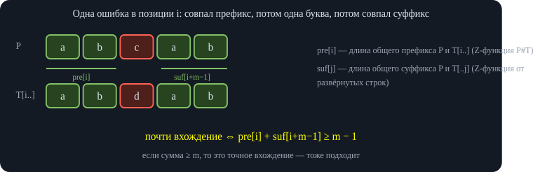\
*Фиксируем начало окна $i$: конец окна известен, поэтому остаётся сравнить два куска.*

Окно $[i,\,i+m-1]$ — почти вхождение тогда и только тогда, когда $\mathrm{pre}_i+\mathrm{suf}_{i+m-1}\ge m-1$: оставшаяся одна буква между кусками как раз и есть допустимая ошибка. Лектор выводит индексы на доске и замечает, что в итоговом выражении длина $P$ сокращается.

<div class="code">

<div class="code-head">

псевдокод

копировать

</div>

```
Z1 = Z-функция(P # T);      pre[i] = Z1[m + 1 + i]
Z2 = Z-функция(rev(P) # rev(T));   suf[j] = Z2[m + 1 + (n − 1 − j)]
для i от 0 до n − m:
    если pre[i] + suf[i + m − 1] ≥ m − 1:   вывести i
```

</div>

Время и память $O(n+m)$. Идею проверили программно на случайных строках над алфавитом из двух букв против прямого сравнения по окнам: расхождений нет.

### 1.2. Циклический сдвиг и xor

**Условие.** Даны две последовательности неотрицательных чисел $a$ и $b$ одинаковой длины $n$. Нужно найти число пар $(k,x)$ таких, что после циклического сдвига $a$ на $k$ позиций и xor каждого элемента с $x$ получится $b$.

**Ключевое наблюдение.** Пусть $a'_i=a_{(i+k)\bmod n}\oplus x$. Тогда xor соседних элементов не меняется: $a'_i\oplus a'_{i+1}=a_{i+k}\oplus a_{i+k+1}$, потому что $x$ входит дважды и уничтожается. Значит, нужное равенство $a'_i=b_i$ для всех $i$ влечёт равенство xor-ов соседних. От неизвестного $x$ мы избавились.

**Для фиксированного $k$ возможен только один $x$:** из $a'_0=b_0$ получаем $x=a_k\oplus b_0$. Поэтому достаточно перебирать $k$, а равенство всей последовательности равносильно равенству xor-ов соседних плюс выбору $x$ по первому элементу.

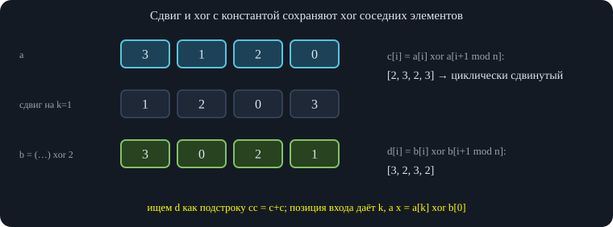\
*Константа $x$ при xor соседей сокращается, поэтому от неё можно избавиться и свести задачу к поиску подстроки.*

**Алгоритм.** Строим циклические xor-ы соседних: $c_i=a_i\oplus a_{(i+1)\bmod n}$ для $a$ и $d_i=b_i\oplus b_{(i+1)\bmod n}$ для $b$, $i=0\ldots n-1$ (включая «стык» последнего с первым). Записываем $c$ два раза подряд, чтобы циклический сдвиг стал обычной подстрокой, и ищем все вхождения $d$ в $cc$ с начальной позицией $k\lt n$ (позиция $k=n$ повторяет $k=0$). Для каждого такого $k$ получаем ровно одну пару $(k,\ a_k\oplus b_0)$.

<div class="code">

<div class="code-head">

псевдокод

копировать

</div>

```
c[i] = a[i] xor a[(i+1) mod n];   d[i] = b[i] xor b[(i+1) mod n]
найти все k из [0, n) такие, что d совпадает с cc[k .. k + n − 1]   (Z-функция или КМП)
ответ = число найденных k
```

</div>

<div class="own">

<span class="lbl">Развёрнутое объяснение</span>\
Нужны именно циклические $n$ xor-ов (с «стыком»), а не $n-1$: тогда совпадение $n$ значений $d$ со сдвигом $k$ гарантирует и $b_i\oplus b_{i+1}=a'_i\oplus a'_{i+1}$ для всех $i$ по кругу, и все $b_i$ получаются из $b_0$ и $x$. Идею проверили программно против перебора всех пар $(k,x)$: расхождений нет. Случай $n=1$ даёт ровно одну пару на каждый $x=a_0\oplus b_0$, то есть ответ 1.

</div>

### 1.3. Перестановка символов

**Условие.** Даны строка $S$ (большая) и $T$ (маленькая). Нужно найти все вхождения $T$ в $S$ с точностью до *переименования букв*: разные буквы переходят в разные, одинаковые — в одинаковые.

**Идея.** Как и в прошлой задаче, ищем инвариант, не зависящий от переименования. Таким инвариантом служит *расстояние до следующей такой же буквы*: во что бы ни перешла буква, расстояния между соседними одинаковыми не меняются, и именно они задают разбиение позиций на группы одинаковых.

Строим $S'$ и $T'$: $S'_i=j-i$, где $j\gt i$ — ближайшая позиция с такой же буквой. Считается одним проходом справа налево с запоминанием для каждой буквы последней встреченной позиции.

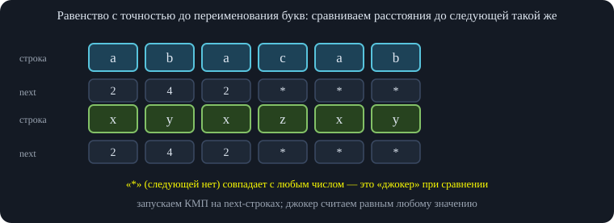\
*abacab и xyxzxy отличаются только переименованием букв: next-массивы совпадают.*

Проблема только у позиций, где следующей такой буквы нет. В записи лектор предлагает: в $T'$ на таких местах «может быть что угодно», и запустить КМП на $T'\#S'$, пропуская эти позиции при сравнении.

<div class="fix">

<span class="lbl">Исправление</span>\
Одного «джокера» недостаточно. Пример: $T=$ `ab` и окно `aa` в $S$. В $T'$ обе позиции — «следующей нет» (джокеры), в окне у первой буквы следующая есть (расстояние 1), и джокер её «принимает», хотя `aa` не получается из `ab` переименованием. Поэтому расстояние в окне нужно *обрезать*: следующая такая же буква, лежащая за концом окна, считается отсутствующей, и «отсутствует» должно совпадать только с «отсутствует». Но обрезка по концу окна зависит от окна и ломает КМП. Проверка на 20 000 случайных пар строк показала, что КМП с джокером даёт неверный ответ в большинстве случаев.

</div>

<div class="own">

<span class="lbl">Развёрнутое объяснение</span>\
Рабочий вариант — зеркальный: вместо расстояния до *следующей* такой же буквы берём расстояние до *предыдущей* ($\mathrm{prev}_i=i-j$, где $j\lt i$ — последняя позиция той же буквы; 0, если такой нет). В окне, начинающемся в позиции $i_0$, значение на позиции $k$ обрезается по началу окна: если $\mathrm{prev}_{i_0+k}\gt k$ (предыдущая буква вне окна), считаем его нулём. Такое значение определяется только уже прочитанной частью окна, поэтому КМП (префикс-функция) работает без джокеров: $T'$ — те же значения $\mathrm{prev}$ образца, а сравнение при $k$ совпавших символах — «$(\mathrm{prev}_S\text{ если }0\lt\mathrm{prev}_S\le k\text{, иначе }0)=\mathrm{prev}_T[k]$». Эквивалентно: применить рассуждение лектора к обеим развёрнутым строкам. Схема проверена на 5 000 случайных пар против прямого сравнения окон с построением биекции букв: расхождений нет.

</div>

<div class="code">

<div class="code-head">

псевдокод

копировать

</div>

```
prevT[j], prevS[i] — расстояние до предыдущей такой же буквы (0, если нет)
eq(p, k):  ((p, если 0 < p ≤ k, иначе 0) == prevT[k])    // p — значение из текста, k — число совпавших символов
fail = префикс-функция образца: для i = 1..m−1: пока k > 0 и не eq(prevT[i], k): k = fail[k];  если eq(prevT[i], k): k++;  fail[i+1] = k
проход по S: k = 0; для каждого i: пока k > 0 и (k == m или не eq(prevS[i], k)): k = fail[k]
                                  если eq(prevS[i], k): k++;   если k == m: вхождение с позиции i − m + 1
```

</div>

### 1.4. Бор в боре

**Условие.** Дан бор $T$ и набор строк. Нужно найти суммарное число вхождений строк набора в строки бора, причём «вхождение» — буквальное: строка встречается как подстрока пути от корня вниз (путь может продолжаться дальше).

**Идея.** Для набора строк строим автомат Ахо—Корасик (его бор $T_1$, суффиксные ссылки, автоматные переходы). Затем обходим бор $T$ в глубину *как строку*, запоминая в каждой вершине $T$ соответствующую вершину автомата — то есть состояние после чтения пути от корня.

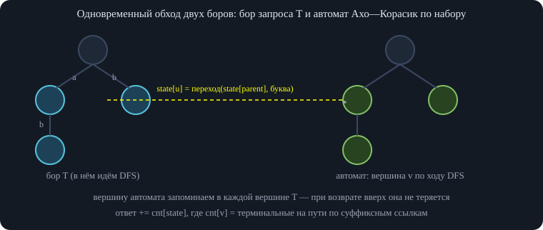\
*Вложенный обход: спускаясь по бору $T$, спускаемся по автоматным рёбрам; по возвращении вершина восстанавливается.*

При спуске по ребру с буквой $c$ вершина автомата меняется по автоматному переходу $\delta(s,c)$; состояние родителя хранится в рекурсии, поэтому после возврата вверх оно не теряется. Для каждой вершины автомата заранее считаем $\mathrm{cnt}[v]$ — число терминальных вершин на пути по суффиксным ссылкам до корня: $\mathrm{cnt}[v]=\mathrm{cnt}[\mathrm{link}(v)]+[v\ \text{терминальна}]$. Явно дерево суффиксных ссылок строить не нужно. В ответ при посещении каждой вершины $T$ добавляется $\mathrm{cnt}[\text{состояние}]$.

<div class="warn">

<span class="lbl">Ловушка</span>\
Нельзя переходить в автомате циклом `while` по суффиксным ссылкам: амортизация («длина текущего состояния растёт на 1 за символ») работает на строке, но не на дереве — размер бора по числу вершин не оценивает сумму длин порождающих строк. Например, «швабра»: миллион букв `a` вниз и маленькие веточки, на которых обход многократно «прыгает» по ссылкам. Поэтому нужны именно готовые автоматные рёбра: каждый переход за $O(1)$, всего $O(|T_1|\cdot\sigma)$ памяти ($\sigma=26$).

</div>

<div class="code">

<div class="code-head">

псевдокод

копировать

</div>

```
построить автомат по набору, посчитать cnt[v]
dfs(u, s):                      // u — вершина бора T, s — состояние автомата
    ans += cnt[s]
    для каждого ребра u --c--> w:   dfs(w, δ(s, c))
dfs(корень T, корень автомата)
```

</div>

### 1.5. Удаление первого или второго символа

**Условие.** Дан набор различных строк. Пара $(i,j)$ «подходит», если из $S_i$ последовательными удалениями первого или второго символа можно получить $S_j$. Нужно посчитать число таких пар.

**Структура процесса.** Можно считать, что сначала несколько раз удаляют первый символ, а потом несколько раз — второй. Если удалили второй символ, а затем снова первый, то результат тот же, что при удалении сразу большого куска слева: всё удалённое слева «склеивается» ().

**Критерий.** Для $i\ne j$ пара подходит тогда и только тогда, когда выполнено одно из двух условий: либо $S_j$ — суффикс $S_i$; либо $S_j$ без первой буквы ($S_j[1{:}]$) — суффикс $S_i$, а первая буква $S_j[0]$ встречается в $S_i$ на позиции *строго меньше* $|S_i|-|S_j|$ ().

<div class="own">

<span class="lbl">Развёрнутое объяснение</span>\
Результат процесса — это $s_k\,s_{m}s_{m+1}\dots$: оставили одну букву на позиции $k$, а затем вторым удалением сняли $t=m-k-1\ge0$ следующих за ней букв. При $t=0$ получается суффикс $S_i$, при $t\ge1$ — буква $S_i[k]$ плюс суффикс, начинающийся с позиции $m\ge k+2$. Если $S_j[1{:}]$ — суффикс, начинающийся с позиции $m=|S_i|-|S_j|+1$, то условие $k\le m-2$ записывается именно как $k\lt|S_i|-|S_j|$. Оба случая могут выполняться одновременно (например, $S_j=$ `c` — суффикс строки `cbc`, но буква `c` встречается и раньше); считать такую пару нужно один раз. Критерий проверен программно на всех строках над тремя буквами длины до 8 против перебора достижимых строк.

</div>

Работать удобнее с префиксами, поэтому *разворачиваем* все строки: «суффикс» становится «префиксом», а «буква левее начала суффикса» — «буква правее конца префикса». Теперь пара подходит, если $S_j$ — собственный префикс $S_i$, либо $S_j$ без последней буквы — префикс $S_i$, а последняя буква $S_j$ встречается в $S_i$ *правее* этого префикса, не считая сразу следующую за ним позицию.

Строим бор на развёрнутых строках. Первая мысль — хранить в каждой вершине множество букв из поддерева (маска по 26 буквам, а ещё нужно уметь считать количество). Это слишком тяжело по памяти, и после обсуждения со слушателями () находится экономный способ.

- **Маска у каждой вершины.** В вершине $v$ бор хранит маску $\mathrm{mask}[v]$: бит $c$ стоит, если существует строка $S_j$, у которой «$S_j$ без последней буквы» приводит в $v$, а последняя буква равна $c$. Памяти — $O(|\text{бор}|)$ слов.
- Достаточно именно маски, а не счётчика: строки различны, и две разные $S_j$, пришедшие в одну вершину без последней буквы, различаются последними буквами.
- Фиксируем *более длинную* строку $S_i$ и идём по ней по бору сверху вниз. Заводим массив $\mathrm{cnt}[c]$ — сколько раз буква $c$ ещё встретится правее текущей позиции в $S_i$. При спуске по букве вычитаем её, и в каждой вершине получаем вторую маску «какие буквы ещё остались справа». В вершине $v$ добавляем к ответу число общих битов двух масок.
- Случай «$S_j$ — собственный префикс $S_i$» — число терминальных вершин на пути (вершина самой $S_i$ не считается).

<div class="note">

<span class="lbl">Не считать дважды</span>Строка $S_j=S_i[0..L)+c$ — собственный префикс $S_i$, если $c=S_i[L]$; такая строка уже учтена вторым случаем. Поэтому в первом случае из маски «остатка справа» исключается и бит буквы $S_i[L]$ — иначе пара считается дважды.

</div>

<div class="code">

<div class="code-head">

псевдокод

копировать

</div>

```
построить бор по развёрнутым строкам; для каждой S_j:
    term[вершина(S_j)] = true;   mask[вершина(S_j без последней буквы)] |= бит(последняя буква S_j)
для каждой S_i:
    cnt[c] = число букв c в S_i;   m = маска букв с cnt[c] > 0;   v = корень
    для L от 0 до |S_i| − 1:                         // v — вершина, соответствующая префиксу S_i[0..L)
        если term[v]:  ответ += 1                    // S_j — собственный префикс S_i
        c = S_i[L];   cnt[c] −= 1;   если cnt[c] == 0:  m −= бит(c)     // теперь m — буквы S_i[L+1..]
        ответ += popcount(mask[v] & m & ~бит(c))
        v = ребро(v, c)
```

</div>

<div class="note">

<span class="lbl">Сложность</span>Время $O(\sum|S_i|)$ (маска букв обновляется только при обнулении счётчика), память $O(\text{бор})$. Код на псевдоязыке проверен на 3 000 случайных наборах различных строк над тремя буквами: ответ совпал с перебором всех пар.

</div>

### 1.6. Игра с xor

**Условие.** Дано $2n$ чисел (до $2^{30}$). Алиса и Боб ходят по очереди, начинает Алиса: Алиса берёт число $x$, Боб — число $y$, и записывается число $x\oplus y$. После $n$ раундов смотрим на $n$ записанных чисел и берём максимальное. Алиса хочет его максимизировать, Боб — минимизировать. Нужно найти итог при оптимальной игре.

**Лексикографический взгляд.** Дополним числа до 30 бит ведущими нулями: тогда сравнение чисел совпадает с лексикографическим сравнением битовых строк, и ответ можно искать жадно по старшим битам.

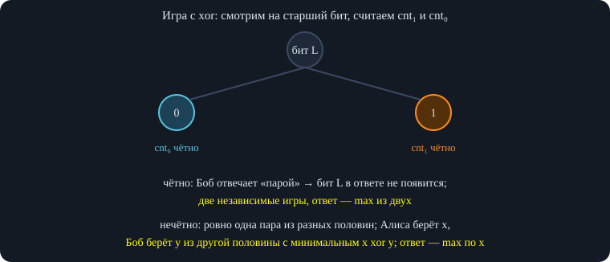\
*Разбор по старшему биту сверху вниз; нечётный случай заканчивает рекурсию в этой вершине.*

Берём старший бит $L$ и делим числа на множества $X$ (бит стоит) и $Y$ (бит не стоит). Количества $\mathrm{cnt}_1=|X|$ и $\mathrm{cnt}_0=|Y|$ имеют одну чётность: всего чисел чётное количество.

**Случай 1: $\mathrm{cnt}_1$ чётно.** Боб разбивает $X$ на пары и $Y$ на пары; на любой ход Алисы отвечает партнёром по паре. Тогда ни один записанный xor не содержит бита $L$, и игра распадается на две независимые игры — на $X$ и на $Y$ (в каждой Алиса ходит первой, Боб отвечает в том же множестве). Ответ — максимум из ответов этих двух игр.

**Случай 2: $\mathrm{cnt}_1$ нечётно.** Тогда в любой партии обязательно найдётся раунд, где одно число из $X$, а другое из $Y$: xor этой пары содержит бит $L$, а все остальные раунды (если Боб ведёт себя разумно) бита $L$ не содержат. Значит, значение партии определяется парой «из разных множеств».

<div class="fix">

<span class="lbl">Исправление</span>\
В записи лекции дальше звучит вывод: «Алиса выбирает любое число, Боб отвечает числом из противоположного множества с минимальным xor, а Алиса берёт максимум по своим выборам». Такой формулой $\max_x \min_y (x\oplus y)$ получаются *неверные* ответы: проверка полным перебором игры на $2n\le 6$ числах дала расхождения (например, для чисел 15, 2, 0, 15, 8, 7 перебор даёт 8, а эта формула — 10), потому что Боб вовсе не обязан сразу завершать «перекрёстную» пару, а Алиса может так не вынудить его. Верен более простой итог: в нечётном случае ответ равен **минимуму $x\oplus y$ по всем парам $x\in X$, $y\in Y$**. Доказательство ниже.

</div>

<div class="own">

<span class="lbl">Развёрнутое объяснение</span>\
**Оценка сверху.** Пусть $(x^*,y^*)$ — пара из разных множеств с минимальным xor $m$. Боб разбивает на пары все числа: $X\setminus\{x^*\}$ внутри себя (чётное число), $Y\setminus\{y^*\}$ внутри себя, а $x^*$ с $y^*$. На любой ход Алисы он отвечает партнёром. Все внутренние пары имеют xor $\lt 2^L$, а $m\ge 2^L$ (бит $L$ стоит), поэтому максимум равен ровно $m$. **Оценка снизу.** Так как $|X|$ нечётно, в любой партии есть хотя бы один раунд с числами из разных множеств, его xor не меньше $m$. Значит, Алиса получит не меньше $m$ при любой игре Боба — например, играя произвольно. Итого ответ $=m$. Проверено программно: рекурсия «чётно — максимум из двух половин, нечётно — минимум по перекрёстным парам» совпадает с полным перебором игры на тысячах случайных наборов из 2, 4 и 6 чисел (в том числе с повторами).

</div>

**Реализация через бор по битам.** Кладём все числа в бор (30 уровней). Для вершины $v$ считаем размер поддерева. Если число терминальных в $v$ чётно, ответ — максимум ответов двух детей; если нечётно, считаем минимальный xor между числами из левого и правого поддерева и дальше не спускаемся. Минимальный xor между двумя множествами ищется спуском по бору: для каждого числа из меньшего множества запрос «число с минимальным xor» в боре другого за $O(L)$. Каждое число участвует в такой операции один раз — на вершине, где происходит остановка, — и поддеревья после остановки не пересекаются, поэтому суммарно $O(nL)$.

<div class="code">

<div class="code-head">

псевдокод

копировать

</div>

```
solve(v, бит):                         // v — вершина бора, бит — текущий уровень
    если размер(v) чётен:
        вернуть max(solve(левый), solve(правый))     // отсутствующий ребёнок даёт 0
    иначе:
        вернуть min x xor y по x из левого, y из правого поддерева    // спуск по бору
ответ = solve(корень, 29)
```

</div>

### 1.7. Палиндромы

**Подсчёт палиндромов.** Число подстрок-палиндромов в строке длины $10^5$ считается перебором центра (отдельно для чётной и нечётной длины) с радиусом из алгоритма Манакера либо хэшей с бинарным поиском; Манакер даёт $O(n)$.

### 1.8. Два подряд идущих палиндрома одинаковой длины

**Условие (по записи лекции).** В строке нужно посчитать число подстрок, которые являются конкатенацией двух подряд идущих палиндромов одинаковой длины. Рассматриваются по отдельности случаи чётной и нечётной длины палиндромов;

**Идея.** Посчитаем Манакером для каждого центра максимальную длину палиндрома $m_c$ (центры нумеруем по «удвоенной» строке: нечётные палиндромы — чётные номера, чётные — нечётные, расстояние между соседними центрами — полсимвола). Пара подходящих подстрок задаётся двумя центрами $i\lt j$: центры соседних палиндромов длины $\ell$ отстоят на $\ell$ символов, то есть $j-i=2\ell$ в удвоенных координатах. Условия: оба палиндрома длины $\ell$ существуют, то есть $\ell\le m_i$ и $\ell\le m_j$.

Переписываем условия так, чтобы всё, что зависит от одного индекса, оказалось в одной части:

$$ j\le i+2m_i,\qquad i\ge j-2m_j,\qquad i\lt j. $$

Кроме того, чётность длины $\ell$ (то есть класс $i\bmod 4$ и $j\bmod 4$) должна быть согласована: для $i$ чётного нужно $j\equiv i+2\pmod 4$, для $i$ нечётного — $j\equiv i\pmod 4$.

<div class="own">

<span class="lbl">Развёрнутое объяснение</span>\
Это точная форма условий, которую лектор в записи выводит «по ходу» с оговорками: центры $i$ и $j$ должны иметь одинаковую чётность, а $\ell=(j-i)/2$ — нужную. Ограничения на четверть в $i\bmod 4$ нужны именно для этого. Формулу и подсчёт ниже проверили программно: двойной перебор, сканлайн с деревом Фенвика и прямой подсчёт подстрок совпали на случайных строках над алфавитом из двух букв длины до 12.

</div>

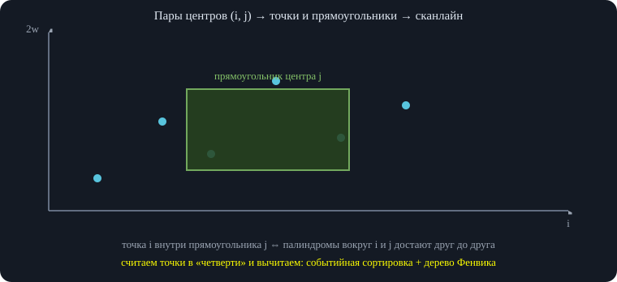\
*Условия вида «левая часть зависит от $i$, правая — от $j$» превращаются в подсчёт точек в прямоугольниках.*

Требования вида «часть зависит от $i$, часть — от $j$» перебором не посчитать ($O(n^2)$). Превращаем в геометрию: каждому $i$ соответствует точка с координатами $(i,\ i+2m_i)$, каждому $j$ — прямоугольник: $x\in[j-2m_j,\ j-1]$, $y\ge j$. Пара подходит, если точка $i$ лежит внутри прямоугольника $j$.

**Подсчёт точек в прямоугольниках.** Каждый прямоугольник раскладываем на разность двух «квадрантов» (до правого края $x\le j-1$ и до $x\le j-2m_j-1$, оба с условием $y\ge j$). Сортируем события по $x$ (при равенстве сначала точки, потом запросы), точки добавляем в дерево по $y$ (дерево отрезков или Фенвика), запрос — число точек с $y\ge j$. Условие согласованности чётности решается тем, что мы запускаем сканлайн отдельно для каждого класса $(i\bmod4,\ j\bmod4)$.

<div class="code">

<div class="code-head">

псевдокод

копировать

</div>

```
для каждого класса (ci, cj) по модулю 4:
    события: точка (x = i, y = i + 2·m[i]) для i ≡ ci;
             запрос (x = j − 1, +1) и (x = j − 2·m[j] − 1, −1) со значением y = j для j ≡ cj
    сортировка по x, при равных — точки раньше запросов
    проход: точка → add(y);  запрос → ответ += знак · (число добавленных точек с y ≥ j)
```

</div>

Время $O(n\log n)$. Лектор отдельно разбирает чётные палиндромы и оставляет нечётные «упражнением читателя» (там меняется лишь $\pm1$ в границах); в удвоенной нумерации центров оба случая обрабатываются одним сканлайном.

### 1.9. Вхождения шаблонов, вирус, показанные слова

**Все вхождения набора строк в текст.** Задача «с лекции»: строим автомат Ахо—Корасик, идём по тексту, а в каждой вершине поднимаемся по *сжатым* суффиксным ссылкам (ссылкам на ближайшую терминальную вершину) и выводим вхождения. Гарантируется, что вхождений адекватное число, поэтому вывод укладывается во время.

**Вирус.** Даны $n$ бинарных строк. Нужно определить, существует ли бесконечная бинарная строка, не содержащая ни одной из них. Строим автомат Ахо—Корасик по набору. Если такая бесконечная строка существует, то при чтении её автомат никогда не оказывается в «плохой» вершине. Поэтому: помечаем плохими все терминальные вершины и все вершины, из которых по суффиксным ссылкам достижима терминальная (в записи это сформулировано как «забанить поддерево терминальных»); оставшиеся вершины и автоматные рёбра между ними образуют ориентированный граф. Бесконечная строка существует тогда и только тогда, когда в этом графе из корня достижим цикл.

<div class="own">

<span class="lbl">Важное дополнение</span>\
Точное правило «плохая вершина»: вершина плохая, если сама терминальна или её суффиксная ссылка ведёт в плохую (то есть на пути по ссылкам есть терминальная). Только так учитываются вхождения запрещённых строк как суффиксов текущего префикса. Цикл ищут обходом в глубину с цветами.

</div>

**Показанные слова.** Есть $n$ строк и $q$ запросов двух видов: «показать слово» (добавить его в список просмотренных) и «спросить про индекс $i$» — сколько из показанных к этому моменту слов входит как подстрока в $S_i$. Если бы словарь был фиксирован, строился бы автомат по нему и считался проход по $S_i$. Добавлять слова в автомат «на лету» нельзя, поэтому предлагается взять сразу *все* слова из запросов и построить автомат по ним, а потом проходить по $S_i$. На этом месте разбор прерывается: время занятия вышло, лектор передаёт слово следующему преподавателю и объявляет перерыв.

## 2. Разбор дистанционного тура

Четыре задачи тура разобраны быстро; подробности лектор обещает в письменном разборе, поэтому здесь даны основные идеи.

### 2.1. A. Змейка по вертикальным и горизонтальным полосам

**Условие (в записи пересказано частично).** Есть вертикальные и горизонтальные полосы и много запросов: человека ставят в точку, он идёт вниз со скоростью одна клетка в минуту; направление на перекрёстках зависит от чётности пройденного (). Для каждого запроса надо сказать, где он окажется через $T$ минут.

**Идея.** Пока отрезки чётной длины, направление после них не меняется, а первый нечётный отрезок его меняет. Поэтому чётные отрезки «сжимаем» до ближайшего нечётного. После сжатия маршрут — змейка: нечётный шаг вниз, нечётный вправо, и так далее.

Для запроса $T$ бинпоиском перебираем число полных ходов $x$: по префиксным суммам проверяем, что $x$ ходов укладываются в $T$, а ещё один уже нет. Остаток времени засчитывается как движение внутри следующего отрезка.

### 2.2. B. Дек и цепочки по делимости

**Условие.** Есть дек и запросы: добавить число слева или справа, убрать слева или справа. Каждое число добавляется не более 10 раз; числа в каждый момент различны и не превосходят $10^6$. После каждого запроса надо выводить длину самой длинной цепочки $a_{i_1}\mid a_{i_2}\mid\dots$ (каждое следующее делится на предыдущее) и их число.

**Длина ответа мала.** Если числа различны, то $a_2\ge 2a_1$, $a_3\ge 2a_2$ и т. д., откуда $a_k\ge 2^{k-1}a_1\ge 2^{k-1}$. При $a_k\le10^6$ получаем $k\le 20$–$22$.

**Динамика.** $dp[i][\ell]$ — число цепочек длины $\ell$, начинающихся с элемента $i$ (в дек добавляются только справа, а слева — удаляются, поэтому «правые» цепочки меняются только при добавлении/удалении). Поддерживаем максимум длины и число цепочек этой длины.

- **Удаление слева.** Остальные значения $dp$ не меняются; достаточно очистить $dp$ удаляемого элемента.
- **Добавление слева.** Нужно посчитать $dp$ нового элемента: цепочка, начинающаяся в нём, продолжается числами, кратными ему (в записи сказано «делят»), поэтому перебираем такие числа в деке и суммируем их $dp$ с увеличением длины на 1. Каждое число добавляется не более 10 раз, и по оценке лектора это укладывается в лимит ().
- **Добавление справа.** Меняются значения $dp$ у *делителей* нового числа слева. Идём по делителям $d$ нового $a_i$ в порядке убывания: сначала $a_i$, потом $a_i/x$ для минимального простого $x$, и т. д. и «проталкиваем» $dp[q]\mathrel{+}=dp[d]$ для делителей $q$ числа $d$ (с учётом длины). Число операций — порядка числа троек $x\mid y\mid z$ с $z\le10^6$, это около $1{,}4\cdot10^8$ при переборе по количеству делителей.
- Удаление справа делается теми же проходами с вычитанием вместо прибавления.

Лектор отмечает, что в разборе заявлены около $1{,}4\cdot10^8$ операций и 2–3 секунды, поэтому массивы лучше делать статическими, а не векторами.

### 2.3. C. Лампочки и электрики

**Условие (по записи — частично).** Лампочки стоят на отрезках с шагом $M$, электрики — тоже на отрезке с шагом $M$ от $A$ до $B$; нужно минимизировать время ремонта. Малая подгруппа ($n,p\le8$) решается перебором, следующая — динамикой за $O(n^2s)$.

**Динамика.** $dp[i][j]$ — минимум времени, чтобы починить первые $i$ лампочек, использовав $j$ рабочих. Каждый рабочий обслуживает подотрезок лампочек: если пути двух рабочих пересеклись, один из маршрутов можно обрезать. Маршрут рабочего — либо «сначала влево до конца, потом вправо», либо наоборот, стоимость $\min(x-l,\ r-x)+(r-l)$ (с поправкой на $\pm1$).

**Ускорение.** Между двумя соседними лампочками на расстоянии $d$ возможно лишь 5 вариантов: никто не проходит ($0$), один проход вправо ($d$), один влево ($d$), правый разворот: идти вправо и вернуться ($2d$), левый разворот ($2d$). Состояние — один из пяти вариантов последнего промежутка. Динамика идёт одним линейным проходом, на каждом шаге — $5\times5=25$ переходов с добавкой $0$, $d$ или $2d$.

Переход можно записать как «умножение» вектора из 5 значений на матрицу $5\times5$ в полукольце $(\min,+)$: $C_{ij}=\min_k (A_{ik}+B_{kj})$. Эта операция ассоциативна (лектор доказательство опускает, оно будет на лекциях дальше), поэтому длинные серии одинаковых переходов считаются бинарным возведением матрицы в степень за $O(\log p)$ матричных умножений по $5^3=125$ операций.

Если все $M=1$ (лампочки подряд), ответ — произведение матриц по отрезкам (степени по длинам). Если $M\gt1$, прогрессии разных остатков накладываются, поэтому лампочки раскладываем в таблицу «длина × остаток по модулю $M$». Для подгруппы $n,p\le 10^4$ все нужные расстояния считаются за квадрат плюс логарифм (дерево Фенвика); для полной группы нужна оптимизация, которую лектор оставляет письменному разбору. Для последних баллов предлагается дерево отрезков, где в вершине хранится произведение матриц.

### 2.4. D. Экстремальные перестановки по шаблону

**Условие.** Дан шаблон перестановки: часть элементов известна, часть — произвольна. Для перестановки $p$ определим $f(p)=\min_i |p_i-p_{i+1}|$. Перестановка *экстремальна*, если $f(p)$ максимально среди всех перестановок длины $n$. Нужно посчитать число экстремальных перестановок, подходящих под шаблон.

**Чётное $n=2k$.** Делим числа на блоки $[1,k]$ и $[k+1,2k]$. Любые два числа из одного блока рядом стоять не могут (разность была бы меньше $k$), поэтому блоки чередуются, и $f=k$. Числа $k$ и $k+1$ имеют единственного подходящего соседа каждое, значит, стоят на концах, а дальше перестановка задана однозначно «змейкой» с шагом $k$. Экстремальных всего две: сама змейка и её разворот. Для каждой проверяем совпадение с шаблоном. (Программный перебор для $n\le 8$ подтверждает: максимум $f$ равен $n/2$ и достигается ровно на двух перестановках; для нечётных $n\le9$ максимум равен $k=\lfloor n/2\rfloor$.)

**Нечётное $n=2k+1$.** Блоки $[1,k]$, $\{k+1\}$, $[k+2,2k+1]$. Оценка $f\le k$ та же, и она достигается. Но теперь число $k+1$ мешает: либо оно стоит с краю, либо во внутренней позиции — тогда его соседи только $1$ и $2k+1$. Различаются случаи «позиция $k+1$ чётная или нечётная».

Числа удобно разбить на пары $(x,\ x+k)$: в экстремальной перестановке пары должны быть соседями (с разностью ровно $k$). Перестановка строится *отрезками*: если уже расставлены числа $1..g-1$ внутри отрезка, то числа $1+g$ и $1+g+k$ ставятся однозначно — к краю, где сейчас находится меньшее значение; так отрезок расширяется на 2.

- **$k+1$ на краю.** Оба конца свободного отрезка — «большие», и каждую пару можно поставить в левый или правый конец. Вариантов — степень двойки (лектор называет $2^{k-1}$).
- **$k+1$ внутри, позиция нечётна.** Остаются два свободных отрезка (префикс и суффикс) чётной длины. Каждую пару нужно отправить в левый или правый отрезок; число способов — биномиальный коэффициент $\binom{\cdot}{\cdot}$. Для него есть вторая интерпретация — пути в таблице $n\times m$ из левого верхнего угла в правый нижний (: $\binom{n+m}{m}$), а уже зафиксированные соседние пары в шаблоне задают точки, через которые путь обязан пройти. Ответ — произведение биномов по участкам между такими точками.
- **$k+1$ внутри, позиция чётна.** Отрезки получаются «одинаковыми» (минимум-минимум и максимум-максимум), и на каждом шаге есть выбор из двух; ответ — степень двойки.

Перебирая позицию числа $k+1$ и считая предпосчитанные биномы, получаем решение за $O(n^2)$ при $n\le 20000$ (: порядка $2\cdot10^8$ операций, укладывается в 2 секунды; в худшем случае различных значений не более $n/2$). Подробный разбор лектор обещает в письменном виде.

<div class="note">

<span class="lbl">Заметка</span>Точная комбинаторика нечётного случая в записи изложена по ходу и не всегда доведена до формул, поэтому здесь передана структура решения без подстановки конкретных индексов в биномы.

</div>

## 3. Математика 1: решето Эратосфена

Тема лекции — «Математика 1». Начинается она с «легендарной» вещи — решета Эратосфена: путь от $O(n\log n)$ через $O(n\log\log n)$ к линейному решету. Весь код ниже — на C++17 (проверен на случайных тестах и перебором).

### 3.1. Первая версия: отмечаем кратные для каждого $i$

Заводим массив $\mathrm{lp}$ (наименьший простой делитель), изначально нулевой. Идём $i$ от 2 до $A$: если $\mathrm{lp}[i]=0$, то $i$ простое, кладём $\mathrm{lp}[i]=i$. Затем для *каждого* $i$ проходим по $j=2i,3i,\dots\le A$ и записываем $\mathrm{lp}[j]=i$ там, где значение ещё не записано. Сколько это работает? Для фиксированного $i$ — $\lfloor A/i\rfloor$ шагов, суммарно $A\cdot(\frac12+\frac13+\dots+\frac1A)$.

### 3.2. Сумма $\sum 1/i$

Округление можно отбросить. **Оценка сверху:** разбиваем слагаемые на группы $\frac1{2^k},\dots,\frac1{2^{k+1}-1}$: в группе $2^k$ слагаемых, каждое не больше $2^{-k}$, значит, сумма группы не больше 1. Групп $\log_2 A$, поэтому $\sum\le\log_2 A$.

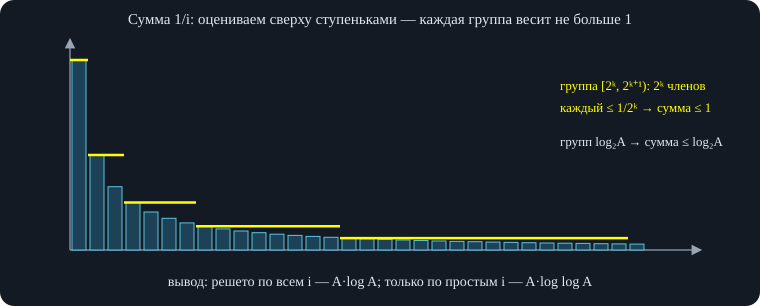\
*Гармонический ряд растёт как $\ln A$ ($\approx 14$ при $A=10^6$), поэтому «сумма $A/i$» — это $O(A\log A)$.*

**Оценка снизу** (по площади под графиком): в группе $\frac1{2^k+1},\dots,\frac1{2^{k+1}}$ каждое слагаемое не меньше $2^{-(k+1)}$, сумма группы не меньше $\frac12$, откуда $\sum\ge\frac12\log_2 A$. Итого $\Theta(\log A)$, и решето работает за $\Theta(A\log A)$.

<div class="note">

<span class="lbl">Точное значение</span> По интегральному признаку $\sum_{i\le A}\frac1i\approx\ln A+\gamma$, где $\gamma\approx0{,}577$ — постоянная Эйлера—Маскерони (: у лектора «меньше 1»). Гармонический ряд расходится, но медленно: при $A=10^6$ сумма около 14.

</div>

### 3.3. Решето за $O(A\log\log A)$

Внутренний цикл достаточно запускать только для простых $i$ (: тогда сумма $\sum_{i\le A,\ i\ \text{простое}}\frac Ai$, а простых до $A$ около $A/\ln A$, и сумма даёт $\ln\ln A$ вместо $\ln A$; подробности — в учебнике). Ещё ускорение: внутренний цикл начинается не с $2i$, а с $i\cdot i$ (меньшие кратные уже отмечены меньшими простыми). Осторожно: $i\cdot i$ в `int` переполняется при $i\gtrsim46341$, поэтому считаем в `long long`.

<div class="code">

<div class="code-head">

C++

копировать

</div>

```
const int A = 100000;
int lp[A + 1];                                   // lp[i] — наименьший простой делитель i (0, пока не найден)
void sieve_simple() {
    for (int i = 2; i <= A; i++)
        if (lp[i] == 0) {                        // i простое
            lp[i] = i;
            for (long long j = 1LL * i * i; j <= A; j += i)   // i*i считаем в long long: в int будет переполнение
                if (lp[j] == 0) lp[j] = i;
        }
}
```

</div>

### 3.4. Линейное решето

Недостаток: составное число отмечается несколько раз. Например, 30 просматривается при $i=2$, при $i=3$ и при $i=5$. Хочется обходить числа так, чтобы каждое составное $c$ получалось ровно один раз.

**Ключевая идея.** Любое составное $c$ единственным образом записывается как $c=\mathrm{lp}(c)\cdot i$, где $\mathrm{lp}(c)$ — его наименьший простой делитель. Будем перебирать *$i$* (а не $c$), и для каждого $i$ пробегать простые $x$ и записывать $\mathrm{lp}[i\cdot x]=x$. Чтобы $x$ действительно был наименьшим простым делителем $i\cdot x$, нужно $x\le\mathrm{lp}(i)$ (: «$x$ не больше минимального простого делителя $i$»). Это условие остановки внутреннего цикла.

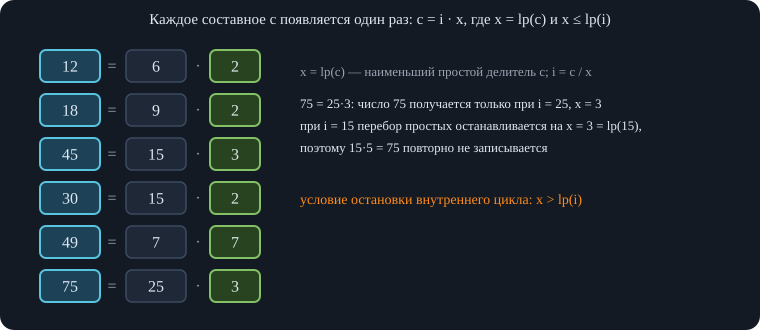\
*Число $c$ единственным образом записывается как «наименьший простой делитель» $\cdot$ «остальное» — отсюда $O(A)$.*

<div class="code">

<div class="code-head">

C++

копировать

</div>

```
const int A = 100000;
int lp[A + 1];
vector<int> primes;                              // найденные простые по возрастанию
void sieve_linear() {
    for (int i = 2; i <= A; i++) {
        if (lp[i] == 0) { lp[i] = i; primes.push_back(i); }
        for (int x : primes) {
            if (x > lp[i] || 1LL * i * x > A) break;   // нужно x ≤ lp(i), иначе c = i·x получится повторно
            lp[i * x] = x;                       // x — наименьший простой делитель числа i·x
        }
    }
}
```

</div>

Корректность: каждое составное $c$ имеет единственное представление $c=x\cdot i$, $x=\mathrm{lp}(c)$, $i=c/x$; при этом $\mathrm{lp}(i)\ge x$, поэтому цикл по $i$ дойдёт до $x$ и запишет $\mathrm{lp}[c]=x$ ровно один раз. Время $O(A)$, память $O(A)$. Побочно получили $\mathrm{lp}$ для всех чисел.

<div class="own">

<span class="lbl">Важное дополнение</span>\
Массив $\mathrm{lp}$ позволяет раскладывать любое $c\le A$ на простые за $O(\log c)$: делим на $\mathrm{lp}[c]$, пока не дойдём до 1.

</div>

<div class="algo" data-frames="linsieve">

</div>

### 3.5. Все делители всех чисел

**Задача.** Для каждого $i\le A$ получить список его делителей. Перебирать для $i$ делители неэффективно; наоборот, фиксируем делитель $g$ и дописываем его ко всем числам $2g,3g,\dots$, которые он делит. Для $g$ это $\lfloor A/g\rfloor$ операций, суммарно снова гармонический ряд: $O(A\log A)$ (: «за два цикла получили список делителей»). Размер ответа тоже $\Theta(A\log A)$.

## 4. Мультипликативные функции

**Определение.** Функция $f$, определённая на натуральных числах, *мультипликативна*, если для любых взаимно простых $m$ и $n$ выполнено $f(mn)=f(m)\,f(n)$ (значение произведения равно произведению значений, но только если числа взаимно просты; $\gcd(m,n)=1$). Все такие функции можно посчитать для всех $n\le A$ за линейное время, используя линейное решето.

### 4.1. Число делителей $d(n)$

Основная теорема арифметики: $n=p_1^{\alpha_1}\cdots p_k^{\alpha_k}$ с различными простыми $p_i$ и $\alpha_i\ge1$. Делитель числа $n$ имеет вид $p_1^{\beta_1}\cdots p_k^{\beta_k}$ с $0\le\beta_i\le\alpha_i$, и наоборот, любая такая расстановка даёт делитель. Следовательно,

$$ d(n)=(\alpha_1+1)(\alpha_2+1)\cdots(\alpha_k+1). $$

Для взаимно простых $m,n$ в формулу входят независимые наборы простых, поэтому $d(mn)=d(m)d(n)$.

### 4.2. Как считать мультипликативную функцию в решете

Считаем значение для степени простого $f(p^\alpha)$, а для остальных чисел пользуемся мультипликативностью. В линейном решете для каждого числа запоминаем *наименьший простой делитель, его показатель и саму степень* $p^\alpha$. Когда мы умножаем $i$ на простое $x$: если $x\lt \mathrm{lp}(i)$, то $x$ и $i$ взаимно просты и $f(ix)=f(i)f(x)$; если $x=\mathrm{lp}(i)$, то степень наименьшего простого растёт на 1, и значение пересчитываем как $f(\text{остаток без }p^\alpha)\cdot f(p^{\alpha+1})$ — остаток взаимно прост со степенью. Для $d$: $d(p^\alpha)=\alpha+1$.

### 4.3. Сумма делителей $\sigma(n)$

Делитель выбирается независимо по каждому простому, поэтому сумма всех делителей раскладывается в произведение скобок:

$$ \sigma(n)=\prod_{i=1}^{k}\bigl(1+p_i+p_i^2+\dots+p_i^{\alpha_i}\bigr). $$

Мультипликативность следует из независимости скобок, а значение на степени простого — сумма геометрической прогрессии $\sigma(p^\alpha)=\frac{p^{\alpha+1}-1}{p-1}$.

### 4.4. Функция Эйлера $\varphi(n)$

$\varphi(n)$ — количество чисел от 1 до $n$, взаимно простых с $n$. Например, $\varphi(6)=2$ (числа 1 и 5). Мультипликативность неочевидна, докажем её.

**Доказательство.** Пусть $\gcd(m,n)=1$. Запишем числа $0,1,\dots,mn-1$ в таблицу $n\times m$ по строкам: в строке $r$ стоят числа $rm,\dots,rm+m-1$: строк $n$, столбцов $m$. Взаимная простота с $mn$ равносильна взаимной простоте и с $n$, и с $m$.

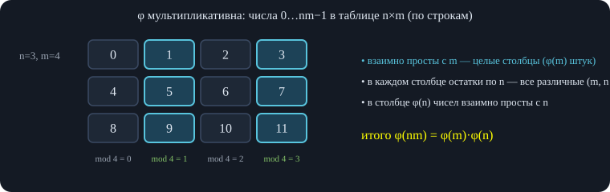\
*Столбец — фиксированный остаток по $m$; внутри столбца остатки по $n$ пробегают все значения.*

1.  Числа одного столбца имеют одинаковый остаток по модулю $m$, а число взаимно просто с $m$ тогда и только тогда, когда с $m$ взаимно прост его остаток по модулю $m$. Поэтому ровно $\varphi(m)$ столбцов состоят целиком из чисел, взаимно простых с $m$, а в остальных столбцах нет ни одного такого числа.
2.  Возьмём один из этих $\varphi(m)$ столбцов. Его числа имеют вид $r+km$, $k=0,\dots,n-1$. Утверждаем, что их остатки по модулю $n$ различны. Если $r+km\equiv r+lm\pmod n$, то $n\mid m(k-l)$, а так как $\gcd(m,n)=1$, то $n\mid k-l$; но $|k-l|\lt n$, значит $k=l$.
3.  Тогда эти $n$ чисел дают все $n$ остатков по модулю $n$, и взаимно простых с $n$ среди них ровно $\varphi(n)$ — как и среди всех остатков.

Итого взаимно простых с $mn$ чисел $\varphi(m)\varphi(n)$. В решете значение на степени простого: $\varphi(p^\alpha)=p^{\alpha}-p^{\alpha-1}=p^{\alpha-1}(p-1)$. При умножении на $x=\mathrm{lp}(i)$ получаем $\varphi(ix)=\varphi(i)\cdot x$; при $x\ne\mathrm{lp}(i)$ — $\varphi(ix)=\varphi(i)(x-1)$.

<div class="code">

<div class="code-head">

C++

копировать

</div>

```
const int A = 100000;
int lp[A + 1];
int e[A + 1];          // e[i]  — показатель наименьшего простого в i
int pw[A + 1];         // pw[i] — наибольшая степень наименьшего простого, делящая i  (p^e)
int sp[A + 1];         // sp[i] — 1 + p + … + p^e для этого простого (хватает и для A ≤ 1e5)
long long d[A + 1], sigma[A + 1], phi[A + 1];
void mult_sieve() {
    vector<int> primes;
    d[1] = sigma[1] = phi[1] = 1; pw[1] = 1;
    for (int i = 2; i <= A; i++) {
        if (lp[i] == 0) {                        // i простое: значения для p^1
            lp[i] = i; primes.push_back(i);
            e[i] = 1; pw[i] = i; sp[i] = i + 1;
            d[i] = 2; sigma[i] = i + 1; phi[i] = i - 1;
        }
        for (int x : primes) {
            if (x > lp[i] || 1LL * i * x > A) break;
            int c = i * x; lp[c] = x;
            if (x < lp[i]) {                     // x не делит i  ⇒  gcd(i, x) = 1: умножаем значения
                e[c] = 1; pw[c] = x; sp[c] = x + 1;
                d[c] = d[i] * 2; sigma[c] = sigma[i] * sp[c]; phi[c] = phi[i] * (x - 1);
            } else {                             // x = lp(i): показатель наименьшего простого вырос на 1
                e[c] = e[i] + 1; pw[c] = pw[i] * x; sp[c] = sp[i] * x + 1;
                int rest = c / pw[c];            // часть без наименьшего простого: она взаимно проста с p^e
                d[c] = d[rest] * (e[c] + 1);
                sigma[c] = sigma[rest] * sp[c];
                phi[c] = phi[i] * x;             // φ(p^k) = p·φ(p^(k−1)) при k ≥ 2
            }
        }
    }
}
```

</div>

Все три функции $d,\sigma,\varphi$ проверены для $i\le 20000$ прямым подсчётом по определению, а для остальных $i\le10^5$ — по разложению на простые.

## 5. Теорема Эйлера и обратный элемент

**Теорема.** Если $\gcd(a,m)=1$, то $a^{\varphi(m)}\equiv1\pmod m$.

**Доказательство.** Выпишем все $\varphi(m)$ чисел, взаимно простых с $m$: $x_1,\dots,x_{\varphi(m)}$. Умножим каждое на $a$: числа $ax_i$ тоже взаимно просты с $m$ (произведение взаимно простых взаимно просто). Они попарно различны по модулю $m$: из $ax_k\equiv ax_t$ при $\gcd(a,m)=1$ следует $x_k\equiv x_t$. Значит, множество остатков $\{ax_i\}$ совпадает с множеством остатков $\{x_i\}$. Перемножая все числа, получаем $a^{\varphi(m)}\prod x_i\equiv\prod x_i$; сокращая взаимно простое с $m$ произведение, получаем $a^{\varphi(m)}\equiv1$.

Следствие: $a^{-1}\equiv a^{\varphi(m)-1}\pmod m$. Для простого модуля $p$ имеем $\varphi(p)=p-1$ (малая теорема Ферма), и обратный находится бинарным возведением в степень. Но для составного большого модуля нужно знать $\varphi(m)$, что требует разложения на простые, — неэффективно.

## 6. Расширенный алгоритм Евклида

Напоминание: $\gcd(a,0)=a$, $\gcd(a,b)=\gcd(b,\ a\bmod b)$. Кроме самого НОД, решим диофантово уравнение $ax+by=g$, $g=\gcd(a,b)$ (то есть найдём целые $x,y$).

**Все решения.** Если $(x,y)$ — решение, то $(x+\frac bg t,\ y-\frac ag t)$ — тоже решение при любом целом $t$. Других нет: для двух решений $(x_1,y_1)$ и $(x_2,y_2)$ имеем $a(x_1-x_2)=b(y_2-y_1)$, то есть $\frac ag(x_1-x_2)=\frac bg(y_2-y_1)$, а так как $\frac ag$ и $\frac bg$ взаимно просты, $\frac bg\mid x_1-x_2$. Достаточно найти одно решение.

**Рекурсия.** При $b=0$ решение $x=1,\ y=0$. Пусть для пары $(b,\ a\bmod b)$ уже найдено $bx_1+(a\bmod b)y_1=g$. Так как $a\bmod b=a-\lfloor a/b\rfloor b$, подставляем и группируем:

$$ a\,y_1+b\,\bigl(x_1-\lfloor a/b\rfloor\,y_1\bigr)=g, $$

откуда $x=y_1$, $y=x_1-\lfloor a/b\rfloor y_1$. Время — как у обычного алгоритма Евклида, $O(\log\min(a,b))$.

**Обратный по модулю.** Пусть $\gcd(a,m)=1$. Решим $ax+my=1$. Тогда $ax\equiv1\pmod m$, то есть $x\bmod m$ — обратный к $a$. Это работает для любого модуля (не только простого) и без подсчёта $\varphi$.

<div class="code">

<div class="code-head">

C++

копировать

</div>

```
typedef long long ll;
// возвращает g = gcd(a, b) и числа x, y, для которых a·x + b·y = g
ll egcd(ll a, ll b, ll& x, ll& y) {
    if (b == 0) { x = 1; y = 0; return a; }
    ll x1, y1;
    ll g = egcd(b, a % b, x1, y1);               // b·x1 + (a mod b)·y1 = g
    x = y1;                                      // a mod b = a − ⌊a/b⌋·b  ⇒  подставляем и группируем по a и b
    y = x1 - (a / b) * y1;
    return g;
}
// обратный к a по модулю m (gcd(a, m) = 1), результат в [0, m)
ll inv(ll a, ll m) {
    ll x, y;
    egcd(a, m, x, y);                            // a·x + m·y = 1  ⇒  a·x ≡ 1 (mod m)
    return (x % m + m) % m;
}
```

</div>

## 7. Китайская теорема об остатках

**Теорема.** Пусть $m_1,\dots,m_n$ попарно взаимно просты, $M=m_1\cdots m_n$. Тогда набор остатков $(a_1,\dots,a_n)$ по этим модулям однозначно соответствует остатку $x\bmod M$: существует ровно одно $x\in[0,M)$ с $x\equiv a_i\pmod{m_i}$ для всех $i$.

**Построение.** Найдём число $K_i$, которое по модулю $m_i$ даёт 1, а по остальным модулям даёт 0. Для этого возьмём произведение всех остальных модулей $M_i=M/m_i$ (оно делится на все $m_j$, $j\ne i$) и умножим на обратное к нему по модулю $m_i$ (оно существует, так как $\gcd(M_i,m_i)=1$): $K_i=M_i\cdot M_i^{-1}\bmod m_i$. Тогда $x=\sum a_iK_i\bmod M$.

<div class="own">

<span class="lbl">Развёрнутое объяснение</span>\
Единственность: если $x,x'\in[0,M)$ — два решения, то $m_i\mid x-x'$ для всех $i$; так как модули попарно взаимно просты, $M\mid x-x'$, а $|x-x'|\lt M$, значит $x=x'$. Код проверен на всех остатках $x\in[0,M)$ для набора модулей $4,9,5,7,11,13$ (случайные $x$) и использует $\mathrm{inv}$ из предыдущего раздела.

</div>

<div class="code">

<div class="code-head">

C++

копировать

</div>

```
// попарно взаимно простые модули m[i]; возвращает x mod M, M = ∏ m[i], с x ≡ a[i] (mod m[i])
ll crt(const vector<ll>& a, const vector<ll>& m) {
    ll M = 1;
    for (ll v : m) M *= v;
    ll x = 0;
    for (size_t i = 0; i < a.size(); i++) {
        ll Mi = M / m[i];                        // делится на все модули, кроме m[i]
        ll K = Mi * inv(Mi % m[i], m[i]) % M;    // K ≡ 1 (mod m[i]),  K ≡ 0 (mod остальным)
        x = (x + a[i] % M * K) % M;
    }
    return x;
}
```

</div>

## 8. Формула включения и исключения

Пусть даны множества $M_1,\dots,M_n$. Мощность их объединения:

$$ \Bigl|\bigcup_{i=1}^{n}M_i\Bigr|=\sum_i|M_i|-\sum_{i\lt j}|M_i\cap M_j|+\sum_{i\lt j\lt k}|M_i\cap M_j\cap M_k|-\dots+(-1)^{n+1}|M_1\cap\dots\cap M_n|. $$

**Идея через подсчёт элементов.** Сначала складываем мощности множеств — элемент, лежащий в нескольких, посчитан несколько раз. Вычитаем попарные пересечения: элементы, лежащие ровно в двух множествах, теперь учтены корректно (дважды минус один раз). Элемент в ровно трёх множествах: добавлен 3 раза, вычтен 3 раза (по числу пар), значит, нужно добавить тройные пересечения. Для четырёх: $4-6+4=2$, снова вычитаем четверные, и так далее, пока не дойдём до пересечения всех множеств.

<div class="own">

<span class="lbl">Развёрнутое объяснение</span>\
Общее доказательство: элемент, лежащий ровно в $k\ge1$ множествах, учтён в формуле $\sum_{j=1}^{k}(-1)^{j+1}\binom kj=1-(1-1)^k=1$ раз. Лектор проводит ту же идею по шагам, ссылаясь на равенство сумм биномиальных коэффициентов на чётных и нечётных местах ().

</div>

Прямой перебор подмножеств даёт $2^n$ слагаемых, что неудобно; на практике группы пересечений одинакового размера часто учитывают одновременно.

<div class="own">

<span class="lbl">Собственный пример</span>\
Сколько чисел из $[1,N]$ взаимно просты с $n$? Пусть $p_1,\dots,p_k$ — простые делители $n$, а $M_i$ — числа из $[1,N]$, делящиеся на $p_i$. Тогда ответ $=N-\bigl|\bigcup M_i\bigr|$, а пересечение $M_{i_1}\cap\dots\cap M_{i_s}$ состоит из чисел, кратных $p_{i_1}\cdots p_{i_s}$, и имеет размер $\lfloor N/(p_{i_1}\cdots p_{i_s})\rfloor$. Подмножеств всего $2^k$, где $k\le9$ для $n\le10^9$.

</div>

<div class="code">

<div class="code-head">

C++

копировать

</div>

```
// сколько чисел из [1, N] взаимно просты с n: включения-исключения по простым делителям n
long long coprime_count(long long N, long long n) {
    vector<long long> ps;
    for (long long p = 2; p * p <= n; p++)
        if (n % p == 0) { ps.push_back(p); while (n % p == 0) n /= p; }
    if (n > 1) ps.push_back(n);
    long long res = 0;
    for (int mask = 0; mask < (1 << ps.size()); mask++) {   // подмножество простых; 2^k слагаемых, k ≤ 9 для n ≤ 1e9
        long long prod = 1; int bits = 0;
        for (size_t i = 0; i < ps.size(); i++)
            if (mask >> i & 1) { prod *= ps[i]; bits++; }
        res += (bits % 2 ? -1 : 1) * (N / prod);  // нечётные подмножества вычитаем
    }
    return res;
}
```

</div>

## 9. Биномиальные коэффициенты

$\binom nk$ — число способов выбрать $k$ объектов из $n$. Свойства (все — комбинаторные доказательства):

1.  $\displaystyle\sum_{k=0}^{n}\binom nk=2^n$: выбираем все подмножества $n$-элементного множества.
2.  Для $n\ge1$ сумма $\binom nk$ по чётным $k$ равна сумме по нечётным (равна $2^{n-1}$). Подмножества разбиваются на пары: «с первым элементом» и «без первого», у пары размеры подмножеств отличаются на 1, поэтому чётных и нечётных поровну.
3.  Рекуррентность Паскаля: $\binom nk=\binom{n-1}{k-1}+\binom{n-1}{k}$ — выбранное подмножество либо содержит последний элемент, либо нет.
4.  $\displaystyle\sum_{k=0}^{n}\binom nk a^k=(1+a)^n$. Для каждого из $n$ объектов выбираем один из $1+a$ вариантов: «не выбран» (1 вариант) или «выбран, помечен одним из $a$ цветов». Если выбрано $k$ объектов, получаем $\binom nk a^k$.
5.  $\displaystyle\sum_{k=0}^{n}\binom nk^2=\binom{2n}{n}$. Через пути на таблице: слагаемое $\binom nk\binom n{n-k}$ — число путей из угла в клетку на «середине» таблицы (), которую каждый путь пересекает ровно один раз.

В таблице $n\times m$ путей из левого верхнего угла в правый нижний (шаги вправо и вниз) всего $\binom{n+m-2}{n-1}$: из $n+m-2$ шагов выбираем $n-1$ шагов вниз. Соответствие между путями и парами слагаемых — взаимно однозначное ().

## 10. Числа Каталана

$\mathrm{Cat}_n$ — количество правильных скобочных последовательностей длины $2n$: открывающая скобка даёт $+1$ к балансу, закрывающая $-1$, баланс всегда неотрицателен и в конце равен 0. Это пути из $(0,0)$ в $(n,n)$ шагами вправо/вниз, не заходящие по одну сторону диагонали (: баланс — разность координат).

Всего путей $\binom{2n}{n}$. **Плохие пути** — касающиеся «запретной» прямой (на единицу за диагональю). Для плохого пути берём первое касание этой прямой и отражаем оставшуюся часть (меняем «вправо» на «вниз» и наоборот). Получим путь, который вместо $(n,n)$ приходит в клетку $(n-1,n+1)$ (: «на один шаг вниз больше и на один вправо меньше»).

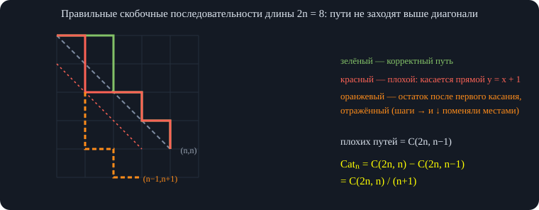\
*Отражение остатка пути относительно прямой $y=x+1$ переводит каждый плохой путь в путь в клетку $(n-1,\,n+1)$, и обратно.*

Обратно: любой путь в $(n-1,n+1)$ обязательно пересекает прямую, и его «хвост» после первого касания можно отразить, получив плохой путь в $(n,n)$. Это взаимно однозначное соответствие, поэтому плохих путей $\binom{2n}{n-1}$ и

$$ \mathrm{Cat}_n=\binom{2n}{n}-\binom{2n}{n-1}=\frac1{n+1}\binom{2n}{n}. $$

(Формула проверена полным перебором скобочных последовательностей для $n\le12$.)

## 11. Непересекающиеся пути в таблице

**Задача.** В таблице $n\times m$ нужно посчитать число пар путей (каждый — шагами вправо и вниз), которые не пересекаются. Первый путь идёт из клетки *под верхним левым углом* в клетку *слева от нижнего правого угла*, второй — из клетки *справа от верхнего левого угла* в клетку *над нижним правым*.

Сначала считаем все пары путей без ограничения: произведение двух биномиальных коэффициентов. Но часть пар пересекается. Возьмём пересекающуюся пару, найдём первую общую клетку и *обменяем хвосты* путей после неё. Получим пару путей, у которых концы поменялись местами: первый путь пришёл в конец второго и наоборот. Обратное преобразование определено тоже, поэтому пересекающихся пар с исходными концами столько же, сколько всех пар с перепутанными концами.

Пар с перепутанными концами считается произведением двух биномов, и ответ:

$$ \text{ответ}=\binom{n+m-4}{n-2}^{2}-\binom{n+m-4}{n-1}\binom{n+m-4}{n-3}. $$

<div class="own">

<span class="lbl">Развёрнутое объяснение</span>\
Здесь пути рассматриваются как последовательности клеток, первый — из клетки $(0,1)$ в $(n-2,m-1)$, второй — из $(1,0)$ в $(n-1,m-2)$ (координаты: столбец, строка; шаги «вправо» и «вниз»). «Не пересекаются» — нет общих клеток. Формула проверена перебором всех пар путей для $2\le n,m\le7$: значения 1, 3, 6, 10, 20, 50, 175 и т. д. совпали. Это частный случай леммы Линдстрёма—Гесселя—Вьенно.

</div>

Лектор отмечает, что на контесте будет целая задача на эту идею с динамикой сверху и разбором случаев; ключевая идея — отражение/обмен хвостов.

<div class="code">

<div class="code-head">

C++

копировать

</div>

```
// C[n][k] по треугольнику Паскаля, C[n][k] = C[n−1][k−1] + C[n−1][k]
const int NMAX = 31;
long long C[2 * NMAX + 1][2 * NMAX + 1];
void build_binom() {
    for (int n = 0; n <= 2 * NMAX; n++) {
        C[n][0] = 1;
        for (int k = 1; k <= n; k++) C[n][k] = C[n - 1][k - 1] + (k <= n - 1 ? C[n - 1][k] : 0);
    }
}
long long catalan(int n) { return C[2 * n][n] - (n ? C[2 * n][n - 1] : 0); }   // = C(2n, n)/(n+1)
// непересекающиеся пары путей в таблице n×m (старты и финиши — как на рисунке), n, m ≥ 2
long long disjoint_pairs(int n, int m) {
    return C[n + m - 4][n - 2] * C[n + m - 4][n - 2] - C[n + m - 4][n - 1] * (n >= 3 ? C[n + m - 4][n - 3] : 0);
}
```

</div>

## 12. Шары и перегородки

**Задача.** Распределить $m$ одинаковых шаров по $n$ ящикам (в ящике может оказаться любое число шаров, в том числе 0). Сколько способов?

Поставим шары в ряд и разделим $n-1$ перегородкой на $n$ групп: группа между соседними перегородками — содержимое ящика. Всего в ряду $n+m-1$ объектов; осталось выбрать, на каких $m$ местах стоят шары (остальные места занимают перегородки):

$$ \binom{n+m-1}{m}. $$

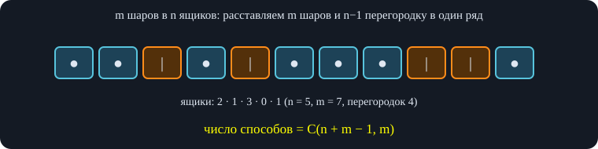\
*Выбираем, на каких $n+m-1$ местах стоят шары — остальные места занимают перегородки.*

Формула проверена перебором распределений для $n\le6$, $m\le6$.

### 12.1. Пример: столбики в сумме

**Задача (с регионального этапа).** Сложили два числа «в столбик» и записали результат. Выражение разрезали на отдельные столбики (две цифры слагаемых и цифра суммы) и перемешали. Нужно найти число способов расставить столбики обратно так, чтобы выражение стало верным.

Столбик характеризуется двумя признаками: **требует ли переноса от предыдущего разряда** и **даёт ли перенос в следующий**. Это четыре типа столбиков; если цифры в столбике не могут дать нужную сумму ни при каком переносе, расстановки нет вообще. Столбик, который требует переноса, должен стоять после столбика, дающего перенос; не требующий — после не дающего. Здесь запись заканчивается (VK ограничивает длительность записи пятью часами), и продолжение разбора — классификация столбиков и подсчёт расстановок — в ней отсутствует.

<a href="../parallel-xs/parallel-xs-zan1-derevya.html" class="prev"><span class="small">← занятие 1</span><strong>Деревья</strong></a><a href="index.html" class="next"><span class="small">к списку</span><strong>Параллель XS</strong></a>
